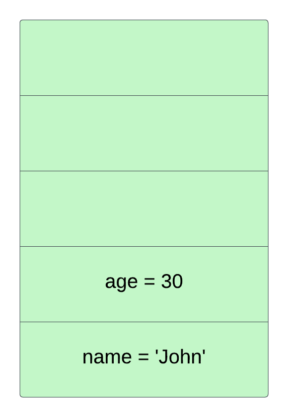
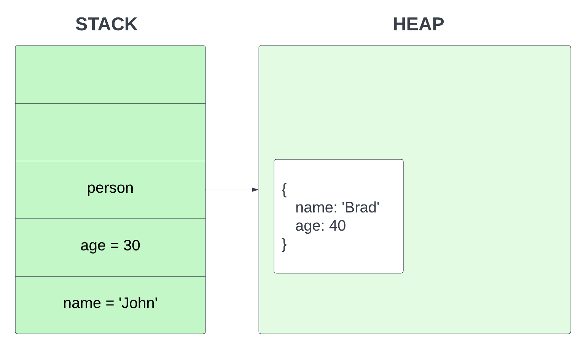
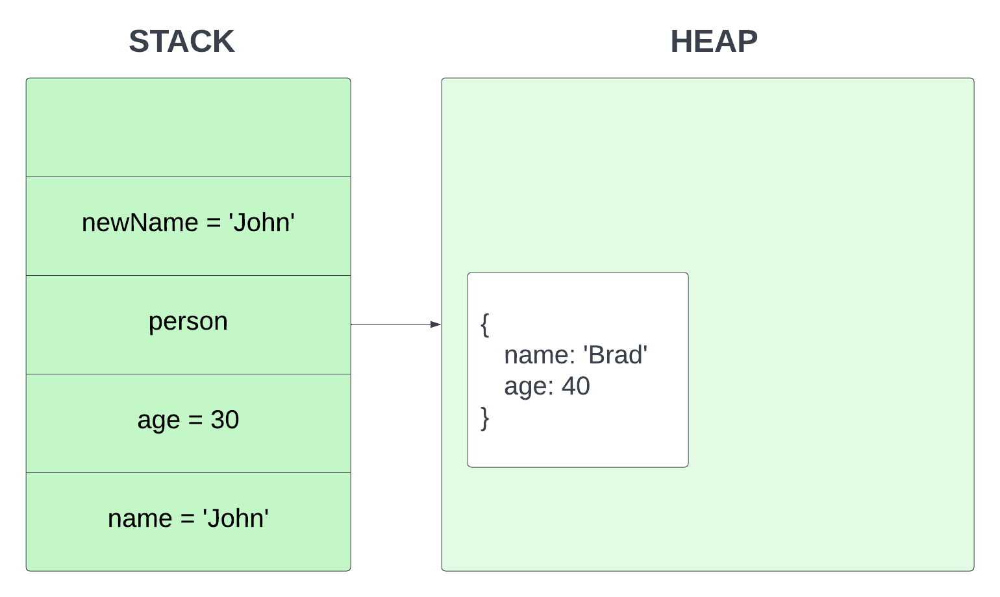
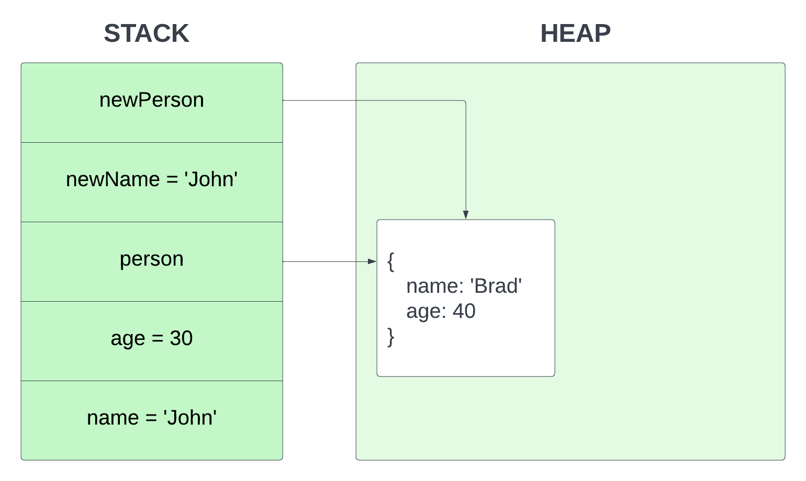
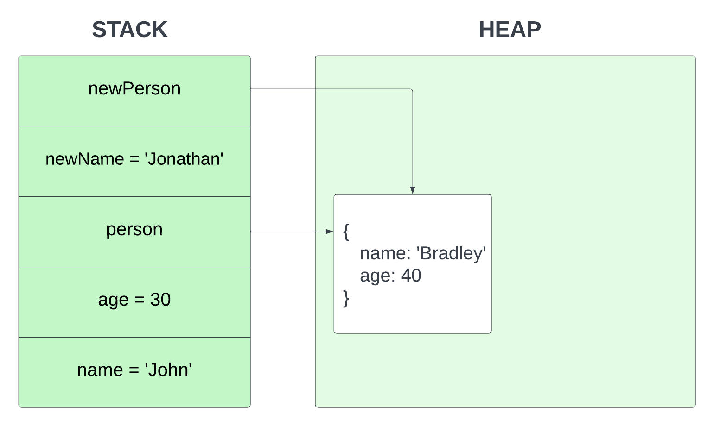
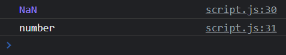
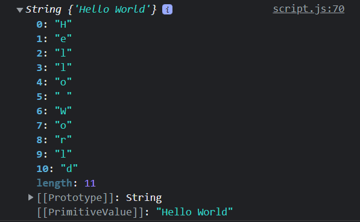
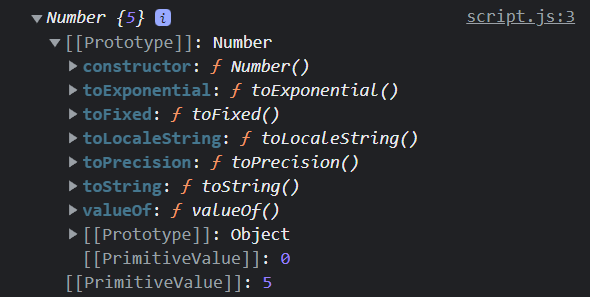

# 01-console

# The JavaScript Console

When we create front-end websites and applications, we work in the browser environment. We can use JavaScript to manipulate the DOM (Document Object Model) and display different elements and values, but many times, we just need a quick way to show what a value is. We also need a place to see any errors or warnings in our script or any script that runs. This is where the JavaScript console comes in.

The console is part of the **Developer Tools** in the browser. In most browsers, you can open the dev tools with `F12` on a Windows PC and `CMD+OPT+I` on a Mac. From there you have a bunch of tabs and one (usually the second) is the console. You can also use `CMD+OPT+J` or `CTRL+ALT+J` to go right to the console.

From here you can actually run JavaScript. Try typing in the following directly into the browser console and hit `enter`.

```JavaScript
alert('Hello from the console')
```

It should show a browser alert with the text.

We can write just about any single line JavaScript expression directly in the console, however, you probably won't do this very much. We usually use the console to output information and values from our script/code.

## Console methods

The `global object` in the browser environment gives us access to a `console` object that has a bunch of useful methods that we can use from our JavaScript file to interact with the JavaScript console. When I say a method, I just mean a function that is attached to an object. In this case, the "console" object.

### `console.log()`

This is the most common console method. We pass whatever we want to log to the console as an argument to the `log()` method. This can be a string, a number, a boolean, an object, an array, or even a function. It will output the value to the console.

#### Log a number

Different data types will have different colors in the console

```JavaScript
console.log(123);
```

#### Log a string

```JavaScript
console.log('Hello World');
```

#### Log multiple values

You can separate values with a comma

```JavaScript
console.log(123, 'Hello', true);
```

#### Log a variable

For the most part, we use the console to debug and log out variables or the result of a function or network request.

```JavaScript
x = 100;
console.log(x);
```

## `console.error()`

using console.error() will make the text red

```JavaScript
console.error('This is an error');
```

## `console.warn()`

Using console.warn() will make the text yellow

```JavaScript
console.warn('This is a warning');
```

## `console.clear()`

```JavaScript
console.clear()
```

## `console.table()`

If you want to log an object, you can format it as a table

```JavaScript
console.table({ name: 'Brad', city: 'Boston' });
```

## `console.group()`

```JavaScript
console.group('simple');
console.warn('warning!');
console.error('error here');
console.log('Hello World');
console.groupEnd('simple');
console.log('new section');
```

#### Log with style

```JavaScript
const styles = 'padding: 10px; background-color: white; color: green;';
console.log('%cHello', styles);
```

There are even more methods. See all of them [here](https://developer.mozilla.org/en-US/docs/Web/API/console)


---


# 02-comments-shortcuts

# Comments & Shortcuts

All programming languages have commenting functionality. Comments are used for documenting your code and explaining things in a human readable way. Often times, multiple developers work on the same code base and comments are used to explain what a certain piece of code does.

Comments are also used to disable code. This is useful when you want to test something out without deleting the code.

You may also use comments as a todo list. This is useful when you want to keep track of what you need to do next.

### Single Line Comments

In JavaScript, single line comments are created by using two forward slashes `//`. Anything after the two forward slashes will be ignored by the JavaScript interpreter. This is useful when you want to add a comment to a single line of code.

```js
// This is a single line comment

console.log('Hello World'); // This is a single line comment
```

### Multi Line Comments

In JavaScript, multi line comments are created by using `/*` and `*/`. Anything between the two symbols will be ignored by the JavaScript interpreter. This is useful when you want to add a comment to multiple lines of code.

```js
/*
This is a multi line comment
*/
```

### Useful Shortcuts

I just want to go over some helpful keyboard shortcuts. These work for VS Code, but many of them are universal and will work in most text editors.

- `shift + up/down` - Highlight lines of code up and down
- `shift + right/left` - Highlight code right and left
- `cmd + right/left arrow` - move cursor to beginning/end of line
- `cmd + up/down arrow` - move cursor to beginning/end of file
- `option + up/down arrow` - move line up/down
- `shift + option + up/down arrow` - copy line up/down
- `cmd + /` - Comment out a line of code
- `cmd + shift + /` - Comment out multiple lines of code
- `cmd + d` - Select the next instance of the selected word
- `cmd + shift + l` - Select all instances of the selected word
- `cmd + shift + f` - Search for a string in the project
- `cmd + shift + o` - Search for a file in the project

You aren't going to remember all of these right now. Try and use a few of them while you're coding and it will become second nature. I use these shortcuts all the time and they make my life a lot easier.


---


# 03-variables

# Variables

Variables are containers for pieces of data. That data can be one of many different data types. It's important to know and understand those data types and we will go over them in the next lesson, but right now, we are just going to look at the syntax for creating and re-assigning variables as well as the differences between how we declare them.

## Declaring a Variable

In JavScript, we need to first declare a variable with one of three keywords

- var
- let
- const

In modern JavaScript, you probably won't see `var` very much. `var` was the original declaration, but in `ES2015` also known as `ES6`, which was a huge update to the language, they introduced `let` and `const`. One of the reasons for this is because of `block scoping`. Now, I'm not going to talk about things like scope right now, because we haven't gotten to functions or anything, so if I talk about scope it'll go right over a lot of people's heads. I just want to focus on how we declare and assign variables and also work with constants. Just know that on the `global scope`, meaning not inside of a function or any kind of control structure, `var` and `let` work in a very similar same way. `const` is a bit different. I'll be using let and const throughout the course, unless there is a specific reason for me to use var.

So let's say that we want a variable called firstName and lastName. Remember that `string` data types need to be wraped in either single or double quotes. You can also use backticks. Backticks (\`) have a special use which I'll talk about later.

```JavaScript
let firstName = 'John';
let lastName = 'Doe';

// We can do a console.log to show the value
console.log(firstName, lastName);
```

We can store other data types such as numbers:

```JavaScript
let age = 30;

console.log(age);
```

## Variable Naming Conventions

So different languages have different rules and conventions when it comes to naming things. There are some rules that you have to follow when it comes to the formatting of your variable names.

- Only letters, numbers, underscores and dollar signs
- Can not start with a number

I wouldn't suggest starting your variable names with a dollar sign or an underscore either.

### Multi-Word Variables

When it comes to variables as well as functions and classes with multiple words, it's really up to you on how you format the case. What you'll typically see in JavaScript and what I usually do is `camelCase`. This where we start with a lowercase letter but every word after that starts with an uppercase letter.

```
let firstName = 'John';
```

You may also see underscores like this

```
let first_name = 'Sara';
```

There's also pascal case, where the first word is also capitalized. You typically see this for class names in object oriented programming.

```
let FirstName = 'Tom';
```

You might also see all lowercase, which I wouldn't recommend

```
let firtstname = 'Bob';
```

## Reassigning Values

Alright, so if we want to reassign a value we can do that here since we're using var. When it comes to directly reassigning a primitive type like a number, you can't use `const`. Const stands for **constant**. So you have to use `var` or `let` if you want to re-assign a variable value. Again, you're not going to see `var` very much, so I will use `let` for this.

```JavaScript
let x = 100;
```

Let's reassign x to 200

```JavaScript
x = 200;
```

Now, in some cases, you may want to simply declare a variable and not assign a value to it.

```JavaScript
let score;
```

In this case, score would be equal to **undefined**, which is actually one of the seven primitive data types that we're gonna talk about in the next video.

If I want to assign a value to it at any time, I can.

```JavaScript
score = 1
```

One reason you might do this is because you have a conditional that says if score equals one thing, do this, if another, then do something else. Here is an example

```JavaScript
let score;

if(userScores) {
  score += 1;
} else {
  score -= 0;
}
```

## Constants

Alright, let's look at `const`, which works a bit differently than `let` or `var`. So if I declare a name like this...

```JavaScript
const x = 100
```

and then I try and re-assign that value

```JavaScript
x = 200; // Results in error
```

I get an error. You can't directly re-assign a value to a constant. You also can't initialize a constant as undefined.

```JavaScript
const score1; // Results in error
```

That will also throw an error. It has to be declared with a value.

Now where this can be a little confusing is when we use `const` with values that are not primitive like objects or reference types such as `arrays` and `object literals`. In that case we can't directly re-assign, but we can change them.

So let's say that we have an array

```JavaScript
const arr = [1,2,3,4]
```

What I can't do is re-assign

```JavaScript
arr = [1,2,3,4,5] // Results in error
```

But I can for instance, add to that array with the push method. I can even take a specific index of the array and change the value that way.

```JavaScript
arr.push(5); // [1, 2, 3, 4, 5]
arr[0] = 200; // [200, 2, 3, 4, 5]
```

We can do the same type of thing with object literals. Now I know some of you have no clue what an object literal is, we'll get to that, but I just want to show you that the object itself can be manipulated, even with const.

```JavaScript
const person = {
  name: 'Brad',
};

person.name = 'John';
person.email = 'john@gmail.com';

console.log(person);

/*
Results in...
{
  name: 'John',
  email: 'john@gmail.com'
}
*/
```

## Declaring multiple values at once

We don't have to declare variables line by line, we are able to declare multiple values at once. With let, we can initialize, with const, we have to assign a value.

```JavaScript
let a, b, c;
const d = 10, e = 20, f = 30;
```

## Let or Const - Which to Use?

So how do we figure out which to use when it comes to let and const or even var? We'll it comes down to preference. What I like to do is always use `const` unless it's a primitive value that I think I may need to re-assign at some point. The score example above is a good example. That score number will be re-assigned throughout the game. So I would use let. You'll find in most cases that you don't need to explicitly re-assign values. We're usually dealing objects where we manipulate them but don't re-assign them.

Some people do the opposite and always use `let` no matter what. Which is fine, but I think using `const` is a bit more robust because you know your values can't be re-assigned my mistake. So, I would suggest `const` unless you know you need to either initialize as undefined or re-assign. It's all preference though.


---


# 04-data-types

# Data Types

We're going to spend a little time on data types. When we create a variable, the data that we define has a type. There are `primitive types` and `reference types`. The big difference under the hood is the way that they're stored and accessed from memory.

1. **Primitive Types** - Stored directly in the location that the variables is accessed
2. **Reference Types (Objects)** - Accessed by reference

## Primitive Data Types

That may not make much sense right now, but in the next video I'm going to go more in depth on how this works under the hood. So first well talk about the 7 primitive types of JavaScript.

The 7 primitive data types are the following

- `String` - a sequence of characters. In JavaScript, strings can be enclosed within the single or double quotes
- `Number` - Represent both integer and floating-point numbers
- `Boolean` - Represent a logical entity and can have two values: true or false
- `Null` - Represents the intentional absence of any object value
- `Undefined` - A variable that has not been assigned a value is undefined.
- `Symbol` - It is a built-in object whose constructor returns a symbol-that is unique
- `BigInt` - New data type used for numbers that are greater than the Number type can handle.

## Dynamic vs Static Types

JavaScript is a "dynamically-typed" language. This means that when we create a variable or a function, we don't explicitly assign the type. JavaScript assigns the type of that value dynamically. In other words, the type is associated with the **value**, not the **variable**. So you can have a variable value be a string and then later in the script, change it to a number. You probably won't do that very often, but you can.

There are other languages that are "statically-typed". This is where you would explicitly define the type of data. Java is an example of a statically-typed language. There's also a language called TypeScript, which is essentially JavaScript with some extra features, including types. So is TypeScript, you could do this.

```TypeScript
const y:number = 100
```

You can see we defined it as a **number**. So now that **y** variable's value HAS to always be a number.

This is not something we can do with vanilla JavaScript. The advantage of static types is that it makes your code more robust and less prone to errors. The downside is you need to write a bit more code.

## Assigning Variables

### String

A string is a "string" of characters wrapped in either single or double quotes. Strings can include any number, letter or symbol

```JavaScript
const firstName = 'Sara';
```

### Number

Any number in JavaScript is the `Number` type, including floats and decimals. Some languages have separate types for floats and integers. JavaScript does not. Numbers are not wrapped in quotes.

```JavaScript
const age = 30;
const temp = 98.9
```

### Boolean

A boolean is a true or false value

```JavaScript
const hasKids = true;
```

### Null

Intentional absence

```JavaScript
const aptNumber = null;
```

### Undefined

Undefined represents a variable that has not been defined a value.

```JavaScript
let score;
const score = undefined;
```

### Symbol

A “symbol” represents a unique identifier. We will talk more about what they are used for later, but this is how we can create one

```JavaScript
const id = Symbol('id');
```

### BigInt

BigInt is a new primitive type and represents integers that are out of the range of the Number type

```JavaScript
const n = 9007199254740991n;
```

### typeof Operator

To check the type of a variable in JavaScript, you can use the typeof operator

```JavaScript
console.log(typeof name)
```

**Tip:** If you run typeof on a variable that holds `null`, you will not get null, you will get `object`. This is generally regarded as a mistake. More info [here](https://developer.mozilla.org/en-US/docs/Web/JavaScript/Reference/Operators/typeof#typeof_null)

```JavaScript
console.log(typeof aptNumber)
```

# Reference Data Types (Objects)

We talked about the primitive data types that are stored directly in memory where they are accessed. Reference types work a little differently under the hood. There are basically 3 types that are passed by reference

- `Arrays`
- `Functions`
- `Objects`

Technically, these are all "objects", meaning that they have properties and methods.

Reference types or "objects" are a non-primitive value and when assigned to a variable, the variable is given a **reference** to that value. The reference points to the object's location in memory. Unlike primitives, where the variable contains the actual value. I'll talk more about this in the next video.

### Arrays

I know we haven't gone over arrays yet so don't worry if you've never worked with them. They're essentially a data structure that can hold multiple values.

So if we write

```JavaScript
const numbers = [1,2,3,4]
```

We have created an array in memory and a variable that points to the address or location of that array.

### Object Literals

Objects are comma separated lists of `name-value pairs`. We'll get into them later, but just to give you an example here

```JavaScript
{
  name: 'John',
  age: 30
}
```

### Functions

Functions are also objects in JavaScript. They can have `properties` and `methods`. What distinguishes them from other objects is that they can be called.

```JavaScript
const sayHello = function() {
  return 'Hello';
}

sayHello()
```

If we check the type with typeof, we'll get "object" for arrays and object literals, but we actually get "function" for a function. This is still an object, it's just identified as a function object, which can be called as you can see [here](https://262.ecma-international.org/5.1/#sec-11.4.3)


---


# 05-stack_heap

# Stack vs Heap Memory Allocation

Now we're going to look at how `primitive` and `reference` type data is stored in memory. One thing I really want to mention is that if you're a beginner or even intermediate, this may seem a little confusing but that's absolutely fine. In all honestly, I have met senior developers that don't know some of this stuff, so don't let this overwhelm you.

What's really important right now is that you just know the types and know how to create variables. I was iffy on even talking about some of this stuff at this point, but I want to this to be a very thorough course. You can always just take in the basics and come back to these videos later. And I'll do my best to let you know what is really important for the day to day and what is more behind the scenes knowledge.

## Garbage Collection

Before we look at how data is stored in memory, I just want to mention that JavaScript uses something called **garbage collection**. With some low-level languages such as `C` and `C++`, you actually have to manage your own memory. When you create variables, you have to allocate the memory yourself and when you are done, you need to free up that space. It makes programming much more difficult. More modern interpreted languages like `JavaScript` and `Python`, do not have you do this. It is automated with something called garbage collection. That's why you don't technically need to know how this stuff works to start writing JavaScript.

## Memory Allocation

When we create a variable, the JavaScript engine allocates them into two different locations called the `stack` and the `heap`.

Primitive values like strings, numbers, etc are static and immutable data that are fixed. Because of this, the size of the data doesn't change at all, so the space is allocated as a fixed amount and is stored on the stack.

So let's take the following example

```JavaScript
const name = 'John';
const age = 30;
```

To help visualize this, I created a simple image of what the memory stack would look like



Notice that the memory was allocated on the stack for the variable and the value for name and age. This is because they are static primitive values.

Now let's create a **person** `object`

```JavaScript
const person = {
  name: 'Brad',
  age: 40
}
```

Since this is a reference type that is not static and we can add and remove values from it, the object gets stored in the heap



Lets set a new variable called **newName** to reference the primitive **name** variable

```JavaScript
const newName = name;
```

Under the hood, JavaScript copies the primitive value of **'John'** and assigns it to **newName**



Now, let's change the value of the **newName** to **Jonathan**

```JavaScript
newName = 'Jonathan'
```


The **name** value stays the same and only the **newName** is changed. That's because it was passed by the value.

Now lets create a new variable called **newPerson** and set it to **person**

```JavaScript
const newPerson = person;
```

Now the **newPerson** variable references the same value on the heap.



If I were to update **newPerson** object's name value

```JavaScript
newPerson.name = 'Bradley'
```

It would change the reference in the heap as well and now both **person** and **newPerson** will have the name Bradley. This is because it is passed by reference.



So at some point, this knowledge will come in handy when you get into more advanced programming. It's not really beginner stuff, but I do think learning it now gives you a leg up.


---


# 06-type-conversion

# Type Conversion

In programming, **type conversion** or **type casting** is the process of explicitly converting a value from one type to another. For instance, you may have a string value of **'5'** and you want to convert it to a number value of **5** so that you can do some arithmetic operations on it.

**Type Coercion**, can also be explicit, but also refers to the automatic or implicit conversion of values from one data type to another. We will talk about this in another video.

## Converting Types

There are a few different ways that we can covert types.

We have a variable with the string of '100'

```JavaScript
 let amount = '100';
```

#### parseInt()

We can convert it to a number type with the `parseInt()` function

```JavaScript
  amount = parseInt(amount);
```

#### toString()

If we want to convert it back to a string, we can use the `toString()` method

```JavaScript
amount = amount.toString();
```

A **method** is just a function that belongs to an object.

This brings up a question though. The `amount` variable is a primitive number. How come it has a method of `toString()`?

The answer is that JavaScript will actually create a temporary wrapper object to run `toString()` on

#### Number()

Another way to convert a string to a number is by wrapping it in the `Number()` method

```JavaScript
amount = Number(amount);
```

#### String()

We can convert something to a string using the `String()` method

```JavaScript
amount = String(amount);
```

## Decimals

If you want to convert a string to a decimal, you don't want to use `parseInt()` because an "integer" is either a negative or positive whole number.

Use `parseFloat()` to convert to a decimal

```JavaScript
let amount2 = 5.5;
amount2 = parseFloat(amount2);
```

## Boolean Values

Strings and numbers are not all that we can convert. We can use Number() with booleans

The following would give us a number of 1. If false, it would give us 0.

```JavaScript
let x = true;
x = Number(x);
```

We also have a Boolean() method to turn a number into a boolean. Later I will talk about "truthy and falsey" values.

```JavaScript
x = Boolean(x);
```

The following will give us the string **true**

```JavaScript
x = String(x);
```

## NaN

You saw above that we could run the string of '5' through `Number()` and get the number 5. Well what happens if the string is something like 'hello'?

```JavaScript
let str = 'Hello';
let num = Number(str)
```



We actually get a special "number" called `NaN`, which stands for **Not a Number**... Yeah, that's JavaScript for you. A number that is "not a number". There are some really strange and quirky aspects of JavaScript. The good news is that most of it doesn't get in your way in practical development. It's just when we start to dig down deeper.

`NaN` is a property of the global object and is a non-writable property. There are 5 different types of operations that return NaN:

- Number cannot be parsed (e.g. parseInt("blabla") or Number(undefined))
- Math operation where the result is not a real number (e.g. Math.sqrt(-1))
- Operand of an argument is NaN (e.g. 7 \*\* NaN)
- Indeterminate form (e.g. 0 \* Infinity, or undefined + undefined)
- Any operation that involves a string and is not an addition operation (e.g. "foo" / 3)


---


# 07-operators

# Operators & Arithmetic

In order to look at implicit type coercion in the next video, we'll be using some operators, so I thought that this would be a good time to go over JavaScript operators. Most of these are in just about every language. This is really easy stuff, but I want to make sure we cover everything.

We have a few different types of operators

## Arithmetic Operators

Addition, subtraction, multiplication and division

```JavaScript
  5 + 5; // 10
```

```JavaScript
  10 - 5; // 5
```

```JavaScript
  5 * 5; // 25
```

```JavaScript
  10 / 2; // 5
```

Concatenation: The `+` operator can also be used to put 2 or more strings together. The use of `+` depends on the data type

```JavaScript
'Hello, ' + 'World!'; // Hello World!
```

Modulus is used to get a division remainder

```JavaScript
  10 % 3; // 1
```

Exponentiation returns the result of the first operand to the power of the second.

```JavaScript
2**3; // 8
```

Increment is used to **increment** or add 1 to a value

```JavaScript
  x = 10;
  x++; // 11
```

Decrement is used to **decrement** or remove 1 from a value

```JavaScript
  x = 10;
  x--; // 9
```

## Assignment Operators

Assignment operators do something with the value on the right side to set the variable on the left side.

Value assignment

```JavaScript
x = 10;
```

Addition assignment operator adds the amount on the right side

```JavaScript
x = 10;
x += 10; // 20
// Same as x = x + 10
```

Subtraction assignment operator subtracts the amount on the right side

```JavaScript
x = 10;
x -= 10;  // 0
// Same as x = x - 10
```

Multiplication assignment operator multiplies the amount on the right side

```JavaScript
x = 10;
x *= 10; // 100
// Same as x = x \* 10
```

Division assignment operator divides the amount on the right side

```JavaScript
x = 10;
x /= 10; // 1
// Same as x = x / 10
```

Modulo assignment operator gets division remainder of the amount on the right side

```JavaScript
x = 10;
x %= 10; // 0
// Same as x = x % 10
```

Exponentiation assignment operator gets exponent of the amount on the right side

```JavaScript
x = 10;
x **= 10; // 100
// Same as x = x \*\* 10
```

## Comparison Operators

Comparison operators are used to compare values

Equal to operator - The following will return true even if the types do not match

```JavaScript
2 == 2 // true
2 == '2' // true
```

Equal value & equal type - The types have to match or it will return false

```JavaScript
2 === 2 // true
2 === '2' // false
```

Not equal to operator - returns true if not equal

```JavaScript
2 != 2 // false
2 != '2' // false
```

Not equal value & equal type

```JavaScript
2 !== 2 // false
2 !== '2' // true
```

Greater than

```JavaScript
10 > 5 // true
```

Less than

```JavaScript
10 < 5 // false
```

Greater than or equal

```JavaScript
10 >= 5 // true
```

Less than or equal

```JavaScript
10 <= 5 // false
```

## == vs ===

As I said above, the `==` operator is used to compare values. The `===` operator is used to compare values and types.

The double equals (==) performs type coercion, which means it makes sure that the values are the same type before comparing them.

Which one you use is up to you, but I personally use the triple equals (===) because it is more explicit and your code will be less prone to errors. In many situations, it doesn't matter, but I prefer to use it unless there is a specific reason not to.

Later on we will talk about **truthy** and **falsy** values and I will show you some situations where the double equals can cause issues.


---


# 08-type-coercion

# Type Coercion

Type Coercion is when data types are converted implicitly by JavaScript. Although the conversion that we did in the previous video can also be called explicit coercion. There's so many different words for the same thing in programming.

Anyway, there are a few situations where implicit coercion can occur. For the most part, you have 3 types of coercion

- to string
- to number
- to boolean

Typically coercion happens when you apply operators to values of different types.

Let's take a look at some examples. I will warn you, some of this will get weird. But again, this stuff usually isn't a big issue in everyday development.

Let's look at our first example

```JavaScript
5 + '5'; // 55 (string)
```

So as you can see, if we use the **+** operator on the **number** 5 and a **string** with the character '5', we get a **string** of 55. Some of you may have expected 10, which is the answer to 5 + 5.

The reason that this happened is because the **number** 5 is being implicitly coerced into a **string** due to the + operator also being used for concatenation, as I talked about in the last video.

This is an example of automatic or implicit coercion because we applied an operator to values of different types.

If I wanted to add these together, I would first convert the string '55' to a number like this

```JavaScript
5 + Number('5'); // 10
```

Although the string would most likely be a variable in this case.

Now, let's take the **number** 5 and multiply by the **string** 5.

```JavaScript
5 * '5'; // 25 (number)
```

For this expression, we do get the result of 5 \* 5, which is a **number** of 25. So in this case, JavaScript looked at the expression and coerced the **string** of '5' into the **number** 5.

This happened because it makes the most sense. The \* can not do anything else but multiply in this expression.

Let's try some more weird stuff and see the results

```JavaScript
5 + null; // 5
```

So in this case, we get 5. Reason being that null is coerced to a number of 0. We can see what a value would be as a number by doing the following

```JavaScript
Number(null); // 0
```

Let's see what the boolean values of true and false would be as a number

```JavaScript
Number(true); // 1
Number(false); // 0
```

So with that what do you think the answer would be if we added 5 + true and 5 + false?

```JavaScript
5 + true; // 51
5 + false; // 50
```

The null and false being 0, brings us to something called "falsey values". We'll get more into that when we talk about conditionals though.

Now let's look at the following expression

```JavaScript
   5 + undefined; // NaN
```

So the result is NaN or **not a number**. We talked a little about this in the last video. The reason is because NaN is the result of a failed number operation. If we run undefined through the Number() method, we also get NaN.
If we try and add NaN like this, we also get NaN.

```JavaScript
5 + NaN; // NaN
```

Want to see something really strange?

```JavaScript
NaN == NaN // false
```

You read that right. NaN is NOT equal to NaN. Kind of mind blowing. This is because not all NaN numbers are created equal. You can read more about it [here](https://es5.github.io/#x11.9.6), but just know that this will always equate to false.

Now there may be times when you need to check for a NaN value. Again, I know we haven't got into functions or conditionals yet, but we do have a function called **isNaN** that we can use like this.

```JavaScript
  isNan(NaN); // true
```

However, this will return true for ANYTHING that is "not a number", such as

```JavaScript
isNan('Hello') // true
```

If you really want to check for the specific value of NaN, you can use the isNan method on the Number object like this

```JavaScript
Number.isNan(NaN) // true
Number.isNaN('Hello') //false
```


---


# 09-strings

# Working with Strings

Alright, so now we're going to work with strings. I'm going to show you how to concatenate strings, use something called **template literals** as well as look at some methods and properties that we can use on string objects.

### Concatenation

So we briefly looked at concatenating strings, but let's take a deeper look.

The **+** operator is used to concatenate. Let's take two strings and put them together.

```JavaScript
'Hello' + 'World';
```

Pretty simple right? We usually use concatenation to work variables into a string like so

```JavaScript
const name = 'John';
const age = 30;

'Hello, my name is ' + name + ' and I am ' + age + ' years old';
```

I learned PHP before JavaScript and in PHP, we use the period(.) character in the same way, so I picked up on this pretty quickly.

### Template Literals

So in 2015, JavaScript had a major update called `ES2015`, also known as `ES6`. In that update, template literals or "template strings" we introduced. These make is much easier and cleaner to include variables in a string.

```JavaScript
const name = 'John';
const age = 30;

`Hello, my name is ${name} and I am ${age} years old`;
```

So as you can see, instead of using single or double quotes around the string, we use backticks(`).

Then, if we want to use a variable or an expression, we simple surround it in curly braces and prefix it with a dollar sign like this... `${myVariable}`. This makes it much easier because we can just put the variables right into the string and not worry about ending and beginning it again with a + sign. You can also go on to multiple lines. You can not do that with regular concatenation.

### String Properties & Methods

Strings are **primitive** in JavaScript. We have already established that. Primitives do not have properties (attributes) and methods (functions), however if we try and use a method like `.toUpperCase()` on a string, it will work. This is because the JavaScript engine will actually promote them to full blown `string objects`. Same goes for numbers, or at least variables that store numbers.

We can actually create a string object ourselves by using the `new` keyword and then the `String constructor`

```JavaScript
const s = new String('Hello World');
```

This is what happens behind the scenes when we use a property or method on a string. If you check the **typeof** s, you will see `object`.

```JavaScript
console.log(s);
```



If you log the actual value of `s`, you will see an object and each character with a key/value pair. The first key or "index" is always **0**. We can actually get a specific character by its index.

```JavaScript
console.log(s[3]); // prints "l"
```

We get the letter "l" because it is the letter at index 3.

Along with the key/value pairs, we get the primitive type and you'll also see something called a `prototype`.

If you un-collapse this, you will find all of the properties and methods available on the string object. We will get much more into prototypes later when we talk about object oriented programming, etc, but I wanted to show you that this is available in case you want to experiment with it.

You can also access the prototype directly with

```JavaScript
console.log(s.__proto__);
```

Alright, so now that we know how primitive values seem to have properties and methods, let's look at some of them.

There is really only one property that we're going to look at and that is **length**. The rest are methods. Methods are functions, so they always end with parentheses ()

#### length

Length is pretty common for multiple data types. On an array, it will tell us the number of elements in it. If we use it on a number or string object, it will give us the number of characters

```JavaScript
const greeting = 'Hello World';
greeting.length; // 11
```

#### Changing case

In some cases, you may want to change your case to upper or lower case. There are methods we can use for that

```JavaScript
greeting.toUpperCase();
greeting.toLowerCase();
```

#### charAt()

Returns the character at the specified index. All characters in a string have an index that starts from 0. In fact, when we logged the "string object", we saw the key/value pairs. This method will tell you the character or value at the specified index

```JavaScript
greeting.charAt(0); // H
```

#### indexOf()

indexOf() will do the reverse of charAt(). Instead of passing the index, we pass the value and it will give us the index of the first occurrence of the character(s)

```JavaScript
greeting.indexOf('o'); // 4
```

#### substring()

Search a string for a specified value. Pass in the start index and the length. Let's say we want to pull out a substring of 'Hell' from 'Hello World', we would start at character 0 and go 4 in length

```JavaScript
greeting.substring(0, 4); // Hell
```

#### slice()

Extracts a part of a string and returns a new string. It is very similar to substring, but there are some differences, for instance, you can use negative numbers with slice.

```JavaScript
greeting.slice(0, 4); // Hell
//  We can also use negative numbers
greeting.slice(-11, -7) // Hell
```

#### trim()

Trim the whitespace of a string

```JavaScript
x = '       Hello World!        ';
x = x.trim(); // Hello World!
```

#### replace()

Replace all instances of a string

```JavaScript
  const url = 'https://traversymedia.com';
  url.replace('traversymedia', 'google'); // https://google.com
```

### includes()

Returns true if a searched string is found

```JavaScript
url.includes('media'); // true
```

#### valueOf()

Returns the primitive value of a variable

```JavaScript
url.valueOf(); // https://traversymedia.com
```

#### split()

Splits a string into an array and takes in a separator parameter. If we add a space, it will put every word in it's own array item.

```JavaScript
greeting.split(' '); // ['Hello', 'World']
```


---


# 10-capitalize-challenge

# Capitalize Challenge

We have arrived at our first challenge. Every once in a while I'm going to ask you to figure out a problem or do something using what we have already learned. I will not ask you to do a challenge that involves doing something that we have not yet gone over.

If you feel stuck and can not figure it out on your own, that is absolutely fine. I will walk you through the solution(s), so that you can understand how to solve the problem.

**Instructions**:

Take the variable `myString` and capitalize the first letter of the word using some of the methods that we talked about in the last video. Put the result in a variable called `myNewString`.

Create multiple solutions if you would like.

**Expected Result:**

```JavaScript
const myString = 'developer';

console.log(myNewString); // 'Developer'
```

**Hints:**

1. You can use the `charAt()` method as well as `string[index]` to get the character at a specific index.
2. The `.toUpperCase()` method will make the entire string uppercase
3. `substring()` or `slice()` will return a specific portion of a string

<details>
  <summary>Click For Solution</summary>
  
  There are many ways to do this. Let's take a look at a few

```JavaScript
// Solution 1
const myNewString = myString.charAt(0).toUpperCase() + myString.substring(1);

// Solution 2 (Uses string[0] instead of string.charAt(0))
const myNewString = myString[0].toUpperCase() + myString.substring(1);

// Solution 3 (Uses template literal and slice())
const myNewString = `${myString[0].toUpperCase()}${myString.slice(1)}`;
```

In all of these, we get the first character of the string, then we use the **substring()** or **slice()** method to get the rest of the string. We then use the **toUpperCase()** method to capitalize the first character and then we concatenate the result with the rest of the string.

</details>


---


# 11-numbers

# Working with Numbers

So we looked at strings and the properties and methods that are available to us. Now let's look at numbers. We'll also look at the `Math` object.

Like with strings, when we add a method to a number, a new number object is created and we can use that object to call the method. Let's create the object ourselves to see the available methods in the prototype

```JavaScript
const num = new Number(5);
console.log(num)
```



#### toString()

Returns a string representation of the number

```JavaScript
num.toString(); // "5"
```

`Number` types and objects do not have a `length` property. If you want to find the length, one thing that you could do is convert it to a string and then use `length`

```JavaScript
num.toString().length; // 1
```

#### toFixed()

Returns a string representation of the number with a specified number of decimals

Let's assume num is equal to 5 right now

```JavaScript
num.toFixed(2); // 5.00
num.toFixed(1); // 5.0
```

#### toPrecision()

returns a number with the specified length

```JavaScript
const num2 = 94.4058;
num.toPrecision(3); // 94.4
```

#### toExponential()

Returns a string representation of the number in exponential notation

```JavaScript
num.toExponential(2); // "5.00e+0"
```

#### toLocalString()

Returns a string representation of the number in the current locale

```JavaScript
let num = 5000000;
num.toLocalString(); // "5,000,000"
```

It defaults to the browser's locale, which for me is "en-US", but let's say we want to use India's locale

```JavaScript
num.toLocalString('en-IN'); // "50,00,000"
```

## Number Object Properties & Values

The Number object has a few properties and methods that are available.

#### Max Value

Largest possible value of a number

```JavaScript
Number.MAX_VALUE; // 1.7976931348623157e+308
```

#### Min Value

Smallest possible value of a number

```JavaScript
Number.MIN_VALUE; // 5e-324
```

There are methods as well. For instance, we already looked at `isNaN()`, which will tell us if the value is actually NaN

```JavaScript
Number.isNaN(NaN); // true
```


---


# 12-math-object

# Math Object

JavaScript has a built-in object called `Math`. This object has a bunch of methods that have to do with mathematical operations. It comes in handy when you need to do things like find the square root or absolute value of a number, when you need to round up or down or when you need to generate a random number. Let's see some examples.

You can see what is available with:

```JavaScript
console.log(Math);
```

#### Math.abs()

Returns the absolute value of a number

```JavaScript
Math.abs(-5); // 5
```

#### Math.round()

Returns the rounded value of a number

```JavaScript
  Math.round(5.5); // 6
```

#### Math.ceil()

Returns the smallest integer greater than or equal to a number (rounds up)

```JavaScript
Math.ceil(5.5); // 6
```

#### Math.floor()

Returns the largest integer less than or equal to a number (rounds down)

```JavaScript
Math.floor(5.5); // 5
```

#### Math.sqrt()

Returns the square root of a number

```JavaScript
Math.sqrt(25); // 5
```

#### Math.pow()

Returns the value of a number raised to the specified power

```JavaScript
Math.pow(5, 2); // 25
```

#### Math.min()

Returns the smallest of the two numbers

```JavaScript
Math.min(5, 10); // 5
```

#### Math.max()

Returns the largest of the two numbers

```JavaScript
Math.max(5, 10); // 10
```

#### Math.random()

Returns a random number between 0 and 1

```JavaScript
Math.random(); // 0.83929
```

This returns a decimal. If you want let's say a random integer between 1 and 10, you can multiply the result of Math.random() by 10 and round it down.

```JavaScript
Math.floor(Math.random() * 10) + 1; // 5
```

We had to round down first with `Math.floor()` or we would get a decimal. We also added 1 otherwise we would get a number between 0 and 9. This is important to understand for the next challenge.

To get a random integer between two numbers, you can do

```JavaScript
const min = 10;
const max = 20;
x = Math.floor(Math.random() * (max - min + 1)) + min; // 17
```


---


# 13-number-challenge

# Number Challenge

**Instructions:**

Create a variable called `x` that is a random number between 1 and 100 along with a variable called `y` that is a random number between 1 and 50.

Create a variable for the sum, difference, product, quotient and remainder of `x` and `y`. Log the output in a string that shows the two numbers of `x` and `y` along with the operator and result.

- You can log the output string directly or put them in separate variables and log them like below.
- You can use string concatenation or template literals for the output.

**Expected Result:**

```JavaScript
console.log(sumOutput); // 31 + 15 = 46
console.log(differenceOutput); // 31 - 15 = 16
console.log(productOutput); // 31 * 15 = 465
console.log(quotientOutput); // 31 / 15 = 2.066666666666667
console.log(rmOutput); // 31 % 15 = 1
```

**Hints:**

1. The `Math.random()` function returns a floating-point, pseudo-random number in the range 0 to less than 1

2. The `Math.floor()` function will round a number down to the nearest integer

<details>
  <summary>Click For Solution</summary>
  
  ```JavaScript
x = Math.floor(Math.random() * 100) + 1;
y = Math.floor(Math.random() * 50) + 1;

// Get the sum
const sum = x + y;
const sumOutput = `${x} + ${y} = ${sum}`;
console.log(sumOutput);

// Get the difference
const difference = x - y;
const differenceOutput = `${x} - ${y} = ${difference}`;
console.log(differenceOutput);

// Get the product
const product = x _ y;
const productOutput = `${x} _ ${y} = ${product}`;
console.log(productOutput);

// Get the quotient
const quotient = x / y;
const quotientOutput = `${x} / ${y} = ${quotient}`;
console.log(quotientOutput);

// Get the remainder
const rm = x % y;
const rmOutput = `${x} % ${y} = ${rm}`;
console.log(rmOutput);

```

</details>


```


---


# 14-dates-and-times

# Working With Dates

Dates and times are very important in any programming language. JavaScript has a `Date` object that represents a point in time and let's you do some basic operations on it.

We can instantiate a `Date` object with the `new` keyword.

```javascript
let d;
d = new Date(); // Fri Jul 22 2022 08:35:10 GMT-0400
```

If do not include any arguments, the Date object will be set to the current date and time and you will also get the timezone information. Sometimes you will need to specify the timezone because it can cause some weird issues.

### Converting to a string

If we look at the type of the variable, it will show **object**. You can always convert it to a string using the `toString()` method.

```javascript
console.log(typeof d); // object

d.toString(); // "Fri Jul 22 2022 08:35:10 GMT-0400"

console.log(typeof d); // string
```

### Specific dates

If you want a specific date and time, you can pass in the year, month, day, hour, minute, second, and millisecond.

One caveat is that the month is 0-indexed, so January is 0 and December is 11.

```javascript
d = new Date(2022, 6, 10); // Fri Jul 10 2022 00:00:00 GMT-0400
```

If you want to add a time, you can. Let's make it 12:30:00.

```javascript
d = new Date(2022, 6, 10, 12, 30, 0); // Fri Jul 10 2022 12:30:00 GMT-0400
```

You can also pass in different date/time strings. You would use the actual month number here.

```javascript
d = new Date('2022-07-10T12:30:00'); // July 10, 2022 12:30:00
d = new Date('07/10/2022 12:30:00'); // July 10, 2022 12:30:00
d = new Date('2022-07-10 12:30:00'); // July 10, 2022 12:30:00
```

You can pass a date without time as well.

Note that if you use the **YYYY-MM-DD** format with hyphens, it may be one day off due to timezones.

```javascript
d = new Date('2022-07-10'); // May be July 09, 2022
```

If you use the **MM-DD-YYYY** format, it should not have this issue.

```javascript
d = new Date('07-10-2022'); // July 10, 2022

// Backslashes will also work
d = new Date('07/10/2022'); // July 10, 2022
```

### Timestamps

The `UNIX timestamp` is a system for describing a point in time. It is an integer that represents the number of seconds elapsed since January 1 1970 (An arbitrary date).

The timestamp in JavaScript is expressed in milliseconds.

You can get the current timestamp using:

```javascript
Date.now(); // 1658497991311
```

To get the timestamp of a specific date, you can use the `getTime()` or the `valueOf` method.

```javascript
d = new Date('07/22/2022'); // July 10, 2022
d.getTime(); // 1658497991311
d.valueOf(); // 1658497991311
```

You can also create date objects from a timestamp.

```javascript
d = new Date(1658497991311); // Fri Jul 22 2022 08:35:10 GMT-0400
```

The JavaScript timestamp is expressed in milliseconds. To convert it to seconds:

```javascript
Math.floor(Date.now() / 1000); // 1658498058
```


---


# 15-date-methods

# Date Methods

There are a lot of useful methods that we can use on the Date object for getting information about the date. Let's create a new date object to work with. I will just use today's date, which is July 22, 2022.

```javascript
let d = new Date();
```

We already looked at a few methods such as toString() and getTime().

```javascript
// Convert the date to a string
d.toString();

// Get the time in milliseconds
d.getTime();
d.valueOf();
```

Let's look at some methods for getting specific parts of the date.

```javascript
// Get the year
d.getFullYear();

// Get the month number (0-11)
d.getMonth();
d.getMonth() + 1; // Actual month number

// Get the day of the month (1-31)
d.getDate();

// Get the day of the week (0-6)
d.getDay();
```

We also have methods for getting time values.

```javascript
// Get the hour (0-23)
d.getHours();
// Get the minute (0-59)
d.getMinutes();
// Get the second (0-59)
d.getSeconds();
// Get the millisecond (0-999)
d.getMilliseconds();
```

We can create create custom date using methods

```javascript
`${d.getFullYear()}-${d.getMonth() + 1}-${d.getDate()}`; // 2022-7-22
```

### Intl.DateTimeFormat API

The Intl.DateTimeFormat API is a more modern and powerful way to format dates and times in a locale-sensitive way. It fixes some of the locale issues we can run into.

We can pass in a locale argument to the constructor to get a date formatted in a specific locale.

```javascript
new Intl.DateTimeFormat('en-US').format(d); // July 22, 2022
new Intl.DateTimeFormat('en-GB').format(d); // 22 July, 2022

// You can pass in 'default' to get your default locale
new Intl.DateTimeFormat('default').format(d); // July 22, 2022
```

By default, it will return a string in the above format, but we can specify what we want in the second argument. Let's say I just want the month name

```javascript
new Intl.DateTimeFormat('en-GB', { month: 'long' }).format(d); // July
```

### toLocaleString()

A shorter way to use this API is to use the toLocaleString() method. This is what I would usually recommend.

```javascript
d.toLocaleString('default', { month: 'long' }); // July
```

if we want more information:

```javascript
d.toLocaleString('default', {
  weekday: 'long',
  year: 'numeric',
  month: 'long',
  day: 'numeric',
  hour: 'numeric',
  minute: 'numeric',
  second: 'numeric',
  timeZone: 'America/Los_Angeles',
}); // Friday, July 22, 2022 at 7:30:57 AM
```


---


# merged_output1


# 01-console

# The JavaScript Console

When we create front-end websites and applications, we work in the browser environment. We can use JavaScript to manipulate the DOM (Document Object Model) and display different elements and values, but many times, we just need a quick way to show what a value is. We also need a place to see any errors or warnings in our script or any script that runs. This is where the JavaScript console comes in.

The console is part of the **Developer Tools** in the browser. In most browsers, you can open the dev tools with `F12` on a Windows PC and `CMD+OPT+I` on a Mac. From there you have a bunch of tabs and one (usually the second) is the console. You can also use `CMD+OPT+J` or `CTRL+ALT+J` to go right to the console.

From here you can actually run JavaScript. Try typing in the following directly into the browser console and hit `enter`.

```JavaScript
alert('Hello from the console')
```

It should show a browser alert with the text.

We can write just about any single line JavaScript expression directly in the console, however, you probably won't do this very much. We usually use the console to output information and values from our script/code.

## Console methods

The `global object` in the browser environment gives us access to a `console` object that has a bunch of useful methods that we can use from our JavaScript file to interact with the JavaScript console. When I say a method, I just mean a function that is attached to an object. In this case, the "console" object.

### `console.log()`

This is the most common console method. We pass whatever we want to log to the console as an argument to the `log()` method. This can be a string, a number, a boolean, an object, an array, or even a function. It will output the value to the console.

#### Log a number

Different data types will have different colors in the console

```JavaScript
console.log(123);
```

#### Log a string

```JavaScript
console.log('Hello World');
```

#### Log multiple values

You can separate values with a comma

```JavaScript
console.log(123, 'Hello', true);
```

#### Log a variable

For the most part, we use the console to debug and log out variables or the result of a function or network request.

```JavaScript
x = 100;
console.log(x);
```

## `console.error()`

using console.error() will make the text red

```JavaScript
console.error('This is an error');
```

## `console.warn()`

Using console.warn() will make the text yellow

```JavaScript
console.warn('This is a warning');
```

## `console.clear()`

```JavaScript
console.clear()
```

## `console.table()`

If you want to log an object, you can format it as a table

```JavaScript
console.table({ name: 'Brad', city: 'Boston' });
```

## `console.group()`

```JavaScript
console.group('simple');
console.warn('warning!');
console.error('error here');
console.log('Hello World');
console.groupEnd('simple');
console.log('new section');
```

#### Log with style

```JavaScript
const styles = 'padding: 10px; background-color: white; color: green;';
console.log('%cHello', styles);
```

There are even more methods. See all of them [here](https://developer.mozilla.org/en-US/docs/Web/API/console)


---


# 02-comments-shortcuts

# Comments & Shortcuts

All programming languages have commenting functionality. Comments are used for documenting your code and explaining things in a human readable way. Often times, multiple developers work on the same code base and comments are used to explain what a certain piece of code does.

Comments are also used to disable code. This is useful when you want to test something out without deleting the code.

You may also use comments as a todo list. This is useful when you want to keep track of what you need to do next.

### Single Line Comments

In JavaScript, single line comments are created by using two forward slashes `//`. Anything after the two forward slashes will be ignored by the JavaScript interpreter. This is useful when you want to add a comment to a single line of code.

```js
// This is a single line comment

console.log('Hello World'); // This is a single line comment
```

### Multi Line Comments

In JavaScript, multi line comments are created by using `/*` and `*/`. Anything between the two symbols will be ignored by the JavaScript interpreter. This is useful when you want to add a comment to multiple lines of code.

```js
/*
This is a multi line comment
*/
```

### Useful Shortcuts

I just want to go over some helpful keyboard shortcuts. These work for VS Code, but many of them are universal and will work in most text editors.

- `shift + up/down` - Highlight lines of code up and down
- `shift + right/left` - Highlight code right and left
- `cmd + right/left arrow` - move cursor to beginning/end of line
- `cmd + up/down arrow` - move cursor to beginning/end of file
- `option + up/down arrow` - move line up/down
- `shift + option + up/down arrow` - copy line up/down
- `cmd + /` - Comment out a line of code
- `cmd + shift + /` - Comment out multiple lines of code
- `cmd + d` - Select the next instance of the selected word
- `cmd + shift + l` - Select all instances of the selected word
- `cmd + shift + f` - Search for a string in the project
- `cmd + shift + o` - Search for a file in the project

You aren't going to remember all of these right now. Try and use a few of them while you're coding and it will become second nature. I use these shortcuts all the time and they make my life a lot easier.


---


# 03-variables

# Variables

Variables are containers for pieces of data. That data can be one of many different data types. It's important to know and understand those data types and we will go over them in the next lesson, but right now, we are just going to look at the syntax for creating and re-assigning variables as well as the differences between how we declare them.

## Declaring a Variable

In JavScript, we need to first declare a variable with one of three keywords

- var
- let
- const

In modern JavaScript, you probably won't see `var` very much. `var` was the original declaration, but in `ES2015` also known as `ES6`, which was a huge update to the language, they introduced `let` and `const`. One of the reasons for this is because of `block scoping`. Now, I'm not going to talk about things like scope right now, because we haven't gotten to functions or anything, so if I talk about scope it'll go right over a lot of people's heads. I just want to focus on how we declare and assign variables and also work with constants. Just know that on the `global scope`, meaning not inside of a function or any kind of control structure, `var` and `let` work in a very similar same way. `const` is a bit different. I'll be using let and const throughout the course, unless there is a specific reason for me to use var.

So let's say that we want a variable called firstName and lastName. Remember that `string` data types need to be wraped in either single or double quotes. You can also use backticks. Backticks (\`) have a special use which I'll talk about later.

```JavaScript
let firstName = 'John';
let lastName = 'Doe';

// We can do a console.log to show the value
console.log(firstName, lastName);
```

We can store other data types such as numbers:

```JavaScript
let age = 30;

console.log(age);
```

## Variable Naming Conventions

So different languages have different rules and conventions when it comes to naming things. There are some rules that you have to follow when it comes to the formatting of your variable names.

- Only letters, numbers, underscores and dollar signs
- Can not start with a number

I wouldn't suggest starting your variable names with a dollar sign or an underscore either.

### Multi-Word Variables

When it comes to variables as well as functions and classes with multiple words, it's really up to you on how you format the case. What you'll typically see in JavaScript and what I usually do is `camelCase`. This where we start with a lowercase letter but every word after that starts with an uppercase letter.

```
let firstName = 'John';
```

You may also see underscores like this

```
let first_name = 'Sara';
```

There's also pascal case, where the first word is also capitalized. You typically see this for class names in object oriented programming.

```
let FirstName = 'Tom';
```

You might also see all lowercase, which I wouldn't recommend

```
let firtstname = 'Bob';
```

## Reassigning Values

Alright, so if we want to reassign a value we can do that here since we're using var. When it comes to directly reassigning a primitive type like a number, you can't use `const`. Const stands for **constant**. So you have to use `var` or `let` if you want to re-assign a variable value. Again, you're not going to see `var` very much, so I will use `let` for this.

```JavaScript
let x = 100;
```

Let's reassign x to 200

```JavaScript
x = 200;
```

Now, in some cases, you may want to simply declare a variable and not assign a value to it.

```JavaScript
let score;
```

In this case, score would be equal to **undefined**, which is actually one of the seven primitive data types that we're gonna talk about in the next video.

If I want to assign a value to it at any time, I can.

```JavaScript
score = 1
```

One reason you might do this is because you have a conditional that says if score equals one thing, do this, if another, then do something else. Here is an example

```JavaScript
let score;

if(userScores) {
  score += 1;
} else {
  score -= 0;
}
```

## Constants

Alright, let's look at `const`, which works a bit differently than `let` or `var`. So if I declare a name like this...

```JavaScript
const x = 100
```

and then I try and re-assign that value

```JavaScript
x = 200; // Results in error
```

I get an error. You can't directly re-assign a value to a constant. You also can't initialize a constant as undefined.

```JavaScript
const score1; // Results in error
```

That will also throw an error. It has to be declared with a value.

Now where this can be a little confusing is when we use `const` with values that are not primitive like objects or reference types such as `arrays` and `object literals`. In that case we can't directly re-assign, but we can change them.

So let's say that we have an array

```JavaScript
const arr = [1,2,3,4]
```

What I can't do is re-assign

```JavaScript
arr = [1,2,3,4,5] // Results in error
```

But I can for instance, add to that array with the push method. I can even take a specific index of the array and change the value that way.

```JavaScript
arr.push(5); // [1, 2, 3, 4, 5]
arr[0] = 200; // [200, 2, 3, 4, 5]
```

We can do the same type of thing with object literals. Now I know some of you have no clue what an object literal is, we'll get to that, but I just want to show you that the object itself can be manipulated, even with const.

```JavaScript
const person = {
  name: 'Brad',
};

person.name = 'John';
person.email = 'john@gmail.com';

console.log(person);

/*
Results in...
{
  name: 'John',
  email: 'john@gmail.com'
}
*/
```

## Declaring multiple values at once

We don't have to declare variables line by line, we are able to declare multiple values at once. With let, we can initialize, with const, we have to assign a value.

```JavaScript
let a, b, c;
const d = 10, e = 20, f = 30;
```

## Let or Const - Which to Use?

So how do we figure out which to use when it comes to let and const or even var? We'll it comes down to preference. What I like to do is always use `const` unless it's a primitive value that I think I may need to re-assign at some point. The score example above is a good example. That score number will be re-assigned throughout the game. So I would use let. You'll find in most cases that you don't need to explicitly re-assign values. We're usually dealing objects where we manipulate them but don't re-assign them.

Some people do the opposite and always use `let` no matter what. Which is fine, but I think using `const` is a bit more robust because you know your values can't be re-assigned my mistake. So, I would suggest `const` unless you know you need to either initialize as undefined or re-assign. It's all preference though.


---


# 04-data-types

# Data Types

We're going to spend a little time on data types. When we create a variable, the data that we define has a type. There are `primitive types` and `reference types`. The big difference under the hood is the way that they're stored and accessed from memory.

1. **Primitive Types** - Stored directly in the location that the variables is accessed
2. **Reference Types (Objects)** - Accessed by reference

## Primitive Data Types

That may not make much sense right now, but in the next video I'm going to go more in depth on how this works under the hood. So first well talk about the 7 primitive types of JavaScript.

The 7 primitive data types are the following

- `String` - a sequence of characters. In JavaScript, strings can be enclosed within the single or double quotes
- `Number` - Represent both integer and floating-point numbers
- `Boolean` - Represent a logical entity and can have two values: true or false
- `Null` - Represents the intentional absence of any object value
- `Undefined` - A variable that has not been assigned a value is undefined.
- `Symbol` - It is a built-in object whose constructor returns a symbol-that is unique
- `BigInt` - New data type used for numbers that are greater than the Number type can handle.

## Dynamic vs Static Types

JavaScript is a "dynamically-typed" language. This means that when we create a variable or a function, we don't explicitly assign the type. JavaScript assigns the type of that value dynamically. In other words, the type is associated with the **value**, not the **variable**. So you can have a variable value be a string and then later in the script, change it to a number. You probably won't do that very often, but you can.

There are other languages that are "statically-typed". This is where you would explicitly define the type of data. Java is an example of a statically-typed language. There's also a language called TypeScript, which is essentially JavaScript with some extra features, including types. So is TypeScript, you could do this.

```TypeScript
const y:number = 100
```

You can see we defined it as a **number**. So now that **y** variable's value HAS to always be a number.

This is not something we can do with vanilla JavaScript. The advantage of static types is that it makes your code more robust and less prone to errors. The downside is you need to write a bit more code.

## Assigning Variables

### String

A string is a "string" of characters wrapped in either single or double quotes. Strings can include any number, letter or symbol

```JavaScript
const firstName = 'Sara';
```

### Number

Any number in JavaScript is the `Number` type, including floats and decimals. Some languages have separate types for floats and integers. JavaScript does not. Numbers are not wrapped in quotes.

```JavaScript
const age = 30;
const temp = 98.9
```

### Boolean

A boolean is a true or false value

```JavaScript
const hasKids = true;
```

### Null

Intentional absence

```JavaScript
const aptNumber = null;
```

### Undefined

Undefined represents a variable that has not been defined a value.

```JavaScript
let score;
const score = undefined;
```

### Symbol

A “symbol” represents a unique identifier. We will talk more about what they are used for later, but this is how we can create one

```JavaScript
const id = Symbol('id');
```

### BigInt

BigInt is a new primitive type and represents integers that are out of the range of the Number type

```JavaScript
const n = 9007199254740991n;
```

### typeof Operator

To check the type of a variable in JavaScript, you can use the typeof operator

```JavaScript
console.log(typeof name)
```

**Tip:** If you run typeof on a variable that holds `null`, you will not get null, you will get `object`. This is generally regarded as a mistake. More info [here](https://developer.mozilla.org/en-US/docs/Web/JavaScript/Reference/Operators/typeof#typeof_null)

```JavaScript
console.log(typeof aptNumber)
```

# Reference Data Types (Objects)

We talked about the primitive data types that are stored directly in memory where they are accessed. Reference types work a little differently under the hood. There are basically 3 types that are passed by reference

- `Arrays`
- `Functions`
- `Objects`

Technically, these are all "objects", meaning that they have properties and methods.

Reference types or "objects" are a non-primitive value and when assigned to a variable, the variable is given a **reference** to that value. The reference points to the object's location in memory. Unlike primitives, where the variable contains the actual value. I'll talk more about this in the next video.

### Arrays

I know we haven't gone over arrays yet so don't worry if you've never worked with them. They're essentially a data structure that can hold multiple values.

So if we write

```JavaScript
const numbers = [1,2,3,4]
```

We have created an array in memory and a variable that points to the address or location of that array.

### Object Literals

Objects are comma separated lists of `name-value pairs`. We'll get into them later, but just to give you an example here

```JavaScript
{
  name: 'John',
  age: 30
}
```

### Functions

Functions are also objects in JavaScript. They can have `properties` and `methods`. What distinguishes them from other objects is that they can be called.

```JavaScript
const sayHello = function() {
  return 'Hello';
}

sayHello()
```

If we check the type with typeof, we'll get "object" for arrays and object literals, but we actually get "function" for a function. This is still an object, it's just identified as a function object, which can be called as you can see [here](https://262.ecma-international.org/5.1/#sec-11.4.3)


---


# 05-stack_heap

# Stack vs Heap Memory Allocation

Now we're going to look at how `primitive` and `reference` type data is stored in memory. One thing I really want to mention is that if you're a beginner or even intermediate, this may seem a little confusing but that's absolutely fine. In all honestly, I have met senior developers that don't know some of this stuff, so don't let this overwhelm you.

What's really important right now is that you just know the types and know how to create variables. I was iffy on even talking about some of this stuff at this point, but I want to this to be a very thorough course. You can always just take in the basics and come back to these videos later. And I'll do my best to let you know what is really important for the day to day and what is more behind the scenes knowledge.

## Garbage Collection

Before we look at how data is stored in memory, I just want to mention that JavaScript uses something called **garbage collection**. With some low-level languages such as `C` and `C++`, you actually have to manage your own memory. When you create variables, you have to allocate the memory yourself and when you are done, you need to free up that space. It makes programming much more difficult. More modern interpreted languages like `JavaScript` and `Python`, do not have you do this. It is automated with something called garbage collection. That's why you don't technically need to know how this stuff works to start writing JavaScript.

## Memory Allocation

When we create a variable, the JavaScript engine allocates them into two different locations called the `stack` and the `heap`.

Primitive values like strings, numbers, etc are static and immutable data that are fixed. Because of this, the size of the data doesn't change at all, so the space is allocated as a fixed amount and is stored on the stack.

So let's take the following example

```JavaScript
const name = 'John';
const age = 30;
```

To help visualize this, I created a simple image of what the memory stack would look like


Notice that the memory was allocated on the stack for the variable and the value for name and age. This is because they are static primitive values.

Now let's create a **person** `object`

```JavaScript
const person = {
  name: 'Brad',
  age: 40
}
```

Since this is a reference type that is not static and we can add and remove values from it, the object gets stored in the heap


Lets set a new variable called **newName** to reference the primitive **name** variable

```JavaScript
const newName = name;
```

Under the hood, JavaScript copies the primitive value of **'John'** and assigns it to **newName**


Now, let's change the value of the **newName** to **Jonathan**

```JavaScript
newName = 'Jonathan'
```


The **name** value stays the same and only the **newName** is changed. That's because it was passed by the value.

Now lets create a new variable called **newPerson** and set it to **person**

```JavaScript
const newPerson = person;
```

Now the **newPerson** variable references the same value on the heap.


If I were to update **newPerson** object's name value

```JavaScript
newPerson.name = 'Bradley'
```

It would change the reference in the heap as well and now both **person** and **newPerson** will have the name Bradley. This is because it is passed by reference.


So at some point, this knowledge will come in handy when you get into more advanced programming. It's not really beginner stuff, but I do think learning it now gives you a leg up.


---


# 06-type-conversion

# Type Conversion

In programming, **type conversion** or **type casting** is the process of explicitly converting a value from one type to another. For instance, you may have a string value of **'5'** and you want to convert it to a number value of **5** so that you can do some arithmetic operations on it.

**Type Coercion**, can also be explicit, but also refers to the automatic or implicit conversion of values from one data type to another. We will talk about this in another video.

## Converting Types

There are a few different ways that we can covert types.

We have a variable with the string of '100'

```JavaScript
 let amount = '100';
```

#### parseInt()

We can convert it to a number type with the `parseInt()` function

```JavaScript
  amount = parseInt(amount);
```

#### toString()

If we want to convert it back to a string, we can use the `toString()` method

```JavaScript
amount = amount.toString();
```

A **method** is just a function that belongs to an object.

This brings up a question though. The `amount` variable is a primitive number. How come it has a method of `toString()`?

The answer is that JavaScript will actually create a temporary wrapper object to run `toString()` on

#### Number()

Another way to convert a string to a number is by wrapping it in the `Number()` method

```JavaScript
amount = Number(amount);
```

#### String()

We can convert something to a string using the `String()` method

```JavaScript
amount = String(amount);
```

## Decimals

If you want to convert a string to a decimal, you don't want to use `parseInt()` because an "integer" is either a negative or positive whole number.

Use `parseFloat()` to convert to a decimal

```JavaScript
let amount2 = 5.5;
amount2 = parseFloat(amount2);
```

## Boolean Values

Strings and numbers are not all that we can convert. We can use Number() with booleans

The following would give us a number of 1. If false, it would give us 0.

```JavaScript
let x = true;
x = Number(x);
```

We also have a Boolean() method to turn a number into a boolean. Later I will talk about "truthy and falsey" values.

```JavaScript
x = Boolean(x);
```

The following will give us the string **true**

```JavaScript
x = String(x);
```

## NaN

You saw above that we could run the string of '5' through `Number()` and get the number 5. Well what happens if the string is something like 'hello'?

```JavaScript
let str = 'Hello';
let num = Number(str)
```


We actually get a special "number" called `NaN`, which stands for **Not a Number**... Yeah, that's JavaScript for you. A number that is "not a number". There are some really strange and quirky aspects of JavaScript. The good news is that most of it doesn't get in your way in practical development. It's just when we start to dig down deeper.

`NaN` is a property of the global object and is a non-writable property. There are 5 different types of operations that return NaN:

- Number cannot be parsed (e.g. parseInt("blabla") or Number(undefined))
- Math operation where the result is not a real number (e.g. Math.sqrt(-1))
- Operand of an argument is NaN (e.g. 7 \*\* NaN)
- Indeterminate form (e.g. 0 \* Infinity, or undefined + undefined)
- Any operation that involves a string and is not an addition operation (e.g. "foo" / 3)


---


# 07-operators

# Operators & Arithmetic

In order to look at implicit type coercion in the next video, we'll be using some operators, so I thought that this would be a good time to go over JavaScript operators. Most of these are in just about every language. This is really easy stuff, but I want to make sure we cover everything.

We have a few different types of operators

## Arithmetic Operators

Addition, subtraction, multiplication and division

```JavaScript
  5 + 5; // 10
```

```JavaScript
  10 - 5; // 5
```

```JavaScript
  5 * 5; // 25
```

```JavaScript
  10 / 2; // 5
```

Concatenation: The `+` operator can also be used to put 2 or more strings together. The use of `+` depends on the data type

```JavaScript
'Hello, ' + 'World!'; // Hello World!
```

Modulus is used to get a division remainder

```JavaScript
  10 % 3; // 1
```

Exponentiation returns the result of the first operand to the power of the second.

```JavaScript
2**3; // 8
```

Increment is used to **increment** or add 1 to a value

```JavaScript
  x = 10;
  x++; // 11
```

Decrement is used to **decrement** or remove 1 from a value

```JavaScript
  x = 10;
  x--; // 9
```

## Assignment Operators

Assignment operators do something with the value on the right side to set the variable on the left side.

Value assignment

```JavaScript
x = 10;
```

Addition assignment operator adds the amount on the right side

```JavaScript
x = 10;
x += 10; // 20
// Same as x = x + 10
```

Subtraction assignment operator subtracts the amount on the right side

```JavaScript
x = 10;
x -= 10;  // 0
// Same as x = x - 10
```

Multiplication assignment operator multiplies the amount on the right side

```JavaScript
x = 10;
x *= 10; // 100
// Same as x = x \* 10
```

Division assignment operator divides the amount on the right side

```JavaScript
x = 10;
x /= 10; // 1
// Same as x = x / 10
```

Modulo assignment operator gets division remainder of the amount on the right side

```JavaScript
x = 10;
x %= 10; // 0
// Same as x = x % 10
```

Exponentiation assignment operator gets exponent of the amount on the right side

```JavaScript
x = 10;
x **= 10; // 100
// Same as x = x \*\* 10
```

## Comparison Operators

Comparison operators are used to compare values

Equal to operator - The following will return true even if the types do not match

```JavaScript
2 == 2 // true
2 == '2' // true
```

Equal value & equal type - The types have to match or it will return false

```JavaScript
2 === 2 // true
2 === '2' // false
```

Not equal to operator - returns true if not equal

```JavaScript
2 != 2 // false
2 != '2' // false
```

Not equal value & equal type

```JavaScript
2 !== 2 // false
2 !== '2' // true
```

Greater than

```JavaScript
10 > 5 // true
```

Less than

```JavaScript
10 < 5 // false
```

Greater than or equal

```JavaScript
10 >= 5 // true
```

Less than or equal

```JavaScript
10 <= 5 // false
```

## == vs ===

As I said above, the `==` operator is used to compare values. The `===` operator is used to compare values and types.

The double equals (==) performs type coercion, which means it makes sure that the values are the same type before comparing them.

Which one you use is up to you, but I personally use the triple equals (===) because it is more explicit and your code will be less prone to errors. In many situations, it doesn't matter, but I prefer to use it unless there is a specific reason not to.

Later on we will talk about **truthy** and **falsy** values and I will show you some situations where the double equals can cause issues.


---


# 08-type-coercion

# Type Coercion

Type Coercion is when data types are converted implicitly by JavaScript. Although the conversion that we did in the previous video can also be called explicit coercion. There's so many different words for the same thing in programming.

Anyway, there are a few situations where implicit coercion can occur. For the most part, you have 3 types of coercion

- to string
- to number
- to boolean

Typically coercion happens when you apply operators to values of different types.

Let's take a look at some examples. I will warn you, some of this will get weird. But again, this stuff usually isn't a big issue in everyday development.

Let's look at our first example

```JavaScript
5 + '5'; // 55 (string)
```

So as you can see, if we use the **+** operator on the **number** 5 and a **string** with the character '5', we get a **string** of 55. Some of you may have expected 10, which is the answer to 5 + 5.

The reason that this happened is because the **number** 5 is being implicitly coerced into a **string** due to the + operator also being used for concatenation, as I talked about in the last video.

This is an example of automatic or implicit coercion because we applied an operator to values of different types.

If I wanted to add these together, I would first convert the string '55' to a number like this

```JavaScript
5 + Number('5'); // 10
```

Although the string would most likely be a variable in this case.

Now, let's take the **number** 5 and multiply by the **string** 5.

```JavaScript
5 * '5'; // 25 (number)
```

For this expression, we do get the result of 5 \* 5, which is a **number** of 25. So in this case, JavaScript looked at the expression and coerced the **string** of '5' into the **number** 5.

This happened because it makes the most sense. The \* can not do anything else but multiply in this expression.

Let's try some more weird stuff and see the results

```JavaScript
5 + null; // 5
```

So in this case, we get 5. Reason being that null is coerced to a number of 0. We can see what a value would be as a number by doing the following

```JavaScript
Number(null); // 0
```

Let's see what the boolean values of true and false would be as a number

```JavaScript
Number(true); // 1
Number(false); // 0
```

So with that what do you think the answer would be if we added 5 + true and 5 + false?

```JavaScript
5 + true; // 51
5 + false; // 50
```

The null and false being 0, brings us to something called "falsey values". We'll get more into that when we talk about conditionals though.

Now let's look at the following expression

```JavaScript
   5 + undefined; // NaN
```

So the result is NaN or **not a number**. We talked a little about this in the last video. The reason is because NaN is the result of a failed number operation. If we run undefined through the Number() method, we also get NaN.
If we try and add NaN like this, we also get NaN.

```JavaScript
5 + NaN; // NaN
```

Want to see something really strange?

```JavaScript
NaN == NaN // false
```

You read that right. NaN is NOT equal to NaN. Kind of mind blowing. This is because not all NaN numbers are created equal. You can read more about it [here](https://es5.github.io/#x11.9.6), but just know that this will always equate to false.

Now there may be times when you need to check for a NaN value. Again, I know we haven't got into functions or conditionals yet, but we do have a function called **isNaN** that we can use like this.

```JavaScript
  isNan(NaN); // true
```

However, this will return true for ANYTHING that is "not a number", such as

```JavaScript
isNan('Hello') // true
```

If you really want to check for the specific value of NaN, you can use the isNan method on the Number object like this

```JavaScript
Number.isNan(NaN) // true
Number.isNaN('Hello') //false
```


---


# 09-strings

# Working with Strings

Alright, so now we're going to work with strings. I'm going to show you how to concatenate strings, use something called **template literals** as well as look at some methods and properties that we can use on string objects.

### Concatenation

So we briefly looked at concatenating strings, but let's take a deeper look.

The **+** operator is used to concatenate. Let's take two strings and put them together.

```JavaScript
'Hello' + 'World';
```

Pretty simple right? We usually use concatenation to work variables into a string like so

```JavaScript
const name = 'John';
const age = 30;

'Hello, my name is ' + name + ' and I am ' + age + ' years old';
```

I learned PHP before JavaScript and in PHP, we use the period(.) character in the same way, so I picked up on this pretty quickly.

### Template Literals

So in 2015, JavaScript had a major update called `ES2015`, also known as `ES6`. In that update, template literals or "template strings" we introduced. These make is much easier and cleaner to include variables in a string.

```JavaScript
const name = 'John';
const age = 30;

`Hello, my name is ${name} and I am ${age} years old`;
```

So as you can see, instead of using single or double quotes around the string, we use backticks(`).

Then, if we want to use a variable or an expression, we simple surround it in curly braces and prefix it with a dollar sign like this... `${myVariable}`. This makes it much easier because we can just put the variables right into the string and not worry about ending and beginning it again with a + sign. You can also go on to multiple lines. You can not do that with regular concatenation.

### String Properties & Methods

Strings are **primitive** in JavaScript. We have already established that. Primitives do not have properties (attributes) and methods (functions), however if we try and use a method like `.toUpperCase()` on a string, it will work. This is because the JavaScript engine will actually promote them to full blown `string objects`. Same goes for numbers, or at least variables that store numbers.

We can actually create a string object ourselves by using the `new` keyword and then the `String constructor`

```JavaScript
const s = new String('Hello World');
```

This is what happens behind the scenes when we use a property or method on a string. If you check the **typeof** s, you will see `object`.

```JavaScript
console.log(s);
```


If you log the actual value of `s`, you will see an object and each character with a key/value pair. The first key or "index" is always **0**. We can actually get a specific character by its index.

```JavaScript
console.log(s[3]); // prints "l"
```

We get the letter "l" because it is the letter at index 3.

Along with the key/value pairs, we get the primitive type and you'll also see something called a `prototype`.

If you un-collapse this, you will find all of the properties and methods available on the string object. We will get much more into prototypes later when we talk about object oriented programming, etc, but I wanted to show you that this is available in case you want to experiment with it.

You can also access the prototype directly with

```JavaScript
console.log(s.__proto__);
```

Alright, so now that we know how primitive values seem to have properties and methods, let's look at some of them.

There is really only one property that we're going to look at and that is **length**. The rest are methods. Methods are functions, so they always end with parentheses ()

#### length

Length is pretty common for multiple data types. On an array, it will tell us the number of elements in it. If we use it on a number or string object, it will give us the number of characters

```JavaScript
const greeting = 'Hello World';
greeting.length; // 11
```

#### Changing case

In some cases, you may want to change your case to upper or lower case. There are methods we can use for that

```JavaScript
greeting.toUpperCase();
greeting.toLowerCase();
```

#### charAt()

Returns the character at the specified index. All characters in a string have an index that starts from 0. In fact, when we logged the "string object", we saw the key/value pairs. This method will tell you the character or value at the specified index

```JavaScript
greeting.charAt(0); // H
```

#### indexOf()

indexOf() will do the reverse of charAt(). Instead of passing the index, we pass the value and it will give us the index of the first occurrence of the character(s)

```JavaScript
greeting.indexOf('o'); // 4
```

#### substring()

Search a string for a specified value. Pass in the start index and the length. Let's say we want to pull out a substring of 'Hell' from 'Hello World', we would start at character 0 and go 4 in length

```JavaScript
greeting.substring(0, 4); // Hell
```

#### slice()

Extracts a part of a string and returns a new string. It is very similar to substring, but there are some differences, for instance, you can use negative numbers with slice.

```JavaScript
greeting.slice(0, 4); // Hell
//  We can also use negative numbers
greeting.slice(-11, -7) // Hell
```

#### trim()

Trim the whitespace of a string

```JavaScript
x = '       Hello World!        ';
x = x.trim(); // Hello World!
```

#### replace()

Replace all instances of a string

```JavaScript
  const url = 'https://traversymedia.com';
  url.replace('traversymedia', 'google'); // https://google.com
```

### includes()

Returns true if a searched string is found

```JavaScript
url.includes('media'); // true
```

#### valueOf()

Returns the primitive value of a variable

```JavaScript
url.valueOf(); // https://traversymedia.com
```

#### split()

Splits a string into an array and takes in a separator parameter. If we add a space, it will put every word in it's own array item.

```JavaScript
greeting.split(' '); // ['Hello', 'World']
```


---


# 10-capitalize-challenge

# Capitalize Challenge

We have arrived at our first challenge. Every once in a while I'm going to ask you to figure out a problem or do something using what we have already learned. I will not ask you to do a challenge that involves doing something that we have not yet gone over.

If you feel stuck and can not figure it out on your own, that is absolutely fine. I will walk you through the solution(s), so that you can understand how to solve the problem.

**Instructions**:

Take the variable `myString` and capitalize the first letter of the word using some of the methods that we talked about in the last video. Put the result in a variable called `myNewString`.

Create multiple solutions if you would like.

**Expected Result:**

```JavaScript
const myString = 'developer';

console.log(myNewString); // 'Developer'
```

**Hints:**

1. You can use the `charAt()` method as well as `string[index]` to get the character at a specific index.
2. The `.toUpperCase()` method will make the entire string uppercase
3. `substring()` or `slice()` will return a specific portion of a string

<details>
  <summary>Click For Solution</summary>
  
  There are many ways to do this. Let's take a look at a few

```JavaScript
// Solution 1
const myNewString = myString.charAt(0).toUpperCase() + myString.substring(1);

// Solution 2 (Uses string[0] instead of string.charAt(0))
const myNewString = myString[0].toUpperCase() + myString.substring(1);

// Solution 3 (Uses template literal and slice())
const myNewString = `${myString[0].toUpperCase()}${myString.slice(1)}`;
```

In all of these, we get the first character of the string, then we use the **substring()** or **slice()** method to get the rest of the string. We then use the **toUpperCase()** method to capitalize the first character and then we concatenate the result with the rest of the string.

</details>


---


# 11-numbers

# Working with Numbers

So we looked at strings and the properties and methods that are available to us. Now let's look at numbers. We'll also look at the `Math` object.

Like with strings, when we add a method to a number, a new number object is created and we can use that object to call the method. Let's create the object ourselves to see the available methods in the prototype

```JavaScript
const num = new Number(5);
console.log(num)
```


#### toString()

Returns a string representation of the number

```JavaScript
num.toString(); // "5"
```

`Number` types and objects do not have a `length` property. If you want to find the length, one thing that you could do is convert it to a string and then use `length`

```JavaScript
num.toString().length; // 1
```

#### toFixed()

Returns a string representation of the number with a specified number of decimals

Let's assume num is equal to 5 right now

```JavaScript
num.toFixed(2); // 5.00
num.toFixed(1); // 5.0
```

#### toPrecision()

returns a number with the specified length

```JavaScript
const num2 = 94.4058;
num.toPrecision(3); // 94.4
```

#### toExponential()

Returns a string representation of the number in exponential notation

```JavaScript
num.toExponential(2); // "5.00e+0"
```

#### toLocalString()

Returns a string representation of the number in the current locale

```JavaScript
let num = 5000000;
num.toLocalString(); // "5,000,000"
```

It defaults to the browser's locale, which for me is "en-US", but let's say we want to use India's locale

```JavaScript
num.toLocalString('en-IN'); // "50,00,000"
```

## Number Object Properties & Values

The Number object has a few properties and methods that are available.

#### Max Value

Largest possible value of a number

```JavaScript
Number.MAX_VALUE; // 1.7976931348623157e+308
```

#### Min Value

Smallest possible value of a number

```JavaScript
Number.MIN_VALUE; // 5e-324
```

There are methods as well. For instance, we already looked at `isNaN()`, which will tell us if the value is actually NaN

```JavaScript
Number.isNaN(NaN); // true
```


---


# 12-math-object

# Math Object

JavaScript has a built-in object called `Math`. This object has a bunch of methods that have to do with mathematical operations. It comes in handy when you need to do things like find the square root or absolute value of a number, when you need to round up or down or when you need to generate a random number. Let's see some examples.

You can see what is available with:

```JavaScript
console.log(Math);
```

#### Math.abs()

Returns the absolute value of a number

```JavaScript
Math.abs(-5); // 5
```

#### Math.round()

Returns the rounded value of a number

```JavaScript
  Math.round(5.5); // 6
```

#### Math.ceil()

Returns the smallest integer greater than or equal to a number (rounds up)

```JavaScript
Math.ceil(5.5); // 6
```

#### Math.floor()

Returns the largest integer less than or equal to a number (rounds down)

```JavaScript
Math.floor(5.5); // 5
```

#### Math.sqrt()

Returns the square root of a number

```JavaScript
Math.sqrt(25); // 5
```

#### Math.pow()

Returns the value of a number raised to the specified power

```JavaScript
Math.pow(5, 2); // 25
```

#### Math.min()

Returns the smallest of the two numbers

```JavaScript
Math.min(5, 10); // 5
```

#### Math.max()

Returns the largest of the two numbers

```JavaScript
Math.max(5, 10); // 10
```

#### Math.random()

Returns a random number between 0 and 1

```JavaScript
Math.random(); // 0.83929
```

This returns a decimal. If you want let's say a random integer between 1 and 10, you can multiply the result of Math.random() by 10 and round it down.

```JavaScript
Math.floor(Math.random() * 10) + 1; // 5
```

We had to round down first with `Math.floor()` or we would get a decimal. We also added 1 otherwise we would get a number between 0 and 9. This is important to understand for the next challenge.

To get a random integer between two numbers, you can do

```JavaScript
const min = 10;
const max = 20;
x = Math.floor(Math.random() * (max - min + 1)) + min; // 17
```


---


# 13-number-challenge

# Number Challenge

**Instructions:**

Create a variable called `x` that is a random number between 1 and 100 along with a variable called `y` that is a random number between 1 and 50.

Create a variable for the sum, difference, product, quotient and remainder of `x` and `y`. Log the output in a string that shows the two numbers of `x` and `y` along with the operator and result.

- You can log the output string directly or put them in separate variables and log them like below.
- You can use string concatenation or template literals for the output.

**Expected Result:**

```JavaScript
console.log(sumOutput); // 31 + 15 = 46
console.log(differenceOutput); // 31 - 15 = 16
console.log(productOutput); // 31 * 15 = 465
console.log(quotientOutput); // 31 / 15 = 2.066666666666667
console.log(rmOutput); // 31 % 15 = 1
```

**Hints:**

1. The `Math.random()` function returns a floating-point, pseudo-random number in the range 0 to less than 1

2. The `Math.floor()` function will round a number down to the nearest integer

<details>
  <summary>Click For Solution</summary>
  
  ```JavaScript
x = Math.floor(Math.random() * 100) + 1;
y = Math.floor(Math.random() * 50) + 1;

// Get the sum
const sum = x + y;
const sumOutput = `${x} + ${y} = ${sum}`;
console.log(sumOutput);

// Get the difference
const difference = x - y;
const differenceOutput = `${x} - ${y} = ${difference}`;
console.log(differenceOutput);

// Get the product
const product = x _ y;
const productOutput = `${x} _ ${y} = ${product}`;
console.log(productOutput);

// Get the quotient
const quotient = x / y;
const quotientOutput = `${x} / ${y} = ${quotient}`;
console.log(quotientOutput);

// Get the remainder
const rm = x % y;
const rmOutput = `${x} % ${y} = ${rm}`;
console.log(rmOutput);

```

</details>


```


---


# 14-dates-and-times

# Working With Dates

Dates and times are very important in any programming language. JavaScript has a `Date` object that represents a point in time and let's you do some basic operations on it.

We can instantiate a `Date` object with the `new` keyword.

```javascript
let d;
d = new Date(); // Fri Jul 22 2022 08:35:10 GMT-0400
```

If do not include any arguments, the Date object will be set to the current date and time and you will also get the timezone information. Sometimes you will need to specify the timezone because it can cause some weird issues.

### Converting to a string

If we look at the type of the variable, it will show **object**. You can always convert it to a string using the `toString()` method.

```javascript
console.log(typeof d); // object

d.toString(); // "Fri Jul 22 2022 08:35:10 GMT-0400"

console.log(typeof d); // string
```

### Specific dates

If you want a specific date and time, you can pass in the year, month, day, hour, minute, second, and millisecond.

One caveat is that the month is 0-indexed, so January is 0 and December is 11.

```javascript
d = new Date(2022, 6, 10); // Fri Jul 10 2022 00:00:00 GMT-0400
```

If you want to add a time, you can. Let's make it 12:30:00.

```javascript
d = new Date(2022, 6, 10, 12, 30, 0); // Fri Jul 10 2022 12:30:00 GMT-0400
```

You can also pass in different date/time strings. You would use the actual month number here.

```javascript
d = new Date('2022-07-10T12:30:00'); // July 10, 2022 12:30:00
d = new Date('07/10/2022 12:30:00'); // July 10, 2022 12:30:00
d = new Date('2022-07-10 12:30:00'); // July 10, 2022 12:30:00
```

You can pass a date without time as well.

Note that if you use the **YYYY-MM-DD** format with hyphens, it may be one day off due to timezones.

```javascript
d = new Date('2022-07-10'); // May be July 09, 2022
```

If you use the **MM-DD-YYYY** format, it should not have this issue.

```javascript
d = new Date('07-10-2022'); // July 10, 2022

// Backslashes will also work
d = new Date('07/10/2022'); // July 10, 2022
```

### Timestamps

The `UNIX timestamp` is a system for describing a point in time. It is an integer that represents the number of seconds elapsed since January 1 1970 (An arbitrary date).

The timestamp in JavaScript is expressed in milliseconds.

You can get the current timestamp using:

```javascript
Date.now(); // 1658497991311
```

To get the timestamp of a specific date, you can use the `getTime()` or the `valueOf` method.

```javascript
d = new Date('07/22/2022'); // July 10, 2022
d.getTime(); // 1658497991311
d.valueOf(); // 1658497991311
```

You can also create date objects from a timestamp.

```javascript
d = new Date(1658497991311); // Fri Jul 22 2022 08:35:10 GMT-0400
```

The JavaScript timestamp is expressed in milliseconds. To convert it to seconds:

```javascript
Math.floor(Date.now() / 1000); // 1658498058
```


---


# 15-date-methods

# Date Methods

There are a lot of useful methods that we can use on the Date object for getting information about the date. Let's create a new date object to work with. I will just use today's date, which is July 22, 2022.

```javascript
let d = new Date();
```

We already looked at a few methods such as toString() and getTime().

```javascript
// Convert the date to a string
d.toString();

// Get the time in milliseconds
d.getTime();
d.valueOf();
```

Let's look at some methods for getting specific parts of the date.

```javascript
// Get the year
d.getFullYear();

// Get the month number (0-11)
d.getMonth();
d.getMonth() + 1; // Actual month number

// Get the day of the month (1-31)
d.getDate();

// Get the day of the week (0-6)
d.getDay();
```

We also have methods for getting time values.

```javascript
// Get the hour (0-23)
d.getHours();
// Get the minute (0-59)
d.getMinutes();
// Get the second (0-59)
d.getSeconds();
// Get the millisecond (0-999)
d.getMilliseconds();
```

We can create create custom date using methods

```javascript
`${d.getFullYear()}-${d.getMonth() + 1}-${d.getDate()}`; // 2022-7-22
```

### Intl.DateTimeFormat API

The Intl.DateTimeFormat API is a more modern and powerful way to format dates and times in a locale-sensitive way. It fixes some of the locale issues we can run into.

We can pass in a locale argument to the constructor to get a date formatted in a specific locale.

```javascript
new Intl.DateTimeFormat('en-US').format(d); // July 22, 2022
new Intl.DateTimeFormat('en-GB').format(d); // 22 July, 2022

// You can pass in 'default' to get your default locale
new Intl.DateTimeFormat('default').format(d); // July 22, 2022
```

By default, it will return a string in the above format, but we can specify what we want in the second argument. Let's say I just want the month name

```javascript
new Intl.DateTimeFormat('en-GB', { month: 'long' }).format(d); // July
```

### toLocaleString()

A shorter way to use this API is to use the toLocaleString() method. This is what I would usually recommend.

```javascript
d.toLocaleString('default', { month: 'long' }); // July
```

if we want more information:

```javascript
d.toLocaleString('default', {
  weekday: 'long',
  year: 'numeric',
  month: 'long',
  day: 'numeric',
  hour: 'numeric',
  minute: 'numeric',
  second: 'numeric',
  timeZone: 'America/Los_Angeles',
}); // Friday, July 22, 2022 at 7:30:57 AM
```
