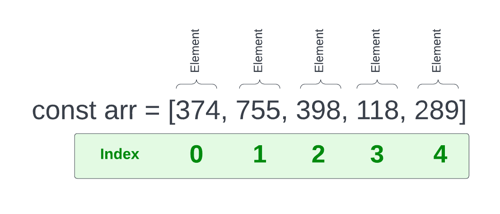
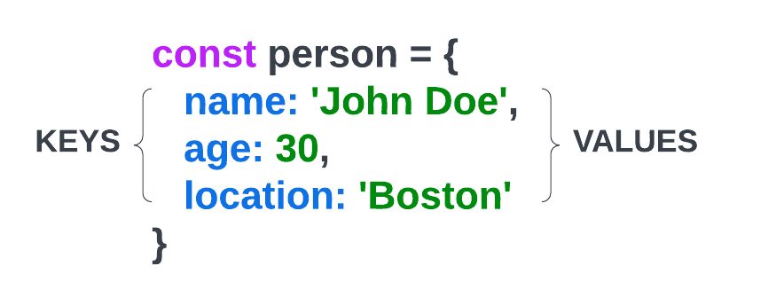

# 01-array-basics

# Array Basics

`Arrays` are a special type of `object` in JavaScript. Arrays are also what we call a `data structure`, which is just that, a way of structuring data. Lets look at a basic Array



We create a variable and set it to some brackets with some values inside. The values could be of any type. In this case, we have an array of numbers.

The values in an array are called `elements`. Each element has an `index`. The index is the position of the element in the array. The first element in an array has an index of 0. The second element has an index of 1, and so on. In just about every language, arrays are zero-based.

Let's create this same array in our code

```javascript
const arr = [374, 755, 398, 118, 289];
```

If we log the array in the console, we'll see that like other types of objects, it has a prototype property. These are all kinds of properties and methods that can be used with arrays. We'll get more into those in a little bit.

```javascript
console.log(arr);
```

#### Array Constructor

There is a second way to create an array that is less common. The one that we have already used is called an `array literal`. The second is by using the `Array` constructor with the `new` keyword

```js
const arr2 = new Array(1, 2, 3, 4, 5);
```

You can use either one to create an array. They both create an array object.

#### Getting values by index

So to get one of these values, we can use the index of the element we want to get. To get the first one

```javascript
arr[0];
```

If we wanted to use an array value in an expression, we could

```javascript
arr[0] + arr[3]; //492
```

Arrays can have any type of data within it. In this case, we have an array of numbers, but we could create an array of strings

```javascript
const fruit = ['apples', 'oranges', 'pears'];
```

We can even mix types of data within an array and even have an array within an array

```javascript
const mixed = [1, 'string', true, null, undefined, [1, 2, 3]];
```

#### Array length

We can get the length of an array using the `.length` property, which is very useful

```javascript
console.log(arr.length); // 5
```

#### Mutating arrays

Arrays are mutable, meaning we can add, change and remove elements. There are many methods that we can use and I'll get into those in a little bit, but lets say we want to add a new element to the end without using any kind of method.

We know that the `length` property gives us the total count of elements and since the array is 0-based, we can simply add the length as the index of the new element

```JavaScript
fruit[fruit.length] = 'Peaches'; // ['apples', 'oranges', 'pears', 'peaches']
```

````

In the code above, `fruit.length` was `3` so we set the value of `fruit[3]`, which was the next index.

If we want to target a specific index and change the value, we can do that easily

```javascript
fruit[1] = 'mangos';
````

We can also set the array length to a new value, which will shorten the array

```JavaScript
fruit.length = 2;
```

Now the array would look like this

```javascript
['apples', 'oranges'];
```


---


# 02-array-methods

# Array Methods

As we talked about earlier, arrays are a special kind of `object`. Objects have `properties` and `methods`. In JavaScript, those methods are stored in the `prototype chain`. We'll talk much more about prototypes later on, but we already saw that both `string objects` and `number objects` have properties and methods in their prototypes.

### Array methods

#### push()

Push adds an element to the end of the array.

```js
arr.push(6); // [1, 2, 3, 4, 5, 6]
```

#### pop()

Pop removes the last element of the array.

```js
arr.pop(); // [1, 2, 3, 4, 5]
```

#### unshift()

Adds an element to the beginning of the array.

```js
arr.unshift(0); // [0, 1, 2, 3, 4, 5]
```

#### shift()

Takes an element off of the start of the array.

```js
arr.shift(); // [1, 2, 3, 4, 5]
```

#### reverse()

I'll let you figure out what this does.

```js
arr.reverse(); // [5, 4, 3, 2, 1, 0]
```

### Returning values from an array

The methods above are all used to manipulate a current array. These methods are typically used to return some kind of value from an array.

#### includes()

Returns `true` if the array contains the value you pass in.

```js
arr.includes(5); // true
```

#### indexOf()

Returns the index of the value you pass in.

```js
arr.indexOf(5); // 4
```

#### Return string from array

```js
arr.toString(); // "1,2,3,4,5"
arr.join(); // "1,2,3,4,5"
```

### slice() and splice()

These are similar in that they both are used to return a new array using a subset of the current array.

#### slice()

slice() takes in two parameters. One being the starting index and one being the ending index.

```js
const newArr = arr.slice(1, 3); // [2, 3]
```

#### splice()

splice() takes in the starting index and the number of elements from the staring index. If you leave off the number of elements, it will take from the starting index and on.

```js
const newArr = arr.splice(1, 3); // [2, 3, 4]
```

Another difference is that slice() does not modify the original array and splice() does. If you log the original array, you will see those elements are gone.

To pluck out a single value, use splice and pass the start index and then 1 as the second arg because you only want to remove that element.

```js
const newArr = arr.splice(2, 1); // [3] the original array would be [1, 2, 4, 5]
```

You can also start from the end with a negative value

```js
const newArr = arr.slice(-2); // [4, 5]
```


### Chaining methods

You can also chain these methods together. Just be aware of what is being returned from the previous method.

```js
x = arr.concat(arr2).reverse();
x = arr3.slice(1, 3).toString();
```

---


# 03-array-nesting-concat-spread

# Nesting, concat, spread & Array Object Methods

To get you more familiar with arrays, we are going to look at nesting, concatenation and the spread operator

Let's create our fruit array again

```javascript
const fruits = ['apple', 'pear', 'orange'];
```

and let's create a "berries" array

```javascript
const berries = ['strawberry', 'blueberry', 'rasberry'];
```

Now let's nest the berries array inside the fruit array

```javascript
fruits.push(berries);// ['apples', 'oranges', 'pears', ['strawberries', 'blueberries', 'raspberries']]
```

Now if we want to access blueberries for example, we can do so

```javascript
fruits[3][1]; // blueberries
```

We could also create a new variable and nest both arrays:
```JavaScript
const allFruits = [fruits, berries];
```

```javascript
allFruits[1][1]; // blueberries
```

#### concat()

We may not want to nest arrays, but we can concatenate them together into the same array using `concat()`.

```javascript
const newArr = fruits.concat(berries);// ['apples', 'oranges', 'pears', 'strawberries', 'blueberries', 'raspberries']
```

So now we have a single array with all of the values of both arrays. There is no nesting going on.

#### Spread operator (...)

The spread operator is a very useful operator that allows us to spread out an array into another array. We can use it to achieve the same type of stuff that concat() does. The spread operator also works with object literals, which we will talk about very soon.

```javascript
const newArr2 = [...fruits, ...berries]; // ['apples', 'oranges', 'pears', 'strawberries', 'blueberries', 'raspberries']
```


### Flatten an array

You can use the `flat()` method to flatten an array. It takes in a parameter for the depth. If you don't want a limit to the depth, you could use `Infinity`.

```js
const arr = [1, 2, [3, 4, 5], 6, [7, 8, [9, 10, [11, 12]]]];
x = arr.flat(Infinity);
```


### Static properties on the Array object

The Array object in JavaScript actually has some helpful methods directly associated with it that we can use.

#### Array.from()

Check if something is an array.

```js
Array.isArray(fruits); // true
Array.isArray('Hello'); // false
```

#### Array.from

Convert an array-like object into an array.

```js
Array.from('12345'); // ['1', '2', '3', '4', '5']
```

#### Array.of()

Create an array from a variable number of arguments.

```js
const a = 1;
const b = 2;
const c = 3;
y = Array.of(a, b, c); // [1, 2, 3]
```


---


# 04-array-challenges

# Array Challenges

Now that we have gone over some basic array stuff, let's try some simple challenges. I would suggest trying these using just what you remember from the past sections, but if you need to look back, that's fine as well.

**Note:** When I assign a challenge, I will never ask you to do something that we have not went over yet in the course. For example, I would not ask you to create a function because we haven't talked about functions yet. Because of this, some of the earlier challenges may seem a bit easy to some of you that already have experience with JavaScript.

### Challenge 1:

**Instructions:**

Use some of the array methods that we looked at to mutate the following array to = the expected result below:

```js
const arr = [1, 2, 3, 4, 5];
```

**Expected Result:**

```js
console.log(arr);
// [6, 5, 4, 3, 2, 1, 0];
```

**Hint**: No hints. This one is pretty easy ;)

<details>
  <summary>Click For Solution</summary>
  
  ```js
  const arr = [1, 2, 3, 4, 5];

    arr.unshift(0);
    arr.push(6);
    arr.reverse();

    console.log(arr); // [6, 5, 4, 3, 2, 1, 0];

````

</details>


### Challenge 2:

**Instructions:**

Combine `arr1` and `arr2` into a new array called `arr3` with the following elements:

```js
const arr1 = [1, 2, 3, 4, 5];
const arr2 = [5, 6, 7, 8, 9, 10];
````

Notice that both `arr1` and `arr2` include the number 5. You will have to find a way to get rid of the extra 5.

**Expected Result:**

```js
console.log(arr3);
// [1,2,3,4,5,6,7,8,9,10]
```

**Hint**: There are many ways to do this, but think of the concat() method or the spread operator as well as the slice() or splice() methods

<details>
  <summary>Click For Solution</summary>
  
```js
const arr1 = [1, 2, 3, 4, 5];
const arr2 = [5, 6, 7, 8, 9, 10];

// Solution 1
const arr3 = arr1.slice(0, 4).concat(arr2);

console.log(arr3); // [1,2,3,4,5,6,7,8,9,10]

// Solution 2
const arr4 = [...arr1, ...arr2];
arr4.splice(4, 1);

console.log(arr4); // [1,2,3,4,5,6,7,8,9,10]

```

</details>

```


---


# 05-object-literals

# Object Literals

I want to talk about a very common JavaScript data structure that holds key/value pairs called an `object literal`. We can also create objects using a `constructor`, but I will get into that later on. The main difference between using a constructor and an object literal is that the object literal is a `singleton`, meaning that it is a **single instance** of the object. With a constructor, we can create multiple instances of the object. Most of the time, we will use the object literal syntax.



The image above shows us the syntax to create a new object. Essentially, all an object is, is a set of `properties` with `key/value` pairs. The `key` is often called the `property name`. The values go by the same types and principles as anything you would set in a regular variable (string, number, boolean, etc)

```js
const person = {
  name: 'John',
  age: 30,
  location: 'Boston',
  hobbies: ['movies', 'music'],
  isAdmin: false,
};
```

We can also nest objects, but I'm going to go over that in next video.

### Accessing property values

To access a value, we can use both dot notation and bracket notation.

```js
// Dot notation
person.name; // John

// Bracket notation
person['name']; // John
```

We will typically use dot notation and use brackets with arrays. Although, technically arrays are just objects with a numeric index.

To access the first hobby in the array:

```js
person.hobbies[0]; // movies
```

### Adding & updating properties

I just manually added and changed some of the properties directly in the object above, but to programmatically add or change properties, we could do this:

```js
person.email = 'john@gmail.com'; // Add a new property
person.isAdmin = true; // Update an existing property
```

### Removing properties

To remove a property, we can use the `delete` keyword.

```js
delete person.isAdmin;
```

### Adding functions to objects

Not only can we store primitives, arrays and other objects, we can also store functions as an object's property.

```js
person.greet = function () {
  console.log('Hello, my name is ' + this.name);
};
```

Notice I used the keyword `this` to access the `name` property. This is because `this` refers to the object that the function is being called on. This is where `scope` comes into play. If we are in the `global scope`, then the `this` keyword refers to the `global object` or the `window` in the browser. We'll get more into scope in the next section.

We can call the greet function like this:

```js
person.greet(); // Hello, my name is John
```

### Using multiple words in property names

If you want to use multiple words as a property name or key, you can use quotes or backticks to wrap the property name.

```js
const person2 = {
  'first name': 'Brad',
  'last name': 'Traversy',
};
```

We have to use bracket notation when using property names with multiple words.

```js
person2['first name']; // Brad
```


---


# 06-object-spread-methods

# Object Nesting, spreading, methods and more

So we saw how to create object literals in JavaScript. I want to go a bit deeper and look at nesting, the spread operator as well as some static methods on the Object constructor.

First, I do want to show you another way of creating objects that you may run into and that is by using the Object constructor.

```js
const todo = new Object();
// Same as
const todo = {};
```

We can add properties to the object using dot notation.

```js
todo.id = 1;
todo.title = 'Buy milk';
todo.completed = false;
```

Later on when we get more into OOP, I'll show you how we can create our own object constructors that we can use to create multiple instances of the same object. So that we can do something like this:

```js
const todo1 = new Todo();
```

For now, we'll stick with static object literals.

### Nesting objects

We can put objects inside other objects.

```js
const person = {
  address: {
    coords: {
      lat: 42.3601,
      lng: -71.0589,
    },
  },
};
```

If we want to access nested objects, we simply use dot notation

```js
person.address.coords.lat;
```

### Spread operator

The spread operator is used to **spread** across object properties into a new object. Let's first look at another example of nesting.

```js
const obj1 = { a: 1, b: 2 };
const obj2 = { c: 1, d: 4 };

const obj3 = { obj1, obj2 }; // { { a: 1, b: 2 }, { c: 1, d: 4 } }
```

### Object.assign()

We can do the same thing we did with the spread operator with the Object.assign() method.

```js
const obj1 = { a: 1, b: 2 };
const obj2 = { c: 1, d: 4 };

const obj3 = Object.assign({}, obj1, obj2); // { a: 1, b: 2, c: 1, d: 4 }
```

The first param we pass in is an empty object, then each one after is an object we want to spread into the empty object.

In the code above, we are simply nesting. We can use the spread operator to spread the properties instead of just nesting the entire object.

```js
const obj3 = { ...obj1, ...obj2 }; // { a: 1, b: 2, c: 1, d: 4 }
```

### Arrays of objects

In many cases, you will be dealing with arrays of objects.

```js
const people = [
  { id: 1, name: 'John' },
  { id: 2, name: 'Sara' },
  { id: 3, name: 'Mike' },
];
```

We can access the name **Sara** like this:

```js
people[1].name; // Sara
```

### Object methods

The Object() constructor has some helpful methods that we can use, just like the `Number()` and `String()` constructors. We already looked at `Object.assign()`, let's look at some others.

#### keys()

Get an array of all the keys in an object.

```js
Object.keys(person); // ['name', 'age', 'address']
```

#### Getting the length of an object

We can't use the `length` property directly on an object. If I do the following, it will look for a 'length' property.

```js
person.length; // undefined
```

However, we can first get the keys of the object and then use the length property on the keys array.

```js
Object.keys(person).length; // 3
```

#### values()

We can get an array of all the values in an object.

```js
Object.values(person); // [ 'John', 30, { address } ]
```

#### entries()

Get an array of key/value pairs

```js
Object.entries(person); // [ [ 'name', 'John' ], [ 'age', 30 ], [ 'address', { address } ] ]
```

#### hasOwnProperty()

Get a boolean indicating if the object has the property

```js
person.hasOwnProperty('name'); // true
```


---


# 07-destructuring-naming

# Destructuring & Naming

#### Variables with the same name

In some cases, we may have a variable that we want to add as an object property value. If a property name (key) is the same as the variable name for the value, we can withdraw the variable name of the value. For example:

```js
const firstName = 'John';
const lastName = 'Doe';
const age = 30;
```

Here I will put the variables above as the values for each property of the object. I will use the same variable names as the property names.

```js
const person = {
  firstName: firstName
  lastName: lastName
  age: age
};
```

We can shorten this code by removing the variable names from the property values. The variable names are the same as the property names, so we can remove them.

```js
const person = {
  firstName
  lastName
  age
};
```

#### Destructuring an object

Destructuring allows us to pull values/variables out of an object

```js
const todo = {
  id: 1,
  title: 'Take out trash',
};

const { id, title } = todo;

console.log(id, title); // 1, 'take out the trash'
```

We can also go multiple levels deep:

```js
const todo = {
  id: 1,
  title: 'Take out trash',
  user: {
    name: 'John',
  },
};

const {
  user: { name },
} = todo;

console.log(name); // John
```

If we want to rename the properties, we can do that too:

```js
const { id: todoId } = todo;

console.log(todoId); // 1
```

#### Destructuring an array

We can also destructure arrays. I personally don't destructure arrays as much as I do objects

```JavaScript
const numbers = [10, 20, 30, 40];

const [firstNumber, secondNumber] = numbers;

console.log(firstNumber, secondNumber) // 10, 20
```

#### The rest operator

The spread operator (...) can be used here, but in this situation, we call it the `rest operator`. It puts the "rest" of the values in an array

```JavaScript
const [firstNumber, secondNumber, ...rest] = numbers;

console.log(rest) // [30, 40]
```


---


# 08-json-intro

# An Intro to JSON

**JSON** is something that you will be working with a lot as a JavaScript developer. **JSON** stands for **JavaScript Object Notation** and is a lightweight data-interchange format. It is essentially a way of storing data in a simple, human-readable format.

In web development, especially in JavaScript, we work with APIs that send and receive data to and from a server. Several years ago, XML (Extensible Markup Language) was the standard for sending data, but in more recent years, JSON has become the standard.

An example of an API that you can make a request to right now and see the JSON response would be the Github API. In your browser, go to the following URL:

https://api.github.com/users/bradtraversy

You will see the result is in JSON format.

The reason I want to talk about JSON right now is because we are talking about JavaScript object literals and the syntax that JSON uses is extremely similar. JSON uses curly braces of key/value pairs. Let's look at an example of a JSON object:

```json
{
  "name": "John",
  "age": 30,
  "city": "New York"
}
```

The main difference here is that the keys have double quotes around them. These are required and they must be double quotes. As far as the values, strings must be wrapped in double quotes. Numbers and booleans do not.

We have methods available to turn JavaScript objects into JSON strings and vice versa.

```js
const obj = {
  name: 'John',
  age: 30,
  city: 'New York',
};

// Turn object into JSON string
const str = JSON.stringify(obj);
console.log(str); // {"name":"John","age":30,"city":"New York"}

// Turn JSON string into object
const obj2 = JSON.parse(str);
console.log(obj2); // {name: "John", age: 30, city: "New York"}
```

Aside from `stringify()` and `parse()`, there isn't really anything else to learn about the JSON object. You will use these two methods a lot though, whether you are on the front-end or back-end.

We can not access properties from a JSON string.

```js
console.log(str.name); // undefined
```

If we try and get the index of a JSON string, we will get the character, because it is treated as a string.

```js
console.log(str[0]); // "{"
```

### JSON Arrays

We have JSON objects like the one above, but JSON can also have arrays. We can also set arrays as a property value.

```json
[
  {
    "name": "John",
    "age": 30,
    "city": "New York",
    "hobbies": ["basketball", "cooking"]
  },
  {
    "name": "Jane",
    "age": 20,
    "city": "LA",
    "hobbies": ["movies", "sports"]
  },
  {
    "name": "Jack",
    "age": 25,
    "city": "Paris",
    "hobbies": ["music", "painting"]
  }
]
```

We can parse it into a JavaScript object with JSON.parse(). Then we can access the properties.

```js
const arr = JSON.parse(str);
console.log(arr[0].name); // John
```


---


# 09-object-challenge

# Object Challenge

### Step 1

Create an array of objects called `library`. Add 3 objects with a property of `title`, `author`, `status`. Title and author should be strings (whatever value you want) and status should be another object with the properties of `own`, `reading` and `read`. Which should all be boolean values. For all status, set `own` to `true` and `reading` and `read` to false.

### Step 2

You finished reading all of the books. Set the `read` value for all of them to `true`. Do not edit the initial object. Set the values using dot notation.

### Step 3

Destructure the title from the first book and rename the variable to `firstBook`

### Step 4

Turn the library object into a JSON string. There is a specific function that we looked at in the last section that we can use to do this.

<details>
  <summary>Click For Solution</summary>

### Step 1 Solution

```js
const library = [
  {
    title: 'The Road Ahead',
    author: 'Bill Gates',
    status: {
      own: true,
      reading: true,
      read: false,
    },
  },
  {
    title: 'Steve Jobs',
    author: 'Walter Isaacson',
    status: {
      own: true,
      reading: false,
      read: false,
    },
  },
  {
    title: 'Mockingjay: The Final Book of The Hunger Games',
    author: 'Suzanne Collins',
    status: {
      own: true,
      reading: false,
      read: true,
    },
  },
];
```

### Step 2 Solution

```js
library[0].status.read = true;
library[1].status.read = true;
library[3].status.read = true;
```

### Step 4 Solution

```js
const { title: firstBook } = library[0];
console.log(firstBook);
```

### Step 4 Solution

```js
const libraryJSON = JSON.stringify(library);
console.log(libraryJSON);
```

</details>
