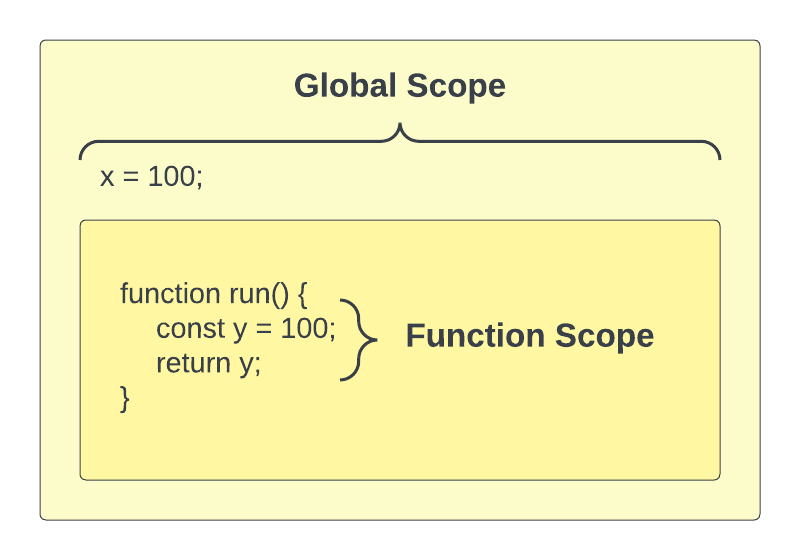
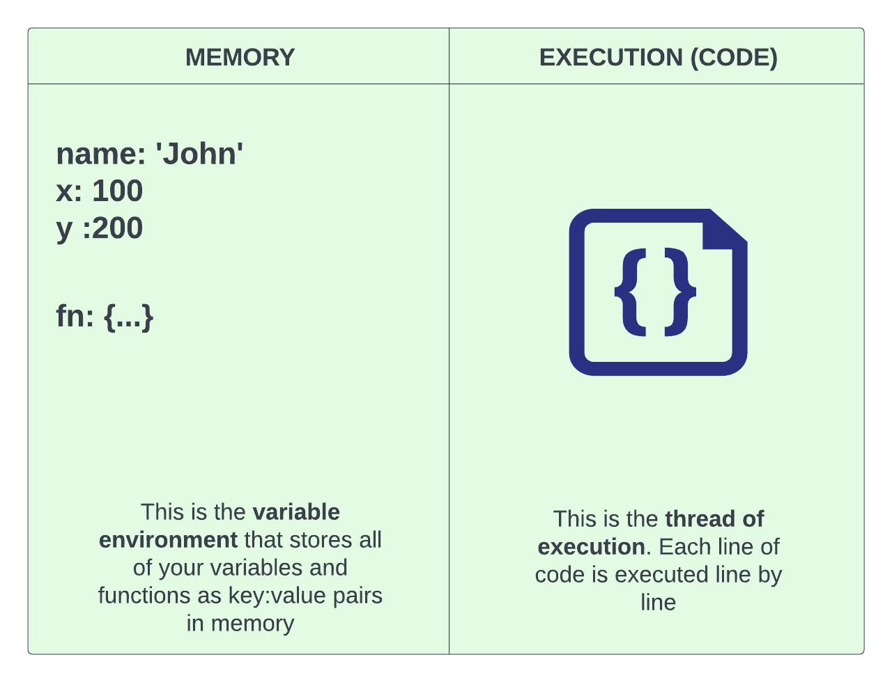
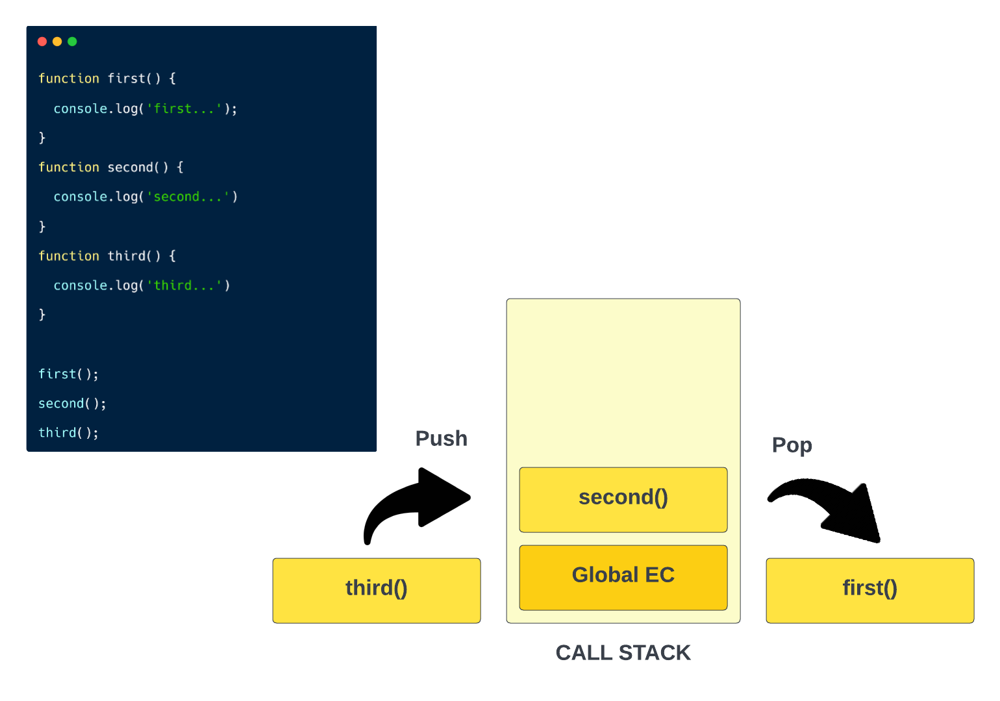
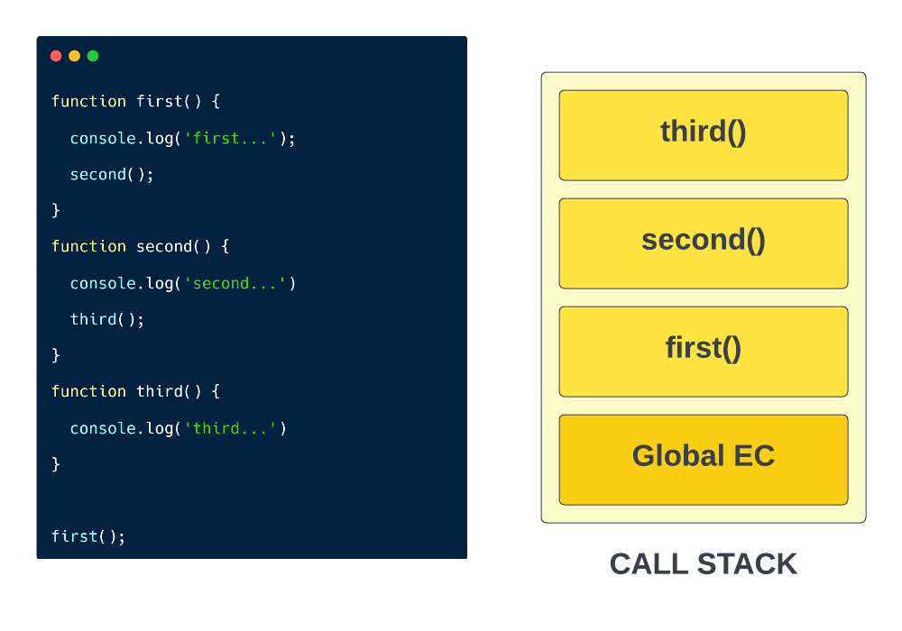

# 01-function-basics

# Function Basics

Functions are a way to group code together. They make code more readable and easier to understand. Let's look at some of the basics.

## Creating a function

Creating or defining a function is simple. We use the function keyword, followed by the name of the function, followed by parentheses. Then we create the function body wrapped in curly braces.

```js
function sayHello() {
  console.log('Hello World');
}
```

When we create a function, we don't add a semi-colon at the end of the curly braces.

Just creating the function does not execute any code. We need to "call" or "invoke" the function to execute the code within it.

```js
sayHello(); // Hello World
```

### Function Parameters

You can define parameters for functions to allow the user to input specific data when calling the function.

```js
function add(x, y) {
  console.log(x + y);
}

add(5, 5); // 10
```

#### Parameters vs. Arguments

- Parameters are the names of the variables that are used to pass data into a function.
- Arguments are the values that are passed into the function

### Returning a value

The function that we created just console logs a message. In the real world, you'll usually want to return a value from a function.

Anything that you put after the return will not get executed because you are essentially ending the function and returning to the parent scope.

```JavaScript
function subtract(x, y) {
  return x - y;

  // This code will not execute
  console.log('After the return');
}

// This will not output anything
subtract(10, 5);

// You could log the value like This
console.log(subtract(10, 5)); // 5

// Usually we do something with the return value, like store it in a variable

const result = subtract(10, 5);
```

You can also return without a value. This is useful for functions that don't return anything. You may have a function to update or delete some data on a server, but don't have a need to return anything.


---


# 02-function-arguments

# More on Params & Arguments

When we create a function, we can allow data to be passed in by creating **parameters** or "params". The data that we pass in when we invoke a function is called an **argument**. I want to look a little more into them.

```js
function registerUser(user) {
  return user + ' is registered';
}

console.log(registerUser('John')); // John is registered
```

First off, if it isn't obvious, the variable of `user` is only available inside the function. The area within the function is called the function's `scope`.

If I try to log the name variable outside of the function, I will get an error.

```js
console.log(user); // Uncaught ReferenceError: user is not defined
```

We will talk more about scope soon.

Let's see what happens if we run the `registerUser()` function, but without passing in a parameter.

```js
console.log(registerUser()); // Undefined is registered
```

### Default Parameters

Sometimes, we may want to make parameters optional and have a default value for them if not passed in. In the ES2015 update, they added a new and easy syntax for this. Before that update, we would do something like this.

```js
function registerUser(user) {
  if (!user) {
    user = 'Bot';
  }
  return user + ' is registered';
}
```

But now, we can simply add the default value with the "=" sign

```js
function registerUser(user = 'Bot') {
  return user + ' is registered';
}

console.log(registerUser()); // Bot is registered
```

### Rest Parameters

Usually, you will know exactly which parameters will be passed to your functions. In the case of a function that takes in multiple arguments that we won't know beforehand, we can use the "rest" operator to collect all of the arguments into an array.

```js
function sum(...numbers) {
  return;
}

sum(1, 2, 3, 4, 5); // [1, 2, 3, 4, 5]
```

As you can see, all the params we pass in are put into an array.

We have not learned about loops yet, but let's say that we want to add all of the numbers passed in. We could do the following.

```js
function sum(...numbers) {
  let total = 0;

  for (const num of numbers) {
    total += num;
  }

  return total;
}

console.log(sum(1, 2, 3, 4)); // 10
```

### Passing objects as arguments

We don't always pass in a primitive value as an argument. Sometimes we want to pass in an object.

```js
function registerUser(user) {
  console.log(`User ${user.id}(${user.name}) has been registered`);
}

const user = {
  id: 1,
  name: 'John',
};

registerUser(user); // User 1(John) has been registered

// or we can pass the object directly:

registerUser({
  id: 1,
  name: 'John',
});
```

### Passing arrays as arguments

We may want to pass in an array. Let's create a function that takes in an array and returns a random number.

```js
function getRandom(arr) {
  // get random index value
  const randomIndex = Math.floor(Math.random() * arr.length);

  // get random item
  const item = arr[randomIndex];

  return item;
}

const numbers = [1, 2, 3, 4, 5, 6, 7, 8, 9, 10];

console.log(getRandom(numbers)); // 4
```


---


# 03-global-function-scope

# Global & Function Scope

**Scope** is an important concept, not only in JavaScript, but in many other programming languages. Scope is the current area or context of a specific piece of code. There are certain rules for what is accessible in specific scopes.



### Global Scope

In JavaScript, when we write code in the `global scope` it is available everywhere, including functions. If we are NOT inside of a function or any kind of block, such as an if statement or a loop, then we are in the `global scope`.

#### The `window` object

The browser creates a global object called `window`. This object has a ton of methods and properties on it that are available to us that we'll be looking at later on in the course.

The `alert` method belongs to the window object.

```JavaScript
window.alert('Hello World');
```

Since the window object is the most top-level object in the browser environment, we don't need to use **window**

```JavaScript
alert('Hello World');
```

There is an `innerWidth` property on the window object. We could use that anywhere as well

```JavaScript
console.log(window.innerWidth);
```

We can use it in a function as well because it is global

```JavaScript
function run() {
  console.log(window.innerWidth);
}
```

#### Creating globally scoped variables

If I simply create a variable at the top of a JavaScript file, this is a global variable in the global scope and I can access it anywhere.

```js
const x = 100;
console.log(x); // 100
```

If we try to access x in the `run()` function, we can because it's global.

```JavaScript
function run() {
  console.log(x); // 100
}
```

### Function Scope

Function scope is the scope that is available to all code inside of a function. Any variables we define here will be available only inside of the function.

```js
function add() {
  const y = 50;
}

console.log(y); // ReferenceError: y is not defined
```

Since `x` is global, I could use that in the `add()` function

```js
function add() {
  const y = 50;
  console.log(x + y); // 150
}
```

If I create a variable called `x` in the function, it will overwrite the global variable and I can no longer access it. This is called **variable shadowing**.

```js
function add() {
  const x = 1;
  const y = 50;
  console.log(x + y); // 51
}
```

### Local Scope

Whatever scope we are currently working in or talking about is called the `local scope`.


---


# 04-block-scope

# Block Scope

`Block scope` is the scope that is available to all code inside of a `block`. A block is something like an if statement or any kind of loop. I know we haven't talked about these yet, but we'll get to them soon. Just know that they have their own scope.

```js
const x = 100;

if (true) {
  console.log(x); // 100
  const y = 200;
  console.log(x + y); // 300
}

console.log(y); // ReferenceError: y is not defined
```

As you can see, we can not access `y` in the global scope because it belongs to the if statement block.

### Loop Example

I know we have not gone over loops yet, but I want to show you that they do have their own block scope.

```js
for (let i = 0; i < 10; i++) {
  console.log(i);
}
console.log(i); // ReferenceError: i is not defined
```

As you can see, `i` is only available inside of the loop.

### let & const vs var

For all of these examples, I used `const` to define my variables. Both `const` and `let` are block scoped. `var` on the other hand is NOT. Let's try an example with var.

```js
if (true) {
  const a = 500;
  let b = 600;
  var c = 700;
}

console.log(a); // ReferenceError: a is not defined
console.log(b); // ReferenceError: b is not defined
console.log(c); // 500
```

If you use `var` with a for loop, it will also be accessible outside of the loop, which you do not want.

```JavaScript
for (var i = 0; i <= 10; i++) {
  console.log(i);
}

console.log(i); // 11
```

One thing I do want to mention is that `var` is at least **function-scoped**. So if you create a variable in a function with `var`, it will not be accessible outside of the function.

```js
function run() {
  var d = 100;
  console.log(d);
}

run();

console.log(d); // ReferenceError: d is not defined
```

When it comes to which of the 3 to use, I would suggest using `let` or `const`. Unless you have a good reason to use `var`. Having variables that are not accessible outside of their scope is usually a good thing.

Another difference with `var` is that when you create a global variable using it, that variable is put on the `window` object.

```JavaScript
const foo = 1;
var bar = 2;
```

You can check by typing `window` in your console and you will see `bar` will be there


---


# 05-nested-scope

# Nested Scope

### Nested Functions

In JavaScript, we can also define a function within a function. This is called a `nested function`. This relates to something called `closures`, which we will talk about later. When it comes to scope, any variable defined in the parent function is available to the nested/child function, but not the other way around.

```js
function first() {
  const x = 500;

  function second() {
    const y = 600;
    console.log(x); // 500
  }

  console.log(y); // ReferenceError: y is not defined

  second();
}

first();
```

As you can see, the `x` variable is defined in `first()`, so we have access to it in the child function, `second()`. However, the `y` variable is defined in `second()`, so we can't access it in the parent function, `first()`. We can access variables from parents but can not access variables from child functions.

### Nested If

Just like with functions, we can access the parent block scope, but not the nested/child scope

```JavaScript
if (true) {
  const x = 100;
  // Nested if
  if (x === 100) {
    const y = 200;
    console.log(x + y); // 300
  }

  // console.log(y); // ReferenceError: y is not defined
}

// console.log(y); // ReferenceError: y is not defined

```


---


# 06-declaration-vs-expression

# Function Declaration vs Function Expression

Up to this point, we know how to declare a function and call or invoke it. There is another way that we can create functions and that is with a function expression. Let's first declare a function just like we've been doing.

```js
function addDollarSign(value) {
  return '$' + value;
}

addDollarSign('10'); // '$10'
```

A function expression is when we assign a function to a variable.

```js
const addPlusSign = function (value) {
  return '+' + value;
};

addPlusSign('10'); // '$10'
```

Notice that we invoke them the same exact way, but we define them differently. The expression is just a variable assigned to a function. Semi-colons are optional in JS, for the most part, but if you are using them, you would put one at the end of the function expression, because again, we are assigning a variable.

## Hoisting

I am not going to explain the ins and outs of hoisting here, I will do that soon when we get into something called `execution context`, but in very simple terms, hoisting is the process of moving all of the function and variable **declarations** to the top of the current scope. before the code is run.

I do want to mention that both functions and variables/function expressions are hoisted, but only function declarations are available before the code is run.

Let's try and access the `addDollarSign()` function **before** it is defined.

```js
const money = addDollarSign('10'); // '$10'

function addDollarSign(value) {
  return '$' + value;
}
```

This still works, however, if we try this with a function expression, it will not work

```js
addPlusSign('10'); // Cannot access 'addPlusSign' before initialization

const addPlusSign = function (value) {
  return '+' + value;
};
```

I will get more into hoisting later, but for now, just know that you can define a function declaration and a function expression. Which one to use really comes down to preference. It may seem that declarations are better because of the way they're hoisted, but in reality, it's not good practice to use functions before they are defined. Using expressions actually makes your code less prone to errors in my own opinion.


---


# 07-arrow-functions

# Arrow Functions

Arrow functions were introduced in **ES6** or **ES2015**. They are a shorter syntax for writing functions with some advantages such as being more compact, implicit returns and lexical scope. Let's look at the syntax.

First off, let's look at a simple traditional function:

```js
function add(a, b) {
  return a + b;
}

add(1, 2); // 3
```

Now let's look at the same thing written as an arrow function:

```js
const add = (a, b) => {
  return a + b;
};

add(1, 2); // 3
```

There are a few things to note here. First, we took away the `function` keyword and instead added a variable declaration. This is because arrow functions are always anonymous functions so we need to assign them to a variable in this case.

Secondly, we added what we call a `fat arrow` to the function, which is an equal sign and a greater-than sign. Sometimes, arrow functions are reffered to as `fat-arrow functions`.

#### Implicit Return

We can actually shorten this particular function a bit more, because it only has one line of code that is a single expression. In this case, we can remove the curly braces and the return statement. If there were multiple lines of code (statements), we would need to add the curly braces and the return statement.

```js
const add = (a, b) => a + b;

add(1, 2); // 3
```

Instead of explicitly returning the result, `a + b` will be returned implcitly. When we don't use the `return` keyword, it is called an **implicit return**. If there were more than one line of code in the function, we would have to use the curly braces and the `return` keyword.

#### Returning an object literal

Where you can run into an issue with implicit returns is when you want to return an object literal.

Be sure that you use parenthises around the curly braces if you want to return an object literal implicitly.

```js
const createObj = () => ({ name: 'John' });
```

#### Single argument shorthand

Another cool feature of arrow functions is that we can remove the parenthises around the argument if it is a single argument.

If you are using VS Code with prettier as I am, it may add the parenthises automatically.

```js
const add10 = (a) => a + 10;

add10(1); // 11
```

#### Anonymous Functions

Many times we don't want to use a named function, but instead want to use an anonymous function. This is useful when we want to use a function as a callback. We can use an arrow function in this case as well.

I know we have not gone over high order array methods like forEach() yet (we will very soon), but just to give you an idea of how this works. Let's create an array with some numbers.

```js
const numbers = [1, 2, 3, 4, 5];
```

The forEach() method can be used to iterate over an array. It takes a callback function as an argument. The callback function will be called for each element in the array.

```js
numbers.forEach(function (number) {
  console.log(number);
});
```

To shorten this to one line, we can use an arrow function:

```js
numbers.forEach((number) => console.log(number));
```


---


# 08-immediately-invoked-functions

# Immediately Invoked Function Expressions (IIFE)

Usually when we deal with functions, we define them and then when we want to run them, we call/invoke them. There may be times where you want to define a function and run it at the same time. In JavaScript, we can do this with an **immediately invoked function expression**, also called an IIFE (pronounced "Iffy").

## Why Use an IIFE?

There are a few reasons why you may want to use an IIFE. One of the biggest reasons is to avoid **global scope pollution**.

If I have a second JavaScript file loading, whether I created it or it is some 3rd party library, etc and in that file is something like this.

```JavaScript
	const user = 'Brad';
```

and then in my script I don't know about that global variable and I create a variable with the same name, it will break my script. Becaue we are defining two variables in the same scope.

```JavaScript
	const user = 'John'; // Results in error
```

To fix this, I could create an IIFE

## IIFE Syntax

The syntax for an IIFE is a little strange. You have to wrap the function keyword and the function body in parentheses. You then have another set of parentheses to indicate that it is an invocation, just like you would with a regular function call.

```JavaScript
(function() {
  const user = 'John';
  console.log(user); // John
})();

// Outside of IIFE
console.log(user); // Brad
```

When it comes to global scope pollution, if you have a small script with little to no dependencies, this most likely won't be a problem. If you have a larger project, especially if multiple people are working on it, then you may want to use an IIFE because you don't know exactly which variables and functions have been defined.

## Adding Parameters

You can also create an IIFE that takes parameters.

```JavaScript
(function (name) {
  console.log('Hello ' + name);
})('John');

// Hello John
```

## Using Arrow Functions

We can also use the arrow function syntax to create an IIFE.

```JavaScript
(() => {
  console.log('Hello from the IIFE!');
})();
```

## Named IIFE

The examples above are all unnamed functions. We can give IIFEs a name, however, the function name would only be available from within the IIFE. So we could use something called **recursion**, which is when a function calls itself. The function would not be available outside the IIFE. I would not suggest running the function within itself, because it will cause an infinite loop.

```JavaScript
(function hello() {
  console.log('Hello from the IIFE!');

  hello() // Causes infinite loop
})();

hello(); // Error: hello is not defined
```

IFFEs are also used in specific design patterns such as the **revealing module pattern**, which I will talk about later.


---


# 09-function-challenges

# Function Challenges

Now that you know the basics of how functions work, let's try a few challenges.

## Challenge 1

**Instructions:**

Create a function called `getCelsius()` that takes a temperature in Fahrenheit as an argument and returns the temperature in celsius.

For bonus points, write it as a one line arrow function

**Expected Result:**

```JavaScript
console.log(getCelsius(32)); // 0
```

You can make the output look prettier by putting it into a string. You can even add `\xB0` (degrees) and a `C` in front of the celsius temperature.

```JavaScript
console.log(`The temperature is ${getCelsius(32)} \xB0C`);
// The temperature is 0 °C
```

**Hints:**

The formula for Fahrenheit to Celsius is `(F - 32) * 5 / 9`. Read more about the formula [here](https://www.cuemath.com/fahrenheit-to-celsius-formula/) if needed.

<details>
  <summary>Click For Solution</summary>
  
```JavaScript
const getCelsius = (fahrenheit) => {
  const celsius = ((fahrenheit - 32) * 5) / 9;
  return Math.round(celsius);
};

console.log(`The temperature is ${getCelsius(32)} \xB0C`); // The temperature is 0 °C

````

</details>


## Challenge 2

**Instructions:**

Create an arrow function called `minMax()` that takes in an array of numbers and returns an object with the minimum and maximum numbers in the array.

**Expected Result:**

```JavaScript
console.log(minMax([1, 2, 3, 4, 5]));
// { min: 1, max: 5 }
````

**Hints:**

1.  You can use `Math.min()` and `Math.max()` to get the min and max of a list of numbers.
2.  You can use the Spread `...` operator to spread the values of an array into separate arguments.

<details>
  <summary>Click For Solution</summary>
  
```JavaScript
function minMax(arr) {
  const min = Math.min(...arr);
  const max = Math.max(...arr);

return {
min,
max,
};
}

console.log(minMax([55, 32, 43, 54, 65, 76, 87, 98, 109]));
// { min: 32, max: 109 }

````

</details>


## Challenge 3

Create an IIFE (Immediately Invoked Function Expression) that takes in the length and width of a rectangle outputs it to the console in a message as soon as the page loads.

**Expected Result:**

```JavaScript
// On page load
The area of a rectangle with a length of 10 and a width of 5 is 50.
````

**Hints:**

1.  The area of a rectangle is `length * width`. These should get passed into the IIFE as arguments.
2.  You do not have to return anything from this function, just log to the console.

<details>
  <summary>Click For Solution</summary>
  
  ```JavaScript
((length, width) => {
const area = length * width;

const output = `The area of a rectangle with a length of ${length} and a width of ${width} is ${area}.`;

console.log(output);
})(10, 5);

```
</details>

```


---


# 10-execution-context

# Execution context

Inside the browser is a JavaScript engine that handles executing our JavaScript. That engine creates a special environment to handle the transformation and execution of code. This environment is called the `execution context`, and it contains the currently running code and everything that aids in its execution.

When we load a JavaScript file in the browser, the first thing that the engine does is create a new execution context. This is called the `global execution context`. It basically includes all of the code that is in the `global scope`. We talked about scope earlier.

## Visualizing the execution context

To give you a better idea of what the execution context looks like, you can picture it as a box with 2 sides. One side is the `variable environment` which is a memory area for your variables and functions in key-value pairs.

Then on the other side,you have your actual lines of code being run. This is the `thread of execution`. The code is executed one line at a time on a **single thread**, which you can think of as like a **process**. JavaScript is a single-threaded, synchronous language.



## Types of Execution Contexts

So we have a couple different types of execution contexts.

**Global Execution Context**
The global execution context is the default or base execution context. This is created when you run a JavaScript file in a browser. It is NOT within a function. When the global execution context is created, it performs two things. It creates the `global object` which is the `window` object in a browser. In Node.js, it's just called the `global object`. It also sets the value of the `this` keyword equal to the global object.

**Function Execution Context**
When a function is invoked, a new execution context is created for that function. Each function has its own execution context. So a new box with the 2 sides is created for the code within the function.

**Eval Execution Context**
eval() is a function property of the global object. Most JavaScript developers don't use eval, so I'm not even going to get into it here.

So just remember that we have a `global` execution context and when a function is invoked, it has it's own `function` execution context.

### Execution Context Phases

When you run a piece of JavaScript code, you create a new execution context and its created in two phases.

- The first being the **memory creation phase** or sometimes just called the **creation phase**. This is where JavaScript allocates the memory for all of the variables and functions. This happens before any code is executed. Think of it as a first pass where the JavaScript engine just goes over all the code and puts the variables and functions into memory.

- The second is the **execution phase** where the code is executed line by line. This happens after the memory creation phase.

One thing to note is that in the memory creation phase, your variables are all put into memory as `undefined`. The actual values of the variables are set during the execution phase. However, functions are directly stored in memory with all of the code inside of them.

### Execution Context In Action

Let's take the following code and see exactly what happens when it runs:

```JavaScript
1  var x = 100
2  var y = 50
3  function getSum(n1, n2) {
4    var sum = n1 + n2
5    return sum
6  }
7  var sum1 = getSum(x, y)
8  var sum2 = getSum(10, 5)
```

#### 1. Global execution context is created

- Global object is created and assigned to `this`

#### 2. Memory creation phase (global execution context)

- **Line 1:** `x` variable is allocated memory and stores `undefined`
- **Line 2:** `y` variable is allocated memory and stores `undefined`
- **Line 3:** `getSum()` function is allocated memory and stores all the code in the function
- **Line 7:** `sum1` variable is allocated memory and stores `undefined`
- **Line 8:** `sum2` variable is allocated memory and stores `undefined`

#### 3. Execution phase (global execution context)

- **Line 1:** places the `100` into the `x` variable
- **Line 2:** places the `50` into the `y` variable
- **Line 3:** skips the function because there is nothing to execute. It is a declaration
- **Line 7:** Invokes the `getSum()` function and creates a **function execution context** with a new **variable environment** and **execution thread**. It will also run the **memory phase** and the **execution phase**.

#### 4. Memory creation phase (function execution context)

- **Line 3:** parameters `n1` & `n2` variable is allocated memory and stores `undefined`
- **Line 4:** `sum` variable is allocated memory and stores `undefined`

#### 5. Execution phase (function execution context)

- **Line 3**: `n1` & `n2` are assigned `100` and `50`
- **Line 4**: The calculation is done and the result (150) is put into `sum` variable
- **Line 5**: return tells the **function execution context** to return to the **global execution context** with this value of `sum` (150)
  **Line 7** - The returned sum value is put into the `sum1` variable in the **global execution context**. The execution context of that function is then **deleted**.
  **Line 8** - We repeat the same process and create a new **function execution context**, just with different parameters being passed in.


---


# 11-call-stack

# The Call Stack

So we talked about the `execution context` in the last video and stepped through some code to see exactly what was happening under the hood. We had our global execution context and we had our function execution context. Well every function that was invoked was added to something we call the `call stack`. It's also referred to as the `execution stack` and many other terms. This keeps track of the functions that are currently being executed. You think of it as an execution context manager.

## What is a stack?

In computer science, a `stack` is a data structure. Later in the course, we'll get deeper into stacks. It's a **LIFO (last in, first out)** data structure. What this means is the last thing to be put on top of the stack is the first to come off.

To give you a better picture of this, lets look at some basic code. And Ill actually show you this in the browser as well because you can see the call stack in the sources tab.



Here we have three functions that are all being run in the global scope. When I say global scope I just mean not in a function. So this is how the call stack would work in this case.

First of all, the global execution context is always at the very bottom of the call stack. Then the function named first will get put on to the stack because that is the first function run in our code. The technical terminology is `push` when something is placed on the stack and `pop` when something is taken off. So first() will be pushed on and executed and popped off. Next, second() will be pushed on and executed, then popped off and finally, third(). Since they're all in the global scope, they don't ever get stacked on top of each other. It's just one after the other.

Now let's look at a different example.



Here, the only function being invoked in the global scope is first(). then in the first() function, the second() is being invoked, now were still in the process of executing first(), so that stays on the stack and second() is pushed on top of it. Then in second(), were executing third(), so first() and second() are still on the stack and third() gets added as well. Once the final console log is done, third() is done and taken off in `last in first out` fashion, then second() is done that gets popped off then first(). Then it's done and the `global execution context` is deleted.
