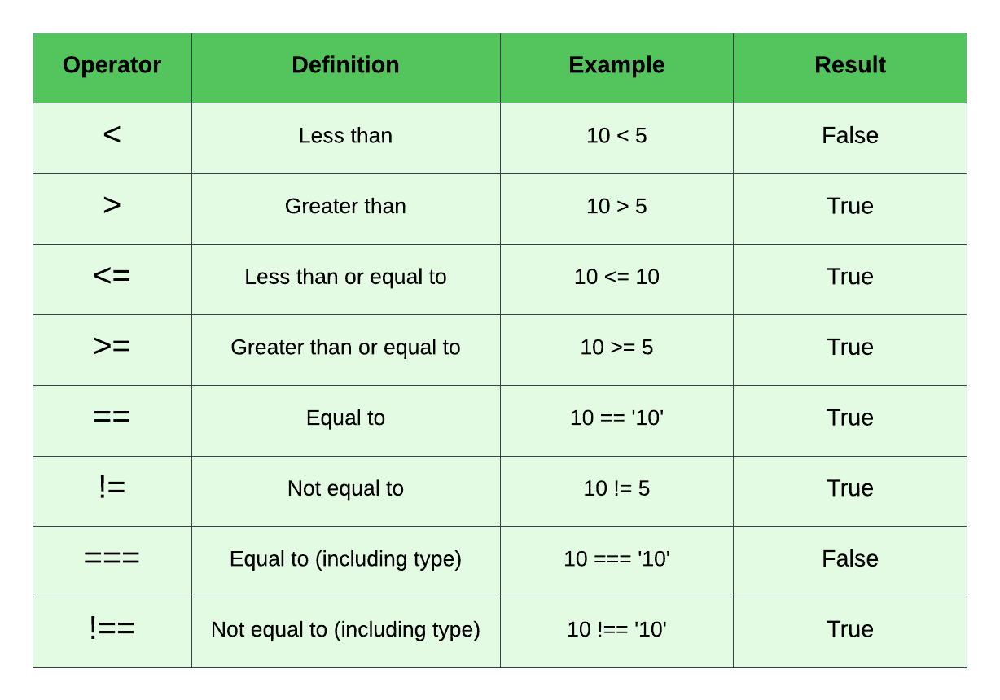

# 01-if-statements

# If Statements

In any programming language, there will be times where you need to execute certain blocks of code and commands if a certain condition is true or false. Without the ability to have this type of conditional logic, programming wouldn't really be possible.

The structure of an `if-statement` is as follows:

```js
if (condition) {
  // code to execute if condition is true
}
```

The code block will only execute if the condition is true. If the condition is false, the code block will not execute.

The condition is a boolean expression that evaluates to true or false. In fact, we could put in true or false directly

```js
if (true) {
  // code to execute if condition is true
}

if (false) {
  // code to execute if condition is false
}
```

There are something called truthy and falsy values in JavaScript. I will get more into this in a bit.

## Comparison Operators

A few sections back, we looked at the comparison operators. These operators are used to compare values and return a boolean value.



We could use these operators to compare values.

```js
const x = 10;

if (x > 5) {
  console.log(`${x} is greater than 5`);
}

if (x === 10) {
  console.log(`${x} is equal to 10`);
}
```

## if-else Statements

Instead of doing nothing if the condition is false, we can execute different code blocks depending on the condition.

```js
const x = 10;

if (x > 5) {
  console.log(`${x} is greater than 5`);
} else {
  console.log(`${x} is less than or equal to 5`);
}
```

## Block Scope

We talked about this earlier, but remember that variables defined with `let` or `const` inside of a block are not accessible outside of that block. `var` variables are, but I would not suggest using them.

```js
const x = 10;

if (x > 5) {
  const y = 20;
  console.log(`${x} is greater than 5`);
  console.log(`${y} is greater than 5`);
}

console.log(y); // ReferenceError: y is not defined
```

## Shorthand If

If the code within your if and else is a single statement and not a block of code, you omit the parentheses. It is usually not recommended and you don't see it that often, but you can do it.

```js
if (x > 5) console.log(`${x} is greater than 5`);

if (x > 5) console.log(`${x} is greater than 5`);
else console.log(`${x} is less than 5`);
```

You actually can have multiple statements, but they need to be separated with a comma.

```js
if (x > 5)
  console.log(`${x} is greater than 5`),
    console.log('another line'),
    console.log(`and another`);
```

I would not personally do this.


---


# 02-else-if-and-nesting

# Else-if and Nesting

There may be cases where you want to execute different code blocks depending on multiple conditions. In this case, you can use an `else if` statement.

Let's make this a bit more interesting and have certain logs during certain hours.

```js
const d = new Date();
const hour = d.getHours();
```

```js
if (hour < 12) {
  console.log('Good Morning!');
} else if (hour < 18) {
  console.log('Good Afternoon!');
} else {
  console.log('Good Night!');
}
```

## Nesting

There may be cases where you need to have `if statements` inside of `if statements`. In this case, you can use a `nested` `if statement`.

```js
if (hour < 12) {
  console.log('Good Morning!');

  if (hour === 6) {
    console.log('Wake up!');
  }
} else if (hour < 18) {
  console.log('Good Afternoon!');
} else {
  console.log('Good Night!');

  if (hour >= 20) {
    console.log('zzzzzzzzzzz!');
  }
}
```

## Multiple conditions

We can test for multiple conditions in the same if statement by using the `&&` (AND) and the `||` (OR) logical operators.

```js
if (hour >= 7 && hour < 15) {
  console.log('It is work time!');
}

if (hour === 6 || hour === 20) {
  console.log('Brush your teeth!');
}
```


---


# 03-switches

# Switches

If you find yourself with a lot of else-if statements and you are testing a single value, you may want to consider using a switch statement. The switch evaluates an expression and then executes the first case that matches the value.

The format for a switch statement is as follows:

```js
switch (expression) {
  case value1:
    statement1;
    break;
  case value2:
    statement2;
    break;
  default:
    statement3;
}
```

We pass in an expression to evaluate and then we use the case keyword to define a value to match against the expression. We then use the break keyword to exit the switch statement. The default will run if there is are no cases that match.

Let's say that we just want to log a message if the month is January, February, or March.

```js
const d = new Date(2022, 1, 20, 8, 0, 0);
const month = d.getMonth();

switch (month) {
  case 1:
    console.log('It is January');
    break;
  case 2:
    console.log('It is February');
    break;
  case 3:
    console.log('It is March');
    break;
  default:
    console.log('It is not January, February or March');
}
```

Switches are best for immediate values. When using ranges, they are slower than `else-if`. To use a switch with ranges, we can do this.

```JavaScript
const hour = d.getHours();

switch (true) {
  case hour < 12:
    console.log('Good Morning');
    break;
  case hour < 18:
    console.log('Good Afternoon');
    break;
  default:
    console.log('Good Night');
}
```


---


# 04-calculator-challenge

# Calculator Challenge

Now that you know how to write functions and use control structures like if statements and switches, let's try to write a simple calculator.

**Instructions:**

Create a function called `calculator` that takes three parameters: `num1`, `num2` and `operator`. The operator can be `+`, `-`, `*` or `/`. The function should return the result of the calculation. If anything other than the four operators is passed in, the function should return an error message.

**Example:**

```
calculator(5, 2, '+') // returns 7
calculator(5, 2, '-') // returns 3
calculator(5, 2, '*') // returns 10
calculator(5, 2, '/') // returns 2.5
calculator(5, 2, '%') // returns an error message
```

**Hint:**

- You can use an if statement to the operator, but this is a good example for using a switch statement.

<details>
  <summary>Click For Solution</summary>

```JavaScript
function calculator(num1, num2, operator) {
let result;
switch (operator) {
  case '+':
    result = num1 + num2;
    break;
  case '-':
    result = num1 - num2;
    break;
  case '*':
    result = num1 * num2;
    break;
  case '/':
    result = num1 / num2;
    break;
  default:
    result = 'Invalid operator';
}
console.log(result);
return result;
}

calculator(3, 4, '*'); // returns 12
```

</details>


---


# 05-truthy-falsy

# Truthy & Falsy Values

So we looked at some control structures for evaluating some basic expressions such as if something is greater than a value. We can also pass in a single value.

```js
const email = 'test@test.com';

if (email) {
  console.log('You passed in an email');
} else {
  console.log('Please enter email');
}
```

This will return true because when you put something in an if statement, it is coerced into a boolean. A string with something in it is what we call a **truthy** value.

### Converting a value to a boolean

We can test truthy and falsy values by converting them to a boolean using the `Boolean` function. We saw this a while back when we looked at data types.

```js
console.log(Boolean(name)); // true
```

We can also use the **!!** (double bang) to convert to a boolean.

```js
console.log(!!name); // true
```

Let's look at the values in JavaScript that are considered **falsy**.

### falsy Values

- false (obviously)
- 0 (also -0 and BigInt 0n)
- "" (empty string)
- null
- undefined
- NaN

If we test any of these in an if statement, it will evaluate to `false`.

```js
const x = 0;

if (x) {
  console.log('This is truthy');
} else {
  console.log('This is falsy');
}
```

We talked about type conversion a while ago. If we convert any of these values to a Boolean, they will result in `false`.

```js
console.log(Boolean(0)); // false
```

### Truthy Values

Everything that is not falsy will evaluate to `true`, however, Some of these may surprise you.

- Everything else that is not falsy
- true (obviously)
- '0' (string with 0)
- 'false' (string with false)
- ' ' (space in a string)
- [] (empty array)
- {} (empty object)
- function() {} (empty function)

If we test any of these in an if statement, it will evaluate to `true`.

```js
const x = '0';

if (x) {
  console.log('This is truthy');
} else {
  console.log('This is falsy');
}
```

### Truthy & Falsy Caveats
Let's say we have a variable called `children` that refers to the number of children someone has and we want to check it.

```js
let children = 2;

if (children) {
  console.log(`You have ${children} children`);
} else {
  console.log('Please enter the number of children you have');
}

// You have 2 children
```

Now that you understand that 0 is falsy, you will understand why the following will not work correctly.

```js
let children = 0;

if (children) {
  console.log(`You have ${children} children`);
} else {
  console.log('Please enter the number of children you have');
}

// Please enter the number of children you have
```

In this case, we want 0 to be a valid value for children, but it is falsy, so the `else` block will run and say it is not defined.

This is something that you have to be aware of. There are multiple solutions to this problem. We could check to see if the variable is not `undefined` or `null`.

```js
if (children !== undefined) {
  console.log(`You have ${children} children`);
} else {
  console.log('Please enter the number of children you have');
}
```

You probably want the value to be a number. So you could check if the value is NaN (Not a Number) with the `isNaN()` function.

```js
if (!isNaN(children)) {
  console.log(`You have ${children} children`);
} else {
  console.log('Please enter the number of children you have');
}
```

### Checking For Empty Arrays and Objects

Since empty arrays and objects are truthy, we can not simply check for the variable that holds them.

Check for an empty array:

```js
const arr = [];

if (arr.length === 0) {
  console.log('The array is empty');
}
```

Check for an empty object:

```js
const obj = {};

if (Object.keys(obj).length === 0) {
  console.log('The object is empty');
}
```

### Loose Equality Comparison

As I stated earlier in the course, I prefer to use `===` unless there is a specific reason to use `==`. Using double equals (==) can cause some unexpected behavior. Let's take a look at some of the weirdness that can happen when using `==`.

`false`, zero and empty strings are equivalent (when using ==)

```JavaScript
false == 0; // true
false == ''; // true
0 == ''; // true
```


---


# 06-logical-operators

# Logical Operators

If we use the `&&` and `||` in a conditional, this is how they work:

```JavaScript
console.log(10 < 20 && 30 > 15 && 40 > 30); // Must all be true
console.log(10 > 20 || 30 < 15); // Only one has to be true
```

There may be cases where you want to conditionally assign a value based on if a value is `truthy` or `falsy`. We can use logical operators and logical assignment for this.

## AND Operator (&&)

If we assign a value, using the `&&` operator, it will execute from left to right. If any of the values are `falsy`, that value will be returned; otherwise, the last value will be returned.

```JavaScript
x = 10 && 20; // 20
x = 10 && 20 && 30; // 30
x = 10 && 0 && 30; // 0 (30 is not evaluated)
x = 10 && false && 30; // false (30 is not evaluated)
```

## OR Operator (||)

The `||` operator is the opposite of the `&&` operator. It will return the first value that is `truthy`. This is more common than using the `&&` operator.

```JavaScript
y = 10 || 20; // 10 (20 is not evaluated)
y = 0 || 20; // 20
y = 10 || 0 || 30; // 10 (0 and 30 are not evaluated)
y = false || false || 30; // 30
```

## Nullish Coalescing Operator (??)

The `??` operator will return the right side operand when its left side is either `null` or `undefined`. It is similar to `||` operator except, it doesn't look at all falsey values, only `null` and `undefined`.

```JavaScript
let c;
c = 10 ?? 20; // 10
c = null ?? 20; // 20
c = undefined ?? 20; // 20
c = null ?? 0 ?? 20; // 0 (it will return 0 because it is not null or undefined)
```


---


# 07-logical-assignment

# Logical Assignment

What we looked at in the last video was also technically logical assignment, however what we were evaluation was not necessarily the value that we were assigning. If what we are assigning is what we are evaluating, we can use a shorthand syntax.

## OR Logical Assignment (||=)

We can do something similar with `||=`. This will assigns the right side value only if the left is a falsy value.

Here is the long form of what we are going to do
```JavaScript
let a = null;

if (!a) {
  a = 10;
}
```

If `a` is truthy, it will be left alone. If it is falsy, it will be set to 10.

A shorter way would be to use the logical OR operator like we did in the last video.

```JavaScript
a = a || 10; 
```

An even shorter way would be to use the OR assignment operator 

```JavaScript
a ||= 10;
```

## AND Logical Assignment (&&=)

We can do something similar with the AND assignment operator

First, let's looka at the long version of what we're doing

```JavaScript
let b = 10;

if (b) {
  b = 20;
}

```

If `b` is `truthy` then we are setting it to 20. 

A shorter way would be to use the logical AND operator


```JavaScript
b = b && 20; 
```

We can make it even shorter by using the AND assignment operator

```JavaScript
b &&= 20; 
```

This returns 20 because the value of `b` is 10, which is truthy.

If we try this with a falsy value, we get that falsy value.

```js
let b = false;
b = b && 20; // false
```


## Nullish Coalescing Assignment (??=)

We can us `??=` to assign a value to a variable if it is null or undefined.

Here is the long version

```JavaScript
let c = null;

if (c === null || c === undefined) {
  c = 20;
}
```

Using the ?? operator

```JavaScript
c = c ?? 20;
```

Using the ??= assignment operator

```JavaScript
c ??= 20; 
```

---


# 08-ternary-operator

# Ternary operator

In addition to `if-else` and `switch`, there is a third way to write conditional logic. This is called the `ternary` operator. It is basically a shorthand, one line `if-else` statement. The actual operator is just a question mark. Let's take a look at the syntax

```JavaScript
condition ? true : false;
```

First, we have the condition to be evaluated as a boolean. Then we have a `?`, which is the **ternary operator** and after that is the expression that we want to happen if the condition is `true`. The `:` is the else. So the expression after that will execute if the condition is `false`.

Let's look at a simple if-else statement:

```JavaScript
const age = 19;

if (age >= 18) {
  console.log('You can vote!');
} else {
  console.log('You can not vote!');
}

// You can vote!
```

We can do the same thing using the ternary operator:

```JavaScript
age >= 18 ? console.log('You can vote!') : console.log('You can not vote!');

// You can vote!
```

## Assigning result to a variable

In many cases, we want to store the result of the ternary operator in a variable.

```JavaScript
const canVote = age >= 18 ? 'You can vote!' : 'You can not vote!';

console.log(canVote); // You can vote!
```

This is much more compact than this:

```JavaScript
let canVote;

if (age >= 18) {
  canVote = 'You can vote!';
} else {
  canVote = 'You can not vote!';
}

console.log(canVote); // You can vote!
```

## Multiple statements

In most cases, you will just have a single expression in the true/false part of the ternary operator, however you can have Multiple statements by using a comma.

```JavaScript
const auth = true;

const redirect = auth
  ? (alert('Welcome To The Dashboard'), '/dashboard')
  : (alert('Access Denied'), '/login');

console.log(redirect);
```

In the case above, it will alert and then return the last value in the ternary.

## Multiple Ternary Operators

We can also have multiple ternary operators and conditions. Much like an else-if.

```JavaScript
const canDrink =
  age >= 21
    ? 'You can drink!'
    : age >= 18
    ? 'You can have 1 beer'
    : 'You can not drink';

console.log(canDrink);
```

## Using `&&` as a shorthand

If your else(semi-colon) in a ternary is going to be null or you don't need an else, you can use the `&&` operator instead. Here is an example:

```JavaScript
auth ? console.log('Welcome to the dashboard') : null;
```

We could just do:

```JavaScript
auth && console.log('Welcome to the dashboard');
```

This is the same as:

```JavaScript
if (auth) {
console.log('Welcome to the dashboard');
}
```

Using the `&&` operator as a shorthand is a popular thing to do in React templates. Many times, you will see something like:

```JavaScript
{!loading && (
  <Fragment>Some UI</Fragment>
)}
```

Which is saying if done loading, then load the JSX fragment.
