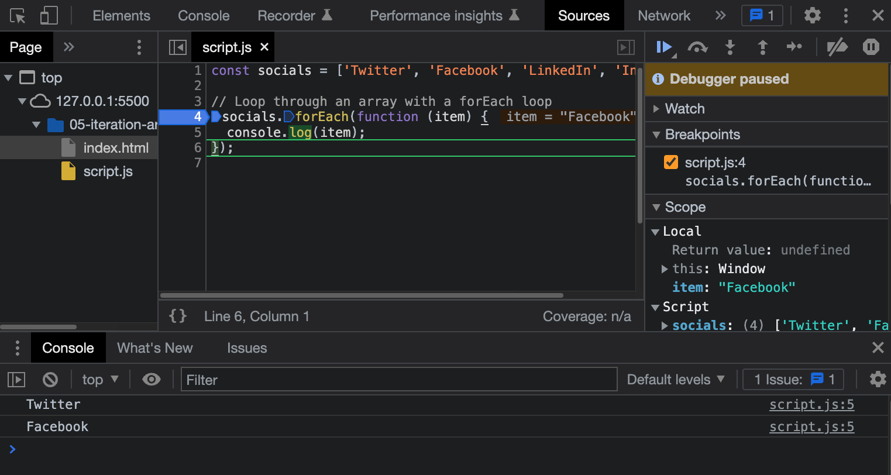

# 01-for-loop

# For Loop

A loop is a **control structure**. It provides a way to do `iteration` in programming. Iteration is a process where you repeat something over and over again until a certain condition is or is met. This can help automate tasks.

There are many different kinds of loops in programming, and one of the most common loop is the `for` loop.

### For Loop Syntax

The syntax for a `for` loop is very similar in many languages. The syntax is:

```JavaScript
for ([initialExpression]; [conditionExpression]; [incrementExpression])
  statement
```

- The **initial expression** usually initializes a variable/counter
- The **condition expression** is the condition that the loop will continue to run a long as it is met or until the condition is false
- The **increment expression** is the expression that will be executed after each iteration of the loop
- The **statement** is the code that will be executed each time the loop is run. To execute a `block` of code, use the `{}` syntax

It is important to not that we use semi-colons to separate the different parts of the loop and not commas.

Here is a very simple example of a for loop that will print out the string "Number X" where X is the number of the iteration.

```JavaScript
for (let i = 1; i <= 10; i++) {
  console.log("Number " + i);
}

// Output:
// Number 1
// Number 2
// Number 3
// Number 4
// Number 5
// Number 6
// Number 7
// Number 8
// Number 9
// Number 10
```

The variable `i` is initialized to 1, and the condition is that the loop will continue to run until the value of `i` is greater than 10. The increment expression is that the value of `i` will be incremented by 1 each time the loop is run.

We could change the initial expression to 5 and it will start from 5 instead of 1.

```JavaScript
for (let i = 5; i <= 10; i++) {
  console.log("Number " + i);
}

// Output:
// Number 5
// Number 6
// Number 7
// Number 8
// Number 9
// Number 10
```

If I wanted to count up to 100 by 5s, I could change the initial expression to 0 and the increment expression to 5.

```JavaScript
for (let i = 0; i <= 100; i += 5) {
  console.log("Number " + i);
}

// Output:
// Number 0
// Number 5
// Number 10
// Number 15
// ...
// Number 100
```

## Block scope

Loops are considered a `block`, just like if statements. Remember that variables using `let` and `const` are scoped to the block they are defined in. So if we define a variable in a loop, we can not access it outside of the loop.

```JavaScript
for (let i = 0; i <= 100; i += 5) {
  const message = 'Number ' + i;
  console.log(message);
}

console.log(message); // ReferenceError: message is not defined
```

However, if we use `var`, we can access the variable outside of the loop. This is not a good practice, but it is possible.

```JavaScript
for (let i = 0; i <= 100; i += 5) {
  var message = 'Number ' + i;
  console.log(message);
}

console.log(message); // Number 100
```

## Testing Conditions

In many cases, you will be testing for a condition in a loop. Let's look at a simple example:

```JavaScript
for (let i = 0; i <= 10; i++) {
  if (i === 7) {
    console.log('7 is my favorite number');
  }

  console.log('Number ' + i);
}
```

In the code above, we are testing the value of `i` to see if it is equal to 7. If it is, we will log the message "7 is my favorite number".

In the next video I will go over skipping an iteration and breaking out of a loop if a certain condition is true.

## Nested For Loops

`i` is a common variable name for a loop counter. Sometimes you will have a loop within a loop. In that case, you need to use a different variable name for each loop. `j` is a common variable name for a nested loop counter.

Here is an example where we loop through 1-10 and then have another loop in each iteration that shows that number multiplied by 1 - 10.

```JavaScript
for (let i = 1; i <= 10; i++) {
  console.log('Number ' + i);
  for (let j = 1; j <= 10; j++) {
    console.log(i + ' * ' + j + ' = ' + i * j);
  }
}
```

## Looping Over Arrays

Arrays have a `forEach()` method that allows you to loop over them. This is the most common way to loop over an array and we will be looking at `forEach()` and other array methods soon, however I do want to show you that we can loop over an array with a `for` loop.

```JavaScript
const names = ['Brad', 'Sam', 'Sara', 'John', 'Tim'];

for (let i = 0; i < names.length; i++) {
    console.log(names[i]);
}

```

We simply specify the condition expression as long as `i` is less than the length of the array.

If you wanted to find a specific iteration and index, you could do something like this

```JavaScript
for (let i = 0; i < names.length; i++) {
  if (i === 2) {
    console.log(names[i] + ' is the best');
  } else {
    console.log(names[i]);
  }
}

```

### Infinite Loops

Infinite loops are something that you will probably run into at one point or another. They are loops that will never stop running. One common cause of this is forgetting to increment the counter. Then the condition is always met. This happens more with while loops, because of the way they are formatted.

To purposely create an infinite `for` loop, we could do this:

```JavaScript
for (let i = 0; i < Infinity; i++) {
  console.log('Number ' + i);
}
```


---


# 02-break-and-continue

# Break & Continue

## Break Statement

We can create conditions inside of a loop to test for different things within each iteration. There may be cases where you want to stop the loop from running if a certain condition is met. In this case, you can use a `break` statement to break out of the loop.

Let's say we have a loop that prints Numbers 1 - 20, but if the number is 15, we want to exit the loop.

```JavaScript
for (let i = 1; i <= 20; i++) {
  if (i === 15) {
    console.log('Found the number 15!');
    break;
  }

  console.log('Number ' + i);
}
```

## Continue Statement

We can also use a `continue` statement to skip the rest of the code in the current iteration and continue to the next iteration.

```JavaScript
for (let i = 1; i <= 20; i++) {
  if (i === 13) {
    console.log('Skipping 13!');
    continue;
  }

  console.log('Number ' + i);
}
```


---


# 03-while-do-while-loop

# While Loops & Do While Loops

In the last video, we looked at `for` loops, which are used to iterate over a block of code until a condition is met. A `while` and `do while` loop does the same thing using a different syntax. They work a bit different as well.

### While Loop Syntax

The syntax for a while loop is very similar in many languages. The syntax is:

```JavaScript
while ([conditionExpression]) {
  statement
}
```

There are a few differences between the `for` loop, which we have already talked about, and the `while` loop.

In a `while` loop, the variable is initialized before the loop runs and it is initialized outside of the loop.

Let's look at a simple example and print Number 1-10, like we did with the `for` loop.

```JavaScript
let i = 0;

while (i <= 20) {
  console.log('Number ' + i);
  i++;
}
```

For many cases, you could use a `while` or a `for` loop and achieve the same result, but a rule that many programmers follow is to use a `for` loop when you know the number of times you want to run the loop and use a `while` loop when the number of times the loop will run is unknown. That is not a mandatory convention, but something that a lot of people do.

### Looping Over Arrays

We can loop over arrays with `while` loops as well

```JavaScript
const arr = [10, 20, 30, 40];

let i = 0;

while (i < arr.length) {
  console.log(arr[i]);
  i++;
}
```

### Nested While Loops

We can nest `while` loops to create a loop that runs a loop inside of a loop.

```JavaScript
let i = 1;

while (i <= 10) {
  console.log('Number ' + i);
  let j = 1;
  while (j <= 10) {
    console.log(i + ' * ' + j + ' = ' + i * j);
    j++;
  }
  i++;
}
```

## Do While Loops

The `do while` loop is a little different from the `while` loop. The `do while` loop will always run at least once, even if the condition is false.

So the answer to the question, "when would I want to use a `do while` loop?" is when you **always** want to run the block of code at least once.

The syntax for a `do while` loop is:

```JavaScript
do {
  statement
} while ([conditionExpression]);
```

Let's look at a simple example:

```JavaScript
let i = 1;

do {
  console.log('Number ' + i);
  i++;
} while (i <= 20);
```

Now let's change the `i` value to 21. This means that the condition expression is never met, however, the console.log() will run at least once, even if the condition is false.

```JavaScript
let i = 21;

do {
  console.log('Number ' + i);
  i++;
} while (i <= 20);
```

You can also use the `break` and `continue` statements with while and do while loops.


---


# 04-fizzbuzz-challenge

# FizzBuzz Challenge

When you go to get a job as a web developer, you may be given specific programming challenges. It's good to practice challenges like this not only for job interviews, but it sharpens your skills in general. You'll find that most challeneges have some kind of iteration involved. One of the most common challenges is the FizzBuzz challenge. This has to do with loops and conditionals, so I think that this is a good challenge at this point in the course.

**Instructions:**

- Print/log the numbers from 1 to 100
- For **multiples of three** print "Fizz" instead of the number
- For **multiples of five** print "Buzz"
- For numbers which are **multiples of both three and five** print "FizzBuzz".

**Hints:**

If you have taken the course up to this point, then you know how to write a loop and output/log something for each iteration. You also know how to check for a condition with "if/else/else if". You also know how to get a remainder of a number using the modulus operator (%). This is all you need to know to complete this challenge. Good luck!

<details>
  <summary>Click For Solution</summary>

 ### Solution 1: `For` Loop

```JavaScript
  for (let i = 1; i <= 100; i++) {
    if (i % 15 === 0) {
    	console.log("FizzBuzz");
    } else if (i % 3 === 0) {
    	console.log("Fizz");
    } else if (i % 5 === 0) {
    	console.log("Buzz");
    } else {
    	console.log(i);
    }
}
```

In the above code, we set out initialize expression to `1`. We set the condition to `i <= 100`. We set out increment expression to `i++`.

We first checked if `i` was divisible by **15**. Because this means `i` is divisible by both **3** and **5**. Since that is the case, we printed `"FizzBuzz"`. Then we checked to see if `i` was divisible by **3**. If so, we printed `"Fizz"`. Then we checked to see if `i` was divisible by **5**. If so, we printed `"Buzz"`. If `i` was not divisible by either **3** or **5**, we printed `i` (The current number).

### Solution 2: `While` Loop

```JavaScript
  let j = 1;

  while(j <= 100) {
    if (j % 15 === 0) {
    	console.log("FizzBuzz");
    } else if (j % 3 === 0) {
    	console.log("Fizz");
    } else if (j % 5 === 0) {
    	console.log("Buzz");
    } else {
    	console.log(j);
    }

    j++;
  }
```

We did the same thing here, just with a `while` loop

</details>


---


# 05-for-of-loop

# For Of Loop

The `for of` loop is used to loop through iterable objects, such as arrays and strings as well as some things that we have not talked about yet like maps and sets. They can replace `for` loops in many cases.

### For Of Syntax

```JavaScript
for (variable of iterable) {
  // do something
}
```

Let's look at a simple example that loops over an array.

```JavaScript
const arr = [1, 2, 3, 4, 5];

for (const number of arr) {
  console.log(number);
}

// 1 2 3 4 5
```

This is cleaner than a `for` loop because we simply give the value for each iteration a name and then we can use that name to access the value, rather than creating a condition expression using the array length and then using `i` as the index.

## Iterating Over Strings

You may not think of a string as an iterable, but it is. If you needed to loop over every letter in a string, you could.

```JavaScript
const greet = 'Hello World';

for (const letter of greet) {
  console.log(letter);
}

// H E L L O W O R L D
```

## Iterating Over Maps

We haven't talked about Maps yet, but they are very similar to arrays. I will go over Maps later, but just to show you a quick example:

```JavaScript

  const map = new Map();
  map.set('name', 'John');
  map.set('age', 30);

  for (const [key, value] of map) {
    console.log(key, value);
  }
```

There are other objects like sets and generators that we can use with `for of` loops, but I will go over that stuff later on. I don't want to overwhelm you with stuff that you won't be using very often. At least right now.


---


# 06-for-in-loop

# For In Loop

The `for in` loop is used to loop through the properties of an object.

### For In Syntax

```JavaScript
for (let key in object) {
  // do something
}
```

Let's look at the object below. It is a set of key/value pairs for colors.

```JavaScript
const colorObj = {
  color1: 'red',
  color2: 'blue',
  color3: 'green',
  color4: 'yellow',
  color5: 'orange',
  color6: 'purple'
};
```

If we want to get a list of all the keys in the object, we can use the for in loop.

```JavaScript
for (let key in colorObj) {
  console.log(key);
}
// color1 color2 color3 color4 color5 color6
```

If we want to get the values, we can simply use the key like so:

```JavaScript
for (let key in colorObj) {
  console.log(colorObj[key]);
}
// red blue green yellow orange purple
```

### Using For In With Arrays

There are a few ways to loop through arrays. We could use a regular for or while loop as well as an array method called `forEach()`, which I will go over soon, but we can also use a `for in` loop.

```JavaScript
const colors = ['red', 'blue', 'green', 'yellow', 'orange', 'purple'];

for (let key in colors) {
  console.log(colors[key]);
}

// red blue green yellow orange purple
```


---


# 07-forEach

# forEach

### High Order Array Methods

Now we are goinf to get into `high order array methods`, which are methods that we can use on arrays that take another function as an argument. These functions that we pass in are called `callback functions`. The callback will run once for every element in the array. This gives us access to each element.

If we create an array and then look at the `prototype chain`, we can see all of the available methods

```JavaScript
const socials = ['Twitter', 'Facebook', 'LinkedIn', 'Instagram'];

console.log(socials.__proto__);
```

### forEach Method

The forEach method is simply a method to loop through an array. It does not return anything, we can just loop through and do whatever we want on each iteration. Let's log all of the social network names.

```JavaScript
socials.forEach(function(item) {
	console.log(item);
});
```

We learned how to use the browser debugger when we learned about execution context. Let's use it to see each time the callback is run. Place a breakpoint on the same line as the forEach. Hit `esc` to bring up the console window so you can see the output. Then hit the step through arrow. You will see it execute and log each item one at a time.



The above function will simply loop through and log the social networks. We don't need to set anything here to be returned, we are just logging each item. The function we pass in will run for every item in the array. The callback function takes in an argument which represents the current item. I called it `item`, but I could have called it anything. I could have called it `social`. It is common to use the singular version of the array name. Then I just logged `item`.

We can use arrow functions to shorten this as well and take away the curly braces, since it is a one liner.

```JavaScript
socials.forEach((item) => console.log(item));
```

In addition to the item passed into the callback, we can also pass in and get access to the current index (stars at 0) and the entire array itself.

```JavaScript
socials.forEach((item, index, arr) => {
  console.log(item, index, arr);
});
```

Let's say we want to also console log something if we are on the last iteration of the loop, or the last element in the array

```JavaScript
socials.forEach((item, index, arr) => {
  if (index === arr.length - 1) {
    console.log('The End');
  }
});
```

You can also use a separate named function as your callback rather than pass in an anonymous one

```JavaScript
function logSocials(social) {
  console.log(social);
}

socials.forEach(logSocials);
```

Of course, we can use `forEach` on an array of objects. In reality, most of your arrays will probably use objects as items.

```JavaScript
const socialObjs = [
  { name: 'Twitter', url: 'https://twitter.com' },
  { name: 'Facebook', url: 'https://facebook.com' },
  { name: 'Instagram', url: 'https://instagram.com' },
];

socialObjs.forEach((item) => console.log(item.url));
```


---


# 08-filter

# Filter() Method

`filter()` is a useful method that filters an array based on a provided function. Unlike `forEach`, it returns a value. That value is an array of items that pass a truth test.

Let's look at a simple example:

```js
const numbers = [1, 2, 3, 4, 5, 6, 7, 8, 9, 10];

const evenNumbers = numbers.filter((number) => number % 2 === 0);

console.log(evenNumbers); // [2, 4, 6, 8, 10]
```

We get back an array of all the even numbers in the original array because the `filter()` method returns all the values that pass the truth test of `number % 2 === 0`.

Again, if the shorthand syntax is messing you up, it is the same as:

```js
const evenNumbers2 = numbers.filter(function (number) {
  return number % 2 === 0;
});
```

#### Same thing with forEach
We can get the same result with a longer block of code using a `forEach`

```JavaScript
const evenNumbers = [];
numbers.forEach((number) => {
  if (number % 2 === 0) {
    evenNumbers.push(number);
  }
});

console.log(evenNumbers); // [2, 4, 6, 8, 10]
```

Let's use an array of companies to work with.

```js
const companies = [
  { name: 'Company One', category: 'Finance', start: 1981, end: 2004 },
  { name: 'Company Two', category: 'Retail', start: 1992, end: 2008 },
  { name: 'Company Three', category: 'Auto', start: 1999, end: 2007 },
  { name: 'Company Four', category: 'Retail', start: 1989, end: 2010 },
  { name: 'Company Five', category: 'Technology', start: 2009, end: 2014 },
  { name: 'Company Six', category: 'Finance', start: 1987, end: 2010 },
  { name: 'Company Seven', category: 'Auto', start: 1986, end: 1996 },
  { name: 'Company Eight', category: 'Technology', start: 2011, end: 2016 },
  { name: 'Company Nine', category: 'Retail', start: 1981, end: 1989 },
];
```

Get only the companies that are in the **Retail** category:

```js
const retailCompanies = companies.filter(
  (company) => company.category === 'Retail'
);
```

Get companies that started in or after 1980 and ended in or before 2005

```js
const earlyCompanies = companies.filter(
  (company) => company.start >= 1980 && company.end <= 2005
);
```

Get companies that lasted 10 years or more

```js
const longCompanies = companies.filter(
  (company) => company.end - company.start >= 10
);
```


---


# 09-map

# map() Method

The `map()` creates a new array populated with the results of calling a provided function on every element in the array.

Let's look at a simple example where we have an array, and we want to create a new array with each number multiplied by 2.

```js
const numbers = [1, 2, 3, 4, 5];

const doubledNumbers = numbers.map((number) => number * 2);

console.log(doubledNumbers); // [2, 4, 6, 8, 10]
```

Since the `map()` method returns a new array, we can assign the result to a variable and use it later.

## Using forEach()

Let's do the same thing using the `forEach()` method.

```js
const doubledNumbers2 = [];

numbers.forEach((number) => {
  doubledNumbers2.push(number * 2);
});

console.log(doubledNumbers2); // [2, 4, 6, 8, 10]
```

You can see `map()` is cleaner and more concise than `forEach()`.

## Using map() with an array of objects

We can use `map()` to transform an array of objects.

```js
const companies = [
  { name: 'Company One', category: 'Finance', start: 1981, end: 2004 },
  { name: 'Company Two', category: 'Retail', start: 1992, end: 2008 },
  { name: 'Company Three', category: 'Auto', start: 1999, end: 2007 },
  { name: 'Company Four', category: 'Retail', start: 1989, end: 2010 },
  { name: 'Company Five', category: 'Technology', start: 2009, end: 2014 },
  { name: 'Company Six', category: 'Finance', start: 1987, end: 2010 },
  { name: 'Company Seven', category: 'Auto', start: 1986, end: 1996 },
  { name: 'Company Eight', category: 'Technology', start: 2011, end: 2016 },
  { name: 'Company Nine', category: 'Retail', start: 1981, end: 1989 },
];
```

Let's create an array of company names:

```js
const companyNames = companies.map((company) => company.name);

console.log(companyNames);
// ['Company One', 'Company Two', 'Company Three', 'Company Four', 'Company Five', 'Company Six', 'Company Seven', 'Company Eight', 'Company Nine']
```

Let's create an array of new objects with just the name and category properties:

```js
const companyInfo = companies.map((company) => {
  return {
    name: company.name,
    category: company.category,
  };
}
```

Let's create an array of objects with the name and the length of each company in years:

```js
const companyYears = companies.map((company) => {
  return {
    name: company.name,
    length: company.end - company.start + ' years',
  };
});
```

## Chaining map Methods

We can chain methods together to create a more complex result.

```js
const squareAndDouble = numbers
  .map((number) => Math.sqrt(number))
  .map((number) => number * 2);

console.log(squareAndDouble);
// [2, 2.8284271247461903, 3.4641016151377544, 4, 4.47213595499958]
```

If the shorthand syntax is confusing you, this is the same as:

```js
const squareAndDouble2 = numbers
  .map(function (number) {
    return Math.sqrt(number);
  })
  .map(function (number) {
    return number * 2;
  });

console.log(squareAndDouble2);
// [2, 2.8284271247461903, 3.4641016151377544, 4, 4.47213595499958]
```


## Chaining With Other Methods

We can chain different methods together to create more complex functionality. Let's say that we want to filter the even numbers and then double them, we can chain `map()` and `filter()` together:

```js
const evenDouble = numbers
  .filter((number) => number % 2 === 0)
  .map((number) => number * 2);

console.log(evenDouble); // [4, 8, 12, 16, 20]
```

---


# 10-reduce

# reduce() Method

The `reduce()` method can be a bit tricky, but it can be very useful. It takes an array and reduces it to a single value. A common use case is to get a total of all the values in an array. This would be useful in a shopping cart application.

## reduce() Syntax

```js
reduce(
  function (previousValue, currentValue, currentIndex) {
    /* … */
  },
  [initialValue]
);
```

The callback function that is passed into the `reduce()` method takes three arguments:

- `previousValue` or `accumulator` - The value returned from the last time the callback function was called. This is sometimes called the "accumulator".
- `currentValue` - The value of the current element being processed in the array.
- `currentIndex` - The index of the current element being processed in the array.

You can also pass in an `initialValue` after the callback function. This is the value to use as the first argument to the first call of the callback function. If no initial value is supplied, the first element in the array will be used.

### Simple Example

```js
const numbers = [1, 2, 3, 4, 5, 6, 7, 8, 9, 10];

const sum = numbers.reduce(function (accumulator, currentValue) {
  return accumulator + currentValue;
}, 0);

console.log(sum); // 55
```

We could shorten it up to:

```js
const sum2 = numbers.reduce((acc, curr) => acc + curr, 0);

console.log(sum2); // 55
```

If I made the initial `previousValue`/`accumulator` 10, we would get 65. 10 would be the starting point
```js
const sum2 = numbers.reduce((acc, curr) => acc + curr, 10);

console.log(sum2); // 65
```


If we were to do the same thing using a `for of` loop, it would look like this:

```js
const sum3 = () => {
  let acc = 0;
  for (const curr of numbers) {
    acc += curr;
  }
  return acc;
};

console.log(sum3()); // 55
```

### Using reduce with objects
You will most likely be working with objects, so let's look at an example of products where we want to get a sum of all of the `price` properties.

```JavaScript
const cart = [
  { name: 'Prooduct 1', price: 130 },
  { name: 'Product 2', price: 150 },
  { name: 'Product 3', price: 175 },
];

const total = cart.reduce(function (accumulator, product) {
  return accumulator + product.price;
}, 0);

console.log(price); // 455
```


---


# 11-array-method-challenges

# Array Method Challenges

## Challenge 1

**Instructions:**

Take the `people` array and create an array called `youngPeople` that stores objects with ONLY `name` and `email` properties of all the people that are 25 and under. The `name` property should have their first and last name.

```JavaScript

const people = [
  {
    firstName: 'John',
    lastName: 'Doe',
    email: 'john@gmail.com',
    phone: '111-111-1111',
    age: 30,
  },
  {
    firstName: 'Jane',
    lastName: 'Poe',
    email: 'jane@gmail.com',
    phone: '222-222-2222',
    age: 25,
  },
  {
    firstName: 'Bob',
    lastName: 'Foe',
    email: 'bob@gmail.com',
    phone: '333-333-3333',
    age: 45,
  },
  {
    firstName: 'Sara',
    lastName: 'Soe',
    email: 'Sara@gmail.com',
    phone: '444-444-4444',
    age: 19,
  },
  {
    firstName: 'Jose',
    lastName: 'Koe',
    email: 'jose@gmail.com',
    phone: '555-555-5555',
    age: 23,
  },
];
```

**Expected Result:**

```JavaScript
console.log(youngPeople);

[
  {name: 'Jane Poe', email:'jane@gmail.com'},
  {name: 'Sara Soe', email:'sara@gmail.com'},
  {name: 'Jose Koe', email:'jose@gmail.com'}
]

```

<details>
  <summary>Click For Solution</summary>

```JavaScript
const youngPeople = people
  .filter((person) => person.age <= 25)
  .map((person) => ({
    name: person.firstName + ' ' + person.lastName,
    email: person.email,
  }));
```

</details>

## Challenge 2

**Instructions:**

Add all of the positive numbers in the array.

**Expected Result:**

```JavaScript

const numbers = [2, -30, 50, 20, -12, -9, 7];

console.log(positiveSum); // 79

```

<details>
  <summary>Click For Solution</summary>
  
```JavaScript
const numbers = [2, -30, 50, 20, -12, -9, 7];

const positiveSum = numbers
  .filter((number) => number > 0)
  .reduce((acc, cur) => acc + cur, 0);

console.log(positiveSum);
```
 
</details>

## Challenge 3

**Instructions:**

Create a new array called `capitalizedWords` with the words from the `words` array with the first letter of each word capitalized.

**Expected Result:**

```JavaScript
const words = ['coder', 'programmer', 'developer'];

console.log(capitalizedWords); // ['Coder', 'Programmer', 'Developer']
```

**Hint:**

Remember back a few sections, we had a challenge to capitalize the first letter of a string. You are doing the same thing here, but for each word in the array.

<details>
  <summary>Click For Solution</summary>
  
```JavaScript
const capitalizedWords = words.map(
  (word) => word[0].toUpperCase() + word.slice(1, word.length)
);

```
</details>
