# 01-what-is-the-dom

# Intro To The DOM

Alright, so now we get to get to the fun stuff, working in the actual browser body and not just in the console. I think one of the big mistakes people make is they jump into the browser too quickly without understanding the stuff that we have talked about so far. Now that you understand control flow, functions, array methods, etc, you will be able to do more within the browser.

## The DOM

The DOM stands for **Document Object Model**, It is essentially a programming interface for web/HTML documents. We already know that we display the content on web pages using HTML tags with text and we style it using CSS. The DOM is the structure of the web page that we can interact with using JavaScript. It generally includes all of the HTML tags, attributes and the text between the tags called "text nodes". The DOM is usually represented as a tree structure.

Let's look at this very simple page structure:

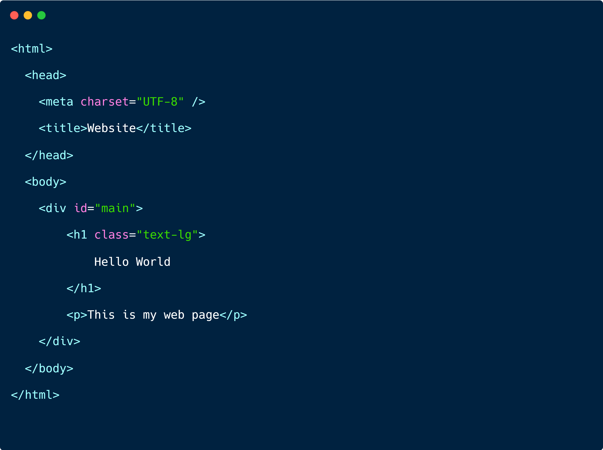

The DOM representation of this would look something like this:

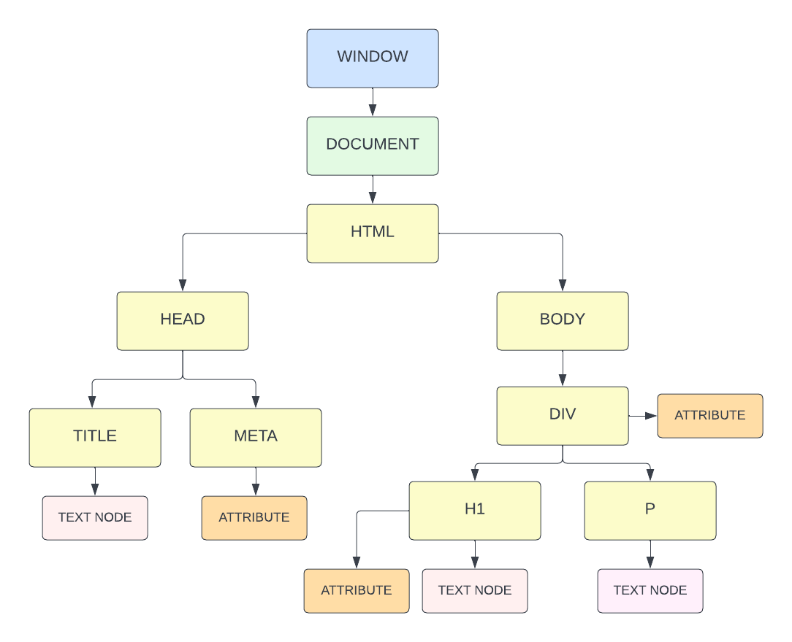

I'll talk about the `window` and `document` objects in a minute, but under that you'll see the structure of this document in a tree structure.

We have the `html` element, which holds the `head` and `body` elements. The `head` element holds the title element, which has a text node inside of it. In this case that would be the text, 'Website'. The `meta` element includes an attribute of `charset` which is set to `utf-8`. So any attributes are going to be accessible in the DOM as well. The `body` element holds the `h1` element, which has a text node inside of it with the text, 'Hello World'. It also has an `id` attribute. Then we have the `p` element with a text node inside of it.

So this is how your HTML document full of tags, attributes and text nodes looks in the DOM.

## The Window Object

A few sections back, we talked about the global `window` object. The `window` object is the top level object in the browser. It is the root of the browser's object hierarchy. It has properties and methods that are available to all of the JavaScript code in the browser. To see the window object's API (methods and properties), you can type `window` in the console or in your code

```JavaScript
console.log(window);
```

# The Document Object

On that `window` object, we have a property/object called `document`. This is an object that represents the HTML document that we are currently viewing. It has all types of properties and methods that we can use to interact with the HTML document.

```JavaScript
console.log(window.document);
```

Since `window` is the top-level object in the browser, we do not need to prefix it with **window**

```JavaScript
console.log(document);
```

Sometimes console.log() will show the properties and methods, but sometimes it will show the element/tag itself. To see all the methods and properties, you can use `console.dir`

```JavaScript
console.dir(document);
```

## Document Properties/Elements

We can access DOM elements directly, such as the `body`

```JavaScript
console.log(document.body);
```

We can also access elements such as links and images. Let's add a link to the HTML

```HTML
<a href="https://traversymedia.com">Traversy Media</a>
```

We can get all of the links with

```JavaScript
console.log(document.links);
```

This returns something called an `HTMLCollection`, which is similar to an array. We can access by index

```JavaScript
console.log(document.links[0]);
```

## Document methods

In addition to properties, the document object has a ton of methods. `document.write()` is a method that will write to the browser body. This is not used very much because you can't really target where you want to output, but it is available

```JavaScript
document.write('Hello From JS');
```

## Document Selection Methods

Getting elements using direct properties is not usually the way you want to do this. There are special methods available that allow us to directly select elements easily. I will be going over all of these in depth soon, but just to give you an example, let's look at `document.getElementById()`, which does exactly that. It allows us to basically grab an element from the HTML document by it's id. Then we could do whatever we want to that specific element including changing the style, removing it, adding an event listener to it and so on. The term `DOM manipulation` just refers to changing the DOM using JavaScript, which again can me adding, removing, changing elements, etc. A lot of the time we change the CSS through JavaScript to make something hide or show based on some user interaction.

Just to give you a very simple example of selecting something from the DOM, let's open an html page and create a new div element with the ID of `main` and just add some text to it.

```html
<div id="main">
  <h1>The DOM</h1>

  <a href="https://traversymedia.com">Traversy Media</a>
</div>
```

Now in our JavaScript file, we can use the `document.getElementById()` method to grab the element with the ID of `main`.

```js
console.log(document.getElementById('main'));
```

Now let's say we want to add some text into the div element. We can easily do that using the `innerHTML` property.

```js
document.getElementById('main').innerHTML = '<h1>Hello World</h1>';
```

This will replace everything in the main element. There are other methods we will get into soon that let us just append or add elements.

So you see, The DOM gives us a lot of power to interact with the HTML document. The code we just wrote is written in JavaScript, but uses the DOM and it's API to access the document and its elements. Even when you start using a front-end framework like React, this is the stuff that it is doing under the hood.

The DOM was created to be independent of any particular language. Yes, JavaScript is definitely the most common language to do this stuff with, but implementations of the DOM can be built for any language, as this Python example demonstrates:

```python
# Python DOM example
import xml.dom.minidom as m
doc = m.parse(r"C:\Projects\Py\chap1.xml")
doc.nodeName # DOM property of document object
p_list = doc.getElementsByTagName("para")
```

## DOM Libraries

I've been doing this for about 15 years now and I know people still complain about JavaScript, but I think very few of them, worked with JavaScript ten+ years ago. Before the big ES6 update, JavaScript was not easy to work with, including accessing and manipulating the DOM. So we had libraries like **jQuery** that were built to make it easier to work with the DOM.

A lot of people ask me if they should learn jQuery and my answer to that now is usually no. If you're genuinely interested in learning it, that's fine. Just make sure you learn the fundamentals of vanilla JavaScript first. You may want to learn jQuery to deal with legacy code. There is a chance you'll run into it in the wild. But do you need to learn it? In my opinion, no you don't.

Alright, so in the next video, I want to examine some of the properties on the browser's `document` object itself.


---


# 02-examining-the-document-object

# Examining the Document Object

Alright, so we know that the DOM is a tree of objects of elements, nodes and attributes. We also know that the `document` object is the root of the DOM tree. It offers extremely helpful methods for us to use to manipulate the DOM including methods to select elements, create elements, and so on. There's also a ton of properties that we can use to get information about the document and that's what I want to look at in this video.

### Shopping List UI

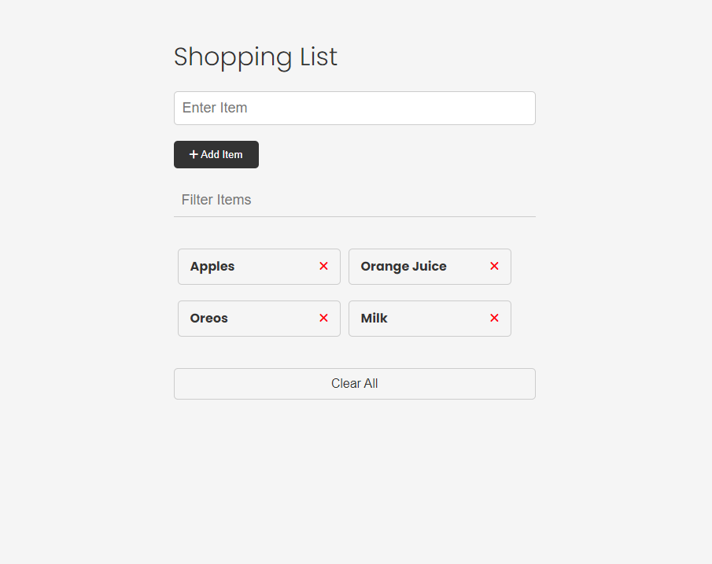

So what you're looking at right now is the UI or user interface for a simple shopping list application. We will be building this project out, but right now, it's only the HTML and CSS, so it's not actually working because there's no JavaScript. There is a JavaScript file linked, but it's empty. That's what we'll be working in to explore the DOM.

You can download the code resources directly from this section, or from the main sandbox GitHub repository.

Let's quickly just look at the structure of this HTML page, so we know what we're working with.

So we have a container that wraps around everything, a heading, then we have a form that has one single text input and a submit button. Under that, we have a filter input to filter the items. Then we have a list of items with an x icon to remove those items. As I mentioned, the functionality of this will not work because we have no JavaScript. Finally, we have a clear all button that will do just that.

So, it's a pretty simple UI, but it's a good starting point for us to explore the DOM.

### Browser Dev Tools

The browser dev tools will be used extensively throughout this course. We've been using the console quite a bit, but I want to check out the `Elements` tab real quick. This is where you can see all of your elements/tags, attributes, text, etc. In reality, you should know some HTML and CSS and you should have at least a little experience with this tab.

We can see the CSS styling here as well. In many cases, we'll be changing styles and adding and removing classes through JavaScript and we'll be using the dev tools to see what's happening.

### The Document Object

So if we type into the console `window`, we see everything that is available to use in the global object and `document` is one of them. You can see that there's a ton of properties and methods available to us. Anything you see here can be used in your JavaScript code.

Let's start off by just logging the document.

```js
console.log(document);
```

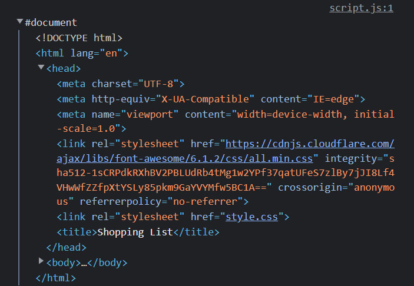

It gives us just that, the entire document including the doctype, html tag and head and body tags with everything in between them.

### `document.all`

```js
console.log(document.all);
```


`document.all` gives us everything in the DOM in an array-like object called a `HTMLCollection`. It's not an array, but it is structured like one. We can't use methods like `forEach()` and `map()` on it, but we can use bracket notation to access the items. We can also use the `length` property to get the number of items in the collection. There's also a method called `item()` that we can use to get a specific item in the collection.

```js
console.log(document.all.length);
console.log(document.all[2];
console.log(document.item(2));
```

`document.all()` is not a very useful method and it's actually deprecated, so we shouldn't use it. It's better to use methods like `document.getElementById()`. I did want to show you that it exists and give you an example of an HTMLCollection.

### `document.documentElement`

```js
console.log(document.documentElement);
```

This will get you the HTML element and everything in it including both the head and body tags.

### `document.head` & `document.body`

```js
console.log(document.head);
console.log(document.body);
```

These two properties give us the head and body elements. We can get the children of those elements using the `children` property.

```js
console.log(document.head.children);
console.log(document.body.children);
```

These will give us an HTMLCollection of the direct children of the head and body elements. So in the case of the body, we only get the container div and the script tag because those are the only direct children of the body element.


If I wanted to get the children of the container div, I would have to do something like this.

```js
console.log(document.body.children[0].children);
```


So now I have a collection of all of the children of the container div. This is a little bit cumbersome and there are better ways to select elements, but let's say I wanted to change the text of the heading. I could do something like this.

```js
document.body.children[0].children[0].textContent = 'Hello World';
```


### Other Page Properties

Here are some other properties on the `document` object that we can access and manipulate.

```js
document.doctype;
document.domain;
document.URL;
document.characterSet;
document.contentType;
```

### `document.forms`

`document.forms`. This will give us an HTMLCollection of all of the forms on the page.

```js
console.log(document.forms);
```

We can get specific forms in the collection by index or by name.

```js
console.log(document.forms[0]);
console.log(document.forms['item-form']);
```

We can get specific attributes as well

```js
console.log(document.forms[0].id);
console.log(document.forms[0].method);
console.log(document.forms[0].action);
```

We aren't only limited to reading the attributes. We can also change them.

```js
document.forms[0].id = 'new-id';
```

I could add a value to the input like this:

```js
document.forms[0].item.value = 'Hello World';
```

`item` being the `name` attribute of the input.

### `document.links`

To get an HTMLCollection of links, we can use `document.links`.

```js
console.log(document.links);
```

We don't have any links in this specific project, so let's add one just to test it out.

```html
<a href="#" class="my-link" id="link">My Link</a>
```

Now we can see that we have a link in the collection.

We can get specific attributes as well.

```js
console.log(document.links[0].id);
console.log(document.links[0].className);
console.log(document.links[0].classList);
console.log(document.links[0].href);
```

### `document.images`

We can also get an HTMLCollection of images with `document.images`.

```js
output = document.images;
output = document.images[0];
output = document.images[0].src;
```

In the code above, we accessed the attributes directly, but we can also use the `getAttribute()` method.

```js
output = document.images[0].getAttribute('src');
```

This will do the same thing as accessing the `src` attribute directly.

### `document.scripts`

If you want to get an HTMLCollection of scripts, you can use `document.scripts`.

```js
console.log(document.scripts);
```

So as you can see, everything in our HTML document is available to us in the DOM using the document object that the browser creates for us.

This is just the tip of the iceberg. There are so many more properties and methods available. We'll be using them throughout the course.


---


# 03-dom-selectors-single-elements

# DOM Selectors - Single Elements

In the last video, we looked at many of the properties available on the `document` object including properties that allowed us to select elements from the DOM in the form of HTMLCollections.

In this video, we will look at a much more common way to select elements. With these **single element** selectors, it will only select one element. Even if you have multiple elements that match the selector, it will only select the first one. If you want to select multiple elements, we will look at that in the next video.

We will also look at getting and setting attributes/properties on elements that we select.

## `getElementById()`

The first method we will look at is `document.getElementById()`. This method takes a string as an argument and returns the element with the matching `id` attribute. If no element is found, it returns `null`.

We have a couple IDs in our shopping list, such as on the form and the list itself, but I want to use something simple, so I'm going to use the `id` on the `h1` element of `app-title`.

If we want to select this element, we can use `document.getElementById()` and pass in the ID as a string.

```js
console.log(document.getElementById('app-title'));
// <h1 id="app-title">Shopping List</h1>
```

This is a much easier way than using something like `document.all` and trying to find the element by index.

Now that we can select the element, we can get certain properties/attributes from it. For example, we can get the `id`.

```js
console.log(document.getElementById('app-title').id);
console.log(document.getElementById('app-title').getAttribute('id'));
```

We can also assign attributes to it. For instance, we can change the `className` property to add a class.

```js
document.getElementById('app-title').className = 'title';
```

We can also use the `setAttribute()` method to add an attribute.

```js
document.getElementById('app-title').setAttribute('class', 'app-title');
```

It's also very common to assign the result of of these selector methods to a variable. This is because we will often want to use the element we selected in multiple places in our code.

```js
const title = document.getElementById('app-title');
console.log(title);
```

### Styling Elements From JS

We can also use these selectors to style elements. there is a property called `style` that allows us to access the CSS styles of an element. We can then assign a value to a CSS property.

```js
title.style.color = 'red';
title.style.backgroundColor = 'black';
title.style.padding = '10px';
title.style.borderRadius = '10px';
```

Now, usually you wouldn't just style things from JavaScript just for a static site. You would usually have some kind of event and then apply the style. For example you may have a button that when you click it, it applies a style to a specific element. This makes your UI more dynamic. We'll be getting into events soon.

### Adding Content

Another thing we can do is add or change the content of an element. Again, usually you'll do this to add some kind of dynamic functionality using events. There are a few different properties that we can use to modify and access content.

```js
// Read
console.log(title.textContent);
// Write
title.textContent = 'Shopping List';
title.innerText = 'My Shopping List';
title.innerHTML = '<strong>Shopping List</strong>';
```

`textContent` and `innerText` are very similar. The main difference is that `innerText` will not return any hidden elements. For example, if we had a `span` element with a class of `hide` and we set the `display` property to `none`, then `innerText` would not return that element. `textContent` will return the element even if it is hidden. `innerHTML` will return the HTML of the element. We can use all of these to update the content of an element.

## `querySelector()`

Alright, so the next method we will look at is `document.querySelector()`. This method is very similar to `getElementById()`, but it allows us to select elements using CSS selectors. This means we can select elements by their class, tag name, or even by their attributes.

```js
// By tag
console.log(document.querySelector('h1'));
// By id
console.log(document.querySelector('#app-title'));
// By class
console.log(document.querySelector('.container'));
// By attribute
console.log(document.querySelector('input[type="text"]'));
// By pseudo-class
console.log(document.querySelector('li:first-child'));
console.log(document.querySelector('li:nth-child(2)'));
```

As you can see, `querySelector` is very powerful and we can select anything we want. This method put JQuery out of business in my opinion, because it pretty much does the same thing in terms of DOM manipulation, without having to use a library.

Let's say that we want to change the color of the second shopping list item:

```js
const secondItem = document.querySelector('li:nth-child(2)');
secondItem.style.color = 'red';
```

Everything we talked about with `getElementById()` also applies to `querySelector()`. We can get the content, set the content, style the element, etc.

## Selecting an element within an element

With `document.querySelector()` and `document.querySelectorAll()`, which we will look at in the next video, you are not restricted to selecting elements from the `document` object. You can also select elements from other local elements. For example, if we wanted to select the first `li` element within the `ul` element, we could do the following:

```js
const list = document.querySelector('ul');
const firstItem = list.querySelector('li');
firstItem.style.color = 'blue';
```

`document.getElementById()` is only available as a method of the global document object, This is because ID values must be unique throughout the entire document, so there is no need for "local" versions of the function.

### Which one to use?

Which one you use is really just preference. I use `getElementById()` quite a bit for `ids` and `querySelector()` for classes and other attributes. You could just as well use `querySelector()` for everything. I have been doing that in a few recent projects, and I may switch it up. It is just important to be consistent.


---


# 04-dom-selectors-multiple-elements

# DOM Selectors - Multiple Elements

So we looked at `getElementById` and `querySelector`, which will select on element from the DOM so that we can do whatever we want with it. But what if we want to select multiple elements, such as all of the list items in our shopping list? We have a few methods that we can use for this.

## `querySelectorAll()`

So I'm going to start off with the one that you'll use the most, which is `document.querySelectorAll()`. This method takes a string as an argument and returns a NodeList of all the elements that match the selector. If no elements are found, it returns an empty NodeList.

#### NodeList vs HTMLCollection

So what is a NodeList? Well, it's very similar to an HTMLCollection, which we have already looked at. It's a list of elements that is formatted like an array. The main difference is that a NodeList is not a live collection. This means that if we add or remove elements from the DOM, the NodeList will not update.

Another difference is that we can use methods like `forEach()` on a NodeList, but not on an HTMLCollection. This really comes in handy.

So let's select all of the list items in our shopping list.

```js
console.log(document.querySelectorAll('li'));
```

We can pass in absolutely any CSS selector to this method. It could be a tag, id, class, etc. That part works just like `querySelector()`. The difference is instead of getting just one element, it will get all of the elements on the page that match that selector. Even if there is only one item on the page that matches, it will still be returned as a NodeList.

If we select the h1 on the page, let's see what happens.

```js
console.log(document.querySelectorAll('h1'));
```

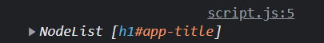

Instead of the element itself, it gives us a NodeList with that 1 element in it.

Now, let's say that we want to make all of the items in the list the color red. Your first thought, may be to do something like this.

```js
const items = document.querySelectorAll('li');

// This will not work
items.style.color = 'red';
```

This won't work because we can't assign a color to a NodeList.

We can access a specific item using it's index, just like an array. We can also manipulate it.

```js
console.log(items[0]);
items[0].style.color = 'blue';
```

However, if we want to apply something to all of the elements, we need to loop through the NodeList and apply to all.

```js
items.forEach(function (item) {
  item.style.color = 'red';
});
```

We can shorten it up a little bit by using an arrow function.

```js
items.forEach((item) => (item.style.color = 'red'));
```

## `getElementsByClassName()`

The next selector is an older one that you probably won't see very much. As the name implies, it selects elements by their class name. It takes a string as an argument and returns an HTMLCollection of all the elements that match the class name. If no elements are found, it returns an empty HTMLCollection.

The limitations to this method are that it only selects elements by class name and instead of a NodeList, it returns an HTMLCollection, which you can't use methods like `forEach()` on. You would have to first, turn the HTMLCollection into an Array and then loop through it.

Let's look at an example. I put a class of `item` on all of the list items in our shopping list. Let's select them all.

```js
console.log(document.getElementsByClassName('item'));
```

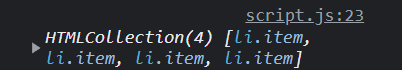

As you can see, it returns an HTMLCollection of all of the list items as opposed to a NodeList.

If we want to turn all of the items blue, we have to first turn the HTMLCollection into an array. Then we can use array methods like `forEach()`.

```js
const items = document.getElementsByClassName('item');

// Covert into an array
const list = Array.from(items);

list.forEach((item) => (item.style.color = 'green'));
```

## `getElementsByTagName()`

This method is basically the same thing as `getElementsByClassName()`, except it selects elements by their tag name. It takes a string as an argument and returns an HTMLCollection of all the elements that match the tag name. If no elements are found, it returns an empty HTMLCollection.

Let's select all of the list items in our shopping list.

```js
console.log(document.getElementsByTagName('li'));
```


We get the same result as `getElementsByClassName('item')`.

There really isn't much else to be said on this method, because you can do the same stuff as `getElementsByClassName()`.

I would say 99.9% of the time, you will be using `querySelectorAll()` to select multiple elements. The only time you would use `getElementsByClassName()` or `getElementsByTagName()` is if you are working with an older codebase that uses those methods.


---


# 05-traversing-the-dom-elements

# Traversing The DOM - Elements

Now we know how to select elements from the DOM, but many times, we need to select elements within elements or a sibling of an element, so it is important to know how relationships work so that we can traverse or move up and down the DOM.

There are also different types of `nodes` in the DOM. The type we will deal with the most are `Elements`. Any HTML tag on the page is an element. There are specific properties for working with elements and there are properties that will allow us to work with other types of nodes, such as `Text` and `Comment` nodes. In this video, we will strictly be working with `Elements` or `Element Nodes` and in the next video, we will look at other types of nodes.

## Element Relationships

To really understand how to traverse and manipulate the DOM, you need to understand relationships between elements along with some properties that allow you to select elements based on their relationship to other elements.

For this video, I'm not going to use the shopping list example. Instead, I'm going to use a simple HTML document with a few nested elements. This is so you can better understand what I'm doing.

Let's look at the following HTML

```html
<div class="parent">
  <!-- Children -->
  <div class="child">Child 1</div>
  <div class="child">Child 2</div>
  <div class="child">Child 3</div>
</div>
```

If we are looking strictly at `element nodes`, it's pretty simple. We have a `div` that is the _parent_ of 3 _child_ `divs`. The 3 _child_ `divs` are _siblings_ to each other.

## Selecting Related Elements

We have many properties available to select related elements. This diagram shows the properties and a visual example of how they work.

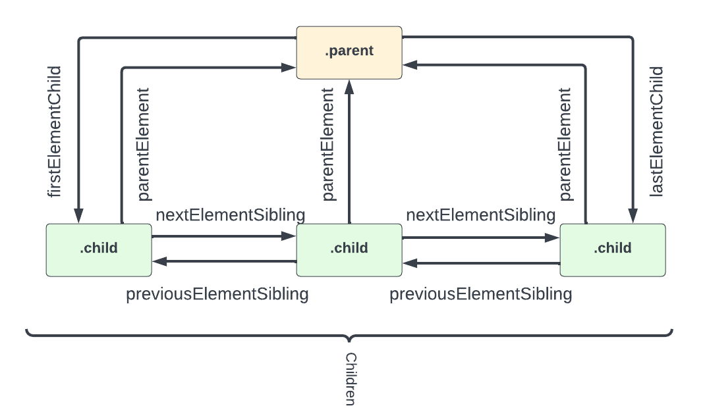

## Child Elements

### `children`

All of an elements children can be accessed by the `children` property.

```js
const parent = document.querySelector('.parent');

console.log(parent.children);
// HTMLCollection [div.child, div.child, div.child]
```

This gives us an `HTMLCollection` of the children. We can access each individual element by index.

```js
console.log(parent.children[1]);
// <div class="child">Child 2</div>

// Get individual child properties
console.log(parent.children[1].nodeName);
// 'DIV'
console.log(parent.children[1].className);
// 'child'

// Get the HTML & Text inside the element
console.log(parent.children[1].innerHTML);
// 'Child 2'

// Get the HTML & Text of the entire element
console.log(parent.children[1].outerHTML);
// '<div class="child">Child 2</div>'
```

We can loop through an HTMLCollection using a for loop or we can convert it to an array and use a forEach loop.

```js
for (let i = 0; i < parent.children.length; i++) {
  console.log(parent.children[i].innerHTML);
}
```

We can change attributes, styles and the content of the children of an element

```js
// Change the text of the second child
parent.children[1].textContent = 'Child Two';

// Change the color of the third child
parent.children[2].style.color = 'red';
```

### `firstElementChild` and `lastElementChild`

`firstElementChild` and `lastElementChild` are useful for selecting the first or last child of an element.

```js
console.log(parent.firstElementChild);
// <div class="child">Child 1</div>

console.log(parent.lastElementChild);
// <div class="child">Child 3</div>

// Change the text of both first and last child
parent.firstElementChild.innerText = 'Child One';
parent.lastElementChild.innerText = 'Child Three';
```

## Parent Element

### `parentElement`

We can use the `parentElement` property to get the parent element of an element.

```js
const child = document.querySelector('.child');

console.log(child.parentElement);
// <div class="parent">
```

We can edit the parent element

```js
// Give the parent a border and padding
child.parentElement.style.border = '1px solid #ccc';
child.parentElement.style.padding = '10px';
```

## Sibling Elements

### `nextElementSibling` and `previousElementSibling`

These are the main properties for selecting sibling elements.

```js
const secondItem = document.querySelector('.child:nth-child(2)');

secondItem.nextElementSibling.style.color = 'green';
secondItem.previousElementSibling.style.color = 'orange';
```

As you can see, working with related elements is not that difficult because we have access to these useful properties. In the next video, we will look at properties to work with other types of nodes.


---


# 06-traversing-the-dom-nodes

# Traversing The DOM - Nodes

Alright, so we looked at some important properties of the DOM that allow us to work with related elements. However, the DOM has more than just element nodes. In fact, there are 12 different types of nodes.

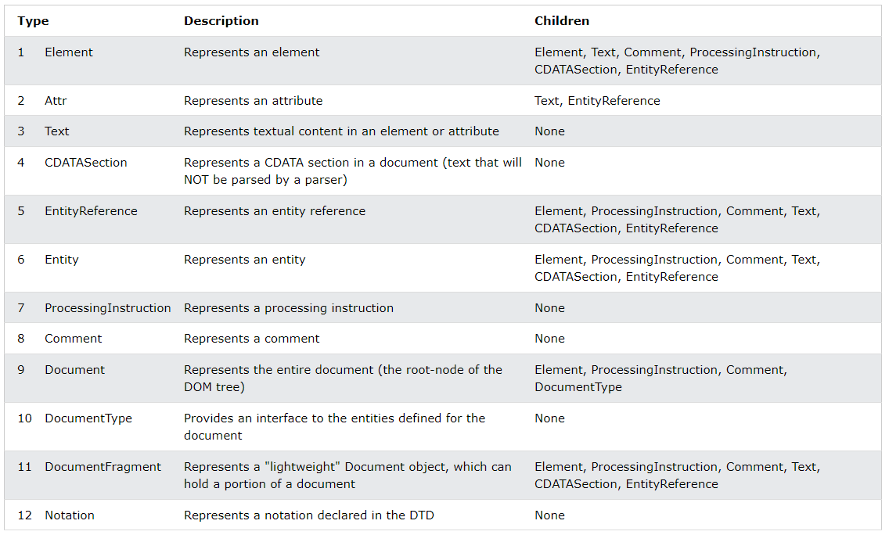

<small>_Table from W3Schools.com_</small>

We don't really need to focus on most of these, but they're good to know.

## Properties That Work With Nodes

The properties that we looked at in the last video were to work with related elements. However, there are other properties that we can use to access other types of nodes.

I would say for the most part, you will use the properties that we looked at in the last video, but you should know these as well.

We are going to use the same HTML structure as in the last video:

```html
<div class="parent">
  <!-- Children -->
  <div class="child">Child 1</div>
  <div class="child">Child 2</div>
  <div class="child">Child 3</div>
</div>
```

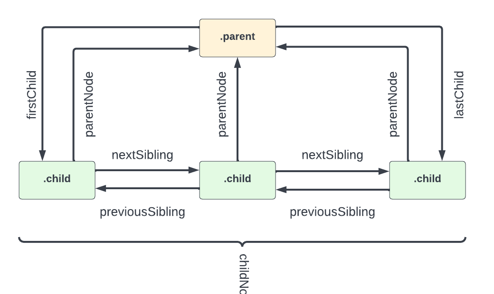

## Child Nodes

### `childNodes`

This method, does exactly what it says, it gets all of the child nodes of an element. This includes `text nodes` and `comment nodes`.

```js
const parent = document.querySelector('.parent');

console.log(parent.childNodes);
```

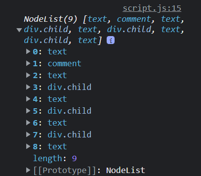

As you can see, we get a NodeList of 9 items. I want to go over what each of these items are...

- 0: White space is a `text node`. Since the first line of HTML within the parent `div` (the comment) is on the next line, that line break is considered a `text node`. If I were to move the comment on to the same line as the parent `div`, then the `text node` would be removed. I know, it's weird.
- 1: The `comment` node. Comments are considered nodes as well.
- 2: Another `text node`. This is the line break between the comment and the first child `div`.
- 3: The first child `div`.
- 4: Another `text node`. This is the line break between the first child `div` and the second child `div`.
- 5: The second child `div`.
- 6: Another `text node`. This is the line break between the second child `div` and the third child `div`.
- 7: The third child `div`.
- 8: Another `text node`. This is the line break between the third child `div` and the closing `div` tag.

We can also access the nodes like this:

```js
console.log(parent.childNodes[3]);
// <div class="child">Child 1</div>

// Get the node name
console.log(parent.childNodes[3].nodeName);
// 'DIV'
console.log(parent.childNodes[2].nodeName);
// '#text'

// Edit the first div
parent.childNodes[3].style.color = 'red';
```

The reason I used the index 3 is because 0, 1 and 2 are text and comment nodes. 3 is where the first element node is.

## `firstChild` and `lastChild`

Just like we have `firstElementChild` and `lastElementChild`, we have `firstChild` and `lastChild`. the difference is that these two do not work only with element nodes.

```js
// Get the first child node
output = parent.firstChild;
// #text

// Get the last child node
output = parent.lastChild;
// #text
```

To edit the value of a text node, we can use the `nodeValue` property.

```js
parent.firstChild.nodeValue = 'Hello';
```

This will actually put the text of 'Hello' into the `nodeValue`, `textContent`, `data` and `wholeText` properties.

## Parent Nodes

### `parentNode`

In many ways, `parentNode` is very similar to `parentElement`. We can use it to do the same type of tasks.

To get the parent node of an element:

```js
const child = document.querySelector('.child');

console.log(child.parentNode);
// <div class="parent">
```

The parent of an element will always be and **element**, **document** or **documentFragment** node type.

We looked at `document.documentElement` a few videos back. If we look at the parent node for that, it is a `#document` node

```js
console.log(document.documentElement.parentNode);
// #document
```

We can edit the parent node/element, just like we could using the `parentElement` property.

```js
child.parentNode.style.border = '1px solid #ccc';
child.parentNode.style.padding = '10px';
```

If you want to get the parent document node of any element, you can use the `ownerDocument` property.

```js
console.log(child.ownerDocument);
// #document
```

## Sibling Nodes

### `nextSibling` and `previousSibling`

Very similar to `nextElementSibling` and `previousElementSibling`, we have `nextSibling` and `previousSibling`.

```js
const secondItem = document.querySelector('.child:nth-child(2)');

// Get next sibling
console.log(secondItem.nextSibling);
// #text

// Get previous sibling
console.log(secondItem.previousSibling);
// #text
```


---


# 07-create-elements

# Create Elements

So we know how to select elements, navigate to related elements, and manipulate them. Now let's look at how to create elements. With JavaScript, we can create any DOM element we want and then insert it into the document.

In many cases, you'll want to create a new element and then insert it into the document on some kind of event. For instance, when we build the final functionality of our shopping list, we're going to want to create a new list item when we click on the _Add Item_ button.

We will learn about events soon, but right now, I just want to focus on creating elements via JavaScript.

## `document.createElement()`

This is the main method we'll use to create elements. It takes one argument, which is the tag name of the element we want to create. Let's create a `div` element.

```js
const div = document.createElement('div');

console.log(div);
// <div></div>
```

If you do a `console.dir(div)`, you'll see a ton of properties as well as methods in the prototype chain.

We can add any attributes we want to our new `div` element.

```js
// Add a class
div.className = 'my-element';

// Add an id
div.id = 'my-element';

// Add an attribute
div.setAttribute('title', 'My Element');
```

### `document.createTextNode()`

If we want to add text, we could technically do it like this:

```js
div.innerText = 'Hello World';
```

However, using `innerText` is not the best way to do this when creating a new element. It is really meant to get and change the text of an already existing element.

It's better to create a new text node with `document.createTextNode()` and then append it to the element.

```js
// Create a text node
const text = document.createTextNode('Hello World');

// Add the text node to the div
div.appendChild(text);
```

Now if you log the div, you'll see

```js
<div class='my-element' id='my-element' title='My Element'>
  Hello World
</div>
```

### Inserting Elements into the Document

Just like we used `appendChild()` to add the text node, we can use it to add it to the document.

```js
document.body.appendChild(div);
```

That will place it in the body tag as the last element. We can target any element in the document and insert it into another element.

```js
document.querySelector('ul').appendChild(div);
```


---


# 08-create-item-innerHTML-vs-createElement

# Create Item - innerHTML vs createElement()

Now that you know the basics of creating an element within your JavaScript, I want to create a function that we can run to add a new item to the shopping list. There are some really important things I want to show you when it comes to the different ways of doing this. There's a quick and dirty solution, which involves just setting the innerHTML to whatever you want and then there's a cleaner and more performant way of creating all of your elements and then inserting them into the DOM. I'm going to show you both ways.

### Quick & Dirty (Using innerHTML)

The first method is to create a `li` element and then simply set the `innerHTML` property to the output that you want, using a template string. 


```js
function createListItem(item) {
  const li = document.createElement('li');

  li.innerHTML = ` ${item}
  <button class="remove-item btn-link text-red">
    <i class="fa-solid fa-xmark"></i>
  </button>`;

  document.querySelector('.items').appendChild(li);
}

createListItem('Cereal');
createListItem('Juice');
createListItem('Toothpaste');
```

### Clean & Performant (Creating the elements)

The second way is to actually create all of the elements including the  li element, text node, button element and icon element and appending each one.

```JavaScript
function createNewItem(item) {
  const li = document.createElement('li');

  li.appendChild(document.createTextNode(item));

  const button = document.createElement('button');

  button.className = 'remove-item btn-link text-red';

  const icon = document.createElement('i');

  icon.className = 'fa-solid fa-xmark';

  button.appendChild(icon);

  li.appendChild(button);

  document.querySelector('.items').appendChild(li);
}
```

Now, you could use either method, just know that using innerHTML causes the web browsers to reparse and recreate all the DOM nodes inside the ul element. So this is less efficient than creating a new element and appending to the ul. So the second way is more performant. Also, setting innerHTML will not automatically reattach event handlers to the new elements it creates, so you would have to keep track of them manually. It is just better practice to create your elements, rather than using innerHTML.


---


# 09-refactor-to-multiple-functions

# Refactor To Use Multiple Functions

In the last lesson, we created a function to add items to our shopping list. In that function, we created multiple elements. We created a list item, a button and an icon. I think that you should generally have functions do one thing. In this case our function did 3 things. Let's refactor this code into multiple functions that we can reuse if needed. 

Here is the original code.

```JavaScript
function createNewItem(item) {
  const li = document.createElement('li');

  li.appendChild(document.createTextNode(item));

  const button = document.createElement('button');

  button.className = 'remove-item btn-link text-red';

  const icon = document.createElement('i');

  icon.className = 'fa-solid fa-xmark';

  button.appendChild(icon);

  li.appendChild(button);

  document.querySelector('.items').appendChild(li);
}
```

Let's create a function to create the button. We will take the classes in as arguments

```JavaScript
function createButton(classes) {
  const button = document.createElement('button');
  button.className = classes;

  return button;
}
```

We create and return the button. We need to include the icon, so let's create a function to create an icon

```JavaScript
function createIcon(classes) {
  const icon = document.createElement('i');
  icon.className = classes;

  return icon;
}
```

Now we can add the `createIcon()` function to our `createButton()` function

```JavaScript
function createButton(classes) {
  const button = document.createElement('button');
  button.className = classes;

  const icon = createIcon('fa-solid fa-xmark');
  button.appendChild(icon);

  return button;
}
```

Now, add the `createButton()` function to our main function

```JavaScript
function createNewItem(item) {
  const li = document.createElement('li');
  li.appendChild(document.createTextNode(item));

  // Add button & icon
  const button = createButton('remove-item btn-link text-red');
  li.appendChild(button);
  document.getElementById('item-list').appendChild(li);
}
```

Now we have everything broken up into small funcions. If something goes wrong, it is much easier to debug and the code is more readable and reusable.

---


# 10-insert-elements

# Insert Elements, Text & HTML

We know how to select and create elements. We also learned how to insert an item into the DOM using `appendChild()`. There are other methods that we can use to insert elements, text and HTML into the DOM.

Let's use our shopping list and add some new items in specific positions.

## `insertAdjacentElement()`

`insertAdjacentElement()` as well as the next two methods work in a similar way. We call the method on the current element that we want to insert before or after. Then we pass in a position as the first argument, then our new custom element that we want to insert as the second argument.

The four position options are **beforebegin**, **afterbegin**, **beforeend**, **afterend**. The placement is as follows:

```
<!-- beforebegin -->
<p>
  <!-- afterbegin -->
  ###The content of the initial element###
  <!-- beforeend -->
</p>
<!-- afterend -->
```

Let's say we want to create an `h1` within our JS and insert it before the `filter input`. We will put this code in a custom function called `insertElement()`

```js
function insertElement() {
  const filter = document.querySelector('.filter');

  const h1 = document.createElement('h1');
  h1.textContent = 'insertAdjacentElement';

  filter.insertAdjacentElement('beforebegin', h1);
}

insertElement();
```

Now your `h1` is before the filter. You can change the position to play round with it.

## `insertAdjacentText()`

`insertAdjacentText()` works the same way except instead of inserting a custom element, we use it to insert text.

Let's insert some text before the first `li` element

```js
function insertText() {
  const item = document.querySelector('li:first-child');

  item.insertAdjacentText('beforebegin', 'insertAdjacentText');
}

insertText();
```

## `insertAdjacentHTML()`

`insertAdjacentHTML()` works the same way, but for straight HTML. It is similar to using `innerHTML`

Let's insert some HTML with an `h2` tag after the clear button

```js
function insertHTML() {
  const clearBtn = document.querySelector('#clear');

  clearBtn.insertAdjacentHTML('afterend', '<h2>insertAdjacentHTML</h2>');
}

insertHTML();
```

## `insertBefore()`

`insertBefore()` is called on the parent element and takes two arguments, the new element and the reference element. It will insert the new element before the reference element.

The following will add a new `li` element before the first `li` element

```js
const ul = document.querySelector('ul');

const li = document.createElement('li');
li.textContent = 'Insert Me Before!';

const firstItem = document.querySelector('li:first-child');

// Call on parent element
ul.insertBefore(li, firstItem);
```

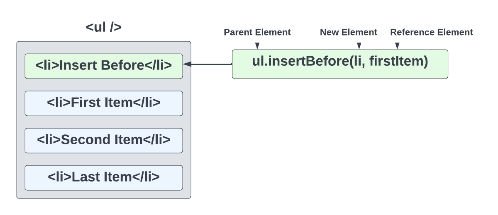

## Custom `insertAfter()`

You would probably think that since there is an `insertBefore()` method, there would be an `insertAfter()` method. Unfortunately, there is not. This is one thing I miss about JQuery that JavaScript has not implemented.

Just because it doesn't exist doesn't mean that we can't create it.

```js
function insertAfter(newNode, existingNode) {
  existingNode.parentNode.insertBefore(newNode, existingNode.nextSibling);
}
```

The function above takes in a new node/element and an existing node/element and inserts the new node after the existing node. We could achieve this by using the `parentNode` and `nextSibling` properties of the existing node.

Now we can use this function to insert a new `li` element after the first `li` element.

```js
// Parent element
const ul = document.querySelector('ul');
// New element to insert
const li = document.createElement('li');
li.textContent = 'Insert Me After!';

// Reference element to insert after
const firstItem = document.querySelector('li:first-child');

insertAfter(li, firstItem);
```

You do have to be careful with this because, there is no parent, so if you your existing node selector matches other elements, you may run into an issue. Just be specific with your selectors.


---


# 11-custom-insertafter

# Custom insertAfter() Challenge

**Instructions**

You may think that since there is an `insertBefore()` method, there is also an `insertAfter()`, but there isn't. In this challenge, I want you to create a custom `insertAfter()` function. If you don't want to do it as a challenge, that's fine, just follow along.

- The first param will be `newEl` which will be a new element that you create with `document.createElement()` 
- The second param will be `existingEl` which is an element in the DOM that you want to insert your new element after

The function will be called like this:

```JavaScript
// New element to insert
const li = document.createElement('li');
li.textContent = 'Insert Me After!';

// Existing element to insert after
const firstItem = document.querySelector('li:first-child');

// Our custom function
insertAfter(li, firstItem);
```

**Hint:**

Remember the properties to get parent and sibling elements. Use some of those combined with `insertBefore()`.

<details>
  <summary>Click For Solution</summary>

```JavaScript
function insertAfter(newEl, existingEl) {
  existingEl.parentElement.insertBefore(newEl, existingEl.nextSibling);
}
```

The solution is actually really simple. 

- We take the `existingEl` and get the parent with either the `parentElement` or `parentNode` property.
- We call `insertBefore()` on the parent and then pass in `newEl` and the element AFTER `existingEl`. We can get that with the `nextSibling` property

Putting our new element before the existing element's next sibling is the same as putting it after the existing element

</details>


---


# 11-replace-elements

# Replacing DOM Elements

In the last video we looked at how to insert elements into the DOM. Now let's look at some methods to replace elements.

We are going to be working with our shopping list UI again. We will be replacing some of the `li` elements in the list. There is more than one way to do this, so I will show you a couple.

### Method 1 - replaceWith()

Let's replace the first `li` element with a new `li` element using the `replaceWith()` method.

```js
// Element to replace
const firstItem = document.querySelector('li:first-child');
// New element
const li = document.createElement('li');
li.textContent = 'Replaced First';

// Replace first element with new element
firstItem.replaceWith(li);
```

We call the `replaceWith()` method on the first `li` element and pass in the new `li` element.

### Method 2 - outerHTML

We could also use the `outerHTML` property to replace the entire element. Let's replace the second item this way.

```js
// Element to replace
const secondItem = document.querySelector('li:nth-child(2)');
// Replace using outerHTML
secondItem.outerHTML = '<li>Replaced Second</li>';
```

### Replacing All Elements

As you know, using `document.querySelector()` will only select one element even if there are more on the page. Let's use `document.querySelectorAll()` to select all of the `li` elements and then loop through and replace them.

```js
// Elements to replace
const lis = document.querySelectorAll('li');
// Loop through and replace all list items
lis.forEach((item) => {
  item.outerHTML = '<li>Replace All</li>';
});
```

If we wanted to edit one of the elements, we could for example change the text of the first item by checking the index.

```js
// Elements to replace
const lis = document.querySelectorAll('li');
// Loop through and replace all list items
lis.forEach((item, index) => {
  item.outerHTML = index === 1 ? '<li>Second Item</li>' : '<li>Item</li>';
});
```

## `replaceChild()`

Another way that we can replace something is by selecting the parent element and then using the `replaceChild()` method. Let's replace the `h1` element with an `h2`.

```js
const h1 = document.querySelector('h1');
const header = document.querySelector('header');
const h2 = document.createElement('h2');
h2.id = 'app-title';
h2.textContent = 'Shopping List';
header.replaceChild(h2, h1);
```

`replaceChild()` is called on the parent element and takes two arguments, the new element and the old element.


---


# 12-remove-elements

# Remove DOM Elements

Now let's look at methods to remove elements completely from the DOM.

## `remove()`

Remove is very simple. You use it on the element you want to remove and it will remove it from the DOM. Let's say that we want to remove the clear button from the page.

```js
const clearButton = document.querySelector('#clear');
clearButton.remove();
```

## `removeChild()`

Remove child is a bit more complicated. You use it on the parent element and it will remove the child element from the parent. Let's say that we want to remove the first `li` in the shopping list.

```js
const ul = document.querySelector('ul');
const li = document.querySelector('li:first-child');
ul.removeChild(li);
```

We first select the parent element and then the child element. Then we use `removeChild()` on the parent and pass in the child.

## Removing Specific List Items

Let's create a function to remove a specific list item. I will show you a few ways we can do this.

```js
function removeListItem(itemNumber) {
  const ul = document.querySelector('ul');
  const li = document.querySelector(`li:nth-child(${itemNumber})`);
  ul.removeChild(li);
}
```

Here we select the parent element and then use the function argument in the selector to remove the specific item.

Let's look at another:

```js
function removeListItem(itemNumber) {
  const ul = document.querySelector('ul');
  const li = document.querySelectorAll('li')[itemNumber - 1];

  ul.removeChild(li);
}
```

Here, we used the `querySelectorAll()` method to select all the `li` elements and then used the `itemNumber - 1` to select the correct element. We subtracted 1 from the item number because the array/NodeList starts at 0.

One more:

```js
function removeListItem(itemNumber) {
  const ul = document.querySelector('ul');
  const li = document.querySelectorAll('li');

  li[itemNumber - 1].remove();
}
```

This one is similar, but we used `remove()` on the element directly.

As you can see, removing elements is pretty easy.
