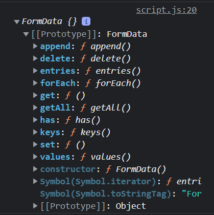
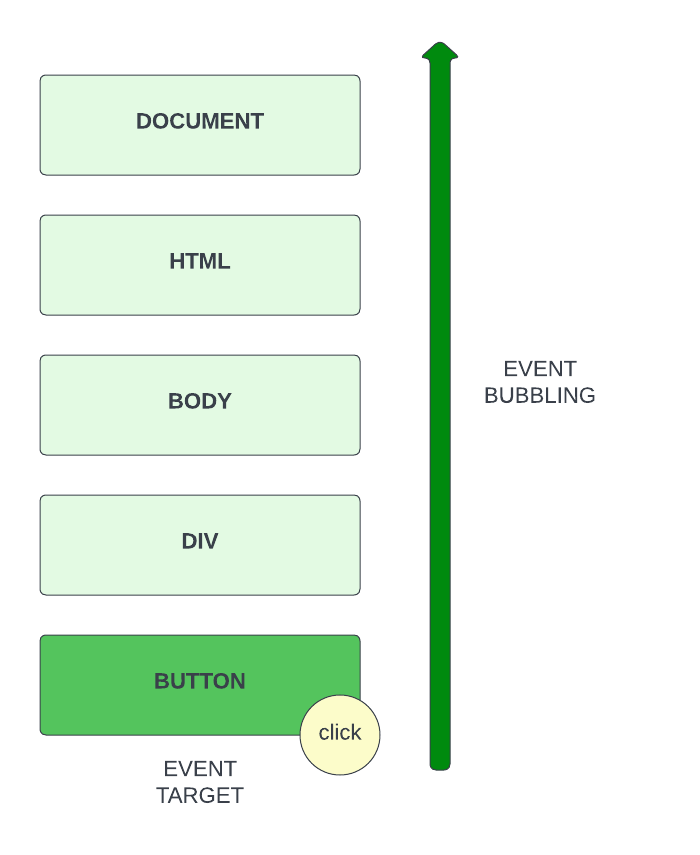

# 01-event-listeners

# Event Listeners

Alright, so we've learned quite a bit about manipulating the DOM, however, many of the things that we have learned, are actions that you'll want to happen when some kind of event is triggered. So that's what we're going to be talking about for the next few sections.

## What Are Events?

Events are something that happens within the browser. There are many kinds of events. Even the page loading is an event that we can listen for and respond to. Some other examples of events would be..

    - Clicking on an element, such as a button
    - Typing into a text input field
    - Hovering over an element
    - Submitting a form
    - Closing a window
    - Dragging an element
    - Resizing an element
    - etc.

Like I said, we can listen for events and respond to them. There are a few ways to do this.

## Inline Event Listeners

There are a few ways to listen for an event and react to it. One of the simplest ways is to use the onclick attribute. This is NOT recommended as it is not very flexible and can possibly pose a security risk. With that said, you should still know it exists.

Let's add an `onclick` event listener to the clear button in our shopping list. We will set the value to `alert('Cleared')`, which will show a browser alert popup when we click the button.

```html
<button onclick="alert('Cleared')" id="clear" class="btn-clear">
  Clear All
</button>
```

So as you can see, we can put JavaScript code directly in the HTML attribute. This is not very good practice though. Another thing we could do is use a JavaScript function to handle the event.

```html
<button onclick="onClear()" id="clear" class="btn-clear">Clear All</button>
```

Now create the function onClear() in the linked JS file.

```js
function onClear() {
  console.log('Clear Items');
}
```

Now when you click the button, you'll see the console log show up.

## Event Listeners in JavaScript

Like I mentioned, using inline event listeners is not recommended. Instead, we can use JavaScript to handle the event. There are a couple ways to do this.

One way is to bring in the element and call `onclick` from there.

```js
const clearBtn = document.getElementById('clear');

clearBtn.onclick = function () {
  console.log('Clear Items');
};
```

This is equivalent to the inline event we had in the HTML, but it gives you more control over the scope. One drawback to this is you may only have one inline event assigned. Inline events are stored as an attribute/property of the element it can be overwritten.

## `addEventListener()`

The best way, at least in my opinion, is to use the `addEventListener()` method. It takes in the event type (click, submit, etc) and a callback function. It attaches a listener to an element and will call the callback function when the event is triggered.

Let's look at an example:

```js
clearBtn.addEventListener('click', function () {
  console.log('Clear Items');
});
```

We don't have to pass in an anonymous function. We can pass in another defined function, such as the `onClear()` function.

```js
function onClear() {
  console.log('Clear Events');
}

clearBtn.addEventListener('click', onClear);
```

This is the method that we will be using in the course and what I would suggest in just about every case when using Vanilla JavaScript.

## `removeEventListener()`

We can also remove event listeners from elements. If you're removing an element that has an event listener attached to it. It's good practice to first remove the event listener before removing the element. This can prevent memory leaks, especially in older browsers. For the most part, modern browsers will handle this correctly, but it's still good to know how to do this.

Just like we have `addEventListener()`, we can use the `removeEventListener()` method. It takes in the event type and the same callback function that you used on the `addEventListener()`.

What I'm going to do is create a timer using the `setTimeout()` method. This will be used to remove the event listener after a few seconds. I know we have not talked about `setTimeout()` yet. Later on we will learn more about this method.

```js
setTimeout(() => {
  clearBtn.removeEventListener('click', onClear);
}, 5000);
```

So now, the event listener is removed after 5 seconds and the button will stop logging when it is clicked.

## Triggering Events in JavaScript

There may be times when you want to call an event from JavaScript without having the user do any kind of interaction. You can easily do this by running the event manually.

I'm going to do another `setTimeout()`, because I want the clear button to click after 5 seconds when the page loads. You should comment out the other `setTimeout()` if you're following along.

```js
setTimeout(() => {
  clearBtn.click();
}, 5000);
```

After 5 seconds, the click event fires. We could also use other event types like `submit()` and `mouseover()`. We will talk about other event types soon.

## Clearing The Items
Let's add some code to clear all of the items from the list. I'll give you 3 different ways to make that happen.


```js
function onClear() {
  const itemList = document.querySelector('ul');
  const items = itemList.querySelectorAll('li');

  // Using innerHTML
  itemList.innerHTML = '';

  // Using forEach() and remove()
  items.forEach((item) => item.remove());

  // Using a while loop and firstChild
  while (itemList.firstChild) {
    itemList.removeChild(itemList.firstChild);
  }
}
```


---


# 02-mouse-events

# Mouse Events

You now know how to listen for an event, but we have only looked at the `click` event. There are many more. Everything from mouse events to events that are part of APIs like the web animation API or websockets. In this video, I want to specifically look at mouse events.

| Event       | Description                     |
| ----------- | ------------------------------- |
| click       | Click left mouse button         |
| dblclick    | Double click left mouse button  |
| contextmenu | Click right mouse button        |
| mousedown   | Click down left mouse button    |
| mouseup     | Release left mouse button       |
| wheel       | Scroll Wheel button             |
| mouseover   | Hover over element              |
| mouseout    | Leave hovering element          |
| dragstart   | Click and start to drag element |
| drag        | Drag element around screen      |
| dragend     | Stop dragging                   |

We can test these events with the following code:

```js
const logo = document.querySelector('img');

const onClick = () => console.log('click event');
const onDoubleClick = () => console.log('double click event');
const onRightClick = () => console.log('right click event');
const onMouseDown = () => console.log('mouse down event');
const onMouseUp = () => console.log('mouse up event');
const onMouseWheel = () => console.log('mouse wheel event');
const onMouseOver = () => console.log('mouse over event');
const onMouseOut = () => console.log('mouse out event');
const onDragStart = () => console.log('drag start event');
const onDrag = () => console.log('drag event');
const onDragEnd = () => console.log('drag end event');

// Button
logo.addEventListener('click', onClick);
logo.addEventListener('dblclick', onDoubleClick);
logo.addEventListener('contextmenu', onRightClick);
logo.addEventListener('mousedown', onMouseDown);
logo.addEventListener('mouseup', onMouseUp);
logo.addEventListener('wheel', onWheel);
// Hover
logo.addEventListener('mouseover', onMouseOver);
logo.addEventListener('mouseout', onMouseOut);
// Drag
logo.addEventListener('dragstart', onDragStart);
logo.addEventListener('drag', onDrag);
logo.addEventListener('dragend', onDragEnd);
```


---


# 03-event-object

# The Event Object

We will look at some other types of events in the next video, but before we do that, I want to talk about the `Event` object. When we run an event handler (The function that runs when the event is triggered), There is an object that is passed in to it that gives us a bunch of information about the element that is attached to that event.

Let's log the `Event` object to the console:

```js
logo.addEventListener('click', function (e) {
  console.log(e);
});
```

You can also use a named function:

```js
function onClick(e) {
  console.log(e);
}

logo.addEventListener('click', onClick);
```

It is important to know that the properties on the event object can vary depending on the event and the element. Let's look at some of the properties that are available on the event object:

- `target` - The element that triggered the event
- `currentTarget` - The element that the event listener is attached to (These are the same in this case
- `type` - The type of event that was triggered
- `timeStamp` - The time that the event was triggered
- `clientX` - The x position of the mouse click relative to the window
- `clientY` - The y position of the mouse click relative to the window
- `offsetX` - The x position of the mouse click relative to the element
- `offsetY` - The y position of the mouse click relative to the element
- `pageX` - The x position of the mouse click relative to the page
- `pageY` - The y position of the mouse click relative to the page
- `screenX` - The x position of the mouse click relative to the screen
- `screenY` - The y position of the mouse click relative to the screen

Try logging some of the properties to the console to see what they are.

```js
logo.addEventListener('click', function (e) {
  console.log(e.target);
  console.log(e.currentTarget);
  console.log(e.type);
  console.log(e.timeStamp);
  console.log(e.clientX, e.clientY);
  console.log(e.offsetX, e.offsetY);
  console.log(e.pageX, e.pageY);
  console.log(e.screenX, e.screenY);
}
```


## `target` vs `currentTarget`
Sometimes the element that you click on is different than the element that the event is attached to. In the case of the logo, it's the same because there is nothing else nested in that logo/image. If we add an event listener to the body, the body is the `currentTarget`, but whatever we click on, such as one of the `li` elements is the `target`. Try it out.

```JavaScript
document.body.addEventListener('click', (e) => {
  console.log(e.target);
  console.log(e.currentTarget);
});
```

## `e.preventDefault()`

Sometimes we want to prevent the default behavior of an event. For example, if we click on a link, we want to prevent the browser from following the link or we click a form submit button, we want to prevent the form from submitting to an actual file.

Let's add a link around the logo that points to Google:

```html
<a href="https://google.com">
  
</a>
```

Right now, it will send us to Google. If we add an event listener to the link, we can prevent the browser from following the link:

```js
document.querySelector('header a').addEventListener('click', function (e) {
  e.preventDefault();
  console.log('Link was clicked.');
});
```

## Dynamic Values

Sometimes the values will change as an event fires off. Let's add a drag event to the logo and output the X and Y position from the `h1`.

```js
function onDrag(e) {
  document.querySelector('h1').textContent = `X ${e.clientX} Y ${e.clientY}`;
}

logo.addEventListener('drag', onDrag);
```

I would encourage you to play around with this stuff. Even if it is ridiculous UI behavior, you can learn a lot from it.


---


# 04-keyboard-events

In this video, we're going to look at events that have to do with keyboards. We usually use these on text input fields.

In the next video, we will look at form and input events, but right now I just want to focus on the actual keyboard button events and getting the buttons that are pressed.

## Keyboard Events

There are 3 main keyboard events that we can listen for:

- `keydown` event is fired when a key is pressed down.
- `keyup` event is fired when a key is released.
- `keypress` event is fired when a key is pressed and released. It does not fire for the left arrow key, home, or end keys. It also fires repeatedly while you hold down the key on the keyboard.

The `keydown` event is usually what I use over the other 2 because it fires for every key and as soon as a key is pressed.

Let's try these out on our input form. We can also get the exact key that was pressed from the `Event` object that we looked at in the previous video.

```js
const itemInput = document.getElementById('item-input');

function onKeyDown(e) {
  console.log('keydown:', e.key);
}

function onKeyUp(e) {
  console.log('keyup:', e.key);
}

function onKeyPress(e) {
  console.log('keypress:', e.key);
}

itemInput.addEventListener('keydown', onKeyDown);
itemInput.addEventListener('keyup', onKeyUp);
itemInput.addEventListener('keypress', onKeyPress);
```

Notice that if we hold the key down, the `keydown` and `keypress` event will fire repeatedly.

Also notice that the `keypress` event does not fire for the left arrow key, home, or end keys.

### Getting The Pressed Key

As I showed you above, using the `key` property on the `Event` object, we can get the key that was pressed. This is useful if for instance, you wanted to do something when typing in an input that is not in a form to submit. You could just check for the `enter` key.

```js
function onKeyDown(e) {
  if (e.key === 'Enter') {
    alert('Enter was pressed.');
  }
}
```

### Key Codes

The `key` property is not supported in some older browsers. There are a couple other ways to get keys though.

#### `keyCode` is the numeric value of the key.

Every key on the keyboard has a key code. The key code is a number that represents the key. There is a list of key codes [here](https://www.toptal.com/developers/keycode/table-of-all-keycodes)

The `enter` key has a key code of `13`. So if we wanted to check for it, we could also check the key code:

```js
function onKeyDown(e) {
  if (e.keyCode === 13) {
    alert('Enter was pressed.');
  }
}
```

#### `code` is the name of the key.

```js
if (e.code === 'Digit1') {
  alert('Number 1 key was pressed.');
}
```

## `repeat` Property

We can also check to see if the key is being held down using the `repeat` property.

```js
function onKeyDown(e) {
  console.log('Repeat: ' + e.repeat);
}
```

If you just tap a key, you wil get false, but if you hold the key down, you will get true.

## `shiftKey`, `ctrlkey` & `altkey` Property

These properties will be either true or false if you hold down the shift, ctrl, or alt keys.

```js
function onKeyDown(e) {
  console.log('Shift: ' + e.shiftKey);
  console.log('Ctrl: ' + e.ctrlKey);
  console.log('Alt: ' + e.altKey);

  if (e.shiftKey && e.key === 'K') {
    alert('Shift + K was pressed.');
  }
}
```


---


# 05-keycode-mini-project

# Keycode Mini-project

In the last video, we learned how to get the key that was pressed using the `key`, `keyCode`, and `code` properties. In this mini-project, we will create a simple keyboard event listener that will display all 3 of these properties on the screen. I think you'll be surprised how easy this will be.

## The HTML

The HTML is really simple:

```HTML
<!DOCTYPE html>
<html lang="en">
  <head>
    <meta charset="UTF-8" />
    <meta name="viewport" content="width=device-width, initial-scale=1.0" />
    <link rel="stylesheet" href="style.css" />
    <title>Event KeyCodes</title>
  </head>
  <body>
    <div id="insert">
      <div class="key">
        Press any key to get the keyCode
      </div>
    </div>
    <script src="script.js"></script>
  </body>
</html>
```

We have a wrapper div with an id of `insert`. This is where we will display the information.

## The CSS

Here is some basic styling. We have a class of `key` that is styled like a card or a box. We will wrap each output in a `div` with the class of `key`.

```CSS
@import url('https://fonts.googleapis.com/css?family=Muli&display=swap');

* {
  box-sizing: border-box;
}

body {
  background-color: #e1e1e1;
  font-family: 'Muli', sans-serif;
  display: flex;
  align-items: center;
  justify-content: center;
  text-align: center;
  height: 100vh;
  overflow: hidden;
  margin: 0;
}

.key {
  border: 1px solid #999;
  background-color: #eee;
  box-shadow: 1px 1px 3px rgba(0, 0, 0, 0.1);
  display: inline-flex;
  align-items: center;
  font-size: 20px;
  font-weight: bold;
  padding: 20px;
  flex-direction: column;
  margin: 10px;
  min-width: 150px;
  position: relative;
}

.key small {
  position: absolute;
  top: -24px;
  left: 0;
  text-align: center;
  width: 100%;
  color: #555;
  font-size: 14px;
}
```

## The JavaScript

```JavaScript
const insert = document.getElementById('insert');

window.addEventListener('keydown', (e) => {
  insert.innerHTML = `
  <div class="key">
  ${e.key === ' ' ? 'Space' : e.key}
  <small>e.key</small>
</div>

<div class="key">
  ${e.keyCode}
  <small>e.keyCode</small>
</div>

<div class="key">
  ${e.code}
  <small>event.code</small>
</div>
  `;
});
```

As you can see, it's very simple. We add an event listener to the window and insert some HTML into the `insert` div. The HTML includes 3 `div`s with the class of `key`. Each `div` has a `small` that displays the 3 properties.


---


# 06-input-events

# Input Events

Now let's look at the events that are fired when the user interacts with inputs. These are events we want to happen right when the user interacts with the input, not on a form submission. We will look at submitting forms in the next video.

## Getting Input Values

In the last video, we saw how to use keyboard events and get the specific keys that were pressed, but usually you want to get the entire input value. Every form input has a `value` property associated with it. We can use the keyboard events and get the value of a text input using the `e.target.value` property.

```js
const itemInput = document.getElementById('item-input');

function onKeyDown(e) {
  console.log(e.target.value);
}

itemInput.addEventListener('keydown', onKeyDown);
```

If you wanted to bind what you are typing to an element like the `h1`, we could do something like this:

```js
function onKeyDown(e) {
  const h1 = document.querySelector('h1');
  h1.innerText = e.target.value;
}
```

## `input` event

The problem with using the `keydown` event is that it only fires when a key is pressed. Some form inputs do not require you to press a key. For instance, if you have a select list and you want to fire something off as soon as you select an option, you can use the `input` event. You can also use it with text inputs. So I would suggest using the `input` event over `keydown`.

We can achieve the same result of outputing the text into the `h1` element by using the `input` event.

```js
const itemInput = document.getElementById('item-input');

function onInput(e) {
  const h1 = document.querySelector('h1');
  h1.innerText = e.target.value;
}

itemInput.addEventListener('input', onInput);
```

Let's try this with a select box. We don't have one in our UI, so we will have to create one. I will a select box for priority it into our form, but you do not necessarily need to have your inputs within a form if you are not submitting the form.

```html
<select id="priority-input" name="priority" class="form-input">
  <option value="0">Select Priority</option>
  <option value="1">1</option>
  <option value="2">2</option>
  <option value="3">3</option>
</select>
```

Now we should be able to select the select box and output the value to the `h1` element.

```js
const priorityInput = document.getElementById('priority-input');

function onInput(e) {
  const h1 = document.querySelector('h1');
  h1.innerText = e.target.value;
}

priorityInput.addEventListener('input', onInput);
```

## `change` event

The `change` event is fired when the value of an input changes. You could use the `change` event here and it will do the same exact thing.

```js
function onInput(e) {
  const h1 = document.querySelector('h1');
  h1.innerText = e.target.value;
}

priorityInput.addEventListener('change', onInput);
```

There are some limitations to the `change` event. I personally would use the `input` event instead in most cases.

## Checkbox Inputs

Checkbox inputs are a bit different. You can use the `input` or the `change` event, however, if you want to get the value of the checkbox, you should use the `e.target.checked` property. This will show true if the checkbox is checked and false if it is not.

```html
<input type="checkbox" id="checkbox" />
```

```js
const checkbox = document.getElementById('checkbox');

function onCheck(e) {
  console.log(e.target.checked);
  const h1 = document.querySelector('h1');
  h1.innerText = checkbox.checked ? 'Checked' : 'Unchecked';
}

checkbox.addEventListener('input', onCheck);
```

## `focus` & `blur` Events

Text inputs have a `focus` event and a `blur` event. `focus`is fired when we click in the input to make it active and `blur` is fired when we click away from the input. This is useful for adding borders, etc.

Let's make the item input have a green border when we click in it and make it disappear when we click away.

```js
function onFocus(e) {
  itemInput.style.outlineStyle = 'solid';
  itemInput.style.outlineWidth = '1px';
  itemInput.style.outlineColor = 'green';
}

function onBlur(e) {
  itemInput.style.outlineStyle = 'none';
}

itemInput.addEventListener('focus', onFocus);
itemInput.addEventListener('blur', onBlur);
```


---


# 07-form-submission

# Form Submission

In the last video we looked at events on specific input fields. Now I want to look at form submission,which includes the `submit` event.

## No Action

If you have any experience with server-side programming with a language such as PHP, then you know that you usually submit a form to a specific page using the `action` attribute. It may look something like this:

```html
<form action="/form-handler.php" method="post"></form>
```

When we are dealing with a form submission using front-end JavaScript, we don't have to worry about the `action` attribute. We actually want to prevent that type of submission, so that we can handle everything within JavaScript.

If you do need to submit the form to a backend or an API (to submit to a database, etc), you would do that from your JavaScript code by using the `fetch` API, which I will talk about in another section. So essentially, we are intercepting the form submission and preventing it.

## `submit` Event

Let's add some JavaScript to select the form and listen for a submit:

```js
const form = document.getElementById('item-form');

function onSubmit() {
  console.log('Form submitted');
}

form.addEventListener('submit', onSubmit);
```

If you submit the form, you will see the message in the console, but it will just flash for a second and then disappear. This is because the form submission is being handled by the browser using the `action` attribute by default. If there is no `action` attribute, then the browser will submit the form to the current page.

What we want to do is prevent the default behavior and if you remember, we already used the `preventDefault` method to do that in a past video. Let's do it here.

```js
function onSubmit(e) {
  e.preventDefault(); // Add this line

  console.log('Form submitted');
}
```

Now if you submit, you should see the message in the console, but it will not flash, it should stay there.

## Getting Form Data

There are a couple ways to get your form data. All form inputs have a `value` property that you can get.

Since our form only has a single text input, let's add a priority select input just for this video. Place this in the form:

```html
<select id="priority-input" name="priority" class="form-input">
  <option value="1">1</option>
  <option value="2">2</option>
  <option value="3">3</option>
</select>
```

We can get both input values by selecting the element and using the `value` property.

```js
function onSubmit(e) {
  e.preventDefault();

  const item = document.getElementById('item-input').value;
  const priority = document.getElementById('priority-input').value;

  console.log(item, priority);
}
```

Whatever we type in the item input will now be in the `item` variable and whatever we select as a priority will be in the `priority` variable. So we could use that to do some validation, submit it to some kind of API, etc.

Let's add a little validation. We don't want to be able to submit an empty item. We also don't want to submit an item with a priority of 0.

```js
function onSubmit(e) {
  e.preventDefault();
  const item = document.getElementById('item-input').value;
  const priority = document.getElementById('priority-input').value;

  if (item === '' || priority === '0') {
    alert('Please fill in all fields');
    return;
  }

  console.log('Adding Item...');
}
```

If the validation does not pass, we show an alert box and return from the function. So nothing else happens. If it does pass, it will go on to the console log.

## `FormData` Object

The `FormData` object is a special type of object that is used to collect form data. This is a bit more difficult than the previous method.

Let's create another function called `onSubmit2` and call that on form submission. Then create the new `FormData` object and log it.

```js
function onSubmit2(e) {
  e.preventDefault();

  const formData = new FormData(form);

  console.log(formData);
}

form.addEventListener('submit', onSubmit2);
```



As you can see, there are a bunch of methods in the prototype. We can use the `get` method to get the value of a specific input.

```js
function onSubmit2(e) {
  e.preventDefault();

  const formData = new FormData(form);
  const item = formData.get('item');
  const priority = formData.get('priority');

  console.log(item, priority);
}
```

We can get all of the form data by using the `entries` method. This will return an array of arrays, where each array is a pair of values. We can see them by using a `for of` loop.

```js
function onSubmit2(e) {
  e.preventDefault();

  const formData = new FormData(form);
  const entries = formData.entries();

  for (let entry of entries) {
    console.log(entry);
  }
}
```

There is a lot more we can do with the `FormData` object, but it is beyond the scope of what we are doing. I just figured I would throw it in here because it is another way to get your form values.

Before we move on to making our shopping list actually work, there are a few more things we need to talk about that have to do with events. In the next video, we'll talk about event bubbling and event delegation.


---


# 08-event-bubbling

# Event Bubbling

In this video, we're going to talk about something that is pretty important when it comes to handling events and that's event bubbling.

When we add an event listener to an element, that event moves up the DOM tree and if it finds a parent element that has a listener for that event, it will fire it.



So even if we click on the button, the event will bubble up all the way up the document.

Let me show you exactly what I mean instead of trying to explain it.

Let's use our shopping list example and in the JavaScript, let's select the add item button in the form and add an event listener to it.

```JavaScript
const button = document.querySelector('form button');

button.addEventListener('click', () => {
  alert('Button was clicked.');
});
```

So we click on the button and we get an alert. No big deal. Now, let's bring in it's parent `div` and add an click event listener to it.

````JavaScript

```JavaScript
const div = document.querySelector('form div:nth-child(2)');

div.addEventListener('click', (e) => {
  alert('Div was clicked.');
});
````

Now click to the right of the button and you should see **Div was clicked.** as to be expected.

Now click on the button. You'll get the initial button alert, but then you'll get the div alert. This is because the event is bubbling up the DOM tree.

Now let's add a click event on to the parent form.

```JavaScript
const form = document.querySelector('form');

form.addEventListener('click', (e) => {
  alert('Form was clicked.');
});

```

Now click on the button. You'll get the initial button alert, then the form alert, then the div alert.

Finally, let's ass a click event on to the document body.

```JavaScript
document.body.addEventListener('click', (e) => {
  alert('Body was clicked.');
});
```

There will be times where you'll need to understand this to be able to achieve certain results.

Now there may be cases where you'll want to stop the event from bubbling up the DOM tree. What if you have a legit click event on the `button` and also on the `div`, but you don't want the `div` to fire the event?

That's where `stopPropagation()` comes in. This is a method on the `Event` object that you can call on an event to stop it from bubbling up the DOM tree.

Let's add it to our `button` event handler.

```JavaScript
button.addEventListener('click', (e) => {
  alert('Button was clicked.');
  e.stopPropagation();
});
```

Now if you click on the button, it will not fire off the `div` event or any others above it. You can still click on the `div` and it will fire off. It will also bubble up from there because we didn't call `stopPropagation()`.

You should only call `stopPropagation()` if you have a reason for it. For instance if we actually had a parent and child with the same event listener.

There is also a method called `stopImmediatePropagation()`. This is used if you have multiple handlers on a single event and you want to stop the event for all of them.

Now that you know how bubbling works, in the next video, we'll talk about event delegation.


---


# 09-event-delegation

# Event Delegation

Now that you understand how event bubbling works, you'll be able to learn how to use a powerful event handling pattern called event delegation.

## Dealing With Multiple Elements

Where this comes in handy is when we want to have an event handler for multiple elements. Our shopping list is a great example of this. We have a bunch of list items (`li` elements) and we're going to want to be able to click on the x icon to delete a specific item. How would we do this when we have a bunch of the same elements and the number of items is dynamic?

There's actually a couple ways we can do this. One way is to grab the items with `document.querySelectorAll()` and then add an event listener to each one. Let's try that.

I'm not going to target the x icon for this example, we'll just make it so that we can click anywhere on the list item and it will get removed. When we do the project, we'll target the x icon.

```js
const listItems = document.querySelectorAll('li');

listItems.forEach((item) => {
  item.addEventListener('click', function (e) {
    e.target.remove();
  });
});
```

This does work. We click on an item and it gets removed. However, we're adding an event listener on every single item. This is inefficient. Especially when we have a large number of items.

## Using Event Delegation

Instead of adding an event listener on every single item, we can use event delegation. We know that events bubble up, so we can use event delegation to listen for events on the parent element and then target the actual element that was clicked on.

Let's grab the list itself (`ul`) and add an event listener to it. Then we can just check to see if the target of the event is a `li` element and if it is, we can remove it.

```js
const list = document.querySelector('ul');

list.addEventListener('click', function (e) {
  if (e.target.tagName === 'LI') {
    e.target.remove();
  }
});
```

Now we are not creating multiple event listeners. We're just adding one event listener to the list.

Of course you are not bound to checking the tagName. You could check for a class, etc. You also are not bound to removing the item. You can do anything you want, Let's say that I want to change the item to be the color red when I hover over it.

```js
list.addEventListener('mouseover', function (e) {
  if (e.target.tagName === 'LI') {
    e.target.style.color = 'red';
  }
});
```

That `e.target` is always going to be the element that the event was fired on.


---


# 10-window-events

# Window Events & Page Loading

The global `window` object has a number of events that are fired when the window is interacted with. We're just going to use a simple html page with an `h1` and some `p` tags.

## Page Load Events

Back in the day, we used to put `<script>` tags in the head of a webpage. Now, it is suggested that we put it right before the ending `</body>` tag, unless we use `defer`, which I will talk about in a minute.

Putting the JavaScript in the head of the page will run the script before the page is done loading. Therefore, if you try and access the DOM or any page element, you'll get an era. Let's try to run the script for this section in the head and add the following JavaScript

```JavaScript
document.querySelector('h1').innerHTML = 'Hello';

// Uncaught TypeError: Cannot set properties of null (setting 'innerHTML')
```

It will not work because the H1 is not there yet. What we could do and what we used to do all the time, which was sort of a hack, was use the `load` event to make sure the page was loaded first.

## load Event

The `load` event is fired when the page and all of it's resources are finished loading.

```js
window.addEventListener('load', () => {
  document.querySelector('h1').innerHTML = 'Hello';
});
```

Now, it works because we waited until the page was loaded.

You could also use `window.onload`, which does the same thing. This code was very common back in the 2000s

```JavaScript
window.onload = function() {
  document.querySelector('h1').innerHTML = 'Hello';
}
```

## `DOMContentLoaded` Event

The `DOMContentLoaded` event is fired when the DOM is parsed and loaded. Unlike the `load` event, it does not wait for things like images to load. If you want to make sure the DOM is loaded before you run your code, you should use this event.

```js
window.addEventListener('DOMContentLoaded', () => {
  document.querySelector('h1').innerHTML = 'Hello';
});
```

If we run both blocks of code and then put a global console log under it.

```js
console.log('Run me!');
```

You will see that the code in the global space with not event will run first, because it did not wait for anything. Next the code in the `DOMContentLoaded` event will run, because it waited for the DOM to be loaded. And finally, the code in the `load` event will run, because it waited for the page to be fully loaded.

## `defer` attribute

A very modern way of doing things is putting the script tags in the head, but using the fairly new `defer` attribute. This will defer the JavaScript from loading until the DOM is ready. This is fine to do. I still prefer putting my scripts at the bottom, but if you want to use `defer` and put them in the head, that's fine as well.

Now let's look at a couple other `window` events

## `resize` Event

The `resize` event is fired when the window is resized. We can get the size of the window using the `innerWidth` and `innerHeight` properties.

Let's display the resized values in the `h1` tag.

```js
window.addEventListener('resize', () => {
  document.querySelector(
    'h1'
  ).textContent = `Resized: ${window.innerWidth} x ${window.innerHeight}`;
});
```

## `scroll` Event

The `scroll` event is fired when the window is scrolled. We can get the scroll position using the `scrollX` and `scrollY` properties.

```js
window.addEventListener('scroll', () => {
  console.log(`Scrolled: ${window.scrollX} x ${window.scrollY}`);

  if (window.scrollY > 70) {
    document.body.style.backgroundColor = 'black';
    document.body.style.color = 'white';
  } else {
    document.body.style.backgroundColor = 'white';
    document.body.style.color = 'black';
  }
});
```

There are others as well. You can visit the MDN documentation for more information on `window` events, properties and methods.

You can even use `focus` and `blur` events. The following will turn all the paragraph text blue when you click in the window and back to black when you click outside of it.

```js
window.addEventListener('focus', () => {
  document.querySelectorAll('p').forEach((p) => {
    p.style.color = 'blue';
  });
});

window.addEventListener('blur', () => {
  document.querySelectorAll('p').forEach((p) => {
    p.style.color = 'black';
  });
});
```

You now know a lot of different event types, you know how to select elements as well as add, remove and replace them, change their styles. With what we have learned so far, there are a lot of cool little things you can build.

In the next section, we are going to create our shopping list functionality.
