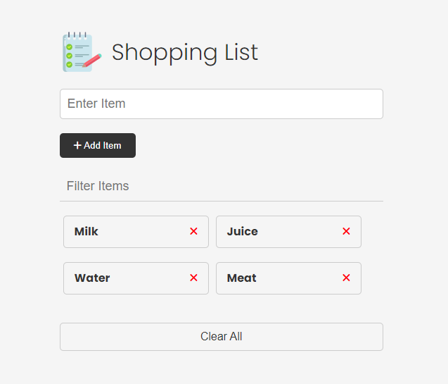
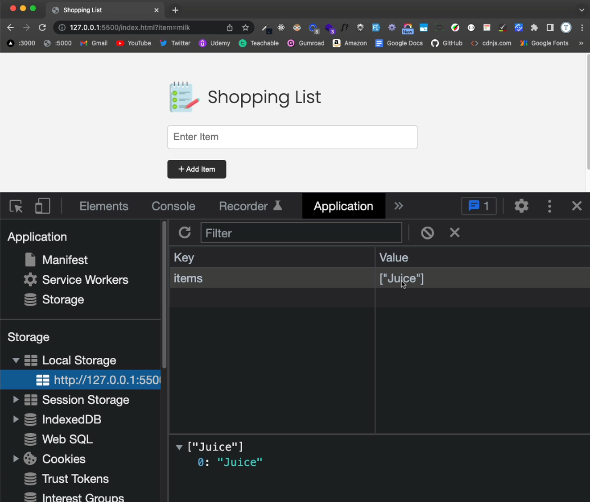

# 00-project-intro

# Shopping List Project Intro

Alright, so we have been working with the shopping list UI for a while. Now it's time to actually build it out and add the functionality. It may seem like a simple app, but we'll be writing about 200+ lines of code. When you don't use a framework, you have to account for everything. If you change the look of a button, you have to make sure it gets changed back to it's default state. Frameworks make things easier, by repainting the UI and stuff like that, but learning how to do things the vanilla way will make it that much easier for you to learn React or any other frontend framework.



Let's look at the specs for this project:

## Project Specs

- Add items to the list via the form
- Remove items from the list by clicking the "X" button
- Clear all of the items from the list with the "Clear All" button
- Filter the items by typing into the filter input field
- Add localStorage functionality to persist the list
- Click on an item to put the text into the input field and change the button to "Update"
- Update an item by clicking the "Update" button
- Add validation and check to see if the item already exists in local localStorage

I know we haven't talked about local storage yet, but I'm going to give you a little crash course before we add it to the project. Remember, everything that we have done so far is all frontend and related to the DOM. If we submit the form and add an item to the `ul`, it's only for that frame. If we reload the page, it goes back to the default. We're not persisting the data anywhere. Many times you'll submit the form and use something like the `fetch` API to send the data to a server and get saved in a database. Another option you have is to save the data locally and that's what local storage is for. So that if we refresh the page, we still have the data there.

Let's take a quick look at the HTML and CSS.

### HTML

The HTML is pretty simple and you probably have it memorized by now. We have a header then a form with an input for an item. We have a filer input to filter items. Of course, we have the item list and each item has the name as well as the "X" button to remove the item. We are using font-awesome for icons. I just included the CDN link in the `head`, that way we can just add classes to use icons. We also have a clear button to remove all of the items.

```html
<!DOCTYPE html>
<html lang="en">
  <head>
    <meta charset="UTF-8" />
    <meta http-equiv="X-UA-Compatible" content="IE=edge" />
    <meta name="viewport" content="width=device-width, initial-scale=1.0" />
    <link
      rel="stylesheet"
      href="https://cdnjs.cloudflare.com/ajax/libs/font-awesome/6.1.2/css/all.min.css"
      integrity="sha512-1sCRPdkRXhBV2PBLUdRb4tMg1w2YPf37qatUFeS7zlBy7jJI8Lf4VHwWfZZfpXtYSLy85pkm9GaYVYMfw5BC1A=="
      crossorigin="anonymous"
      referrerpolicy="no-referrer"
    />
    <link rel="stylesheet" href="css/style.css" />
    <title>Shopping List</title>
  </head>
  <body>
    <div class="container">
      <header>
        
        <h1 id="app-title">Shopping List</h1>
      </header>
      <form id="item-form">
        <div class="form-control">
          <input
            type="text"
            class="form-input"
            id="item-input"
            placeholder="Enter Item"
          />
        </div>
        <div class="form-control">
          <button type="submit" class="btn">
            <i class="fa-solid fa-plus"></i> Add Item
          </button>
        </div>
      </form>

      <div class="filter">
        <input
          type="text"
          class="form-input-filter"
          id="filter"
          placeholder="Filter Items"
        />
      </div>

      <ul id="item-list" class="items">
        <li>
          Apples
          <button class="remove-item btn-link text-red">
            <i class="fa-solid fa-xmark"></i>
          </button>
        </li>
        <li>
          Orange Juice
          <button class="remove-item btn-link text-red">
            <i class="fa-solid fa-xmark"></i>
          </button>
        </li>
        <li>
          Oreos
          <button class="remove-item btn-link text-red">
            <i class="fa-solid fa-xmark"></i>
          </button>
        </li>
        <li>
          Milk
          <button class="remove-item btn-link text-red">
            <i class="fa-solid fa-xmark"></i>
          </button>
        </li>
      </ul>

      <button id="clear" class="btn-clear">Clear All</button>
    </div>

    <script src="js/script4.js"></script>
  </body>
</html>
```

### CSS

The CSS is very simple as well. I didn't use any framework like Tailwind or Bootstrap. I just used a plain old CSS file.

```css
@import url('https://fonts.googleapis.com/css2?family=Poppins:wght@300;400;700&display=swap');

*,
*::before,
*::after {
  margin: 0;
  padding: 0;
  box-sizing: border-box;
}

body {
  font-family: 'Poppins', sans-serif;
  font-size: 16px;
  line-height: 1.5;
  color: #333;
  background-color: #f5f5f5;
}

header {
  display: flex;
  justify-content: flex-start;
  align-items: center;
  margin-bottom: 20px;
}

header h1 {
  font-weight: 300;
  margin-left: 10px;
}

.container {
  max-width: 500px;
  margin: 30px auto;
  padding: 20px;
}

/* Form & Input */
.form-input {
  width: 100%;
  font-size: 18px;
  margin-bottom: 20px;
  padding: 10px;
  border: 1px solid #ccc;
  border-radius: 5px;
  outline: none;
}

.form-input-filter {
  margin-top: 20px;
  width: 100%;
  font-size: 18px;
  margin-bottom: 20px;
  padding: 10px;
  border: none;
  border-bottom: 1px solid #ccc;
  background: transparent;
  outline: none;
}

/* Buttons */
.btn {
  background-color: #333;
  color: #fff;
  border: none;
  border-radius: 5px;
  padding: 10px 20px;
  cursor: pointer;
}

.btn:hover {
  background-color: #444;
}

.btn-link {
  font-size: 16px;
  background-color: transparent;
  color: #333;
  border: none;
  padding: 0;
  cursor: pointer;
}

.btn-clear {
  margin-top: 20px;
  width: 100%;
  font-size: 16px;
  background-color: transparent;
  color: #333;
  border: 1px solid #ccc;
  border-radius: 5px;
  padding: 10px 20px;
  cursor: pointer;
}

.btn-clear:hover {
  background-color: #f1f1f1;
}

.text-red {
  color: red;
}

/* Items */

.items {
  margin-top: 20px;
  display: flex;
  flex-wrap: wrap;
}

.items li {
  display: flex;
  justify-content: space-between;
  width: 45%;
  border: 1px solid #ccc;
  border-radius: 5px;
  padding: 10px 15px;
  margin: 0 5px 20px;
  font-weight: 700;
  cursor: pointer;
}

@media (max-width: 500px) {
  .items li {
    width: 100%;
  }
}
```


---


# 01-add-items-to-list

# Add Items To List

The first piece of functionality we want to add is the ability to add items to the list. We already have the HTML and CSS in place, so let's jump right into the JavaScript.

There will be parts of this project that I refactor as we go along.

First, let's bring in the elements from the DOM that we want to work with.

```js
const itemForm = document.getElementById('item-form');
const itemInput = document.getElementById('item-input');
const itemList = document.getElementById('item-list');
```

Let's add and event listener to the form and an `addItem()` function. We want to listen for the `submit` event. We will also do some basic validation to make sure the user has entered something in the input field.

```js
function addItem(e) {
  e.preventDefault();

  // Validate input
  if (itemInput.value === '') {
    alert('Please enter an item');
    return;
  }

  console.log('Success');
}

itemForm.addEventListener('submit', addItem);
```

Now, we want to create a new list item and add it to the list. The list item will include a button with a font-awesome icon inside of it.

I am going to create a separate functions for creating the button and the icon. This is just preference. You could do it all in one function if you wanted.

```js
function addItem(e) {
  e.preventDefault();

  const newItem = itemInput.value;

  // Validate Input
  if (newItem === '') {
    alert('Please add an item');
    return;
  }

  // Create list item
  const li = document.createElement('li');
  li.appendChild(document.createTextNode(newItem));

  const button = createButton('remove-item btn-link text-red');
  li.appendChild(button);

  itemList.appendChild(li);

  itemInput.value = '';
}

function createButton(classes) {
  const button = document.createElement('button');
  button.className = classes;
  const icon = createIcon('fa-solid fa-xmark');
  button.appendChild(icon);
  return button;
}

function createIcon(classes) {
  const icon = document.createElement('i');
  icon.className = classes;
  return icon;
}
```


---


# 02-setting-up-git

# Setting Up Git & GitHub

Git is a version control systems that is used to track changes in code. It is a very powerful tool that is very important to learn as a developer. It is used in many different ways, but we will be using it to track changes in our code as we build our shopping list app.

The basic workflow is:

1. Make changes to your code
2. Add the changes to the staging area
3. Commit the changes to the repository
4. Push the changes to GitHub (or something else like BitBucket)

## Installing Git

Git is a command line tool, so you will need to install it on your computer. You can download it from [git-scm.com](https://git-scm.com/). You can use the default settings when installing. If you are on a Mac, you can also install it using Homebrew.

If you are on Windows, you can also install Git Bash, which is a `bash` terminal that comes with Git. You can use this instead of the regular Windows command prompt.

## Init Git

Once you install Git, go to the project folder in your command line. VS Code has a built in terminal that you can use, which is what I prefer. Enter the following command:

```bash
git init
```

This creates a hidden `.git` folder in your project folder. This is where all of the Git information is stored.

## Add Files To Git

Now that we have Git initialized, we need to add the files we want to track to Git. We can do this by entering the following command:

```bash
git add .
```

The files are now in the staging area. We can see what files are in the staging area by entering the following command:

```bash
git status
```

## Commit Files

Now that we have the files in the staging area, we can commit them to the repository. We can do this by entering the following command:

```bash
git commit -m "Initial Commit"
```

The `-m` flag is used to add a message to the commit. This is a good practice to get into. It is a good idea to make your commit messages descriptive. This will help you and others understand what changes were made in the commit.

Call it `shopping-list` or whatever you'd like.

## Setup SSH keys for GitHub

Now that we have a remote repo, we need to add an SSH key to GitHub. This will allow us to push our code to GitHub. We can do this by entering the following command:

```bash
ssh-keygen -t rsa -b 4096 -C "
```

This will create a new SSH key. You can press enter to accept the default file location and the default name of `id_rsa` or you can type in a custom name and location. I like to name my key files for the service I am using it for, so I would do something like

```bash
/Users/brad/ssh/id_rsa_github
```

You will then be prompted to enter a passphrase. You can leave this blank by pressing enter.

This will create a private key file and a public key file. The public key file will have the same name as the private key file, but with `.pub` at the end. You can view the contents of the public key file by entering the following command:

```bash
cat ~/.ssh/id_rsa_github.pub
```

## Adding the SSH Key to GitHub

Copy the contents of the public key file. Then go to your GitHub account and click on your profile picture in the top right corner. Then click `Settings`. Then click `SSH and GPG keys`. Then click `New SSH key`. Give it a title and paste the contents of the public key file into the `Key` field. Then click `Add SSH key`.

## Push To GitHub

Next, we need to setup a remote repo at GitHub. We can do this by going to [github.com](https://github.com) and creating a new repository. Login and click the `+` icon in the top right corner. Then click `New repository`. Give it a name and click `Create repository`.

Now that we have a remote repo, we need to push our files to it. Start copying the `git remote` command that you see on the repo page

```bash
git remote add origin YOUR_REMOTE_REPO_URL
```

Then specify the branch you want to push to, We will use the main branch.

```bash
git branch -M main
```

Finally, push the files to the remote repo.

```bash
git push -u origin main
```

Now, you should see your files in the remote repo.

## Updating the remote repo

Anytime you update your code and you want to push to github, you simply add the files to the staging area, commit them, and push them to the remote repo.

Let's cerate a readme file called readme.md. Add the following to the readme file:

```md
# Shopping List App

This is a shopping list app that I created using HTML, CSS, and JavaScript.
```

This is a `markdown` file. You can learn more about markdown [here](https://www.markdownguide.org/).

Now push to your remote repo:

```bash
git add .
git commit -m "Update"
git push
```

The readme file contents will show up on the repo page.


---


# 03-remove-clear-items

# Remove & Clear Items

Now that we can add items, let's add the ability to remove and clear items.

Let's add an event listener on to the list itself and we will use event delegation to target the button/icon.

```js
itemList.addEventListener('click', removeItem);
```

Create the removeItem function

```js
function removeItem(e) {
  if (e.target.parentElement.classList.contains('remove-item')) {
    if (confirm('Are you sure?')) {
      e.target.parentElement.parentElement.remove();
    }
  }
}
```

## Clearing all items

We want to make the **Clear All** button function, so let's create an event listener for it.

```js
clearBtn.addEventListener('click', clearItems);
```

Create the clearItems function

```js
function clearItems() {
  if (confirm('Are you sure?')) {
    while (itemList.firstChild) {
      itemList.removeChild(itemList.firstChild);
    }
  }
}
```

There are many ways to clear the items. you could just set the `innerHTML` to an empty string, but I wanted to use a method that is a bit more performant.


---


# 04-clear-ui-state

# Clear UI State

This is optional, but I want to make the UI a bit more dynamic by not showing the filter input or the clear all button unless there are actual items in the list. If you still have your hardcoded `<li>` items in the HTML, you can remove them now.

We are going to have a function that we can run to check for the list items and if there are not any, we will hide the 2 elements. If they are there, we will show them.

```js
function checkUI() {
  const items = itemList.querySelectorAll('li');

  if (items.length === 0) {
    clearBtn.style.display = 'none';
    itemFilter.style.display = 'none';
  } else {
    clearBtn.style.display = 'block';
    itemFilter.style.display = 'block';
  }
}
```

We are going to call this in a few places. first, we will call it at the end of the file in the global scope. This will run when the page loads and check if there are any items in the list.

```js
checkUI();
```

We also want to add it when we add, remove and clear items.

```js
function addItem() {
  // ...
  checkUI();
}

function removeItem(e) {
  // ...
  checkUI();
}

function clearItems() {
  // ...
  checkUI();
}
```

Now you can test by adding, removing and clearing items. You should see the buttons appear and disappear as you add and remove items.


---


# 05-filter-items

# Filter Items

Now that we can add, remove and clear, we want to be able to type in the filter input and filter the items in the list.

Let's add an event listener to the filter input.

```js
itemFilter.addEventListener('input', filterItems);
```

We are going to use the `filter` method to filter the items.

```js
function filterItems(e) {
  const items = itemList.querySelectorAll('li');
  const text = e.target.value.toLowerCase();

  items.forEach((item) => {
    const itemName = item.firstChild.textContent.toLowerCase();

    if (itemName.indexOf(text) != -1) {
      item.style.display = 'flex';
    } else {
      item.style.display = 'none';
    }
  });
}
```

In the above code, we get the items and whatever is being typed in the filter input. Then we loop through and use the `indexOf` method to see if the item name contains the text. If it does, we show the item, otherwise we hide it.


---


# 06-localstorage-crash-course

# Local Storage Crash Course

## What is Local Storage?

Local Storage is a way for web pages to store named key/value pairs locally, within the client web browser. Unlike cookies, the storage limit is far larger (at least 5MB) and information is never transferred to the remote web server.

## Why would you want to use Local Storage?

Local Storage is one of the most commonly used web APIs in modern web development. It is used for client-side storage of persistent data. This means that the data stored in the browser will persist even after the browser window has been closed. Local Storage is ideal for storing simple data. It is used for things like user preferences, shopping cart contents, game scores, etc.

## How do you use Local Storage?

Local Storage is very simple to use. You can set, get, and remove data from Local Storage using the `setItem()`, `getItem()`, and `removeItem()` methods. The `setItem()` method takes a key and a value as parameters. The `getItem()` method takes a key as a parameter and returns the value. The `removeItem()` method takes a key as a parameter and removes the key/value pair from Local Storage.

## Adding an item to Local Storage

```js
localStorage.setItem('name', 'John');
```

## Getting an item from Local Storage

```js
const name = localStorage.getItem('name');
```

## Removing an item from Local Storage

```js
localStorage.removeItem('name');
```

## Clearing all items from Local Storage

```js
localStorage.clear();
```

Many times, you will want to save an array or object to Local Storage. You can do this by converting the array or object to a string using `JSON.stringify()` and then saving it to Local Storage. When you want to retrieve the array or object, you can convert it back to an array or object using `JSON.parse()`.

## Saving an array to Local Storage

```js
const todos = [
  {
    text: 'Take out trash',
  },
  {
    text: 'Meeting with boss',
  },
  {
    text: 'Dentist appt',
  },
];

localStorage.setItem('todos', JSON.stringify(todos));
```

## Getting an array from Local Storage

```js
const todos = JSON.parse(localStorage.getItem('todos'));
```

That is pretty much it. Local Storage is very simple to use.


---


# 07-add-items-to-localstorage

# Add Items To LocalStorage

Now that we have add, remove, clear and filter working in the DOM, we need to be able to persist the items to localStorage in the browser.

I am going to refactor the code a bit to make it easier to work with. Instead of having the submit event call a function called `addItem`, I am going to change the name of that function to `onAddItemSubmit()` and then call that function from the submit event.

```js
itemForm.addEventListener('submit', onAddItemSubmit);
```

The part of the function where we add the item to the DOM, I am going to remove and put in it's own function called `addItemToDOM()`.

```js
function onAddItemSubmit(e) {
  e.preventDefault();

  const newItem = itemInput.value;

  // Validate Input
  if (newItem === '') {
    alert('Please add an item');
    return;
  }

  // Create item DOM element
  addItemToDOM(newItem);

  checkUI();

  itemInput.value = '';
}
```

```js
function addItemToDOM(item) {
  // Create list item
  const li = document.createElement('li');
  li.appendChild(document.createTextNode(item));

  const button = createButton('remove-item btn-link text-red');
  li.appendChild(button);

  // Add li to the DOM
  itemList.appendChild(li);
}
```

## Adding items to localStorage

Now we will create a function to add the items to localStorage. We will call it right after we add the item to the DOM.

```js
function addItemToStorage(item) {
  let itemsFromStorage;

  if (localStorage.getItem('items') === null) {
    itemsFromStorage = [];
  } else {
    itemsFromStorage = JSON.parse(localStorage.getItem('items'));
  }

  // Add new item to array
  itemsFromStorage.push(item);

  // Convert to JSON string and set to local storage
  localStorage.setItem('items', JSON.stringify(itemsFromStorage));
}
```

```js
function onAddItemSubmit(e) {
  // ...

  // Create item DOM element
  addItemToDOM(newItem);

  // Add item to local storage
  addItemToStorage(newItem);
}
```

Now, when you add an item, it will get added to `items` in localStorage. You can check this by going to your application tab in the dev tools and clicking on the `Local Storage` tab.




---


# 08-display-items-from-localstorage

# Display Items From Local Storage

We are now able to add items to localStorage. Now we need to display them on the page when the page loads.

## Getting items from localStorage

We will start by creating a function that we can use in multiple places to get the items from localStorage.

```js
function getItemsFromStorage() {
  let itemsFromStorage;

  if (localStorage.getItem('items') === null) {
    itemsFromStorage = [];
  } else {
    itemsFromStorage = JSON.parse(localStorage.getItem('items'));
  }

  return itemsFromStorage;
}
```

We are just creating a variable called `itemsFromStorage` and setting it to an empty array. Then we are checking to see if there is anything in localStorage. If there is, we are parsing it and setting it to `itemsFromStorage`. If there isn't, we are just returning an empty array.

We can now replace most of the code in `addItemToStorage()` with this function.

```js
function addItemToStorage(item) {
  const itemsFromStorage = getItemsFromStorage();

  // Add new item to array
  itemsFromStorage.push(item);

  // Convert to JSON string and set to local storage
  localStorage.setItem('items', JSON.stringify(itemsFromStorage));
}
```

## Displaying items from localStorage

Next, we will create a function to display the items from localStorage on the page.

```js
function displayItems() {
  const itemsFromStorage = getItemsFromStorage();
  itemsFromStorage.forEach((item) => addItemToDOM(item));
  checkUI();
}
```

We are getting the items from localStorage and then looping through them. For each item, we are calling `addItemToDOM()` and passing in the item. Finally, we are checking the UI to see if we need to show the clear items button and filter input.

## Adding an `init()` function

Instead of putting all of the event listeners in the global scope, we will create an `init()` function and put them in there.

```js
function init() {
  // Event Listeners
  itemForm.addEventListener('submit', onAddItemSubmit);
  itemList.addEventListener('click', removeItem);
  clearBtn.addEventListener('click', clearItems);
  itemFilter.addEventListener('input', filterItems);
  document.addEventListener('DOMContentLoaded', displayItems);

  checkUI();
}

init();
```

This will work either way, but I prefer to put them in a function rather than the global space


---


# 09-remove-items-from-localstorage

# Remove Items From Local Storage

Now we want to be able to click the remove button and remove the item from the DOM and localStorage.

I am going to do the same thing that I did with the 'add' functionality and change the event listener function from `removeItem` to `onClickItem`. One reason I am doing this is because we are also going to have 'edit' functionality and that will also be used on a click on the item.

```js
itemList.addEventListener('click', onClickItem);
```

Now we will create the `onClickItem()` function. We will check to see if the target of the click is the remove button. If it is, we will call the `removeItem()` function.

```js
function onClickItem(e) {
  if (e.target.parentElement.classList.contains('remove-item')) {
    removeItem(e.target.parentElement.parentElement);
  }
}
```

Let's create the `removeItem()` function. We will pass in the item that we want to remove. We will remove it from the DOM and then remove it from localStorage.

```js
function removeItem(item) {
  if (confirm('Are you sure?')) {
    // Remove item from DOM
    item.remove();

    // Remove item from storage
    removeItemFromStorage(item.textContent);

    checkUI();
  }
}
```

Let's create the `removeItemFromStorage()` function. We will pass in the text for the item that we want to remove. We will get the items from localStorage, loop through them, and if the item matches the item that we want to remove, we will remove it from the array. Then we will set the new array to localStorage.

```js
function removeItemFromStorage(item) {
  let itemsFromStorage = getItemsFromStorage();

  // Filter out item to be removed
  itemsFromStorage = itemsFromStorage.filter((i) => i !== item);

  // Re-set to localstorage
  localStorage.setItem('items', JSON.stringify(itemsFromStorage));
}
```

## Clearing all items

This is simple. We just need to remove `items` from local storage in the `clearItems()` function.

```js
function clearItems() {
  while (itemList.firstChild) {
    itemList.removeChild(itemList.firstChild);
  }

  // Clear from localStorage
  localStorage.removeItem('items');

  checkUI();
}
```

You could also use `localStorage.clear()` to clear all items from localStorage.


---


# 10-set-edit-mode

# Set Edit Mode

In this section, we will add the ability to click on an item and enable edit mode which will put that item text into the input. We will also make that item in the list a lighter color and change the button from 'Add' to 'Edit'.

Let's start by adding a global variable for the edit state. We will set it to false.

```js
let isEditMode = false;
```

Let's go into the `onClickItem()` function and add an else, which will run if we are clicking in the item, but not on the delete icon. If that is true, then we will call a function called `setItemToEdit()`

```js
function onClickItem(e) {
  if (e.target.parentElement.classList.contains('remove-item')) {
    removeItem(e.target.parentElement.parentElement);
  } else {
    setItemToEdit(e.target);
  }
}
```

Now, let's create the `setItemToEdit()` function. This function will take in the item element and do the following:

- Set the edit state to true
- Add the `edit-mode` class to the item element
- Change the button text, icon and color
- Set the input value to the item text

```js
function setItemToEdit(item) {
  isEditMode = true;
  item.classList.add('edit-mode');
  formBtn.innerHTML = '<i class="fa-solid fa-pen"></i>   Update Item';
  formBtn.style.backgroundColor = '#228B22';
  itemInput.value = item.textContent;
}
```

Now when we click on an item, it does all of those things, but if you click on another item, the 'edit-mode' class is not removed from the previous item. Let's fix that by removing the class from all items before we add it to the new item.

```js
function setItemToEdit(item) {
  isEditMode = true;

  itemList
    .querySelectorAll('li')
    .forEach((i) => i.classList.remove('edit-mode'));

  item.classList.add('edit-mode');
  formBtn.innerHTML = '<i class="fa-solid fa-pen"></i>   Update Item';
  formBtn.style.backgroundColor = '#228B22';
  itemInput.value = item.textContent;
}
```


---


# 11-update-item-reset-state

# Update Item & Reset State

We can now set the app to 'edit mode' by clicking on an item. Now we need to add the ability to update the item.

We can do this by checking to see if we are in edit mode in the `onAddItemSubmit()` function. If we are, then we will update the item, otherwise we will add a new item.

```js
function onAddItemSubmit(e) {
  e.preventDefault();

  const newItem = itemInput.value;

  // Validate Input
  if (newItem === '') {
    alert('Please add an item');
    return;
  }

  // Check for edit mode
  if (isEditMode) {
    const itemToEdit = itemList.querySelector('.edit-mode');

    removeItemFromStorage(itemToEdit.textContent);
    itemToEdit.classList.remove('edit-mode');
    itemToEdit.remove();
    isEditMode = false;
  }

  // Create item DOM element
  addItemToDOM(newItem);

  // Add item to local storage
  addItemToStorage(newItem);

  checkUI();

  itemInput.value = '';
}
```

You can not directly update an item in local storage, so we are basically removing the item and adding a new one. We are also removing the `edit-mode` class from the item element and setting the edit state to false.

To make sure that the UI is reset, we will call the `checkUI()` function. I am also going to add the following to the `checkUI()` function:

```js
function checkUI() {
  itemInput.value = '';

  const items = itemList.querySelectorAll('li');

  if (items.length === 0) {
    clearBtn.style.display = 'none';
    itemFilter.style.display = 'none';
  } else {
    clearBtn.style.display = 'block';
    itemFilter.style.display = 'block';
  }

  formBtn.innerHTML = '<i class="fa-solid fa-plus"></i> Add Item';
  formBtn.style.backgroundColor = '#333';

  isEditMode = false;
}
```

Just to make sure we set the button back and set edit mode to false whenever we run this function.


---


# 12-prevent-duplicate-entries

# Prevent Duplicate Entries

In this lesson, we will add a check to prevent duplicate entries from being added to the shopping list.

Let's create a function that will check if the item already exists in the shopping list.

```js
function checkIfItemExists(item) {
  const itemsFromStorage = getItemsFromStorage();
  return itemsFromStorage.includes(item);
}
```

We are using the `includes()` method to check if the item exists in the array of items from local storage.

Now let's use it in the `onAddItemSubmit()` function.

This is what the final function should look like:

```js
function onAddItemSubmit(e) {
  e.preventDefault();

  const newItem = itemInput.value;

  // Validate Input
  if (newItem === '') {
    alert('Please add an item');
    return;
  }

  // Check for edit mode
  if (isEditMode) {
    const itemToEdit = itemList.querySelector('.edit-mode');
    removeItemFromStorage(itemToEdit.textContent);
    itemToEdit.classList.remove('edit-mode');
    itemToEdit.remove();
    isEditMode = false;
  } else {
    if (checkIfItemExists(newItem)) {
      alert('That item already exists!');
      return;
    }
  }

  // Create item DOM element
  addItemToDOM(newItem);

  // Add item to local storage
  addItemToStorage(newItem);

  checkUI();

  itemInput.value = '';
}
```

The reason that we check for edit mode is because if the item is being edited, we want to allow the user to use the same name for the item.


---


# 13-deploy-to-netlify

# Deploy To Netlify

When it comes to hosting, you have many many choices, especially for a simple HTML, CSS and JavaScript application. There are many services that will even host your project for free up to a limit (traffic and users).

One of my favorite hosting providers for websites and front-end applications is [Netlify](https://www.netlify.com/). It is amazingly simple to deploy your project for free. I am not being sponsored by Netlify in any way. It is just a service that I use and recommend.

## Create a Netlify Account

If you don't already have a Netlify account, you can create one for free. You can use your GitHub account to sign up.

## Create a New Site

There are a few ways to push your project to the server. The easiest way is to simply push to GitHub, which I already showed you how to do. Then, you can connect your GitHub account to Netlify and it will automatically deploy your project.

Just click "Add new site" and select your GitHub project. After a few seconds, it will show you a congratulations message and your project will be live. You will have a strange URL, but you can easily add your own domain by following the instructions in the docs.

## Future deployments

When you make changes to your project, you can simply push to GitHub and Netlify will automatically deploy your project. By default, the `main` branch is used, but you can change that in the settings. Sometimes developers will use a `dev` branch for development and then merge to `main` when they are ready to deploy. Or they may have a branch named `deploy` or `production`. You can change the branch in the settings.

That's it!
