# 01-thread-of-execution

# Thread Of Execution

## JavaScript is Synchronous

So, we have covered a lot of the fundamentals of JavaScript and how to work with the Document Object Model (DOM). Now we are going to start to get into asynchronous JavaScript. Before we do that though, it is important to understand how JavaScript actually works and to understand that at it's core, JavaScript is a `synchronous` and `single-threaded` language. It has `asynchronous` capabilities, which we will be looking at in this section and others, but it is not `asynchronous` by default.

## JavaScript is Single-Threaded

You already have a leg up on this stuff, because you know about the `execution context`. We talked about that earlier in the course. The `execution context` contains the currently running code and everything that aids in its execution. It also runs on what we call a `thread of execution`. The `thread of execution` is a single thread that **runs one line of code at a time**. This is why JavaScript is a `single-threaded` language and is `synchronous`. Some languages have multiple threads that can run code at the same time. JavaScript does not.

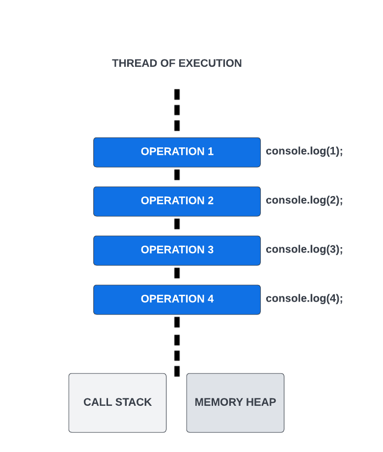

If we look at this image, it shows the `thread of execution`, which is a single sequential flow of control and each operation happens one after the other. The second console.log() will not run until the first one is finished. The third will not run until the second is finished. This is `synchronous` behavior. The thread also includes the call stack and memory heap, which we've already talked about.

So that's really all I want you to understand up to this point is that everything is executed line by line. In the next video, I'll show you how it is possible to run code asynchronously with the help of web APIs.


---


# 02-how-async-js-works

# How Asynchronous JavaScript Works: The Task Queue & Event Loop

Alright, so I just want to warn you that I'm going to throw a lot of information at you in this video because I'm basically going to explain everything that happens behind the scenes when we create asynchronous code. If this confuses you, don't worry about it. You'll learn more about the behind the scenes stuff as well as the syntax throughout the course.

So you know that JavaScript is a `synchronous` and it's a `single-threaded` language. It runs one line of code at a time. Just to remind you, we can look at the image we talked about in the last video.


These operations run line by line and each one has to wait for the last one to complete before executing. Where we run into issues is where one of these operations takes a while. Something like fetching data from a server or if you're using Node.js, maybe you're reading from or writing to a file. That can take a while, and by a while, I mean usually a few seconds or even a few milliseconds, but that's a long time in programming.

## Blocking & Non-Blocking Code

When an operation takes a while and basically holds up the line, that is called `blocking` code or operations. It blocks the flow of the program until it completes. `Non-blocking`code refers to code that does not block execution.

Let's look at the following code. Don't worry if you don't understand everything, but both pieces of code are reading a file using Node.js file system methods and then calculating the sum of numbers from 1 to 10.

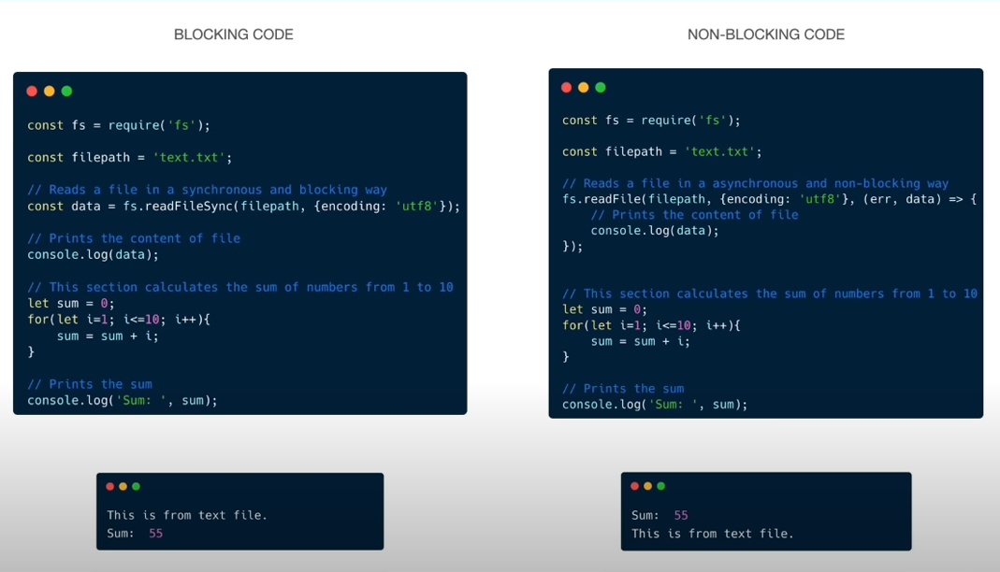

On the left, we are using the `readFileSync()` method. This is a blocking method. It will read the file and then move on to calculate the sum. In the console, we see the file contents and then the sum.

On the right, we are using the `readFile()` method. This is a non-blocking, asynchronous method. It will read the file but it will not block the execution of the program by making it wait. The way it works, is it takes in a callback function and when the file is read, it will execute the callback function. In the console, we see the sum first and then the file contents, because we did not have to wait for the file to be read before calculating the sum.

Now `readFile()` is not available to us in the browser, but there are a lot of APIs that are available that work in a similar asynchronous way.

I'm going to show you a diagram to try and explain what happens when we write asynchronous code using these web APIs.

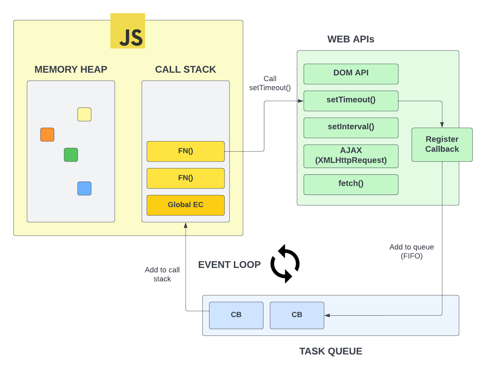

The yellow box represents the `JavaScript engine`. This is the part of the browser that executes our JavaScript code. This is where our `call stack` is that executes all of our functions, etc. This is also where the `memory heap` is, which is where all of our variables and objects are stored.

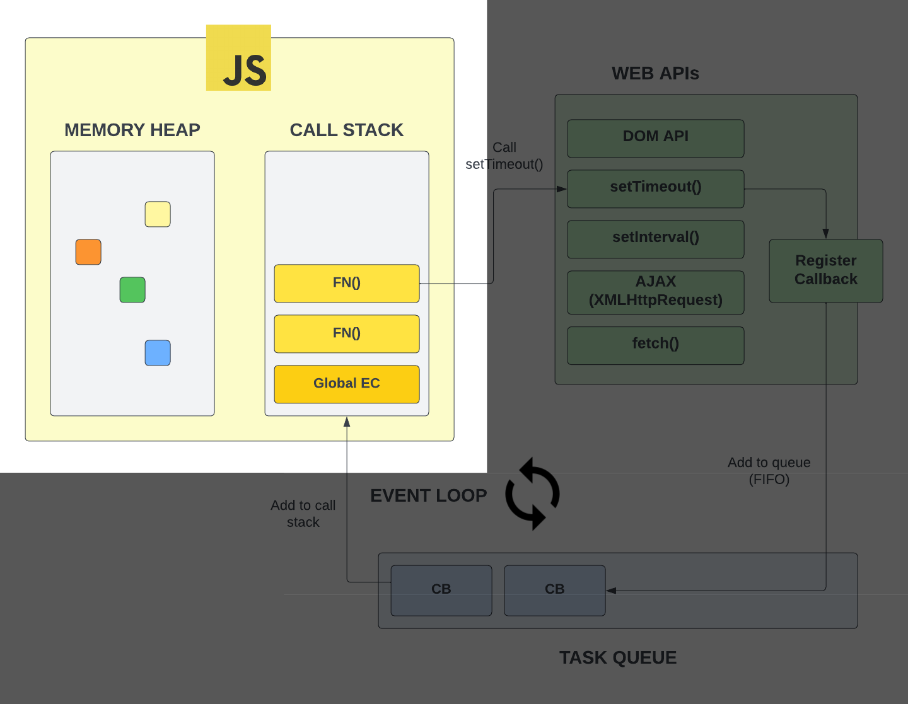

Outside of that, in the green box, we have a bunch of web APIs that are accessible to us via the browser and the `global object`. Remember, this is created during the _creation phase_ of the `global execution context`.

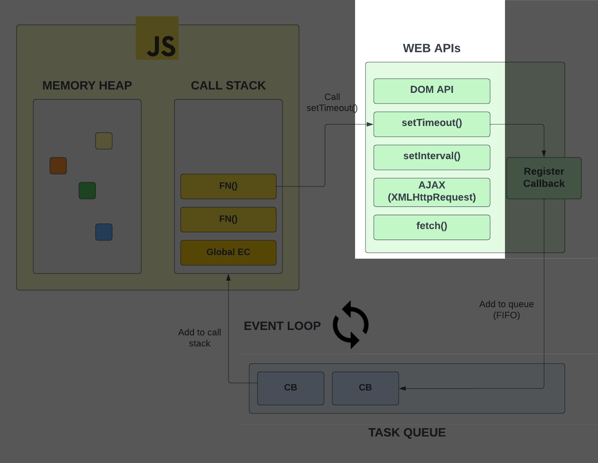

If we go to the browser console and type in `window` and hit enter, you will see `setTimeout()` and `setInterval()` and a bunch of other functions that allow us to do things asynchronously.

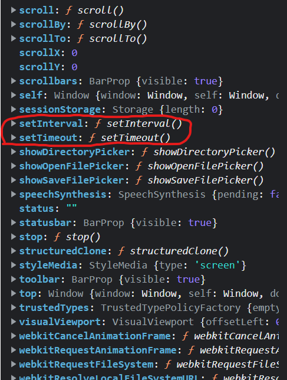

In addition to `setTimeout()` and `setInterval()`, we have the whole DOM API. We select elements and put event listeners on them. That's another API we have available to us. it's not part of JavaScript. When you use Node.js, you don't have access to the document object, because there is no DOM or browser in Node.js. But as you saw in the code examples, in Node, you do have access to the filesystem API, which allows you to read and write files.

`fetch()` is another API that we have access to. It allows us to make HTTP requests. We'll be working with the fetch API quite a bit to send requests to APIs and services. This is something that a front-end developer has to know how to use, and we'll get to that soon enough.

Right now, I just want you to understand that this is stuff provided to us by the browser environment. Now, let's talk about how they work with the JavaScript engine, which is inherently synchronous.

## Task Queue

So we know these APIs are separate from the JavaScript engine. We know that we have the ability to go off and do something while the script continues to execute and when that something is done, we fire off a callback function. This is possible because of something called the `task queue`.

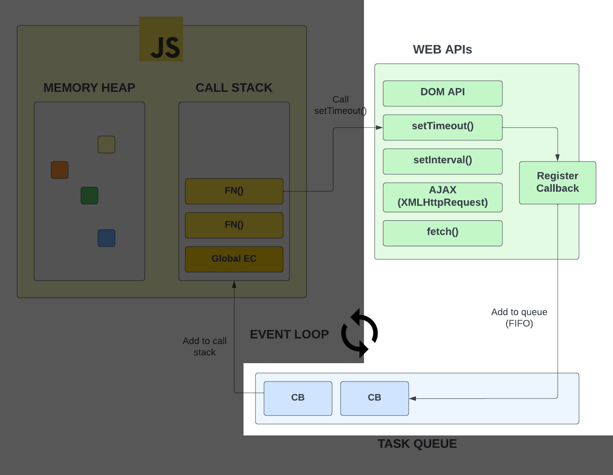

When we call an asynchronous function such as `setTimeout()`. In the diagram it's being called from a function, but it could just as well be from the global scope. When we call it, we added a callback function as an argument. It then registers that callback and it gets added to what we call a `task queue`. This is a queue of callbacks that are waiting to be added to the call stack and executed.

A `queue` is a data structure that follows the `first in, first out` principle. This means that the first item that is added to the queue will be the first item that is removed from the queue. In our case, the first callback that is added to the task queue will be the first callback that is executed.

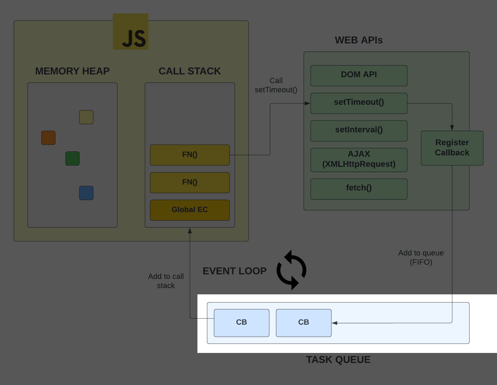

Remember, we already looked at a `stack`, which follows the `last in, first out` principle. This means that the last item that is added to the stack will be the first item that is removed. The `call stack` is an example. So both `queues` and `stacks` are data structures that are used in programming.

## Event Loop

Any callbacks that are in the queue, have to be put on the stack to be executed. This is where the `event loop` comes in. The event loop is a process that checks the call stack and the task queue. If the call stack is empty, it will take the first callback in the task queue and add it to the call stack to be executed. When we create event listeners with `addEventListener()`, we are also adding callbacks to the task queue.

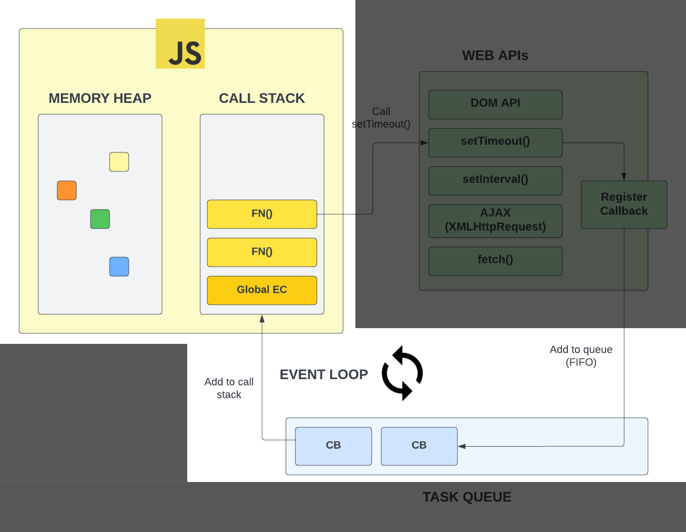

You can think of the event loop like one of those revolving doors at the mall. It's constantly checking to see if the door is open and if it is, it will let people in. If it's not, it will keep spinning until it is. In this case, we're dealing with functions instead of people.

Now this is also how the event loop and the task queue work within Node.js. There are different APIs and functions available, but it all works the same under the hood. Node even uses the same V8 engine that Chrome uses.

## Promises

Now Just to confuse you a little bit more, with things like event listeners and `setTimeout()`, callbacks get added to the task queue. When we work with let's say, the `fetch` API, we get a `Promise` object back, which work a little differently.

Promises are objects that represent the eventual completion or failure of an asynchronous operation. They are a way to handle asynchronous code in a more elegant way than using callbacks. We'll be working with promises a lot in the future. The reason I'm mentioning them now is because promises create what are called `PromiseJobs` or the v8 engine calls them `microtasks`.

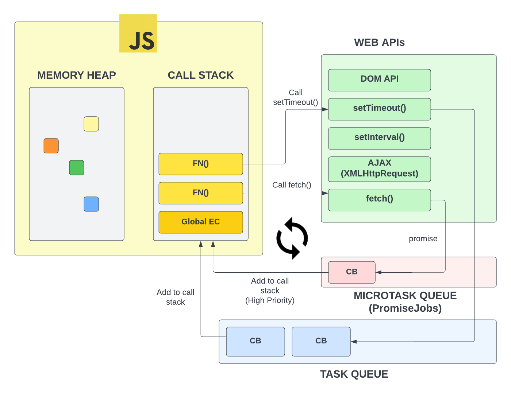

Microtasks are callbacks that are added to the `microtask queue`. It works in a similar way to the task queue, but it's a separate queue and it's checked before the task queue. It has a higher priority. There are also something called `observers` that are added to the microtask queue. We'll get to those later.

Alright, I know this is confusing as hell, but the truth is, you don't need to understand all of this right now. In fact, I know senior developers that don't know some of this stuff, but I wanted you to get a head start on what is actually happening under the hood.


---


# 03-settimeout-cleartimeout

# `setTimeout()` and `clearTimeout()`

In the last video, we looked at a diagram that represented what actually happens under the hood when we use some of the asynchronous APIs that the browser or Node.js offers. In this video, we're going to look at `setTimeout()`, which is really helpful for doing something after a certain amount of time. We're also going to look at `clearTimeout()`, which is a function that we can use to cancel a timeout.

```js
setTimeout(function () {
  console.log('Hello from callback');
}, 2000);

console.log('Hello from the top-level code');
```

When we run this code, we see the following output.

```
Hello from the top-level code
Hello from callback
```

The reason for this is because setTimeout() is given a number of milliseconds as the second argument and then it waits that amount of time and fires off. It does not block the code though, so we see the top-level console log first and then the callback console log.

Let's go ahead and change the 2000 milliseconds to `0`. What do you think is going to happen?

```js
setTimeout(function () {
  console.log('Hello from callback');
}, 0);

console.log('Hello from the top-level code');
```

When we run this code, we see the following output.

```
Hello from the top-level code
Hello from callback
```

You may have thought that the callback would execute first since we set the timeout to 0. Remember, that callback gets put on to the `task queue` and then it waits for the call stack to be empty. So, the callback is not going to execute until the call stack is empty, even if we set the timeout to 0. Just to remind you, here is the diagram that we looked at in the last video.


You may want to use this to change something in the DOM after a certain amount of time. We did this in the loan calculator project to show a spinner for 1 second before showing the results.

Let's make the `h1` tag change after a few seconds.

```js
setTimeout(() => {
  document.querySelector('h1').textContent = 'Hello from callback';
}, 3000);
```

We could also put that in a separate function and then call it.

```js
function changeText() {
  document.querySelector('h1').textContent = 'Hello from callback';
}

setTimeout(changeText, 3000);
```

## `clearTimeout()`

In addition to `setTimeout()`, we also have `clearTimeout()`. This is a function that we can use to cancel a timeout.

Let's create a button that will cancel the timeout to change the text.

```html
<button id="cancel">Cancel Text Change</button>
```

In order to know which timeout to cancel, we need to store the id that is returned from `setTimeout()`.

```js
const timerId = setTimeout(changeText, 3000);
```

Now, we can create an event listener for the button that will call `clearTimeout()`.

```js
document.querySelector('#cancel').addEventListener('click', () => {
  clearTimeout(timerId);
  console.log('Timer Cancelled');
});
```


---


# 04-setinterval-clearinterval

# `setInterval()` and `clearInterval()`

`setInterval()` is used to run a specific callback function and repeat it at a set interval. The number of miliseconds passed to the function is the amoount of time to wait between each function call. Let's look at a simple example

```js
const intervalID = setInterval(myCallback, 1000);

function myCallback() {
  console.log(a, Date.now());
}
```

This will log the timestamp every second.

We can also pass in parameters

```JavaScript
const intervalID = setInterval(myCallback, 1000, 'Hello');

function myCallback(a) {
  console.log(a, Date.now());
}
```

`clearInterval()`

To clear or stop the interval, we can use `clearInterval()` and pass in the interval ID

```JavaScript
clearInterval(intervalID);
```

Let's create a script to change the body background color every second. We will have buttons to start and stop it.

```JavaScript
let intervalID;

function startChange() {
  if (!intervalID) {
    intervalID = setInterval(changeBackground, 1000);
  }
}

function changeColor() {
  if (document.body.style.backgroundColor !== 'black') {
    document.body.style.backgroundColor = 'black';
    document.body.style.color = 'white';
  } else {
    document.body.style.backgroundColor = 'white';
    document.body.style.color = 'black';
  }
}

function stopChange() {
  clearInterval(intervalID);
}

document
  .getElementById('start')
  .addEventListener('click', startChange);
document.getElementById('stop').addEventListener('click', stopChange);

```


We could make it a random color by generating a hex value

```JavaScript
function changeRandomColor() {
  const randomColor = Math.floor(Math.random() * 16777215).toString(16);
  document.body.style.backgroundColor = `#${randomColor}`;
}
```

---


# 05-callbacks

# Callbacks

Let's touch on callback functions a bit more. A callback is simply a function that is passed into another function as an argument and executed within the function that it was passed into.

We have already used callbacks quite a few times in this course. For example, we've used them with `addEventListener()` and `setTimeout()`.

Just because a function takes in a callback does not mean that it is asynchronous. It is a way to handle asynchronous code, such as we saw with `setTimeout()`, where the callback is placed in the `task queue` and then it waits for the call stack to be empty before it is executed. But, we also used callbacks with high order array methods like `forEach()` and `map()`. These are not asynchronous. The callbacks are executed immediately in this case.

## Callback Recap

`addEventListener()` is a good example of a function that takes in a callback. Let's look at the following code.

```js
function toggle(e) {
  const bgColor = e.target.style.backgroundColor;

  if (bgColor === 'red') {
    e.target.style.backgroundColor = '#333';
  } else {
    e.target.style.backgroundColor = 'red';
  }
}

document.querySelector('button').addEventListener('click', toggle);
```

Notice, when we pass in a callback, we do not use parentheses. We just pass in the name of the function. Parentheses are used when we want to execute the function. The function is executed within the `addEventListener()` function at a later time (when the event occurs).

If we were to add parentheses, the function would execute immediately and the callback would not be passed into the `addEventListener()` function.

```js
function toggle(e) {
  // Add this
  console.log('toggle ran...');

  const bgColor = e.target.style.backgroundColor;

  if (bgColor === 'red') {
    e.target.style.backgroundColor = '#333';
  } else {
    e.target.style.backgroundColor = 'red';
  }
}

document.querySelector('button').addEventListener('click', toggle());
```

If you run the code above, you will see the console log right away. You will also get an error, because it can't read the event object.

## Implementing Callbacks

Until you are writing advanced JavaScript, you probably will not have too many times where you will actually create a function that takes in a callback, but let's try it, just to see how it works.

Let's create a couple posts inside of an array:

```js
const posts = [
  { title: 'Post One', body: 'This is post one' },
  { title: 'Post Two', body: 'This is post two' },
];
```

Now I am going to create two functions. One to create a new post and one to get all posts. The `createPost()` function is going to create after two seconds and the `getPosts()` function is going to get all posts after one second.

```js
function createPost(post) {
  setTimeout(() => {
    posts.push(post);
  }, 2000);
}

function getPosts() {
  setTimeout(() => {
    posts.forEach(function (post) {
      const div = document.createElement('div');
      div.innerHTML = `<strong>${post.title}</strong> - ${post.body}`;
      document.querySelector('#posts').appendChild(div);
    });
  }, 1000);
}

createPost({ title: 'Post Three', body: 'This is post three' });

getPosts();
```

We ran both functions, yet we only see the initial two posts. The third never shows up because the posts already showed up after one second then the `createPost()` function ran after two seconds. We need to use a callback to fix this.

We can use a callback to fix this. We can pass in a callback to the `createPost()` function and then call the `getPosts()` function inside of the callback.

```js
function createPost(post, cb) {
  setTimeout(() => {
    posts.push(post);
    cb();
  }, 2000);
}

function getPosts() {
  setTimeout(() => {
    posts.forEach(function (post) {
      const div = document.createElement('div');
      div.innerHTML = `<strong>${post.title}</strong> - ${post.body}`;
      document.querySelector('#posts').appendChild(div);
    });
  }, 1000);
}

createPost({ title: 'Post Three', body: 'This is post three' }, getPosts);
```

Now, when we run the code, we see all three posts. The `createPost()` function is executed and then the callback is executed.

Where we can get in trouble with callbacks is when we have multiple callbacks nested within eachother. This is called callback hell. To address this, we can instead use something called `promises`, which we will get into a little later.

In the next ;lesson, I want to get into HTTP requests. Making HTTP requests will give us more realistic examples of asynchronous code, rather than just using `setTimeout()`.


---


# 06-http-requests

# HTTP Requests

Alright, so now we're starting to get to the fun stuff. The JavaScript code that we have been writing in this course has all been `front-end` code, meaning it is being run in the browser on the client machine as opposed to on the server or the `back-end`. You can write server-side JavaScript with Node.js, but that's way beyond what we're learning now. However, there will be times when you'll want to fetch some data from some kind of API on a server, or send some data to a server from a form. This is where `HTTP` requests come in. The server could be either your own back-end that you wrote with Node.js or another language like Python or Ruby, or it could be a public third-party API. We'll be working with a couple third-party APIs in this course. We interact with APIs by making HTTP requests.

## What is an HTTP request?

`HTTP` stands for `HyperText Transfer Protocol`. It is the protocol that is used to send and receive data on the web.`HTTP` is a client-server protocol, which means requests are initiated by the client, usually the web browser, and the server will respond with a response. Every time that you go to a web page, your browser is making a request to a server. The server is responding with things like HTML, CSS, and JavaScript files. It may also respond with images, videos, and other media as well as data formatted as JSON or XML. When we fetch data using JavaScript, it is usually JSON data. If you go to your browser's developer tools `network` tab, you can see the requests that are being made to the server. You can also see the responses that are being sent back.

## Making HTTP requests

You can make HTTP requests right from your JavaScript code without having to refresh the page. There are a few ways to do this. The old way of doing this was to use `AJAX`, which stands for **Asynchronous JavaScript and XML**. You can still use `AJAX` to make HTTP requests, but it's not the most common way to do it anymore. The most common way to make HTTP requests is to use the `fetch()` API. The `fetch()` API is a promise-based API, which means that it returns a promise that will resolve with the response from the server. We're going to get into `fetch()` and `promises`, but first, I'll show you how to make an HTTP request with `AJAX` and the `XMLHttpRequest` object. You probably won't use this method much, but it's good to know how it works.

## JSON responses

When you make an HTTP request from your JavaScript code, the server will respond with some data. The data can be in a variety of formats, but the most common format is `JSON`. We talked about `JSON` earlier, but let's have a little refresher. `JSON` stands for **JavaScript Object Notation**. It is a way to represent data in a format that is easy for both humans and machines to read and write. We used to use XML (Which is why the X in AJAX stands for XML), but it's become more common to use `JSON` because it's easier to work with. We'll be fetching JSON data from the APIs that we'll work with. We can then use that data in our web page.

## HTTP Methods

When you make an HTTP request, you need to specify what kind of request you're making. There are a few different types of requests, but the most common ones are `GET`, `POST`, `PUT`, and `DELETE`. We'll mostly be using `GET` in this course.

- `GET` requests are used to retrieve data from the server. In fact, every time you visit a webpage, you are making a `GET` request.
- `POST` requests are used to send data to the server. Usually when you submit a website form, it makes a `POST` request.
- `PUT` requests are used to update data on the server. There's also a `PATCH` method that can be used to update.
- `DELETE` requests are used to delete data on the server.

There are other less common methods, but these are the main four. When you use the `fetch` API or `AJAX`, you can choose which type of request you want to make.

## HTTP Status Codes

I'm going to mention HTTP status codes here, but this is not something you really need to remember right now. You'll learn them in time. When you make an HTTP request, the server will respond with a status code. The status code will tell you if the request was successful or not. Status code ranges have specific meanings.

- `100` range is just continue or processing. It j=means the request is not done yet, but is ok up to that point. You don't work with 100 range responses very often.
- `200` range means **success** and everything went as it should. 200 is what you want.
- `300` range means some kind of redirect.
- `400` range means there was a client error. So basically, it's your fault whether that is a missing field in a form or if you're unauthorized to make that request.
- `500` range is a server error. So it's not the client's fault something went wrong on the server in the back-end code.

#### Common Codes

Here are som very common codes. These are the main codes you will run into:

- 200: Success
- 201: Success and something was created
- 204: Success but no content returned

- 301: Permanent redirect

- 400: Bad request
- 401: Unauthorized
- 403: Forbidden
- 404: Resource not found

- 500: Something wrong on server

Read more about status codes [here](https://developer.mozilla.org/en-US/docs/Web/HTTP/Status).

## An Example Request

Let's make a request to an API right from our browser. We'll use the public GitHub API. APIs have different endpoints, which are just URLs that you can make requests to using certain HTTP methods to achieve certain results. The GitHub API has a few different endpoints, but we'll use the `users` endpoint. The `users` endpoint will return information about a GitHub user. Later, we'll do this from our code, but for now, let's go to the following URL in the browser:

```
https://api.github.com/users/bradtraversy
```

You can replace my username with your own if you want. This will return a JSON object with information about the user. The data will show right in the browser. You can also see the response in the browser's developer tools `network` tab along with the headers and any other information including the status code of 200, which means successful.

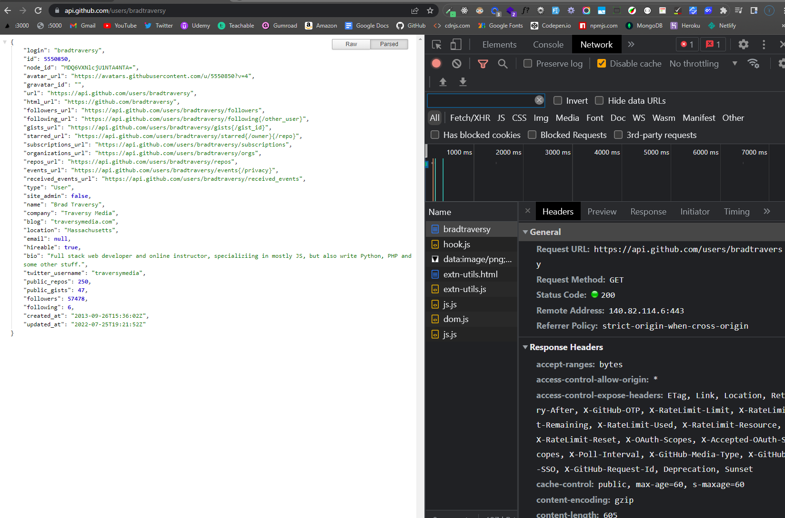

If we made this request from our code, we could then use any of this information in our web page. We'll do this later on. For now, I just wanted to get you familiar with making HTTP requests and seeing the response.


---


# 07-sample-requests-network-tab

# Sample HTTP Requests & The Network Tab

Okay, so I want to show you how to use the Network tab in your browser's developer tools. This is a really useful tool for debugging your code. It allows you to see what requests are being made to your server and what data is being sent back.

I'm going to use my own website as an example, so I'll go to https://traversymedia.com and go to the developer tools. I'll click on the Network tab and then refresh the page.

This will show us every single resource that was sent with the response from the `GET` request that was made to the server by the browser. You can see that there are a lot of resources here. There are images, CSS files, JavaScript files, and more. If you click on one of these, you can see the details of the request and response.

If I click on one of the resources such as one of the CSS files, we can see the status code is `200`, which means `success`. We can also see the size of the file, the type of file and much more. If I click on `response`, we can see the actual CSS file that was sent back to the browser.

## Getting Data

So that's how you can use the Network tab to see what resources are being sent back to the browser. Now, let's look at a data resource that we would typically use JavaScript to fetch data from. I'm going to use the GitHub API as an example.

In your browser, you can go to https://api.github.com/users/bradtraversy. This is the API endpoint for my GitHub profile.

The data will display right in the browser. I have a Chrome extension called **JSON Viewer** that makes it easier to read. If you don't have this extension, you can install it from the Chrome Web Store.

If we click on the Network tab and refresh the page, we can see that the request was made to the server and the response was sent back. If we click on the response, we can see the data that was sent back.

Ultimately, we would want to use JavaScript to fetch this data and use it within our project. We can do this with the `fetch API`. Before we get to fetch, I want to show you how we can do it using the `XMLHttpRequest` object. This will give us more opportunities to work with callbacks.


---


# 08-ajax-xhr

# AJAX & XHR (XMLHttpRequest)

So when we make a request to a server or some kind of data API, we will usually use the `fetch` API. Any project we do in this course, that's what we'll be doing. But it's important to know that there's another way to do it, and that's with the `XMLHttpRequest` object. This is the older way of doing it, but you should at least know the basics just in case you run into it. It will also help you understand more about callbacks, etc.

## XMLHttpRequest

The `XMLHttpRequest` object is a built-in browser object that allows us to make HTTP requests. It's a little more complicated than the `fetch` API, but it's still pretty straightforward. You may notice `XML` is included in the name of the object. AJAX also stands for "Asynchrounous JavaScript and XML". This is because years ago when this was created, XML was the common data format we used. These days you almost never see XML, instead we work with JSON, which is much simpler and cleaner.

Let's look at the following diagram to see how this works:

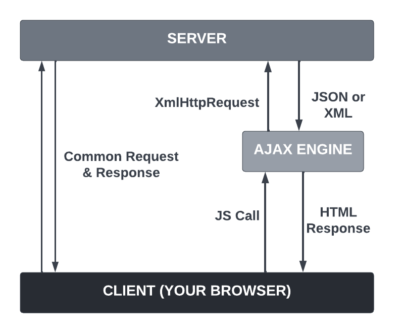

So we have our client, which is our browser, and we have the server or third-party API that we want to communicate with via HTTP request. This could also just be a file on your file system.

Like I said before, when we visit a webpage, we are making an HTTP request. That is what is demonstrated on the left.

What AJAX and the XHR object allow us to do is make those same types of requests via JavaScript. So from our code we make a call using the AJAX engine and XHR object. It sends a request behind the scenes without refreshing the page. Then we get back JSON or XML data in a response and we can then update the dom with that data. So all this happens behind the scenes without the user having to refesh the page.

Let's look at an example of how we do this within our code:

```js
const xhr = new XMLHttpRequest();

xhr.open('GET', 'https://api.github.com/users/bradtraversy');

xhr.onreadystatechange = function () {
  if (this.readyState === 4 && this.status === 200) {
    console.log(JSON.parse(this.responseText));
  }
};

xhr.send();
```

Let's go through bit-by-bit.

First, we create a new `XMLHttpRequest` object. This is the object that we'll use to make the request.

```js
const xhr = new XMLHttpRequest();
```

Next, we use the `open()` method to initialize the request. We pass in the type of request we want to make, and the URL we want to make the request to. You can also pass in a third parameter to specify whether the request should be made asynchronously or not. This is `true` by default, but we can set it to `false` if we want to make a synchronous request, which will block the rest of the code from running until the request is complete. We won't be doing this in this course, but it's good to know that it's possible.

```js
xhr.open('GET', 'https://api.github.com/users/bradtraversy');
```

Then we use the `onreadystatechange` event handler to listen for the `readystatechange` event. This event will fire every time the `readyState` changes. We can use this to check the status of the request. You can also use addEventListener() to listen for the event.

readyState has 5 possible values:

- 0: request not initialized
- 1: server connection established
- 2: request received
- 3: processing request
- 4: request finished and response is ready

We want to check that the `readyState` is 4, and that the `status` is 200, which means everything is OK. If the `status` is not 200, then there was an error. We use the `this` keyword to refer to the `XMLHttpRequest` object.

We can see what the values are every time the status changes:

```js
console.log(this.readyState, this.status);
```

The data that we get back will be in the `responseText` property. We can use `JSON.parse()` to convert it to a JavaScript object.

```js
xhr.onreadystatechange = function () {
  if (this.readyState === 4 && this.status === 200) {
    console.log(JSON.parse(this.responseText));
  }
};
```

Finally, we use the `send()` method to send the request.

```js
xhr.send();
```

We will see the data in the console, but you can also look in your devtools `network` tab. You should see a request to the GitHub API. Click on it and you should see the response.

  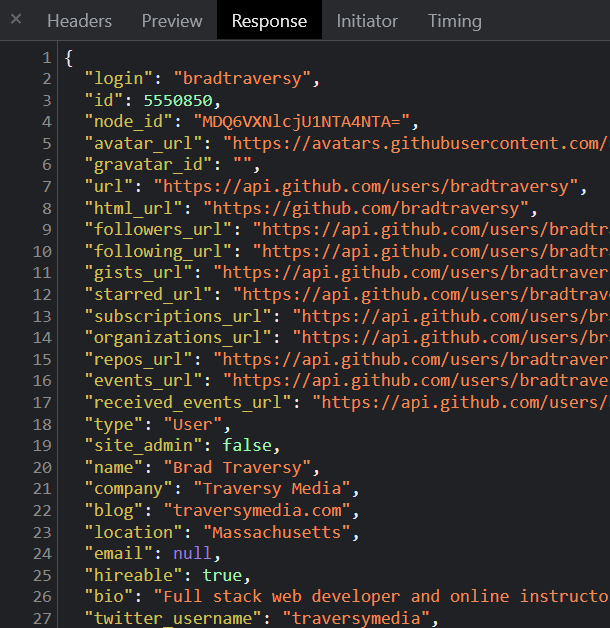

If you want to try getting all of the GiHub repos for a user, you can use the following URL:

```js
xhr.open('GET', 'https://api.github.com/users/bradtraversy/repos');
```

Instead of getting back an object, you will get back an array of objects.

Let's output the data to the page. We can use the `forEach()` method to loop through the array of repos. We can then create a list item for each repo and append it to the page.

```js
xhr.onreadystatechange = function () {
  if (this.readyState === 4 && this.status === 200) {
    const data = JSON.parse(this.responseText);

    data.forEach((repo) => {
      const li = document.createElement('li');
      li.innerHTML = `<strong>${repo.name}</strong> - ${repo.description}`;
      document.querySelector('ul').appendChild(li);
    });
  }
};
```

It is important to understand that whatever you get back from an API is up to the server-side developer. So you may get back a different format of data, or different properties, etc. What they chose to send back will be accessible in the `responseText` property.

So now that we know how to make a simple request, in the next video, we're going to create a little joke generator app using the Chuck Norris Jokes API.


---


# 09-joke-generator-project

# Joke Generator Project

In the last video, we saw how to make a request to an API using the `XMLHttpRequest` object. In this video, we'll use the same technique to make a request to the [https://api.chucknorris.io/](https://api.chucknorris.io/) to get a random Chuck Norris joke and put it into the page. We will also create a button that will allow us to get a new joke.

Before I move on, I would like to challenge you to create this yourself without having to follow along. We went over everything that you need to know already. In the resources for this video, you'll find the 'chuck-joke-generator`folder with the HTML and CSS along with an empty `script.js` file. You just need to do the following:

- Add an event listener for the button
- Create a function that will make a request to https://api.chucknorris.io/jokes/random using the `XMLHttpRequest` object
- Get the data that is sent back (this.responseText), parse the JSON and get the joke from it
- Display the joke in the page (you can use the `innerHTML` property)


<details>
  <summary>Click For Solution</summary>

First I will bring in the button and the id of where I want the joke to be displayed:

```js
const jokeEl = document.getElementById('joke');
const jokeBtn = document.getElementById('jokeBtn');
```

Next, I will add an event listener for the button:

```js
jokeBtn.addEventListener('click', generateJoke);
```

Now, I will create the `generateJoke` function. This function will make the request to the API and get the joke:

```js
function generateJoke() {
  const xhr = new XMLHttpRequest();

  xhr.open('GET', 'https://api.chucknorris.io/jokes/random');

  xhr.onreadystatechange = function () {
    if (this.readyState === 4) {
      if (this.status === 200) {
        jokeEl.innerHTML = JSON.parse(this.responseText).value;
      } else {
        jokeEl.innerHTML = 'Something went wrong (Not Funny)';
      }
    }
  };

  xhr.send();
}
```

I am going to first check for the `readystate` to be `4` and then check for the `status` to be `200`. If the status is anything but `200`, then I will put an error message into the joke element.

Remember, the server decides how to format the response. In this case, we get a JSON object with a `value` property. So, we need to parse the JSON and get the joke from it. Then we add it to the page.

We also want this to run right away, so let's use the `DOMContentLoaded` event:

```js
document.addEventListener('DOMContentLoaded', generateJoke);
```

</details>


And that's it. We now have a Chuck Norris joke generator. You can see the final code in the `chuck-joke-generator-final` folder in the resources for this video.


---


# 10-callback-hell

# Callback Hell

So, we have seen a bunch of examples of callback functions. They come in handy when we want to make sure that some code is executed after another piece of code has finished executing. But what if we want to make sure that some code is executed after multiple pieces of code have finished executing? This can sometimes result in a lot of nested callbacks, which is called callback hell. There are something called `promises` that can help us with this. We will look at `promises` in the next video, but let's create a situation where we have to have multiple callback functions nested within each other.

I want to create a function called `getData()` that we can use to pass in an endpoint, whether a URL or a file path, and then it will make a request to that endpoint and return the data. We will use the `XMLHttpRequest` object to make the request. Right now, we will just log the data from the function. No callback is being passed in. Let's go ahead and do that.

```js
function getData(endpoint) {
  const xhr = new XMLHttpRequest();
  xhr.open('GET', endpoint);

  xhr.onreadystatechange = function () {
    if (this.readyState === 4 && this.status === 200) {
      console.log(JSON.parse(this.responseText));
    }
  };

  setTimeout(() => {
    xhr.send();
  }, Math.floor(Math.random() * 3000) + 1000);
}
```

Now, you never know how long a request will take, so in addition to the request, I am adding a `setTimeout()` that will return the response within 1-3 seconds.

Now Let's create some .json files to fetch. These will just be local files, but it could just as well be a URL endpoint.

**File 1 - movies.json**

```json
[
  {
    "title": "Scarface",
    "release_year": "1983"
  },
  {
    "title": "The Godfather",
    "release_year": "1972"
  },
  {
    "title": "Goodfellas",
    "release_year": "1990"
  },
  {
    "title": "A Bronx Tale",
    "release_year": "1993"
  }
]
```

**File 2 - actors.json**

```json
[
  {
    "name": "Al Pacino",
    "age": "78"
  },
  {
    "name": "Robert De Niro",
    "age": "76"
  },
  {
    "name": "Joe Pesci",
    "age": "77"
  },
  {
    "name": "Chazz Palminteri",
    "age": "62"
  }
]
```

**File 3 - directors.json**

```json
[
  {
    "name": "Brian De Palma",
    "age": "78"
  },
  {
    "name": "Francis Ford Coppola",
    "age": "82"
  },
  {
    "name": "Martin Scorsese",
    "age": "76"
  },
  {
    "name": "Robert De Niro",
    "age": "76"
  }
]
```

Now, let's say that we want to get the data from all 3 files. Let's do that.

```js
getData('movies.json');
getData('actors.json');
getData('directors.json');
```

So, the way that we are doing it now, you'll notice that the order that we get the data is not the same order that we are requesting the data. This is because the `setTimeout()` is randomizing the order that the data is returned.

If we want to make sure that the data is returned in the order that we requested it. We can do that by passing in a callback function. Let's change the `getData()` function to accept and run a callback function.

```js
function getData(endpoint, cb) {
  const xhr = new XMLHttpRequest();
  xhr.open('GET', endpoint);

  xhr.onreadystatechange = function () {
    if (this.readyState === 4 && this.status === 200) {
      cb(JSON.parse(this.responseText));
    }
  };

  setTimeout(() => {
    xhr.send();
  }, Math.floor(Math.random() * 3000) + 1000);
}
```

Now, we can pass in a callback function when we call the `getData()` function.

```js
getData('./movies.json', (data) => {
  console.log(data);
  getData('./actors.json', (data) => {
    console.log(data);
    getData('./directors.json', (data) => {
      console.log(data);
    });
  });
});
```

So you can see the issue here. We have nested 3 callback functions within each other. This is called callback hell. It is not very readable and it can get very messy very quickly. However it does work, it gets the data in the correct order.

In the next video, we will look at `promises`, which gives us a more elegant solution. We will first look at how they work and then in the video after that, we will address this code using promises.


---


# 11-promises

# Promises

Alright, so now we are going to learn about promises. A promise is an object that represents the eventual completion or failure of an asynchronous operation. The concept is that a promise is made to complete some kind of task or operation, such as fetching data from a server. Meanwhile, the rest of the code continues to execute. So it's asynchronous and non-blocking. When the task is complete, the promise is either fulfilled or rejected. It also prevents `callback hell`, which are multiple nested callbacks, as we saw in the previous video.

Most of the time, until you get into more advanced JavaScript, you will be dealing with the response from promises, not writing them. For instance, using the `fetch API` will return a promise. So you will need to know what to do with it. In this video, I will show you how to deal with them but also how to create them with the `Promise` constructor.

I'm going to show you how to refactor our posts code from callbacks to promises in the next video, but first I want to give you a super simple example of creating and dealing with promises, so that you can understand the syntax and the concept in general.

## Creating a Promise

We use the `Promise` constructor to create a new promise. The `Promise` constructor takes in a function that has two parameters, `resolve` and `reject`. The `resolve` function is called when the promise is successful and the `reject` function is called when the promise is not successful.

Let's create a simple promise:

```js
const promise = new Promise(function (resolve, reject) {
  // Do an async task
  setTimeout(function () {
    console.log('Async task complete');
    resolve();
  }, 1000);
});
```

So we used the `Promise` constructor to create a new promise and passed in the function with the `resolve` and `reject` parameters. We then used the `setTimeout` function to simulate an asynchronous task. After 1 second, we called the `resolve` function. This will "resolve" the promise.

## Consuming/Handling a Promise

If we run this code, nothing will happen because we haven't dealt with the promise yet. To do that, we use the `then` method. The `then` method takes in a function that will be called when the promise is resolved. I do want to mention that there is an alternate way to handle promises and that is with something called `Async/Await`, which we will be learning in a little bit. For now, we will use the `then` method.

```js
promise.then(function () {
  console.log('Promise consumed');
});
```

You also don't have to put the promise into a variable. You could just do this:

```js
new Promise(function (resolve, reject) {
  // Do an async task
  setTimeout(function () {
    console.log('Async task complete');
    resolve();
  }, 1000);
}).then(function () {
  console.log('Promise consumed');
});
```

If we look in the console, we can see that the `Async task complete` message is logged first and then the `Promise consumed` message is logged. To show you that this is asynchronous, I will add a global console log to the bottom of the file.

```js
console.log('Global console log');
```

Now if we run it, we will see the global console log first because the code is not blocked by the promise. The promise is asynchronous and non-blocking.

## Returning Data from a Promise

To return data from a promise, we simply pass it in the `resolve` function. Let's say we want to return a user object from a promise. We can do that like this:

```js
const promise = new Promise(function (resolve, reject) {
  // Do an async task
  setTimeout(function () {
    resolve({ name: 'John', age: 30 });
  }, 1000);
});
```

The `then` method takes in a function that has a parameter for the data that is returned from the promise. We can call it whatever we want, but I will call it `user`.

```js
promise.then(function (user) {
  console.log(user);
```

## Handling Errors

Remember, we also have a `reject` function that we can call when the promise is not successful, meaning there is some kind of error.

Let's create a variable that represents an error and then check for it and call the `reject` function if it exists. We will also pass in an error message.

```js
const promise = new Promise(function (resolve, reject) {
  // Do an async task
  setTimeout(function () {
    let error = false;

    if (!error) {
      resolve({ name: 'John', age: 30 });
    } else {
      reject('Error: Something went wrong');
    }
  }, 1000);
});
```

If `error` is set to false, we get the same result as before. But let's set it to `true` and see what happens.

```js
let error = true;
```

So, we do see our error message, but notice it also says `Uncaught (in promise)`. This is because we are not handling the error. We can handle the error by using the `catch` method. The `catch` method takes in a function that has a parameter for the error message. We can call it whatever we want, but I will call it `error`.

```js
promise
  .then(function (user) {
    console.log(user);
  })
  .catch(function (error) {
    console.log(error);
  });
```

Now, we are handling the error and we can see the error message in the console.

We can shorten this with arrow functions and implicit returns.

```js
promise.then((user) => console.log(user)).catch((error) => console.log(error));
```

## `finally` Method

The `finally` method is used to execute code after the promise is resolved or rejected. It will run no matter what. I personally have not had too many instances where I needed to add a `finally` block, but you should know it exists. Let's add a `finally` method to our promise.

```js
promise
  .then((user) => {
    console.log(user);
    return user.name;
  })
  .then((name) => console.log(name))
  .catch((error) => console.log(error))
  .finally(() => console.log('The promise has been resolved or rejected'));
```

Now that you know the basic syntax of a promise, in the next lesson, we will re-factor our posts code from callback to promise.


---


# 12-callback-promise-refactor

# Callback To Promise Refactor

In the previous lesson, we saw how to use promises to handle asynchronous code. In this lesson, we will refactor our callback code to use promises.

Here is the original code:

```js
function createPost(post, cb) {
  setTimeout(() => {
    posts.push(post);
    cb();
  }, 2000);
}

function getPosts() {
  setTimeout(() => {
    posts.forEach(function (post) {
      const div = document.createElement('div');
      div.innerHTML = `<strong>${post.title}</strong> - ${post.body}`;
      document.querySelector('#posts').appendChild(div);
    });
  }, 1000);
}

createPost({ title: 'Post Three', body: 'This is post three' }, getPosts);
```

We call the `createPost` function and pass in the `getPosts` function as the callback. This is the function that will be called when the `createPost` function is done. The `getPosts` function will get all the posts and display them on the page.

## Creating a Promise

To refactor this, let's get rid of the `cb` parameter and create a `promise` instead. We will use the `Promise` constructor to create a new promise. The `Promise` constructor takes in a function that has two parameters, `resolve` and `reject`. The `resolve` function is called when the promise is successful and the `reject` function is called when the promise is not successful.

We will create a variable that represents an error and then check for that error. If it is true, then we will call the `reject` function. If it is false, then we will call the `resolve` function.

```js
function createPost(post) {
  return new Promise((resolve, reject) => {
    setTimeout(() => {
      posts.push(post);

      let error = true;

      if (!error) {
        resolve();
      } else {
        reject('Error: Something went wrong');
      }
    }, 2000);
  });
}
```

The `getPosts` function will stay the same.

```js
function getPosts() {
  setTimeout(() => {
    posts.forEach(function (post) {
      const div = document.createElement('div');
      div.innerHTML = `<strong>${post.title}</strong> - ${post.body}`;
      document.querySelector('#posts').appendChild(div);
    });
  }, 1000);
}
```

## Handling the Promise

To handle promises, we use the `then` method, which takes in a function that will be called when the promise is resolved. We will simply pass in the `getPosts` function as the `then` method.

```js
createPost({ title: 'Post Three', body: 'This is post three' }).then(getPosts);
```

This way, we don't have to pass any callback into the `createPost` function. The `then` method will be called when the promise is resolved.

## Handling The Error

We can also add a `catch` method to handle the error. The `catch` method takes in a function that will be called when the promise is rejected.

We will create a `showError` function that will display the error on the page.

```js
function showError(error) {
  const h1 = document.createElement('h1');
  h1.innerHTML = `<strong>${error}</strong>`;
  document.querySelector('#posts').appendChild(h1);
}

createPost({ title: 'Post Three', body: 'This is post three' })
  .then(getPosts)
  .catch(showError);
```

There we go. We have successfully refactored our callback code to use a promise.


---


# 13-promise-chaining

# Promise Chaining

You may have a case where you have a promise that returns another promise. In this case, you can chain the promises together. This is called promise chaining. You would do this if you had a promise that returned a value that you needed to use in another promise or had a sequence of asynchronous tasks that you needed to complete. Let's take our example from the previous lesson:

```js
const promise = new Promise((resolve, reject) => {
  setTimeout(() => {
    let error = false;

    if (!error) {
      resolve({ name: 'John', age: 30 });
    } else {
      reject('Error: Something went wrong');
    }
  }, 1000);
});

promise
  .then((user) => {
    console.log(user);
  })
  .catch((error) => console.log(error));
```

So we have a promise that resolves with a `user` object after 1 second. We're then logging the `user` object. Whatever we return from the `then` callback will be passed to the next `then` callback. So let's return the user's `name` property. We can then log the name in the next `then` callback.

```js
promise
  .then((user) => {
    console.log(user);
    return user.name;
  })
  .then((name) => {
    console.log(name);
  })
  .catch((error) => console.log(error));
```

We can chain as many `then` callbacks as we want. Let's say we wanted to get the user's `name` `length` property. We can do that by returning it and chaining another `then` callback.

```js
promise
  .then((user) => {
    console.log(user);
    return user.name;
  })
  .then((name) => {
    console.log(name);
    return name.length;
  })
  .then((nameLength) => console.log(nameLength))
  .catch((error) => console.log(error));
```

We can go on and on like this. I think you'll already see how this is a good way to avoid `callback hell`, but I'll show you a direct comparison soon.

It's also good to know that if you have a `.then()` after a `.catch()`, the `.then()` will still run. This is because the `.catch()` only handles errors in the previous `.then()`. Let's change the `error` flag to `true` in the promise. and add a `.then()` after the `.catch()`.

```js
const promise = new Promise((resolve, reject) => {
  setTimeout(() => {
    let error = true; // Change this to true

    if (!error) {
      resolve({ name: 'John', age: 30 });
    } else {
      reject('Error: Something went wrong');
    }
  }, 1000);
});

promise
  .then((user) => {
    console.log(user);
    return user.name;
  })
  .then((name) => {
    console.log(name);
    return name.length;
  })
  .then((nameLength) => console.log(nameLength))
  .catch((error) => console.log(error))
  .then((x) => console.log('This will run no matter what'));
```

We can even return something from the `.catch()` callback. This will be passed to the next `.then()` callback. Let's return a string.

```js
promise
  .then((user) => {
    console.log(user);
    return user.name;
  })
  .then((name) => {
    console.log(name);
    return name.length;
  })
  .then((nameLength) => console.log(nameLength))
  .catch((error) => {
    console.log(error);
    return 123;
  })
  .then((x) => console.log('This will run no matter what', x));
```

Now that you know how to chain promises, let's look at how this compares to `callback hell`.


---


# 14-promises-vs-callback-hell

# Promises vs Callback Hell

So a couple videos back, I showed you an example of what we call "callback hell". This is when you have a bunch of callbacks nested inside of each other. It can get really messy and creates a pyramid of code that is hard to follow. It's also hard to debug.

What I want to do now is create that same `getData` function to get our movies, actors and directors, but I want to use promises instead of callbacks. To get our data, we are still using the XMLHttpRequest (XHR) object. We will be switching to the `fetch API` very soon.

Let's first create the function:

```js
function getData(endpoint) {
  return new Promise((resolve, reject) => {
    const xhr = new XMLHttpRequest();
    xhr.open('GET', endpoint);

    xhr.onreadystatechange = function () {
      if (this.readyState === 4) {
        if (this.status === 200) {
          resolve(JSON.parse(this.responseText));
        } else {
          reject('Error: Something went wrong');
        }
      }
    };

    setTimeout(() => {
      xhr.send();
    }, Math.floor(Math.random() * 3000) + 1000);
  });
}
```

As you can see, we created a new promise and if everything goes as planned and we get a `200` status code, then we will resolve the promise. If we get an error, then we will reject the promise.

# Handling Multiple Functions

We will call the the first `getData` function to get the movies and we are going to use the `then` method to handle the response from the promise.

```js
getData('./movies.json').then((movies) => {
  console.log(movies);
});
```

Now, we want to call `getData` again to get the actors and directors. We can do this by chaining another `then` method. What's great about this is whatever we return from the first `then` method, we can use that in the second `then` method. So let's return the next `getData` function and pass in the actors endpoint. Then we will do it again for the directors.

```js
getData('./movies.json')
  .then((movies) => {
    console.log(movies);
    return getData('./actors.json');
  })
  .then((actors) => {
    console.log(actors);
    return getData('./directors.json');
  })
  .then((directors) => {
    console.log(directors);
  });
```

So, as you can see, we are able to chain multiple `then` methods together just like we did in the last lesson. This is a lot cleaner than having a pyramid of code. It's also easier to debug because we can see exactly where the error is happening.

We can also use the `catch` method to handle any errors.

```js
getData('./movies.json')
  .then((movies) => {
    console.log(movies);
    return getData('./actors.json');
  })
  .then((actors) => {
    console.log(actors);
    return getData('./directors.json');
  })
  .then((directors) => {
    console.log(directors);
  })
  .catch((error) => console.log(error));
```

So more importantly than creating promises, right now, I want you to understand how to handle them with `then` and `catch`.

In the next video, I'm going to show you how to handle multiple promises with `Promise.all`.


---


# 15-promise-all

# Handle Multiple Promises with `Promise.all()`

There may be some instances where you want to handle multiple promises at the same time. For example, you may want to get data from multiple endpoints at the same time. We did this in the last video by chaining multiple `then` methods together. However, there is another way to handle multiple promises at the same time and that is with `Promise.all()`.

Let's take our `getData` function from the last video and use `Promise.all()` to handle multiple promises at the same time.

```js
function getData(endpoint) {
  return new Promise((resolve, reject) => {
    const xhr = new XMLHttpRequest();
    xhr.open('GET', endpoint);

    xhr.onreadystatechange = function () {
      if (this.readyState === 4) {
        if (this.status === 200) {
          resolve(JSON.parse(this.responseText));
        } else {
          reject('Error: Something went wrong');
        }
      }
    };

    setTimeout(() => {
      xhr.send();
    }, Math.floor(Math.random() * 3000) + 1000);
  });
}
```

Now, let's store each promise response in a variable:

```js
const moviesPromise = getData('./movies.json');
const actorsPromise = getData('./actors.json');
const directorsPromise = getData('./directors.json');
```

Instead of chaining multiple `then` methods, we can use `Promise.all()` to handle all of the promises at the same time. We will pass in an array of promises and then we can use the `then` method to handle the response.

```js
Promise.all([moviesPromise, actorsPromise, directorsPromise])
  .then((data) => {
    console.log(data);
  })
  .catch((error) => console.log(error));
```

It's as easy as that. If I wanted to add another promise to the mix, I would just add it to the array.

```js
const moviesPromise = getData('./movies.json');
const actorsPromise = getData('./actors.json');
const directorsPromise = getData('./directors.json');
const dummyPromise = new Promise((resolve, reject) => {
  setTimeout(() => {
    resolve('Dummy data');
  }, 2000);
});

Promise.all([moviesPromise, actorsPromise, directorsPromise, dummyPromise])
  .then((data) => {
    console.log(data);
  })
  .catch((error) => console.log(error));
```

So now that you know how to work with promises, we can start to learn the `fetch API`, which is a much more modern and cleaner way to make HTTP requests than the `XMLHttpRequest` object.
