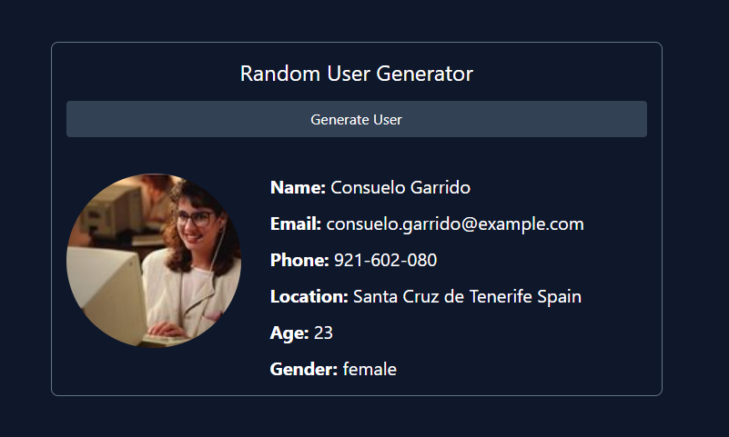

# 01-fetch-basics

# Fetch API

So you saw how we can use the `XMLHttpRequest` object to make HTTP requests. But there's a more modern way that's been added to the browser to make HTTP requests, called the `Fetch API`. It's a little bit easier to use than the `XMLHttpRequest` object. It's also more powerful. Fetch also provides a single logical place to define other HTTP-related concepts such as CORS and extensions to HTTP. We'll talk about that later, but right now, we're just going to learn how to make simple requests.

## How Fetch Works

`fetch()` is a method that only requires one argument, which is the URL or file path that you want to make the request to. It returns a `promise` that resolves to a `Response` object. The `Response` object contains the response from the server.

Let's make a request to get the data in the `movies.json` file. You know how to handle `promises` now, so you can use the `then` method to handle the response.

```js
fetch('./movies.json').then(function (response) {
  console.log(response);
});
```

You can use this syntax or you can use the arrow function syntax, which is what I prefer and probably what I will be using for the rest of the course.

It is important to note that this does not directly return the data or the JSON response body (in this case, movies) but instead returns a promise that resolves with a `Response` object with a bunch of properties. It includes stuff like the `status` of `200`, `statusText` of `ok`. It has a `body` property that contains a `ReadableStream` object. To extract the JSON data from the `Response` object, we return the `json()` method, which returns a second promise that resolves with the data that we're looking for.

Remember, when we chain `then` methods, the return value of the first `then` method is passed as an argument to the second `then` method. We can call that argument whatever we want, but in this case, we'll call it `data`.

```js
fetch('./movies.json')
  .then(function (response) {
    return response.json();
  })
  .then(function (data) {
    console.log(data);
  });
```

We can shorten this up using arrow functions and implicit returns. This is commonly what you'll see in the wild.

```js
fetch('./movies.json')
  .then((response) => response.json())
  .then((data) => console.log(data));
```

## Fetching Text

Usually we want to fetch JSON data, but just to show you it is possible, we can fetch plain text. Let's create a file named `test.txt` and just add some random text in it. We can use the `text()` method to get the text from the `Response` object.

```js
fetch('./test.txt')
  .then((response) => response.text())
  .then((data) => console.log(data));
```

## Fetching Data from an API

Now that we know how to make a request to a local file, let's make a request to an API. There are a ton of public APIs that we can use. Some of them do not require any type of authentication, but some of them do. You may need to register what we can an API key, and send that with your request. We'll talk about that later.

One of my favorite resources on the Web is this GitHub repo called [Public APIs](https://github.com/public-apis/public-apis). It's a list of public APIs that you can use in your projects. There are all kinds of categories and it tells you if there is any authentication required, if HTTPS is required and if there is a CORS policy, which we will talk about later.

Most public APIs will have documentation showing you which endpoints are available and what kind of data you can expect back as well as any operations that the API lets you run.

Let's try getting data from a couple APIs that don't require any authentication.

We've already looked at the public GitHub API in the last section. Let's make a request to the GitHub API to get information about a user. Feel free to replace my username with your own.

```js
fetch('https://api.github.com/users/bradtraversy')
  .then((response) => response.json())
  .then((data) => console.log(data));
```

Here is the response that we get back:

```json
{
  "login": "bradtraversy",
  "id": 1198226,
  "node_id": "MDQ6VXNlcjExOTgyMjY=",
  "avatar_url": "https://avatars.githubusercontent.com/u/1198226?v=4",
  "gravatar_id": "",
  "url": "https://api.github.com/users/bradtraversy",
  "html_url": ",
  "followers_url": "https://api.github.com/users/bradtraversy/followers",
  "following_url": "https://api.github.com/users/bradtraversy/following{/other_user}",
  "gists_url": "https://api.github.com/users/bradtraversy/gists{/gist_id}",
  "starred_url": "https://api.github.com/users/bradtraversy/starred{/owner}{/repo}",
  "subscriptions_url": "https://api.github.com/users/bradtraversy/subscriptions",
  "organizations_url": "https://api.github.com/users/bradtraversy/orgs",
  "repos_url": "https://api.github.com/users/bradtraversy/repos",
  "events_url": "https://api.github.com/users/bradtraversy/events{/privacy}",
  "received_events_url": "https://api.github.com/users/bradtraversy/received_events",
  "type": "User",
  "site_admin": false,
  "name": "Brad Traversy",
  "company": "Traversy Media",
  "blog": "http://www.traversymedia.com",
  "location": "Charleston, SC",
  "email": null,
  "hireable": null,
  "bio": "Full Stack Web Developer & Instructor",
  "twitter_username": "traversymedia",
  "public_repos": 185,
  "public_gists": 32,
  "followers": 10000,
  "following": 0,
  "created_at": "2012-09-30T15:36:51Z",
  "updated_at": "2021-03-31T20:19:57Z"
}
```

So we could use any of this data to display on our page.


---


# 02-random-user-mini-project

# Random User Generator Challenge

Before we move on to fetch options and making other types of requests, I want to do a mini project using the [Random User API](https://randomuser.me/). We are going to be able to click a button and fetch a random user and put their info on the page including their picture, name, email, phone, location, age and gender.



If you think you are ready to try this on your own, We already have the HTML and CSS for the project. You just need to add the JavaScript to add an event listener to the button, fetch the user and display them on the page. We'll be using the same HTML structure as the harcoded HTML, we will just replace the values with data coming from the API.

Alright, let's get started!

### Get Elements & Add Event Listener

First, we will get the generate button, the user result element and the loader element. Then we will add an event listener to the button.

```js
const generateBtn = document.querySelector('#generate');
const userEl = document.querySelector('#user');
const loadingEl = document.querySelector('#loading');

generateBtn.addEventListener('click', () => {
  console.log('Fetch User...);
});

```

Make sure that works by clicking the button and checking the console. You should see the message.

Now, let's make the request to the API endpoint, which is `https://randomuser.me/api/`.

```js
generateBtn.addEventListener('click', () => {
  fetch('https://randomuser.me/api/')
    .then((res) => res.json())
    .then((data) => {
      // console.log(data);
    });
});
```

You should see the data in the console. It is an array with a single object. We need to get the object out of the array. We can do that by using [0]:

```js
generateBtn.addEventListener('click', () => {
  fetch('https://randomuser.me/api/')
    .then((res) => res.json())
    .then((data) => {
      const user = data.results[0];
      console.log(user);
    });
});
```

Now, we can start displaying the user data on the page. You can basically copy everything that is in the `#user` div in the HTML and then add it to the `div` via JavaScript with the values from the API response:

```js
generateBtn.addEventListener('click', () => {
  fetch('https://randomuser.me/api/')
    .then((res) => res.json())
    .then((data) => {
      const user = data.results[0];

      userEl.innerHTML = `
      <div class="flex justify-between">
      <div class="flex">
        
        <div class="space-y-3">
          <p class="text-xl">
            <span class="font-bold">Name: </span>${user.name.first} ${user.name.last}
          </p>
          <p class="text-xl">
            <span class="font-bold">Email: </span> ${user.email}
          </p>
          <p class="text-xl">
            <span class="font-bold">Phone: </span> ${user.phone}
          </p>
          <p class="text-xl">
          <span class="font-bold">Location: </span> ${user.location.city} ${user.location.country}
        </p>
          <p class="text-xl"><span class="font-bold">Age: </span> ${user.dob.age}</p>
          <p class="text-xl">
            <span class="font-bold">Gender: </span>${user.gender}
          </p>
        </div>
      </div>
    </div>
      `;
    });
});
```

It's up to you if you want to remove the initial user from the HTML code. I left it, but commented it out.

### Show Loading Spinner

If you want to show the spinner, add a link to the stylesheet in the `head` tag right above the Tailwind CDN. Then add a function to show and hide the spinner. It is set to `display: none` in the CSS, so we will just change that to `display: block` when we want to show it:

```js
function showSpinner() {
  loadingEl.style.display = 'block';
}

function hideSpinner() {
  loadingEl.style.display = 'none';
}
```

Now, add it to the event listener:

```js
generateBtn.addEventListener('click', () => {
  showSpinner();

  fetch('https://randomuser.me/api/')
    .then((res) => res.json())
    .then((data) => {
      hideSpinner();
      const user = data.results[0];
      // console.log(data);

      userEl.innerHTML = `
      <div class="flex justify-between">
      <div class="flex">
        
        <div class="space-y-3">
          <p class="text-xl">
            <span class="font-bold">Name: </span>${user.name.first} ${user.name.last}
          </p>
          <p class="text-xl">
            <span class="font-bold">Email: </span> ${user.email}
          </p>
          <p class="text-xl">
            <span class="font-bold">Phone: </span> ${user.phone}
          </p>
          <p class="text-xl">
          <span class="font-bold">Location: </span> ${user.location.city} ${user.location.country}
        </p>
          <p class="text-xl"><span class="font-bold">Age: </span> ${user.dob.age}</p>
          <p class="text-xl">
            <span class="font-bold">Gender: </span>${user.gender}
          </p>
        </div>
      </div>
    </div>
      `;
    });
});
```

I prefer to break my code up into smaller functions. This is optional, but I'm going to create a function to fetch the user and another to display the user. I also like to put my event listeners at the bottom. Here is the final result:

```js
const generateBtn = document.querySelector('#generate');
const userEl = document.querySelector('#user');
const loadingEl = document.querySelector('#loading');

function fetchUser() {
  showSpinner();
  fetch('https://randomuser.me/api/')
    .then((res) => res.json())
    .then((data) => {
      hideSpinner();
      const user = data.results[0];
      displayUser(user);
    });
}

function displayUser(user) {
  userEl.innerHTML = `
      <div class="flex justify-between">
      <div class="flex">
        
        <div class="space-y-3">
          <p class="text-xl">
            <span class="font-bold">Name: </span>${user.name.first} ${user.name.last}
          </p>
          <p class="text-xl">
            <span class="font-bold">Email: </span> ${user.email}
          </p>
          <p class="text-xl">
            <span class="font-bold">Phone: </span> ${user.phone}
          </p>
          <p class="text-xl">
          <span class="font-bold">Location: </span> ${user.location.city} ${user.location.country}
        </p>
          <p class="text-xl"><span class="font-bold">Age: </span> ${user.dob.age}</p>
          <p class="text-xl">
            <span class="font-bold">Gender: </span>${user.gender}
          </p>
        </div>
      </div>
    </div>
      `;
}

function showSpinner() {
  loadingEl.style.display = 'block';
}

function hideSpinner() {
  loadingEl.style.display = 'none';
}

generateBtn.addEventListener('click', fetchUser);
```

That's it! Now we have a random user generator.

What I want to talk about next is error handling with the Fetch API.


---


# 03-fetch-options

# Fetch Options

When we make a request with the fetch API, the first parameter is the URL, but we can also pass in an object as the second parameter to add options to the request.

Some of the available options are:

- `method`: The HTTP method to use, such as `GET`, `POST`, `PUT`, `DELETE`, etc. By default it is `GET`.
- `headers`: An object containing any custom headers that you want to add to the request.
- `body`: The data to send with the request. If you are submitting form data for instance, you can send that data here. It can be a string, a `Blob`, a `BufferSource`, a `FormData`, a `URLSearchParams`, or a `USVString`.

There are others as well such as `mode`, `credentials`, `cache`, `redirect`, `referrer`, `referrerPolicy`, `integrity`, and `keepalive`. You can read more about them [here](https://developer.mozilla.org/en-US/docs/Web/API/WindowOrWorkerGlobalScope/fetch#parameters).

## JSONPlaceholder API

For this video and the next project, we will be using the [JSON Placeholder Fake REST API](https://jsonplaceholder.typicode.com/). This API gives us access to a bunch of different endpoints for resources like posts, users, todos, etc. 

It is a REST API, which adheres to specific standards when it comes to HTTP methods and how the endpoint URLs are structured. We will be using the blog post resource for this. These are the REST endpoints

- GET /posts **Fetch all posts**
- GET posts/1 **Fetch a post with the ID of 1**
- POST /posts **Add a new post**
- PUT /posts/1 **Update a post with the id of 1**
- DELETE /posts/1 **Delete a post with the id of 1**

Now, we can make the requests, just know that the data does not actualy persist into any database. So for instance, when we make a post request, we get a successful response, however the data does not stick because it is not actually saved in the database. They can't let the pubic add any data they want. There is a tool called `JSON Server` from this developer that we can use to store data locally. We will look at that later.

## Making a POST Request

By default, when we pass a URL into `fetch()` it will make a `GET` request. This is what we use if we want to retrieve data from a server. But what if we want to send data to the server? We can do that by passing in an object as the second parameter to `fetch()`. This object can contain options for the request, including the `method` option.

Let's make a POST request to the [JSON Placeholder](https://jsonplaceholder.typicode.com/) API. 

Usually, when we make a `POST` request, we send some form data to the server to create some kind of resource like a blog post, user, etc.

JSONPlaceholder has endpoints for creating posts, users, and comments. Let's make a `POST` request to create a new post.

```js
function createPost({ title, body }) {
  fetch('https://jsonplaceholder.typicode.com/posts', {
    method: 'POST',
    body: JSON.stringify({
      title,
      body,
    }),
    headers: {
      'Content-Type': 'application/json',
    },
  })
    .then((response) => response.json())
    .then((data) => console.log(data));
}

createPost({ title: 'My Post', body: 'This is my post' });
```

The `body` option is where we send the data to the server. We can send any kind of data here, but we need to make sure that the server knows what kind of data we are sending. We do this by setting the `Content-Type` header to the appropriate value. In this case, we are sending JSON data, so we set the `Content-Type` header to `application/json`. We also need to make sure that the data is in the correct format. In this case, we need to convert the data to a string using `JSON.stringify()`.

We can also add any custom headers that we wanted. For instance, the API may require you to authenticate and get a token and then send that token with a request to access a protected route.

```JavaScript
headers: {
    'Content-type': 'application/json; charset=UTF-8',
    'token': 'abc123'
  }
````

The server will respond with the data that we sent, but it will also add an `id` property to the object. This is the ID of the new post that was created.

If you open your DevTools and go to the `Network` tab, you will see all of the info about the request and response including the headers, payload, status and response.


---


# 04-typicode-todos-mini-project

# Typicode Todos Mini-Project

Ok, so in the last lesson, I showed you how to add options to your fetch request including the method, headers and body. I want to take that a little further with another mini project. We're going to use the [JSONPlaceholder API](https://jsonplaceholder.typicode.com). Here are the specs...

- Fetch the todos from https://jsonplaceholder.typicode.com/todos and put them on the page. We already have the HTML and CSS. I also want to be able to add a todo by making a POST request to the api and then adding the todo to the DOM. Now it's important to understand that this data will NOT persist. The API does not actually let us store data, so it will not stick. If we reload the page, any new todos that we added will go away. Later on I will show you another tool by this API developer called `JSON Server` which we can run locally and actually save the data. 

- All of the todos that have the property `completed: true`, will have a class of `.done`, which will give it a light gray background. 

- We click on the todo and it toggles the update value. This means we need to toggle the class in the DOM and make a PUT request to the API to update the `completed` value. Again, this will not stick because we can not actually update their data. It will give us the response though.

- We doouble click and send a DELETE request then delete the todo from the DOM.

## Getting and Displaying the Todos

Let's start by getting and displaying the todos

I am going to use an `init()` function for our event listeners

```JavaScript
const apiUrl = 'https://jsonplaceholder.typicode.com/todos';

function getTodos() {
  fetch(`${apiUrl}?_limit=5`)
    .then((res) => res.json())
    .then((data) => {
      data.forEach((todo) => {
      	const div = document.createElement('div');
        div.classList.add('todo');
	  	  div.appendChild(document.createTextNode(todo.title));
	  	  div.setAttribute('data-id', todo.id);

	  	  document.getElementById('todo-list').appendChild(div);
	  });
	});
}

function init() {
  document.addEventListener('DOMContentLoaded', getTodos);
}

init();
```

The code above will fetch the data and then loop through it and create a new `div` for each todo and add it to the list.

I added `?_limit=5` on to the end of our apiUrl. JSONPlaceholder allows this to limit the number of resources. I only want to get 5.

I added a custom `data` attribute called `data-id`. That is because we will need the id later. This will let us access it. When you create an attribute that does not exist in HTML, you should prefix it with `data-`. We can then access it later using the 'dataset' object.

## Add background for completed todos

To add a gray background, just check for the completed value and add the `done` class:

```JavaScript
if (todo.completed) {
	div.classList.add('done');
}
```

## Create seperate function to add todo to DOM
When we create a todo, we will also add it to the DOM, so let's create a function for that

```JavaScript
function addTodoToDOM(todo) {
  const div = document.createElement('div');
  div.classList.add('todo');
  div.appendChild(document.createTextNode(todo.title));
  div.setAttribute('data-id', todo.id);

  if (todo.completed) {
    div.classList.add('done');
  }

  document.getElementById('todo-list').appendChild(div);
}
```

Now add it to the foreach in `getTodos()`

```JavaScript
function getTodos() {
  fetch(`${apiUrl}?_limit=5`)
    .then((res) => res.json())
    .then((data) => {
      data.forEach((todo) => addTodoToDOM(todo));
    });
}
```

## Create a todo

Now, let's add the event listener and the `createTodo()` function

```JavaScript
function createTodo(e) {
  e.preventDefault();

  const newTodo = {
    title: e.target.firstElementChild.value,
    completed: false,
  };
  fetch(apiUrl, {
    method: 'POST',
    body: JSON.stringify(newTodo),
    headers: {
      'Content-Type': 'application/json',
      token: 'abc123',
    },
  })
    .then((response) => response.json())
    .then((data) => addTodoToDOM(data));
}

function init() {
  document.addEventListener('DOMContentLoaded', getTodos);
  document.getElementById('todo-form').addEventListener('submit', createPost);
}

init();
```

## Update completed field

Let's make it so we can click on a todo and update the `completed` field. Again, this will go away on refresh because it does not persist to the database of the API.

```JavaScript
function toggleComplete(e) {
  if (e.target.classList.contains('todo')) {
    e.target.classList.toggle('done');
    updateTodo(e.target.dataset.id, e.target.classList.contains('done'));
  }
}

function updateTodo(id, completed) {
  fetch(`${apiUrl}/${id}`, {
    method: 'PUT',
    body: JSON.stringify({ completed }),
    headers: {
      'Content-Type': 'application/json',
    },
  })
    .then((res) => res.json())
    .then((data) => console.log(data));
}

function init() {
  document.addEventListener('DOMContentLoaded', getTodos);
  document.getElementById('todo-form').addEventListener('submit', createTodo);
  document
    .getElementById('todo-list')
    .addEventListener('click', toggleComplete);
}

init();
```

## Delete a todo
Let's add a double click event listener and handler to remove the Todo. We will make a DELETE request and get a resonse, but it will not stick.

```JavaScript
function deleteTodo(e) {
  if (e.target.classList.contains('todo')) {
    const id = e.target.dataset.id;
    fetch(`${apiUrl}/${id}`, {
      method: 'DELETE',
    })
      .then((res) => res.json())
      .then(() => e.target.remove());
  }
}


function init() {
  document.addEventListener('DOMContentLoaded', getTodos);
  document.getElementById('todo-form').addEventListener('submit', createTodo);
  document
    .getElementById('todo-list')
    .addEventListener('click', toggleComplete);
  document.getElementById('todo-list').addEventListener('dblclick', deleteTodo);
}

init();

```

Here is the final code:

```JavaScript
const apiUrl = 'https://jsonplaceholder.typicode.com/todos';

function getTodos() {
  fetch(`${apiUrl}?_limit=5`)
    .then((res) => res.json())
    .then((data) => {
      data.forEach((todo) => addTodoToDOM(todo));
    });
}

function createTodo(e) {
  e.preventDefault();

  const newTodo = {
    title: e.target.firstElementChild.value,
    completed: false,
  };
  fetch(apiUrl, {
    method: 'POST',
    body: JSON.stringify(newTodo),
    headers: {
      'Content-Type': 'application/json',
      token: 'abc123',
    },
  })
    .then((response) => response.json())
    .then((data) => addTodoToDOM(data));
}

function addTodoToDOM(todo) {
  const div = document.createElement('div');
  div.appendChild(document.createTextNode(todo.title));
  div.setAttribute('data-id', todo.id);

  if (todo.completed) {
    div.classList.add('done');
  }

  document.getElementById('todo-list').appendChild(div);
}

function toggleComplete(e) {
  e.target.classList.toggle('done');
  updateTodo(e.target.dataset.id, e.target.classList.contains('done'));
}

function updateTodo(id, completed) {
  fetch(`${apiUrl}/${id}`, {
    method: 'PUT',
    body: JSON.stringify({ completed }),
    headers: {
      'Content-Type': 'application/json',
    },
  })
    .then((res) => res.json())
    .then((data) => console.log(data));
}

function deleteTodo(e) {
  const id = e.target.dataset.id;
  fetch(`${apiUrl}/${id}`, {
    method: 'DELETE',
  })
    .then((res) => res.json())
    .then(() => e.target.remove());
}

function init() {
  document.addEventListener('DOMContentLoaded', getTodos);
  document.getElementById('todo-form').addEventListener('submit', createTodo);
  document
    .getElementById('todo-list')
    .addEventListener('click', toggleComplete);
  document.getElementById('todo-list').addEventListener('dblclick', deleteTodo);
}

init();

```


---


# 05-fetch-api-error-handling

# Fetch API Error Handling

In this lesson, I want to talk about error handling in the Fetch API. There are a couple things that you may not expect. It is important to understand the main HTTP status codes and what they mean, because it is important that you understand your API's response. So let's recap on the most common ones.

The `200` range is for successful responses.

- 200 - OK
- 201 - Created
- 204 - No Content

The `400` range is for client errors. This means that the request was not understood by the server.

- 400 - Bad Request
- 401 - Unauthorized
- 403 - Forbidden
- 404 - Not Found

The `500` range is for server errors. This means that the server encountered an error while processing the request.

- 500 - Internal Server Error

The most common of the common will be `200`, `404` and `500`. So let's look at how we can handle these in the Fetch API.

We can use the website [httpstat.us](http://httpstat.us) to send requests to and get a specific status code. Let's try it out.

```js
fetch('http://httpstat.us/200')
  .then((response) => {
    return response;
  })
  .then((data) => {
    console.log('Success');
  });
```

If you run this, you should see 'Success' logged to the console. Let's try a `404` now.

```js
fetch('http://httpstat.us/404')
  .then((response) => {
    return response;
  })
  .then((data) => {
    console.log('Success');
  });
```

A `404` is not a successful response. It means what we are requesting is not there. However, we are still seeing 'Success' logged to the console.

Let's try adding a `catch` to the end of the chain. Remember, a `catch` will catch any errors that occur in the chain. So let's try it.

```js
fetch('http://httpstat.us/404')
  .then((response) => {
    return response;
  })
  .then((data) => {
    console.log('Success');
  })
  .catch((error) => {
    console.log('Error:', error);
  });
```

Nothing happens. The `catch` is not called. This is because the `fetch` request itself was successful. The `catch` will only be called if there is a network error. So if we make a request to a URL that doesn't exist, we will see the `catch` called. let's try this:

```js
fetch('http://hello123.net')
  .then((response) => {
    return response;
  })
  .then((data) => {
    console.log('Success');
  })
  .catch((error) => {
    console.log('Error:', error);
  });
```

This does result with the `catch` being called. So we can use the `catch` to handle network errors. But what about the `404` or any other unsuccessful response? We want to handle that as well. We can do this by checking the `status` of the response and then throwing an error if we need to. Let's try it out.

```js
fetch('http://httpstat.us/404')
  .then((response) => {
    if (response.status !== 200) {
      throw new Error('Not 200 response');
    }
    return response;
  })
  .then((data) => {
    console.log('Success');
  })
  .catch((error) => {
    console.log('Error:', error);
  });
```

So we looked at the `status` of the response and if it is not `200`, we throw an error. `throw` is a keyword that will stop the chain and call the `catch` with the error that we throw. So now we are seeing the `catch` called with the error that we threw. Try a `200` response and you will see the `then` called. If you try a `500` response or anything but `200`, you will see the `catch` called.

If you want to check for specific status codes, you can use `else if` statements:

```js
fetch('http://httpstat.us/400')
  .then((response) => {
    if (response.status === 404) {
      throw new Error('Not found');
    } else if (response.status === 400) {
      throw new Error('Bad request');
    } else if (response.status === 500) {
      throw new Error('Server error');
    } else if (response.status !== 200) {
      throw new Error('Not 200 response');
    }
    return response;
  })
  .then((data) => {
    console.log('Success');
  })
  .catch((error) => {
    console.log('Error:', error);
  });
```

There are other **success** status codes that you may want to handle. For example, `201` is a successful response that means a resource was created. You may want to handle this differently than a `200` response. You can do this by adding another `else if` statement. Let's try it out.

```js
fetch('http://httpstat.us/404')
  .then((response) => {
    if (response.status >= 200 && response.status <= 299) {
      throw new Error('Not 200 response');
    }
    return response;
  })
  .then((data) => {
    console.log('Success');
  })
  .catch((error) => {
    console.log('Error:', error);
  });
```

There is also an `ok` property on the response object. This is a boolean that is `true` if the status is in the `200` range. So we can use this as well:

```js
fetch('http://httpstat.us/400')
  .then((response) => {
    if (!response.ok) {
      throw new Error('Something went wrong');
    }
    return response;
  })
  .then((data) => {
    console.log('Success');
  })
  .catch((error) => {
    console.log('Error:', error);
  });
```

## Add error handling to project

The random user API is pretty simple. We most likely won't get a 404 or 500 error. But we can still add some error handling. Let's add a `catch` to the end of the chain and show a message if there is an error.

```js
function fetchUser() {
  showSpinner();
  fetch('https://randomuser.me/api/')
    .then((res) => {
      if (res.status !== 200) {
        throw new Error('Something went wrong');
      }
      return res.json();
    })
    .then((data) => {
      hideSpinner();
      const user = data.results[0];
      displayUser(user);
    })
    .catch((error) => {
      hideSpinner();
      userEl.innerHTML = `<p class="text-xl text-center text-red-500 mb-5">${error}</p>`;
    });
}
```

Now try and change the URL to `https://randomuser.me/api1/`. Now this would still run the catch even without the check because it doesn't exist, but the check is there to show for specific status codes and makes your code more less error prone.


---


# 06-async-await

# Async / Await

Now that we know how about promises, I want to show you an alternate way to consume them called `Async & Await`. We already saw that we can use the `.then()` method to handle the promise. That method is cleaner than the callback syntax, but it can get a little messy when you have a lot of nested `.then()` methods. That's where `Async & Await` comes in. It allows us to write asynchronous code that looks synchronous. It's also a lot easier to read and understand.

Let's take the first promise that we created a while ago and convert it to use `Async & Await`.

```js
const promise = new Promise(function (resolve, reject) {
  // Do an async task
  setTimeout(function () {
    let error = false;

    if (!error) {
      resolve({ name: 'John', age: 30 });
    } else {
      reject('Error: Something went wrong');
    }
  }, 1000);
});
```

So this code will create a promise that resolves after 1 second. I'll use the `.then()` syntax for comparison:

```js
promise.then((data) => {
  console.log(data);
});
```

When we use `Async & Await`, we create a function that is prefixed with the `async` keyword. We can then use the `await` keyword in front of any promise. This will pause the execution of the function until the promise is resolved. Once the promise is resolved, we can store the result in a variable.

```js
async function getPromise() {
  const response = await promise;
  console.log(response);
}

getPromise();
```

As you can see, this does the same exact thing, but it's a lot easier to read and understand. It reads like a normal synchronous function. We simply add the `async` keyword to the function, and then we use the `await` keyword in front of the promise. It is important to stress that you will not be able to use the `await` keyword outside of an `async` function. If you try it, you will get an error.

## Async / Await with Fetch

Using Async/Await with the Fetch API is very similar. We'll create a function that is prefixed with the `async` keyword. We'll then use the `await` keyword in front of the `fetch()` method. This will pause the execution of the function until the promise is resolved. Once the promise is resolved, we can store the result in a variable.

You can use any API, but I'm going to use the `users` endpoint from https://jsonplaceholder.typicode.com.

```js
async function getUsers() {
  const response = await fetch('https://jsonplaceholder.typicode.com/users');
  const data = await response.json();

  console.log(data);
}

getUsers();
```

Now, remember the Fetch API returns the initial `Response` object. We can't get the JSON data from that object directly. We need to use the `.json()` method on the response object. This will return another promise, so we need to use the `await` keyword again. Once the promise is resolved, we can store the result in a variable.

Let's make it a bit more interesting and show the users on the page. I know this is not a DOM lesson, but I want to make sure I keep you on your toes.

Add a `div` with an `id` of `output` to the `index.html` file.

```html
<div id="output"></div>
```

Then edit your `getUsers()` function

```js
async function getUsers() {
  const response = await fetch('https://jsonplaceholder.typicode.com/users');
  const data = await response.json();

 console.log(data);
}

getUsers();
```

## Using Async / Await with Arrow Functions

When we use arrow functions, the `async` keyword goes before the arrow. Here is the same function as above, but using an arrow function.

```js
const getUsers2 = async () => {
  const response = await fetch('https://jsonplaceholder.typicode.com/users');
  const data = await response.json();

 console.log(data);
};

getUsers2();
```

## Do I need to use Async/Await?

No, you don't need to use Async/Await. It's just another way to consume promises. It's a lot easier to read and understand, but it's not required. You can use the `.then()` method if you want. I almost never use the `.then()` method. I think it's a lot easier to read and understand the `Async & Await` syntax. We'll mostly be using the `Async & Await` syntax for the rest of the course. If you'd like to use the `.then()` method, you can. It's just a matter of preference.

Next, let's look at how to handle errors using `try/catch`.


---


# 07-try-catch

# Try...Catch

A try...catch statement is used to handle errors in JavaScript. It is a syntax that allows you to write code that will run if an error occurs, and code that will run if no error occurs. The reason that I am choosing to cover this now is because it is how we usually handle errors with Async & Await. With the `.then()` syntax, we can use the `.catch()` method, which you could use with Async/Await if you want, but usually to handle errors. With Async & Await, we use a try...catch statement. I will get into using it with Async & Await in the next lesson.

Let's start off by just logging a variable that does not exist:

```js
console.log(x);
```

If we run this code, we will get an error in the console:

```bash
Uncaught ReferenceError: x is not defined
```

Notice how it says `uncaught`? Let's wrap this code in a try...catch statement:

The basic syntax is as follows:

```js
try {
  // Try to execute this code
} catch (error) {
  // If an error occurs, execute this code
}
```

Let's add the console.log and also log any errors:

```js
try {
  console.log(x);
} catch (error) {
  console.log('Error:', error);
}
```

Now, if we run this code, we will see the error in the console:

```bash
Error: ReferenceError: x is not defined
```

So we still get the same message, but it does not say `uncaught`. This is because we are handling the error.

## When To Use Try...Catch

There is no reason to fill your code with try...catch statements. You should use a try...catch statement when you are doing something that may result in an error and you plan on handling that error. For example, if you are making an API request and you are not sure if the request will succeed, you can use a try...catch statement to handle the error if it occurs. We can then do something with the error, like display it on the page:

```js
try {
  console.log(x);
} catch (error) {
  document.body.append(error);
}
```

There may be times where you do some kind of check and then want to throw an error if the check fails. For example, let's say we have a function that takes in a number and doubles it. We want to make sure that the argument is a number.

```js
function double(number) {
  if (isNaN(number)) {
    throw new Error(number + ' is not a number');
  }

  return number * 2;
}
```

Let's try to call this function with a string inside a try...catch statement:

```js
try {
  const y = double('a');
} catch (error) {
  console.log(error);
}
```

We get the following error, which we can now do whatever we want with:

```bash
Error: a is not a number
```

## Finally Block

The finally block is a block of code that will always run, regardless of whether an error occurs or not. It is very similar to the `.finally()` method that we can use with `.then()`.

Let's say we want to log a message after the try...catch statement runs. We can do this with the finally block:

```js
try {
  const y = double('a');
} catch (error) {
  console.log(error);
} finally {
  console.log('This will always run');
}
```

In the next video, we will look at how to use try...catch with Async & Await.


---


# 08-async-await-error-handling

# Async/Await Error Handling

In the last lesson, we looked at how to use try...catch statements. In this lesson, we will look at how to use try...catch with Async & Await.

Let's use the same `getUsers()` example from the other lesson. I'll use the arrow function version:

```js
const getUsers = async () => {
  const response = await fetch('https://jsonplaceholder.typicode.com/users');
  const data = await response.json();

  document.querySelector('#output').innerHTML = data
    .map(
      (user) => `
    <li>${user.name}</li>
  `
    )
    .join('');
};

getUsers();
```

Remember, with the fetch API, if we want to handle status codes like 404, we need to check the `status` or `ok` property on the response object.

In that case, we will throw an error:

```js
const getUsers = async () => {
  const response = await fetch('http://jsonplaceholder.typicode.com/users');

  // Add this
  if (response.status !== 200) {
    throw new Error('Something went wrong');
  }

  const data = await response.json();

  document.querySelector('#output').innerHTML = data
    .map(
      (user) => `
    <li>${user.name}</li>
  `
    )
    .join('');
};

getUsers();
```

In order to catch and use that error, we can use a try...catch statement. Let's also change the URL to something that will return a 404 error.

```js
const getUsers = async () => {
  try {
    // const response = await fetch('http://jsonplaceholder.typicode.com/users');
    const response = await fetch('http://httpstat.us/404');

    if (response.status !== 200) {
      throw new Error('Something went wrong');
    }

    const data = await response.json();

    document.querySelector('#output').innerHTML = data
      .map(
        (user) => `
    <li>${user.name}</li>
  `
      )
      .join('');
  } catch (error) {
    document.querySelector('#output').innerHTML = error;
  }
};

getUsers();
```

And remember from the earlier lesson, you can check for specific responses and give specific error messages if you want.

Again, you do not always have to use `try...catch`, just like you don't always need to use a `then...catch`. It depends on your use case.


---


# 09-async-await-multiple-promises

# Async / Await With Multiple Promises

So we know that we can chain promises together using multiple `.then()` methods. We can also use promise.all to wait for multiple promises to resolve. But what about using async / await to wait for multiple promises to resolve?

Let's look at our `getData()` function from a past lesson.

```js
function getData(endpoint) {
  return new Promise((resolve, reject) => {
    const xhr = new XMLHttpRequest();
    xhr.open('GET', endpoint);

    xhr.onreadystatechange = function () {
      if (this.readyState === 4) {
        if (this.status === 200) {
          resolve(JSON.parse(this.responseText));
        } else {
          reject('Error: Something went wrong');
        }
      }
    };

    setTimeout(() => {
      xhr.send();
    }, Math.floor(Math.random() * 3000) + 1000);
  });
}
```

It fetches data from an endpoint and returns a promise. It can take anywhere from 1 to 4 seconds to resolve. I first showed you how to do this with callbacks, then with promises and chaining `.then()` methods, and now we're going to do it with async / await.

Just for reference, let's look at how we did this with promise chaining.

```js
getData('./movies.json')
  .then((movies) => {
    console.log(movies);
    return getData('./actors.json');
  })
  .then((actors) => {
    console.log(actors);
    return getData('./directors.json');
  })
  .then((directors) => {
    console.log(directors);
  });
```

We returned a value from each `.then()` method, and that value was passed to the next `.then()` method. This is ok. It looks better than callbacks, but it's still a little messy. We can do better.

```js
async function getAllData() {
  const movies = await getData('./movies.json');
  console.log(movies);
  const actors = await getData('./actors.json');
  console.log(actors);
  const directors = await getData('./directors.json');
  console.log(directors);
}

getAllData();
```

Or even better:

```js
async function getAllData() {
  const movies = await getData('./movies.json');
  const actors = await getData('./actors.json');
  const directors = await getData('./directors.json');
  console.log(movies, actors, directors);
}

getAllData();
```

We were able to use async / await to wait for multiple promises to resolve and it looks much nicer. We also have access to the data from each promise in the same scope.

## Using `fetch` instead of `XMLHttpRequest`

In the `getData()` function, we used the `XMLHttpRequest` object to fetch data from an endpoint. We could also use the `fetch()` API to do the same thing and get rid of the `getData()` function completely.

```js
async function getAllDataWithFetch() {
  const moviesRes = await fetch('./movies.json');
  const movies = await moviesRes.json();

  const actorsRes = await fetch('./actors.json');
  const actors = await actorsRes.json();

  const directorsRes = await fetch('./directors.json');
  const directors = await directorsRes.json();

  console.log(movies, actors, directors);
}

getAllDataWithFetch();
```

There is no returning from `.then()` methods. The code looks synchronous, but it's not. It's still asynchronous. We're just using async / await to make it look synchronous.

## `Promise.all()`

We can also still use `Promise.all()` to wait for multiple promises to resolve.

```js
async function getAllDataWithPromiseAll() {
  const [moviesRes, actorsRes, directorsRes] = await Promise.all([
    fetch('./movies.json'),
    fetch('./actors.json'),
    fetch('./directors.json'),
  ]);

  const movies = await moviesRes.json();
  const actors = await actorsRes.json();
  const directors = await directorsRes.json();

  console.log(movies, actors, directors);
}

getAllDataWithPromiseAll();
```

If you want, you can still use `.then()` on the response promise to get the data:

```js
async function getAllDataWithPromiseAll2() {
  const [movies, actors, directors] = await Promise.all([
    fetch('./movies.json').then((response) => response.json()),
    fetch('./actors.json').then((response) => response.json()),
    fetch('./directors.json').then((response) => response.json()),
  ]);

  console.log(movies, actors, directors);
}

getAllDataWithPromiseAll2();
```
