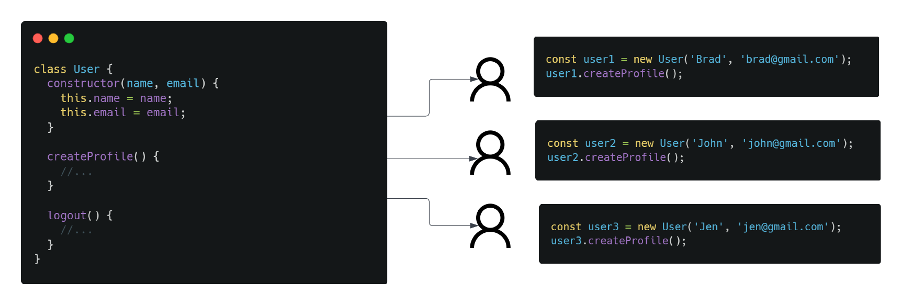
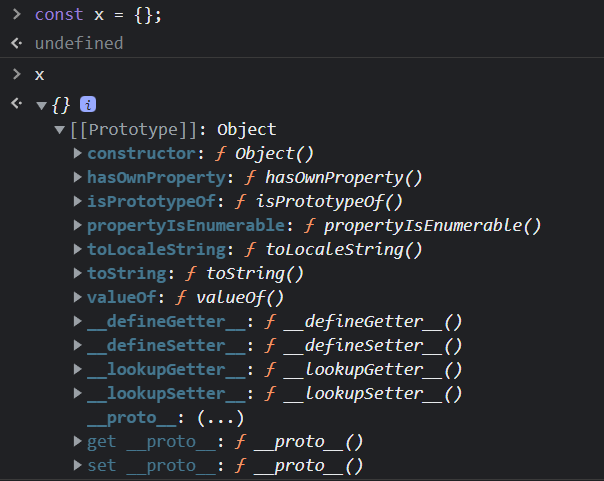
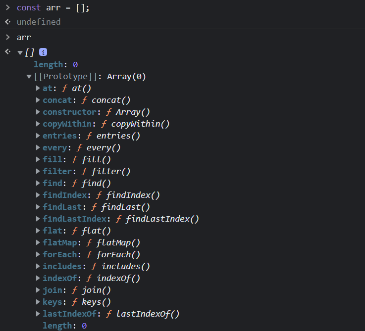
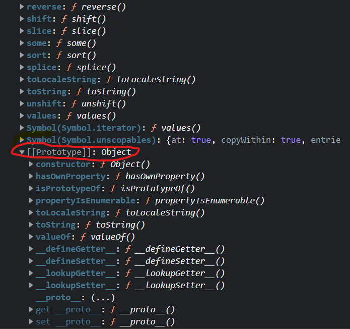
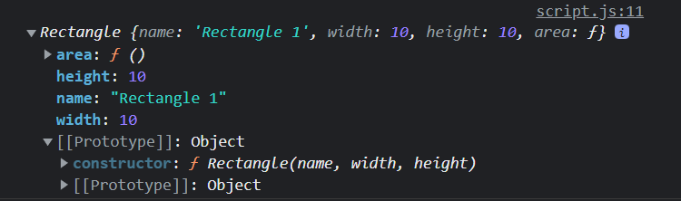
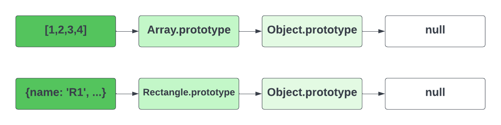
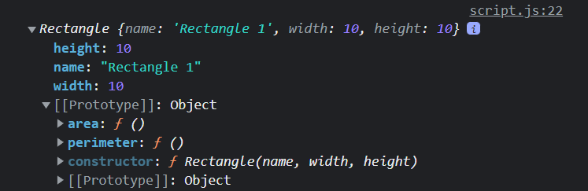

# 01-what-is-oop

# What Is OOP?

Now we're going to get into `Object Oriented Programming` or `OOP` using JavaScript. The way that we write object-oriented code with JavaScript is a little different than some other languages and even a bit controversial and I will get to that soon, but first, I want to talk about what OOP actually is outside of specific languages.

`OOP` is a **programming paradigm**. In short, a programming paradigm is a way of thinking about programming, and a way of structuring your code. You could dumb it down to the word "style". There are many different programming paradigms and certain languages are built for certain paradigms. The most common are `procedural`, `object-oriented` and `functional`. You can read more about paradigms [here](https://www.freecodecamp.org/news/what-exactly-is-a-programming-paradigm/)

What we have been doing so far is mostly `procedural` programming, although, we have definitely used some elements of `OOP` and even `functional` programming. JavaScript is an extremlet flexible language and you can do things in many different ways. Which can be a good thing, because you have a lot of freedom, but it can be bad because it can get really confusing and also cause you to sometimes write code that isn't that great. In `procedural` programming, we write functions that perform actions, and we call those functions to perform those actions. In `object-oriented` programming, we write objects that contain both data and functions, and we interact with those objects to perform actions. Some languages force you to write all of your code within objects.

## What Is An Object?

An object is a 'self-contained' piece of code and is a collection of properties, and a property is an association between a name (or key) and a value. A property's value can be a function, in which case the property is known as a method. So, essentially, an object is a **collection of properties and methods**. Objects are used as building blocks and can interact with one another.

We have already had some experience working with objects such as `Math` and `Date`. In fact, just about everything in JavaScript is an object. Primitive data types like strings are not objects, however they are treated like objects when we use methods like `toUpperCase()`. As I stated earlier in the course, when we use a method like that on a string, JavaScript is actually creating a temporary object behind the scenes to perform the action. This is called a `wrapper object`.

JavaScript has many was to create objects incliding object literals, constructor functions, which we'll be covering soon, classes, factories, etc.

Any entity in your application could be an object. For example, if you are building a blog, you might use objects like `users` and `posts`. Just to give you a better idea of what would be looked at as an object, here is a list of random objects:

- `user`
- `post`
- `comment`
- `UI component`
- `product`
- `order`
- `cart`
- `customer`
- `employee`
- `message`
- `book`

## Why Use OOP?

There are a lot of reasons to use OOP for certain projects, but the main reason is that it makes your code easier to understand and easier to maintain. It helps prevent what we call 'Spaghetti Code`. OOP is also very flexible and can be used to build complex applications. It is also very easy to reuse code in OOP, which is one of the main reasons why it is so popular.

## When To Use OOP

Where OOP really shines and makes sense is when you are building a complex application and will need multiple instances of an object. It's also helpful if youre working on a team. If you are building a relatively simple application, you probably should not use OOP. For the stuff that we have done up to this point, I would not use it. And when I say I would not use OOP, I mean I wouldnt create custom classes or constructor functions. In JavaScript, we're always using objects, so we're always using some aspect of OOP.

## Components of OOP

Technically we have created objects many times as we have been using `object literals`. However, I wouldn't call that `OOP`. We've just been using object literals to create a single object and structure data into key/value pairs. With OOP, we create blueprints to create multiple instances of an object. 

Now OOP within JavaScript is a bit differen than most languages. A lot of that has to do with the inner mechanics and the browser environment. In JavaScript, we use something called `constructor functions` as well as `prototypes`. With these we can create blueprints to create objects. Most languages use `classes`. JavaScript doesn't use classes in the core language, however, the ES6 update gave us the class syntax. THis is called `syntactic sugar`. So we have the easier to write class syntax, but it's really using constructors and prototypes under the hood. I'm going to show you both ways.


Some important components of OOP in JavaScript are:

- `Constructor Functions` Are the way that JavaScript creates a blueprint for an object.
- `Prototypes` A way for objects to inherit properties and methods from one another.
- `Classes` Another way to create a blueprint for an object. They are not a part of the core JavaScript language, but they are a part of the `ES6` specification. So we can use classes as a type of syntactic sugar to make our code easier to read and write. Classes are a core part of many other languages.
- `Instances` Objects are instantiated from a blueprint like a constructor or a class. This way we can create multiple objects that all have their own property values and can share the same methods.

Below is an example of a very simple class. I'm not showing you this to teach you the syntax yet, I'm just showing you this to give you some perspective of how OOP works. This class is essentially a blueprint for an object and it includes properties and methods. We can use that blueprint to create what are called `instances` of that object. in this case, users.



The class alone is just the blueprint. It's useless in our code if we don't use it. You can think of it just like a blueprint for a house. The blueprint is just a piece of paper, it's not a house. We have to use the blueprint to build the house. In this case, the blueprint is for a user and each user is the actual object. We can create as many users as we want using the blueprint.

Now like I said, JavaScript doesn't actually have classes in the core language, it uses something called`constructor functions` and `prototypes`, but we can still write our code using classes and it get's transpiled into regular JavaScript. We will talk about both constructors, prototypes and classes in more detail later.

In the next lesson, I just want to go over some of the main principles of OOP.


---


# 02-basic-principles

# The 4 Basic Principles Of OOP

There are 4 basic principles of OOP that you should know about.

- Abstraction
- Encapsulation
- Inheritance
- Polymorphism

These principles are the foundation of OOP and are used in almost every OOP language. Right now, you are not expected to know how to implement these principles in your code. You will learn that later. For now, just know what they are and what they do.

## Abstraction

Abstraction is where we hide all but the relevant parts of an object in order to reduce complexity and increase efficiency.

The easiest way to explain and understand abstraction is to look at something like your car. As a user, do you really need to understand the details of what happens when you start your car? No, that's not your job. You don't need to know how it works. You just need to know how to use it. So you need to know about the ignition, gas, brakes, etc. You don't need to know how the fuel pump works to drive a car. That's abstraction. It's the process of hiding the details of how something works and only showing the the important parts.

Since objects can get pretty large and complex, it's not usually possible to show the user all the details of how the object works. There also is no reason to. The user of the object should only see and access what they need.

We deal with abstraction everywhere in programming. There are 100 things that I can think of that we have already done in this course that have used abstraction. For example, when we create an event listener, we use the `fetch()` method. We don't need to know exactly how it works. We just need to know how to use it. Even the public APIs that we have used also have a lot of abstraction. We just hit an endpoint. We have no clue what goes on behind the scenes. Another example is when we're working with events and call `addEventListener()` method. We don't need to know how the event listener works. We just need to know how to use it. As a programmer, you'll both use and create abstractions.

One of the most useful things about abstraction is that is reduces the complexity of our code and the impact of change. If we have a class of `User` and we want to add a new property, we don't have to change the code everywhere that we use the `User` class. We can just add the new property to the class and it will be available everywhere.

## Encapsulation

Encapsulation is the process of wrapping up data and methods into a single unit such as a class or function. This concept is also often used to hide the properties or state of an object from the outside. This is called information hiding or data hiding. When we create a class for example, the properties and methods are 'encapsulated' into that specific class. This is a way to keep our code organized and easy to understand. It also means that certain properties and methods are only accessible from within the class. Some languages have access modifiers like `private` and `public` keywords to indicate which properties and methods are accessible from the outside. JavaScript doesn't have those keywords, but the latest ES2022 update does include private fields using a `#` symbol. We'll look at that later.

I don't expect you to understand this example yet, but it uses encapsulation. The `radius` property is encapsulated into the `Circle` class. We can't access the `radius` property from outside the `Circle` class. So it's hidden from the outside world. We can access the `area` property from outside the class with what we call a `getter`. 

```js
class Circle {
  #radius;
  constructor(value) {
    this.#radius = value;
  }
  get area() {
    return Math.PI * Math.pow(this.#radius, 2);
  }
}
```

I know this is confusing now, but after the next two sections, you'll fully understand this. Another example of encapsulation that you should already understand is the scope chain. When we create a variable within a function, it's encapsulated in that functions scope. We can't access it from the global or any higher level scope.


## Inheritance

Inheritance is the process of inheriting the properties and methods from a parent class. This is a way to reuse code and reduce redundancy. We can create a parent class with some properties and methods, and then create child classes that inherit those properties and methods as well as have their own.

Even when we work with elements in the DOM, all HTML elements share some common properties and methods. For example, all HTML elements have a `style` property and a `addEventListener()` method. We can create a parent class of `HTMLElement` that has those properties and methods. Then we can create child classes of `HTMLButtonElement`, `HTMLDivElement`, etc. that inherit those properties and methods. Now, we can create instances of the `HTMLButtonElement` class and use the `style` property and the `addEventListener()` method.

To give you a very simple example, we have a class of `User` that has a property of `name` and a method of `sayHello()`. We can create a child class called `Admin` that inherits the `name` property and the `sayHello()` method. We can then add a new method to the `Admin` class called `deleteUser()`. Now, we can create an instance of the `Admin` class and use the `name` property, the `sayHello()` method, and the `deleteUser()` method.

```js
class User {
  constructor(name) {
    this.name = name;
  }
  sayHello() {
    console.log(`Hello, my name is ${this.name}`);
  }
}

class Admin extends User {
  deleteUser(user) {
    users = users.filter((u) => u.name !== user.name);
  }
}
```

## Polymorphism

Polymorphism is a scary word, but it's not that intimidating when  you break it down. The word `poly` means `many` and `morph` means `form`. SO it describes situations in which something occurs in several different forms. This is a way to reuse code. It allows us to do away with long `if/else` or `switch` statements and use a single method that will work for different types of objects. A very common example of polymorphism is when we use the same method name for different types of objects.

For instance, we have a `User` object with a `sayHello` method. Then we have an `Admin` class that extends the `User` class and also has a sayHello method that does something different. We could have 10 more classes with a `sayHello` and they all do something different. So we're using **many forms** of `sayHello` (poly morph)

```js
class User {
  constructor(name) {
    this.name = name;
  }index.
  sayHello() {
    console.log(`Hello, my name is ${this.name}`);
  }
}
class Admin extends User {
  sayHello() {
    console.log(`Hello, my name is ${this.name}. I am an admin.`);
  }
}
```

So those are about the simplest way I can explain the 4 principles. As we move through the next dozen or so videos, these will come into perspective.


---


# 03-object-literals-and-this-keyword

We have been working with `object literals` throughout this course. They are the simplest form of an object and great when you only need one instance of an object, which is usually the case when building simple applications. But what if you need to create multiple instances of an object? That's where `constructor functions` come in, which I will get to soon. But first, let's look at `object literals` a little closer. I also want to talk about the `this` keyword, which is used a lot in object oriented programming.

Let's say that we have a program that works with shapes, for whatever reason. I want to create a `Rectangle` object. So I'll use an object literal in this case. Let's give it some properties.

```js
const rect = {
  name: 'Rectangle 1',
  width: 10,
  height: 10,
};
```

We can easily access properties with dot notation.

```js
console.log(rect.name); // Rectangle 1
```

This is nothing new right? We've been doing stuff like this all along. One thing that we haven't done is added a method to an object literal. Let's add a method to our `Rectangle` object that calculates the area of the rectangle.

```js
const rect = {
  name: 'Rectangle 1',
  width: 10,
  height: 10,
  area: function () {
    console.log('Show area');
  },
};
```

We can call the method like this:

```js
rect.area(); // Show area
```

## `this` keyword

The `this` keyword is used to refer to the current object. Let's have our `area` method return the area of the rectangle, which would be `width * height`.

```js
const rect = {
  name: 'Rectangle 1',
  width: 10,
  height: 10,
  area: function () {
    return this.width * this.height;
  },
};

console.log(rect.area()); // 100
```

As you can see, we can access the properties of the object using `this`. This is very useful when you have multiple objects that have the same properties and methods. You can use the `this` keyword to access the properties of the current object.

The `this` keyword seems to be confusing to a lot of people. It's actually pretty simple. It just refers to the current object. If you are in a method, it refers to the object that the method is part of. If you are in a function or the global scope, it refers to the global object, which is the `window` object in the browser.

Let's go outside of the object literal and try to access the `this` keyword.

```js
console.log(this); // Window {parent: Window, opener: null, top: Window, length: 0, frames: Window, …}
```

It gives us the window object. Remember, when we run our script, the first thing that the `execution context` does is create the `global object`, which is the `window` object in the browser. So `this` refers to the `window` object.

## Object Literal Drawbacks

There are a few drawbacks to using object literals. The first is that you can't create multiple instances of the same object. Let's say that we want to create another rect object. We can't do this with an object literal. We need to basically just create a new one from scratch.

```js
const rect2 = {
  name: 'Rectangle 2',
  width: 20,
  height: 20,
  area: function () {
    return this.width * this.height;
  },
};

console.log(rect2.area()); // 400
```

Imagine if we needed to create 100 rects. We would have to create 100 different object literals. This is not very efficient. We need a way to create multiple instances of the same object. This is where `constructor functions` come in, which we will talk about in the next lesson.


---


# 04-constructor-functions

# Constructor Functions

Object literals are very useful in many ways, but what if you need a way to create multiple instances of the same object? This is where constructor functions come in.

Constructor functions are functions that are essentially blueprints to create new objects. They define properties and behaviors that will belong to the new object. 

We have used constructor functions many times already. For instance, when we created a new `Date` object, we used the `Date` constructor function.

```js
const now = new Date();
```

Anytime we use the `new` keyword, we are using a constructor function. Now, we want to create our own constructor function. Let's create a constructor function for a `Rectangle` object.

```js
function Rectangle(name, width, height) {
  this.name = name;
  this.width = width;
  this.height = height;
  // We can also hardcode properties
  this.type = 'Rectangle';
}
```

We use the `function` keyword to create a function. We give it a name, which is `Rectangle`. The first letter is capitalized, which is a convention for constructor functions. We pass in the parameters that we want to use to create the object. We use the `this` keyword to set the properties of the object.

What is returned from the constructor function is the new object that is created. We could actually do this:

```js
function Rectangle(name, width, height) {
  this.name = name;
  this.width = width;
  this.height = height;

  return this;
}
```

But there is no need to because the `this` keyword is implicitly returned by default.

We can now create a new `Rectangle` object like this:

```js
const rect1 = new Rectangle('Rectangle 1', 10, 10);
console.log(rect1); // Rectangle {name: "Rectangle 1", width: 10, height: 10}
```

So as you can see, when we log the rectangle, it is an object and it is prefixed with `Rectangle`. This is because we used the `Rectangle` constructor function to create the object.

You'll also notice the `prototype` object. Inside of that is the constructor function. We can actually add methods to the `prototype` and we're going to get into that soon.

We can now access the properties of the object like this:

```js
console.log(rect1.name); // Rectangle 1
```

When we use the `new` keyword, the following things happen:

1. A new empty object is created.
2. The constructor function is called with the arguments that we passed in.
3. The `this` keyword is set to the new empty object.
4. The new object is returned from the constructor function.

## Multiple Instances

The main advantage of using a constructor function is that we can create multiple instances of the same object. Let's create another `Rectangle` object.

```js
const rect2 = new Rectangle('Rectangle 2', 20, 20);
console.log(rect2); // Rectangle {name: "Rectangle 2", width: 20, height: 20}
```

So you see, we did not need to create an entirely new constructor function to create a new `Rectangle` object. We just used the same constructor function and passed in different arguments. This is much more efficient than creating a new object literal every time we want to create a new object.

## Methods

We can also add methods to our constructor function. Let's add an `area` method to our `Rectangle` constructor function. Those of you that are a little more advanced may say we should add this to the `prototype` object. We will get into that later.

```js
function Rectangle(name, width, height) {
  this.name = name;
  this.width = width;
  this.height = height;
  this.area = function () {
    return this.width * this.height;
  };
}

console.log(rect1.area()); // 100
```

## `constructor` Property

Every object has a `constructor` property. This property is a reference to the constructor function that was used to create the object. Let's log the `constructor` property of the `rect1` object.

```js
console.log(rect1.constructor); // ƒ Rectangle(name, width, height) { this.name = name; this.width = width; this.height = height; this.area = function () { return this.width * this.height; }; }
```

## `instanceof` Operator

We can use the `instanceof` operator to check if an object was created by a constructor function. Let's check if the `rect1` object was created by the `Rectangle` constructor function.

```js
console.log(square1 instanceof Rectangle); // true
```

## Encapsulation & Abstraction In Practice

This brings use to the first of the four principles of object-oriented programming, which is `encapsulation`. Encapsulation is the idea that we should group related variables and functions together. We should also hide the implementation details from the outside world. This is what we have done with the `Rectangle` constructor function. We have encapsulated the properties and methods that belong to the `Rectangle` object.

One of the benefits of encapsulation is that we can change the implementation details without affecting the outside world. For instance, we could change the name of the `area` method to `calculateArea` without affecting the outside world.

```js
function Rectangle(name, width, height) {
  this.name = name;
  this.width = width;
  this.height = height;
  this.calculateArea = function () {
    return this.width * this.height;
  };
}
```

Another advantage is when we call `square1.calculateArea()` we don't have to pass in any arguments. This is because the `this` keyword is set to the `square1` object. We can access the properties of the `rect1` object inside of the `calculateArea` method.

## Abstraction

Abstraction is the idea that we should only expose the necessary details to the outside world. We should hide the implementation details. We have already seen this with the `Rectangle` constructor function. We have hidden the implementation details of the `Rectangle` object. We have only exposed the properties and methods that we want the outside world to use.

In the next lesson, we will look more at `literals` and `constructors` as well as `boxing` and `unboxing`.


---


# 05-literals-constructors-boxing

# Literals vs Constructors & Boxing

We somewhat went over this already, but I want to talk a little bit about literals vs constructor functions when it comes to all types of data including `strings`, `numbers`, etc. We have constructors for strings, numbers, booleans, arrays, and objects. We can use either literals or constructor functions to create these. Literals are obviously shorter and more common and easier but let's take a look at both syntax and see what the differences and similarities are.

```js
const strLit = 'Hello';
const strObject = new String('Hello');

console.log(strLit, typeof strLit); // Hello string
console.log(strObj, typeof strObj); // String {"Hello"} object
```

We see that `typeof` returns `string` for the literal and `object` for the object.

## Boxing

When we use a method such as `toUpperCase()` on a string literal, JavaScript creates a wrapper object around it. This is called `boxing`. So essentially, it is the same as calling `toUpperCase()` on a string object.

```js
console.log(strLit.toUpperCase());
// Same as
console.log(strObj.toUpperCase());
```

## `valueOf` property & Unboxing

We can use the `valueOf` method to get the primitive value of the string object. This is called `unboxing` because we are unboxing the object and getting the primitive value.

```js
console.log(strObj.valueOf()); // Hello
```

## `constructor` Property

Because of boxing, there is still a constructor property on the string literal. We can use the `constructor` property to see what the constructor function is for the string literal and object.

```js
console.log(strLit.constructor); // [Function: String]
console.log(strObj.constructor); // [Function: String]
```

## `instanceof` Operator

We can also use the `instanceof` operator to check if an object is an instance of a constructor function. The literal will return `false` and the object will return `true`.

```js
console.log(strLit instanceof String); // false
console.log(strObj instanceof String); // true
```

Let's look at some other type literals vs constructor functions.

```js
const numLit = 20;
const numObj = new Number(20);

const boolLit = true;
const boolObj = new Boolean(true);

const arrLit = [1, 2, 3, 4, 5];
const arrObj = new Array(1, 2, 3, 4, 5);

const funcLit = function (x) {
  return x * x;
};

const funcObj = new Function('x', 'return x * x');

console.log(funcObj(10));

const objLit = { name: 'Jeff' };
const objObj = new Object({ name: 'Jeff' });
```

As you can see, there is even a constructor for objects. When we execute the following code:

```js
const obj = {};
```

JavaScript actually creates an object behind the scenes and then assigns it to the variable `obj`. So the following code is actually the same as the code above.

```js
const obj = new Object();
```

Hopefully this helps you understand the differences between literals and constructor functions. I know it can be confusing at first, but once you get the hang of it, it will be much easier to understand. Also, even if you do not fully understand, that doesn't mean you can't be a great developer. A lot of this stuff is behind the scenes and just stuff you have to learn and practice.


---


# 06-object-properties

# Object Properties

Now, we're going to talk about properties and how we can add and remove them as well as look at some methods that we can use to get information about an object. Now, I just want to mention that a lot of this stuff, we have already talked about because they also pertain to `object literals`. So, we're going to talk about them again, but just in the context of `constructor functions`.

Let's use the same `Rectangle` constructor function that we used in a previous lesson. We're going to create a `rect1` object and log it to the console.

```js
function Rectangle(name, width, height) {
  this.name = name;
  this.width = width;
  this.height = height;
  this.area = function () {
    return this.width * this.height;
  };
}

const rect1 = new Rectangle('Rectangle 1', 10, 10);
console.log(rect1); // Rectangle {name: "Rectangle 1", width: 10, height: 10, area: ƒ}
```

## Adding & Removing Properties

We add and remove properties the same way that we would with `object literals`. Let's add a `color` property to the `rect1` object.

```js
rect1.color = 'red';
console.log(rect1); // Rectangle {name: "Rectangle 1", width: 10, height: 10, area: ƒ, color: "red"}
```

We can also remove properties from objects using `delete`. Let's delete the `color` property from the `rect1` object.

```js
delete rect1.color;
console.log(rect1); // Rectangle {name: "Rectangle 1", width: 10, height: 10, area: ƒ}
```

## `hasOwnProperty` Method

We can use the `hasOwnProperty` method to check if an object has a specific property. Let's check if the `rect1` object has a `color` and a `name` property.

```js
console.log(rect1.hasOwnProperty('color')); // false
console.log(rect1.hasOwnProperty('name')); // true
```

## `Object.keys` Method

We can use the `Object.keys` method to get an array of all the properties of an object. Let's get the properties of the `rect1` object.

```js
console.log(Object.keys(rect1)); // (3) ["name", "width", "height"]
```

## `Object.values` Method

We can use the `Object.values` method to get an array of all the values of an object. Let's get the values of the `rect1` object.

```js
console.log(Object.values(rect1)); // (3) ["Rectangle 1", 10, 10]
```

## `Object.entries` Method

We can use the `Object.entries` method to get an array of all the properties and values of an object. Let's get the properties and values of the `rect1` object.

```js
console.log(Object.entries(rect1)); // (3) [Array(2), Array(2), Array(2)]
```

## Looping Through Object Properties

We can use a `for...of` loop to loop through all the entries of an object. Let's loop through the `rect1` object.

```js
for (let entry of Object.entries(rect1)) {
  console.log(entry); // (2) ["name", "Rectangle 1"], (2) ["width", 10], (2) ["height", 10], (2) ["area", ƒ]
}
```

This will give us all properties, even the method. We can use `typeof` to check if the value is a function. Let's loop through the `rect1` object and check if the value is a function.

```js
for (let [key, value] of Object.entries(rect1)) {
  if (typeof value !== 'function') {
    console.log(`${key}: ${value}`); // name: Rectangle 1, width: 10, height: 10
  }
}
```

We can also use a `for...in` loop to loop through all the properties of an object. Let's loop through the `rect1` object.

```js
for (let key in rect1) {
  console.log(`${key}: ${rect1[key]}`);
}
```

## `Object.assign` Method

We can use the `Object.assign` method to copy the properties and values of one object to another.

Let's create a new object with a `color` property

```js
const obj = { color: 'green' };
```

Now let's create a new object that has the properties of `rect` and `obj`

```js
const rect2 = Object.assign(obj, rect1);
console.log(rect2); // Rectangle {name: "Rectangle 1", width: 10, height: 10, color: "green"}
```

## Spread Operator

We can do the same exact thing with the spread operator (...). Let's create a new object that has the properties of `rect` and `obj`

```js
const rect3 = { ...obj, ...rect1 };
console.log(rect3);
```


---


# 07-prototypes

# Prototypes & The Prototype Chain

Alright, so now we're going to look at everyone's favorite topic, `prototypes`. This is a topic that I think is made to be over-complicated in a lot of tutorials. I will try and give you the simplist definition that I can.

## What Are Prototypes?

Prototypes are a special type of enumerable object where additional methods and properties can be attached and shared across all of the instances of it's constructor function. In JavaScript, every function and object has a prototype. The prototype itself is an object. When we try to access a property on an object, JavaScript will first look for that property on the object. If it doesn't find it, it will look at the object's `prototype`. If it still doesn't find it, it will look at the prototype's prototype. This continues until it finds the property or it reaches the end of what we call the `prototype chain`, which is null. 

So the dumbed down version is that prototypes are an extra space to hold properties and methods that we can use on our objects. We can add properties and methods to the prototype and they will be available to all objects that inherit from that prototype. This is called `prototypical inheritance`.

We've used many prototype methods in the previous lessons. For instance, when we have an array and we call the `map()` method, JavaScript will look for the `map()` method on the array. If it doesn't find it, it will look at the array's prototype. It will find the `map()` method and execute it.

## Viewing Prototypes

Open your browser console and create an object. It can be empty. Then type the variable name and hit `enter`



you will see that it has a `Prototype` property. This is the prototype of the object. If you create an array or a function, it will also have a `Prototype` property. Everything in JS is an object and every object has a prototype (which is also an objct).

Notice in the object's prototype, there is a `constructor`. The `constructor` property is a reference to the function that was used to create the object.

There are some other familiar properties in the prototype, like `toString()`, `valueOf()` and `hasOwnProperty()`. These are all methods that are inherited from the `Object.prototype` also called `objectBase`.

## Prototype Chain & Prototypical Inheritance

Let's create an array in the console. You'll see the `Array.prototype` or the `arrayBase` with some very familiar methods like `push()`, `pop()` as well as high order array methods that we have used such as `map()`, `filter()` and `forEach()`.



If we scroll down, you will see another `prototype` object.



This is because the `Array.prototype` inherits from the `Object.prototype`. This is inheritance in what we call the prototype chain. The prototype is itself an object, so the prototype will have its own prototype, making what's called a prototype chain. The chain ends when we reach a prototype that has null for its own prototype.

Let's use our `Rectangle` object from the previous lesson and create an object and look at the prototype in the console.

```js
function Rectangle(name, width, height) {
  this.name = name;
  this.width = width;
  this.height = height;
  this.area = function () {
    return this.width * this.height;
  };
}

const rect1 = new Rectangle('Rectangle 1', 10, 10);
console.log(rect1);
```



In addition to the values, we can see the prototype, which includes the `constructor` property. You can see the 3 arguments that the `Rectangle` constructor function takes.

Notice that this also includes the `Object.prototype`. That's because the `Rectangle` constructor function inherits from the `Object.prototype` or `objectBase`. This is why we can use the `toString()` method on our `Rectangle` object.

```js
console.log(rect1.toString());
// [object Object]
```

So, the prototype chain looks something like this for the array and our `Rectangle` objectS:



`Object.getPrototypeOf()` is a method that returns the prototype of an object. Let's use it to get the prototype of the `rect1` object.

```js
console.log(Object.getPrototypeOf(rect1));
```

We see the same thing that we saw in the console.

In the next lesson, I'll show you how to add properties and methods to the prototype.


---


# 08-add-methods-to-prototype

# Adding Methods & Properties to Prototypes

In the previous lesson, we learned about `prototypes`. In this lesson, we will learn how to add methods and properties to `prototypes`.

## Adding Methods to Prototypes

Let's look at the `Rectangle` object we created in the previous lesson.

```js
function Rectangle(name, width, height) {
  this.name = name;
  this.width = width;
  this.height = height;
  this.area = function () {
    return this.width * this.height;
  };
}
```

It's clear that every rectangle will take in a `name`, `width`, and `height`. However, the `area` method is the absolute same for every rectangle. it will always be the `width` x `height`. So instead of keeping the `area()` method on the object itself, we can move it to the `prototype` of the `Rectangle` object.

First, remove the method from the `Rectangle` constructor function.

```js
function Rectangle(name, width, height) {
  this.name = name;
  this.width = width;
  this.height = height;
}
```

Then, add the `area()` method to the `Rectangle.prototype`.

```js
Rectangle.prototype.area = function () {
  return this.width * this.height;
};
```

We still have access to the `area()` method on every rectangle object, but it's now on the `prototype`.

```js
const rect1 = new Rectangle('Rectangle 1', 10, 10);

console.log(rect1.area()); // 100
```

Let's add another method for the `perimeter` of the rectangle.

```js
Rectangle.prototype.perimeter = function () {
  return this.width * 2 + this.height * 2;
};
```

Now, we can access:

```js
console.log(rect1.perimeter()); // 40
```

Let's log the `rect1` object to see what it looks like.

```js
console.log(rect1);
```

As you can see, we now have 2 methods in addition to the `constructor`.



Also, notice that it inherits `Object.prototype`.

## Using arguments

We can also pass in arguments to the `prototype` methods. Let's add a method to change the name. It will take in a `newName` argument.

```js
Rectangle.prototype.changeName = function (newName) {
  this.name = newName;
};

rect1.changeName('Rectangle One');
console.log(rect1); // Rectangle {name: "Rectangle One", width: 10, height: 10, area: ƒ, perimeter: ƒ, …}
```

I'm not going to leave this method, on the `prototype`. I just wanted to show that they can take in arguments.


---


# 09-object-create

# Using Object.create()

The `Object.create()` method creates a new object, using an existing object as the prototype of the newly created object. This is an alternate way to create objects and set the prototypes of an object.

Let's look at creating a rectangle object using a constructor function and adding a few prototype methods:

```js
function Rectangle(height, width) {
  this.height = height;
  this.width = width;
}

Rectangle.prototype.area = function () {
  return this.height * this.width;
};

Rectangle.prototype.perimeter = function () {
  return 2 * (this.height + this.width);
};

Rectangle.prototype.isSquare = function () {
  return this.height === this.width;
};

const rectangle1 = new Rectangle(4, 4);
console.log(rectangle1.isSquare(), rectangle1.area());

```

Nothing new here. We have already learned this. I want to show you another way to do this using the `Object.create()` method.

First, we create an object that will be the prototype(s) of the `Rectangle` object:

```js
const rectanglePrototypes = {
  isSquare: function () {
    return this.height === this.width;
  },
  area: function () {
    return this.height * this.width;
  },
  perimeter: function () {
    return 2 * (this.height + this.width);
  },
};
```

I'm going to put the Object.create() method inside of a function called `createRectangle()`. This function will take in the `height` and `width` and return a new `Rectangle` object:

```js
function createRectangle(height, width) {
  return Object.create(rectanglePrototypes, {
    height: {
      value: height,
    },
    width: {
      value: width,
    },
  });
}

const rectangle2 = createRectangle(5, 8);
console.log(rectangle2, rectangle2.isSquare());
```

As you can see, we get the same result as before. We have created a new `Rectangle` object using the `Object.create()` method. We have also set the prototype of the `Rectangle` object to the `rectanglePrototypes` object.

Both examples do the same thing and give the same result. The `Object.create()` method is just another way to create objects and set the prototype of an object.

When we use the `new` keyword, the prototype of the object includes the constructor function's prototype property. This happens automatically. When we use the `Object.create()` method, we can manually set the prototype to any object we want.

You could use either method to create objects and set prototypes. Using the `new` keyword is more common, but you could use either method.

`Object.create()` is also very useful when we use inheritance. We will learn about inheritance in the next lesson.


---


# 10-inheritence-with-call

# Prototypical Inheritance & the `call()` Method

I've already talked about prototypical inheritance. We saw that the `Rectangle` constructor function as well as any array as well as many other things inherits from the `Object.prototype` or `objectBase`. This is why we can use the `toString()` method on our `Rectangle` object or on an array.

What I want to do now is show you how we can use inheritance with our own objects. I want to create a `Shape` constructor function that will be the base for other shapes. So we can create a `Circle`, `Square`, etc and have them all inherit from the `Shape` constructor function as well as any prototype methods we add to the `Shape` constructor function.

Let's create a very simple constructor function for a `Shape`:

```js
function Shape(name) {
  this.name = name;
}
```

The only property I am going to add to the `Shape` constructor function is the `name` property.

## `call()`

The `call()` method allows us to call a function with a given `this` value and arguments provided individually. The `call()` method is a predefined JavaScript method. It can be used for a variety of purposes. We will use it to call the `Shape` constructor function from the `Rectangle` constructor function.

```js
function Rectangle(name, height, width) {
  Shape.call(this, name);

  this.height = height;
  this.width = width;
}
```

```js
const rect1 = new Rectangle('Rectangle 1', 10, 10);
console.log(rect1); // Rectangle { name: 'Rectangle 1', height: 10, width: 10 }
```

As you can see, we are calling the `Shape` constructor function from the `Rectangle` constructor function using `call()`. We are passing in the `this` value and the `name` property. This will set the `name` property on the `Rectangle` object. Then we can add the `height` and `width` properties to the `Rectangle` object.

### Why use `call()`?

If we did not use the `call()` method, we would get an error that says **Uncaught TypeError: Shape is not a constructor**. This is because the `Shape` constructor function would be called as a regular function and in a regular function, the `this` value is the `window` object. We need to use the `call()` method to set the `this` value to the `Rectangle` object.

Let's do the same with a `Circle` constructor function:

```js
function Circle(name, radius) {
  Shape.call(this, name);

  this.radius = radius;
}
```

```js
const circle1 = new Circle('Circle 1', 10);
console.log(circle1); // Circle { name: 'Circle 1', radius: 10 }
```

## Inheriting Prototype Methods

Let's add a `logName()` method to the `Shape` constructor function and try to use it on the `Rectangle` object

```js
Shape.prototype.logName = function () {
  console.log(`Shape name is: ${this.name}`);
};

rect1.logName();
```

This will throw an error: **Uncaught TypeError: rect1.logName is not a function**. The prototype methods are not inherited automatically from the `Shape` constructor function.

We can fix this by using the `Object.create()` method. We're going to set the `Rectangle.prototype` to the `Shape.prototype` using the `Object.create()` method.

```js
Rectangle.prototype = Object.create(Shape.prototype);
```

We have to use the `Object.create()` method because if you just set the `Rectangle.prototype` to the `Shape.prototype`, the `constructor` property and the prototype chain will be broken.

Now, let's try to call the `logName()` method on the `Rectangle` object:

```js
rect1.logName(); // Shape name is: Rectangle 1
```

It works! We can also call the `logName()` method on the `Circle` object:

```js
circle1.logName(); // Shape name is: Circle 1
```

So again, JavaScript will look for `logName()` directly on the `Rectangle` or `Circle` object. It will not find it, so it will look at the object's prototype which is the `Shape.prototype`. It will find the `logName()` method and will use it.

## Set constructor property

Right now, if we log the constructor of the `Rectangle` object, we will get the `Shape` constructor function:

```js
console.log(rect1.constructor); // [Function: Shape]
```

This may cause some unexpected results in the future, so you probably want to set the `constructor` property on the `Rectangle.prototype` to the `Rectangle` constructor function.

```js
Rectangle.prototype.constructor = Rectangle;

console.log(rect1.constructor); // [Function: Rectangle]
```

We can do the same for the `Circle` constructor function:

```js
Circle.prototype.constructor = Circle;
```

## Polymorphism - Overwriting Prototype Methods

You should also be able to overwrite prototype methods. Let's add a `logName()` method to the `Rectangle` constructor function:

```js
Rectangle.prototype.logName = function () {
  console.log(`Rectangle name is: ${this.name}`);
};

rect1.logName(); // Rectangle name is: Rectangle 1
```

This is an example of polymorphism. We are able to have the same method name on different objects and have different results. We could have 100 different objects and all of them could have a `logName()` method and they would all do something different.


---


# 11-oop-game-challenge

# OOP Game Challenge


**Instructions:**

- Create a constructor to create a `Player` object with a name
- Player should have a `name` as well as a `lvl` set to **1** by default and `points` set to **0** by default
- Create a method on the prototype called `gainXp` that takes in a number from 1-10 and adds it to the players `points`. If the current `points` are >= 10 then add 1 to the `lvl` and decrement the points by 10.
- Create another prototype method called `describe` that displays the players stats (name, lvl, points)

You should be able to use the Plyer object like this:

```js
let player1 = new Player('Bob');
let player2 = new Player('Alice');

player1.gainXp(5);
player2.gainXp(7);
player1.gainXp(3);
player2.gainXp(2);
player1.gainXp(8);
player2.gainXp(4);

console.log(player1.describe()); // Bob is level 2 with 6 experience points
console.log(player2.describe()); // Alice is level 2 with 3 experience points
```


<details>
  <summary>Click For Solution</summary>

  ```js
  function Player(name) {
  this.name = name;
  this.lvl = 1;
  this.points = 0;
}

Player.prototype.gainXp = function (xp) {
  this.points += xp;
  if (this.points >= 10) {
    this.lvl++;
    this.points -= 10;
  }
};

Player.prototype.describe = function () {
  return `${this.name} is level ${this.lvl} with ${this.points} experience points`;
};

let player1 = new Player('Bob');
let player2 = new Player('Alice');

player1.gainXp(5);
player2.gainXp(7);
player1.gainXp(3);
player2.gainXp(2);
player1.gainXp(8);
player2.gainXp(4);

console.log(player1.describe());
console.log(player2.describe());
```

</details>
