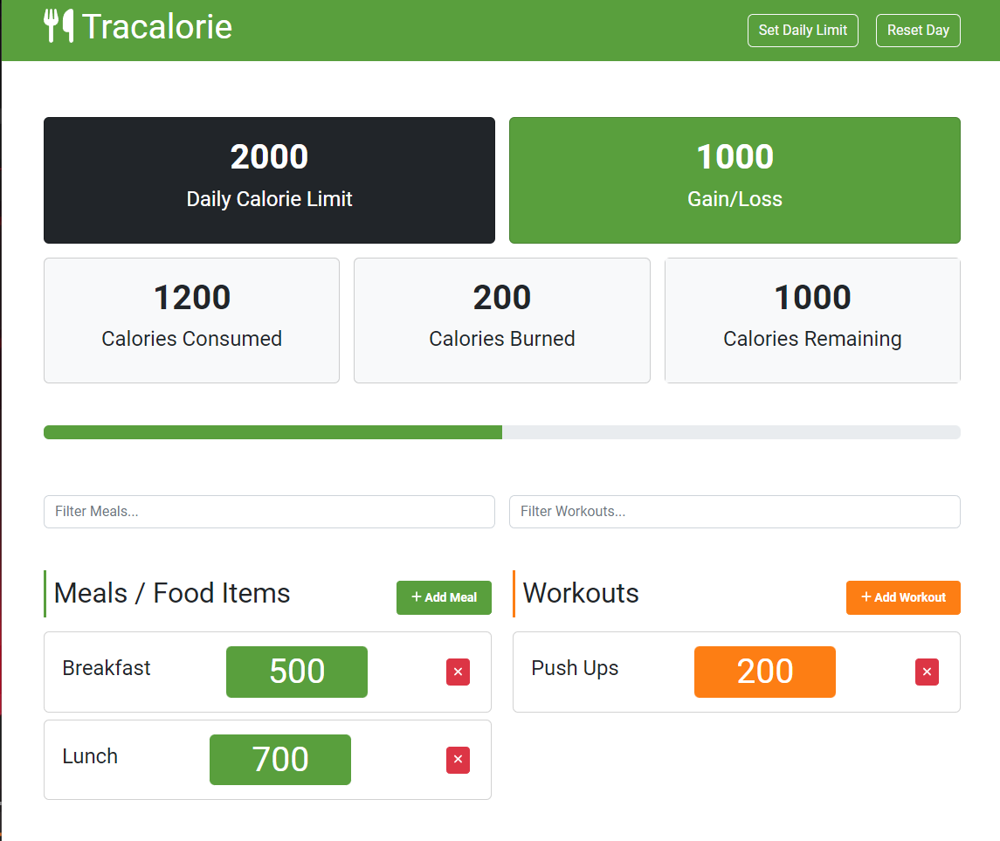
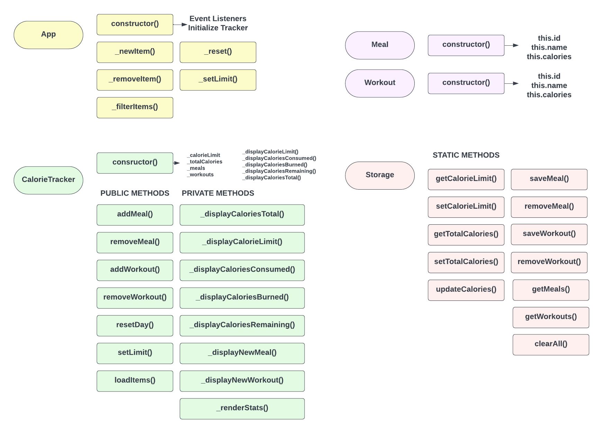
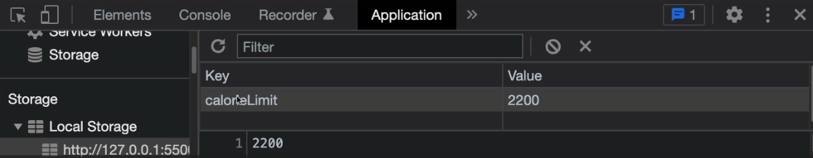

# 01-project-intro

# Tracalorie Project Intro

Now that you have an understanding of how OOP works, we are going to build a project that will help you understand how to use OOP in practice. We are going to build a calorie tracker app called Tracalorie. The app will allow users to add meals and workouts that will either add or remove (burn) calories from their total and track their calories. It is meant to be used as a daily tracker, but you could add to it and implement a schedule. Personally, I would not do that using client side local storage. It's just too much data. I would create a backend API and store the data in a database.



Let's look at the requirements for the app:

- Set a calorie limit
- Add meals and workouts
- Delete meals and workouts
- Filter meals and workouts
- Display total calories gain/loss
- A progress bar to visualize total calories gain/loss
- Display calories consumed and burned
- Reset calories and clear meals and workouts
- Use local storage to persist total calories, calorie limit, meals and workouts
- Use Bootstrap for styling and UI components (Modal & Collapse)

We will be using ES6 classes for this project. If you wanted to convert it to constructor functions and prototypes, that would not be difficult at all. I just prefer classes for something like this.


---


# 02-theme-setup

# Theme Setup

For this project, we will be using a custom Bootstrap 5 theme that I created. We are not going to be typing out the HTML/CSS. I have included a folder called `tracalorie_theme` in the lesson files. It is also in the main GitHub repo in the `_theme` folder. You can find the final code at https://github.com/bradtraversy/tracalorie.

Take the theme folder and rename it to `tracalorie`. Open it up with `VS Code` and open `index.html` with the `Live Server` extension.

You should see the UI, alothough nothing will work, because there is no JavaScript. the only things that will work that are dynamic is the modal when you click 'Set Daily Limit' and the collapse form when you click 'Add Meal` or 'Add Workout'. That is because we are including the Bootstrap JavaScript bundle. The rest of the JavaScript will be written from scratch.

## Sass Files

If you do not plan on changing any styles of the theme, you can delete the `SCSS` folder as well as all of the Bootstrap css files except for `bootstrap.css`. If you want to customize the styling, then you can use a Sass compiler like `Live Sass Compiler` to compile the `SCSS` files to `CSS`.

Now, that we have our UI and theme setup, we can start working on the JavaScript.


---


# 03-planning-diagram

# Project Planning & Diagram

It's always a good idea to take time before starting a project and plan out the steps. This will give you sort of a map and will help you stay on track and make sure you don't miss anything.

The following diagram shows every class, property, method and relationship that will be needed for this project.



## App Class

The `App` class is basically the initializer. This is the only class that we instantiate in the global scope. Everything kicks off from there.

In the constructor, we will instantiate the CalorieTracker class, which is responsible for anything to do with tracking and displaying calorie related data. We will also have all of the event listeners in the constructor of the `App` class.

We will be using the tracker within all of the `App` class methods, so we will store it in a property called `_tracker`.

We are abiding by the underscore convention for private properties and methods that should only be accessed within that class.

## CalorieTracker Class

This is the main class for all of our calorie tracking and displaying. It will hold properties for the total calories, daily limit, meals and workouts. It will also have methods for adding and deleting items as well as displaying calorie data in the DOM.

## Meal & Workout Classes

The `Meal` and `Workout` classes will be very simple. they will only have a constructor with an `id`, `name` and `calories` property. When we use the `addMeal()` or `addWorkout()` methods in the tracker, we will be passing in an object instance of the `Meal` or `Workout` class.

## Storage Class

The `Storage` class will be responsible for storing and retrieving data from `localStorage`. We will store the total calories, calorie limit, meals and workouts. This will let us persist the data even if the user refreshes the page. All of the methods in this class will be static. There is no need to instantiate this class because there is only one `localStorage`.

Hopefully, this gives you an idea of how the project will be structured.


---


# 04-base-tracker-meal-workout

# Base Tracker, Meal & Workout Classes

We are going to start of by creating the base `CalorieTracker` class, as well as the `Meal` and `Workout` classes. We will be using the `Meal` and `Workout` classes to instantiate meal and workout objects that we will be passing into the `CalorieTracker` class.
Let's create the class with the constructor and properties.

```js
class CalorieTracker {
  constructor() {
    this._calorieLimit = 2000;
    this._totalCalories = 0;
    this._meals = [];
    this._workouts = [];
  }
```

We set the calorieLimit to a hardcoded **2000**, but later on, that will be controlled via the app. We also set the totalCalories to **0** and the meals and workouts to empty arrays.

We are also going to create a class to add a meal and a workout, which will just add the meal or workout to the respective array and add or remove the calories to the total calories. A workout burns calories, so we will subtract the calories from the total calories, and a meal adds calories, so we will add the calories to the total calories.

```js
class CalorieTracker {
  // ...

  addMeal(meal) {
    this._meals.push(meal);
    this._totalCalories += meal.calories;
  }

  addWorkout(workout) {
    this._workouts.push(workout);
    this._totalCalories -= workout.calories;
  }
}
```

Now let's create the `Meal` and `Workout` classes. They will be very simple. They will only have a constructor with an `id`, `name` and `calories` property. When we use the `addMeal()` or `addWorkout()` methods in the tracker, we will be passing in an object instance of the `Meal` or `Workout` class.

The ID has to be different for each meal or workout, so I am going to use `Math.Random().toString(16)` which will give us a random hexadecimal string. We will then slice off the first two characters. There are many other ways to create random IDs, this is just one of them.

```js
class Meal {
  constructor(name, calories) {
    this.id = Math.random().toString(16).slice(2);
    this.name = name;
    this.calories = calories;
  }
}

class Workout {
  constructor(name, calories) {
    this.id = Math.random().toString(16).slice(2);
    this.name = name;
    this.calories = calories;
  }
}
```

Now, we should be able to instantiate the `CalorieTracker` class and add meals and workouts to it.

```js
const tracker = new CalorieTracker();

const breakfast = new Meal('Breakfast', 400);
tracker.addMeal(breakfast);

const run = new Workout('Morning Run', 300);
tracker.addWorkout(run);
```

We can see the results, by logging the properties. Now these are private properties, so we should not be accessing them directly, but for now, we will just log them to the console to see the results.

```js
console.log(tracker._meals); // [Meal { id: '1a2b3c', name: 'Breakfast', calories: 400 }]
console.log(tracker._workouts); // [Workout { id: '4d5e6f', name: 'Morning Run', calories: 300 }]
console.log(tracker._totalCalories); // 100
```


---


# 05-display-stats

# Display Stats

In the last lesson, we created a class for the calorie tracker. In this lesson, we will create methods to display the stats on the UI.

We are going to have methods to display the total calories, the calorie limit, the calories consumed, the calories burned, and the calories remaining.

```js
class CalorieTracker {
  // ...

  _displayCaloriesTotal() {
    const totalCaloriesEl = document.getElementById('calories-total');
    totalCaloriesEl.innerHTML = this._totalCalories;
  }

  _displayCaloriesLimit() {
    const calorieLimitEl = document.getElementById('calories-limit');
    calorieLimitEl.innerHTML = this._calorieLimit;
  }

  _displayCaloriesConsumed() {
    const caloriesConsumedEl = document.getElementById('calories-consumed');

    const consumed = this._meals.reduce(
      (total, meal) => total + meal.calories,
      0
    );

    caloriesConsumedEl.innerHTML = consumed;
  }

  _displayCaloriesBurned() {
    const caloriesBurnedEl = document.getElementById('calories-burned');

    const burned = this._workouts.reduce(
      (total, workout) => total + workout.calories,
      0
    );

    caloriesBurnedEl.innerHTML = burned;
  }

  _displayCaloriesRemaining() {
    const caloriesRemainingEl = document.getElementById('calories-remaining');

    const remaining = this._calorieLimit - this._totalCalories;

    caloriesRemainingEl.innerHTML = remaining;
  }
}
```

So this is pretty simple. We are grabbing elements from the DOM and inserting data into them based on the data we have in the class. We are also using the `reduce()` method to get the total calories consumed and burned.

Now we need to call these methods in the constructor so that they run as soon as the class is instantiated.

```js
class CalorieTracker {
  constructor() {
    this._calorieLimit = 2000;
    this._totalCalories = 0;
    this._meals = [];
    this._workouts = [];

    this._displayCaloriesLimit();
    this._displayCaloriesTotal();
    this._displayCaloriesConsumed();
    this._displayCaloriesBurned();
    this._displayCaloriesRemaining();
  }
```

Now we need to call these methods in the `addMeal()` and `addWorkout()` methods so that they run whenever a new meal or workout is added. Instead of calling them all in both methods, let's create a private method called `_render()` that will call all of these methods.

```js
class CalorieTracker {
  //...

  addMeal(meal) {
    this._meals.push(meal);
    this._totalCalories += meal.calories;
    this._render();
  }

  addWorkout(workout) {
    this._workouts.push(workout);
    this._totalCalories -= workout.calories;
    this._render();
  }

  _render() {
    this._displayCaloriesTotal();
    this._displayCaloriesConsumed();
    this._displayCaloriesBurned();
    this._displayCaloriesRemaining();
  }
}
```

Now let's test it out. We can add a meal and a workout and see if the stats are updated.

```js
const tracker = new CalorieTracker();

const breakfast = new Meal('Breakfast', 400);
tracker.addMeal(breakfast);

const run = new Workout('Morning Run', 320);
tracker.addWorkout(run);

console.log(tracker._meals);
console.log(tracker._workouts);
console.log(tracker._totalCalories);
```

As you add meals and workouts, the stats should update. If you refresh the page, the stats should reset to their default values.


---


# 06-progress-calorie-alert

# Progress Bar & Max Calorie Alert

Before we move on to the `App` class, let's add a progress bar and a max calorie alert. The alert is going to turn the "Calories Remaining" box and the progress bar red by adding the `bg-danger` class.

Bootstrap progress bars work by setting the `width` to a percentage. We can calculate the percentage by dividing the calories consumed by the max calories and multiplying by 100.

Let's create a method in the `CalorieTracker` class called `_displayCaloriesProgress` and add the following code:

```js
 _displayCaloriesProgress() {
    const progressEl = document.getElementById('calorie-progress');
    const percentage = (this._totalCalories / this._calorieLimit) * 100;
    const width = Math.min(percentage, 100);
    progressEl.style.width = `${width}%`;
  }
```

We then want to add call this in the constructor and in the `_render()` method.

```js
class CalorieTracker {
  constructor() {
    //...
    this._displayCalorieProgress();
  }
}
```

```js
class CalorieTracker {
  _render() {
    //...
    this._displayCalorieProgress();
  }
}
```

Now let's add the alert. We want to add the `bg-danger` class to the "Calories Remaining" box and the progress bar if the calories remaining is 0 or less. We can put this in the `_displayCaloriesRemaining` method.

```js
class CalorieTracker {
  _displayCaloriesRemaining() {
    const caloriesRemainingEl = document.getElementById('calories-remaining');
    const progressEl = document.getElementById('calorie-progress');
    const remaining = this._calorieLimit - this._totalCalories;
    caloriesRemainingEl.innerHTML = remaining;
    if (remaining <= 0) {
      caloriesRemainingEl.parentElement.classList.remove('bg-light');
      caloriesRemainingEl.parentElement.classList.add('bg-danger');
      progressEl.classList.add('bg-danger');
      progressEl.classList.remove('bg-success');
    } else {
      caloriesRemainingEl.parentElement.classList.remove('bg-danger');
      caloriesRemainingEl.parentElement.classList.add('bg-light');
      progressEl.classList.remove('bg-danger');
      progressEl.classList.add('bg-success');
    }
  }
}
```


---


# 07-app-class

# App Class, New Meal & Workout

Now that we have our base `CalorieTracker` class, let's create the `App` class. The `App` class is going to be the main class that will control the entire application. It will be responsible for initializing the `CalorieTracker` class and it is where all of the event listeners will be added.

We are going to set the tracker instance as a property on the `App` class.

```js
class App {
  constructor() {
    this._tracker = new CalorieTracker();
  }
}
```

In the final version of the app, we will have an event handler called `_newItem` that will be responsible for adding a new meal or workout to the tracker. For now, we will have two separate event handlers, `_newMeal` and `_newWorkout`. We will add the event listeners in the constructor.

We also need access to the current instance by using the `this` keyword. Since `this._newMeal` and `this._newWorkout` are being passed as callbacks, the `this` keyword will refer to the element that the event was called on. To get around this, we can use the `bind` method to bind the `this` keyword to the `App` class instance.

```js
document
  .getElementById('meal-form')
  .addEventListener('submit', this._newMeal.bind(this, 'meal'));

document
  .getElementById('workout-form')
  .addEventListener('submit', this._newWorkout.bind(this, 'workout'));
```

Let's start with the `_newMeal` event handler. We are going to get the values from the form and create a new `Meal` object. We will then add the meal to the tracker and render the tracker.

```js
  _newMeal(e) {
    e.preventDefault();
    const name = document.getElementById('meal-name');
    const calories = document.getElementById('meal-calories');

    if (name.value === '' || calories.value === '') {
      alert('Please fill in all fields');
      return;
    }

    // Create a new meal
    const meal = new Meal(name.value, +calories.value);

    // Add the meal to the tracker
    this._tracker.addMeal(meal);
  }
```

This will create a new meal and we should see the reflection in the calorie stats. We won't see the meal in the list yet because we haven't rendered that, but it is being added to the tracker.

I also want to clear the form inputs and close the Bootstrap collapse component when we submit, so let's do that.

```js
  _newMeal(e) {
  e.preventDefault();
  const name = document.getElementById('meal-name');
  const calories = document.getElementById('meal-calories');

  if (name.value === '' || calories.value === '') {
    alert('Please fill in all fields');
    return;
  }

  // Create a new meal
  const meal = new Meal(name.value, +calories.value);

  // Add the meal to the tracker
  this._tracker.addMeal(meal);

  // Clear the form
  name.value = '';
  calories.value = '';

  // Collapse the form
  const collapseMeal = document.getElementById('collapse-meal');
  const bsCollapse = new bootstrap.Collapse(collapseMeal, {
    toggle: true,
  });
}
```

Now to do this for the workout, is very similar. Let's create the `_newWorkout` event handler.

```js
  _newWorkout(e) {
    e.preventDefault();
    const name = document.getElementById('workout-name');
    const calories = document.getElementById('workout-calories');

    if (name.value === '' || calories.value === '') {
      alert('Please fill in all fields');
      return;
    }

    // Create a new workout
    const workout = new Workout(name.value, +calories.value);

    // Add the workout to the tracker
    this._tracker.addWorkout(workout);

    // Clear the form
    name.value = '';
    calories.value = '';

    // Collapse the form
    const collapseWorkout = document.getElementById('collapse-workout');
    const bsCollapse = new bootstrap.Collapse(collapseWorkout, {
      toggle: true,
    });
  }
```

We have to instanciate the `App` class

```js
const app = new App();
```

These two functions are very similar, so in the next lesson, we will refactor a bit and abide by the DRY principle.


---


# 08-newItem-refactor

# newItem() Refactor

So, the `_newMeal()` and `newWorkout()` methods in the last lesson were very similar. We are going to combine them into a single method called `_newItem()`.

First we need to change the event handlers. We are going to change the method name to `_newItem()` and pass in the type of item as a parameter.

```js
document
  .getElementById('meal-form')
  .addEventListener('submit', this._newItem.bind(this, 'meal'));

document
  .getElementById('workout-form')
  .addEventListener('submit', this._newItem.bind(this, 'workout'));
```

Now, let's create the method, which will take in a type parameter.

```js
  _newItem(type, e) {
    e.preventDefault();
    const name = document.getElementById(`${type}-name`);
    const calories = document.getElementById(`${type}-calories`);

    if (name.value === '' || calories.value === '') {
      alert('Please fill in all fields');
      return;
    }

    if (type === 'meal') {
      const meal = new Meal(name.value, +calories.value);
      this._tracker.addMeal(meal);
    }
    if (type === 'workout') {
      const workout = new Workout(name.value, +calories.value);
      this._tracker.addWorkout(workout);
    }

    name.value = '';
    calories.value = '';

    const collapseItem = document.getElementById(`collapse-${type}`);
    const bsCollapse = new bootstrap.Collapse(collapseItem, {
      toggle: true,
    });
  }
```

As you can see, we just changed a lot of the hardcoded 'meal' and 'workout' strings to the type parameter. We also added a conditional to see which tracker method would be called.


---


# 09-display-new-meal-workout

# Display New Meal & Workout

So we are able to add a meal or workout via the forms and the calories are factored into the stats, but we still don't see the meal or workout. So we are going to create two methods, `_displayNewMeal()` and `_displayNewWorkout()`.

I would suggest removing any dummy items in the list from the HTML if you still have any there.

Let's start by calling them where they need to be called, which is in the public `addMeal()` and `addWorkout()` methods in the `CalorieTracker`.

```js
  addMeal(meal) {
    this._meals.push(meal);
    this._totalCalories += meal.calories;
    this._displayNewMeal(meal);
    this._render();
  }

  addWorkout(workout) {
    this._workouts.push(workout);
    this._totalCalories -= workout.calories;
    this._displayNewWorkout(workout);
    this._render();
  }
```

Now, let's create the `_displayNewMeal()` method in the `CalorieTracker` class.

```js
  _displayNewMeal(meal) {
    const mealsEl = document.getElementById('meal-items');
    const mealEl = document.createElement('div');
    mealEl.classList.add('card', 'my-2');
    mealEl.setAttribute('data-id', meal.id);
    mealEl.innerHTML = `
    <div class="card-body">
      <div class="d-flex align-items-center justify-content-between">
        <h4 class="mx-1">${meal.name}</h4>
        <div class="fs-1 bg-primary text-white text-center rounded-2 px-2 px-sm-5">
          ${meal.calories}
        </div>
        <button class="delete btn btn-danger btn-sm mx-2">
          <i class="fa-solid fa-xmark"></i>
        </button>
    </div>
  </div>
    `;
    mealsEl.appendChild(mealEl);
  }
```

We just selected the element where we want to append the meal, created the element, added some classes and a `data-id` attribute, and then set the inner HTML. We are using the `data-id` attribute to get the ID of the meal when we want to delete it. We are also using the `delete` class to select the delete button when we want to delete the meal.

We will create the `_displayNewWorkout()` method in the same way.

```js
_displayNewWorkout(workout) {
  const workoutsEl = document.getElementById('workout-items');
  const workoutEl = document.createElement('div');
  workoutEl.classList.add('card', 'my-2');
  workoutEl.setAttribute('data-id', workout.id);
  workoutEl.innerHTML = `
  <div class="card-body">
    <div class="d-flex align-items-center justify-content-between">
      <h4 class="mx-1">${workout.name}</h4>
      <div class="fs-1 bg-secondary text-white text-center rounded-2 px-2 px-sm-5">
        ${workout.calories}
      </div>
      <button class="delete btn btn-danger btn-sm mx-2">
        <i class="fa-solid fa-xmark"></i>
      </button>
  </div>
</div>
  `;
  workoutsEl.appendChild(workoutEl);
}
```

Now when you add a meal or workout, you should see it in the list.


---


# 10-remove-meal-workout

# Remove Meal & Workout

Now we want to be able to remove meals and workouts. We want to remove from the list, but we also want to account for the calories in the tracker. So we are going to start by adding event listeners in the `App` class.

```js
 document
      .getElementById('meal-items')
      .addEventListener('click', this._removeItem.bind(this, 'meal'));

    document
      .getElementById('workout-items')
      .addEventListener('click', this._removeItem.bind(this, 'workout'));
      ```


As you can see, we are using event delegation and putting the event listener on the parent element. We are also passing in the type as a parameter. Now let's create the method.

```js
   _removeItem(type, e) {
    if (
      e.target.classList.contains('delete') ||
      e.target.classList.contains('fa-xmark')
    ) {
      if (confirm('Are you sure?')) {
        const id = e.target.closest('.card').getAttribute('data-id');
        type === 'meal'
          ? this._tracker.removeMeal(id)
          : this._tracker.removeWorkout(id);
        const item = e.target.closest('.card');
        item.remove();
      }
    }
  }
```

We are targeting the `delete` and `fa-xmark` classes. We are also using the `closest` method to get the parent element. We are then getting the `data-id` attribute and passing it to the `removeMeal` or `removeWorkout` method in the `CalorieTracker`. We are also removing the item from the DOM.

## Remove From Tracker

Now, let's create our public `removeMeal()` and `removeWorkout()` methods in the tracker.

```js
 removeMeal(id) {
    const index = this._meals.findIndex((meal) => meal.id === id);
    if (index !== -1) {
      const meal = this._meals[index];
      this._meals.splice(index, 1);
      this._totalCalories -= meal.calories;
      this._render();
    }
  }

  removeWorkout(id) {
    const index = this._workouts.findIndex((workout) => workout.id === id);
    if (index !== -1) {
      const workout = this._workouts[index];
      this._workouts.splice(index, 1);
      this._totalCalories += workout.calories;
      this._render();
    }
  }
```

Now, when we click on the delete button, it will remove the item. We are also updating the total calories.


---


# 11-filter-reset

# Filter & Reset

In this lesson, we are going to add the functionality to filter items and reset the total calories as well as remove all items.

let's start by adding an event listener for a `keyup` event on both the meal and workout filter inputs.

```js
 document
      .getElementById('filter-meals')
      .addEventListener('keyup', this._filterItems.bind(this, 'meal'));

    document
      .getElementById('filter-workouts')
      .addEventListener('keyup', this._filterItems.bind(this, 'workout'));
      ```


We will create the `_filterItems` method in the `App` class.

```js
_filterItems(type, e) {
    const text = e.target.value.toLowerCase();
    document.querySelectorAll(`#${type}-items .card`).forEach((item) => {
      const name = item.firstElementChild.firstElementChild.textContent;
      if (name.toLowerCase().indexOf(text) != -1) {
        item.style.display = 'block';
      } else {
        item.style.display = 'none';
      }
    });
  }
```

We are getting the text of the input. Then we are looping through all the items and checking if the text is in the name of the item. If it is, we display the item, otherwise we hide it. We don't need to use the tracker at all because it has nothing to do with manipulating calories or items.

## Adding Reset Functionality

Let's add an event listener for the reset button.

```js
document
  .getElementById('reset')
  .addEventListener('click', this._reset.bind(this));
```

    Create the `_reset` method in the `App` class.

```js
    _reset() {
    if (confirm('Are you sure you want to reset everything?')) {
      this._tracker.reset();
      document.getElementById('meal-items').innerHTML = '';
      document.getElementById('workout-items').innerHTML = '';
      document.getElementById('filter-meals').value = '';
      document.getElementById('filter-workouts').value = '';
    }
  }
```

Anything to do with resetting calories and items will happen in the tracker, so we have a \_tracker.reset() method. We are also clearing the items from the UI and resetting the filter inputs.

Let's create the tracker reset. Remember, this is a public method, so no underscore.

```js
reset() {
    this._totalCalories = 0;
    this._meals = [];
    this._workouts = [];
    this._render();
  }
```

We are clearing the total calories, the meals and workouts arrays, and then we are rendering the tracker/stats.


---


# 12-set-calorie-limit

# Set Calorie Limit

Before we start to get into localStorage, I want to make it so that when we submit the limit modal form, it changes the limit, which right now is hard-coded to 2000.

Let's add an event listener for the submit event on the limit form.

```js
document
  .getElementById('limit-form')
  .addEventListener('submit', this._setLimit.bind(this));
```

Now, create the `_setLimit` method in the `App` class.

```js
_setLimit(e) {
    e.preventDefault();
    const limit = document.getElementById('limit');

    if (limit.value === '') {
      alert('Please add a limit');
      return;
    }

    this._tracker.setLimit(+limit.value);
    limit.value = '';

    const modalEl = document.getElementById('limit-modal');
    const modal = bootstrap.Modal.getInstance(modalEl);
    modal.hide();
  }
```

So, the actual setting of the calorie limit is done within the tracker. We are also clearing the input and hiding the modal.

let's create the tracker setLimit method. Remember, this is a public method, so no underscore.

```js
  setLimit(calorieLimit) {
    this._calorieLimit = calorieLimit;
    this._displayCalorieLimit();
    this._render();
  }
```

We are setting the calorie limit and then calling the displayCalorieLimit and render methods.

Now whatever you set it to, the rest of the app will use that value. However, it will not stick if you refresh the page. Nothing will right now. So in the next few lessons, we will implement localStorage to save the data.


---


# 13-storage-class-limit-persist

# Storage Class & Calorie Limit Persist

In the last lesson, we added the ability to set the calorie limit. However, if you refresh the page, it will go back to the default of 2000. In this lesson, we will implement localStorage to save the data.

Let's create a `Storage` class:

```js
class Storage {}
```

This class will have all `static` methods. Meaning we do not have to instantiate the class. There is no need to because we never need more than one instance. So we can call the methods directly from the class (Storage.methodName()).

Let's add a method to get the calorie limit from localStorage:

```js

class Storage {
  static getCalorieLimit(defaultLimit = 2000) {
    let calorieLimit;
    if (localStorage.getItem('calorieLimit') === null) {
      calorieLimit = defaultLimit;
    } else {
      calorieLimit = +localStorage.getItem('calorieLimit');
    }
    return calorieLimit;
  }
}

We are first checking if there is a calorieLimit in localStorage. If not, we are setting it to the defaultLimit. If there is, we are parsing it to an integer and returning it.
```

Now, we need a method to set the calorie limit in localStorage:

```js
class Storage {
  static setCalorieLimit(calorieLimit) {
    localStorage.setItem('calorieLimit', calorieLimit);
  }
}
```

Let's change the default limit in the `CalorieTracker` class to use the `Storage` class:

```js
class CalorieTracker {
  constructor() {
    this.calorieLimit = Storage.getCalorieLimit();
}
```

When we set the limit in the `CalorieTracker` class, we need to update the localStorage:

```js
setLimit(calorieLimit) {
    this._calorieLimit = calorieLimit;
    Storage.setCalorieLimit(calorieLimit); // Add this line
    this._displayCalorieLimit();
    this._render();
}
```

Now, when you submit the limit form in the modal, it will update local storage and persist in the app. If you look in the `Application` tab in the devtools, and click on `Local Storage`, you should see the key/value pair.




---


# 14-persist-total-calories

# Persist Total Calories to Storage

We want the total calories to be stored in localStorage and we want that number to update when we add a meal or a workout.

Let's create a method to get the total calories from localStorage:

```js
static getTotalCalories(defaultCalories = 0) {
    let totalCalories;
    if (localStorage.getItem('totalCalories') === null) {
      totalCalories = defaultCalories;
    } else {
      totalCalories = +localStorage.getItem('totalCalories');
    }
    return totalCalories;
  }

```

As well as a method to update the calories

```js
static updateCalories(calories) {
    localStorage.setItem('totalCalories', calories);
}
```

Now, let's update the `_totalCalories` property in the tracker to use the `getTotalCalories()` method:

```js
class CalorieTracker {
  constructor() {
    this._totalCalories = Storage.getTotalCalories(0);
    // ...
  }
}
```

When we add a meal or a workout, we need to update the total calories:

```js
addMeal(meal) {
    this._meals.push(meal);
    this._totalCalories += meal.calories;
    Storage.updateCalories(this._totalCalories); // Add this line
    this._render();
  }
```

```js
addWorkout(workout) {
    this._workouts.push(workout);
    this._totalCalories -= workout.calories;
    Storage.updateCalories(this._totalCalories); // Add this line
    this._render();
}
```

We also want to do it when we remove a meal or workout:

```js

removeMeal(id) {
    const index = this._meals.findIndex((meal) => meal.id === id);
    if (index !== -1) {
      const meal = this._meals[index];
      this._meals.splice(index, 1);
      this._totalCalories -= meal.calories;
      Storage.updateCalories(this._totalCalories);
      this._render();
    }
  }

removeWorkout(id) {
    const index = this._workouts.findIndex((workout) => workout.id === id);
    if (index !== -1) {
      const workout = this._workouts[index];
      this._workouts.splice(index, 1);
      this._totalCalories += workout.calories;
      Storage.updateCalories(this._totalCalories);
      this._render();
    }
  }
```

Now, when we refresh the page, the total calories will be the same as before. However, we won't see the meals and workouts because we haven't implemented that in local storage yet.


---


# 15-save-meals-localstorage

So the calories are now being tracked and saved in local storage, but the calories consumed and burned are not being displayed as well as the meals and workouts themselves. This is because we have yet to save them in local storage, so that is what we are going to do now.

Let's create a `getMeals()` method in the `Storage` class:

```js
class Storage {
  // ...
  static getMeals() {
    let meals;
    if (localStorage.getItem('meals') === null) {
      meals = [];
    } else {
      meals = JSON.parse(localStorage.getItem('meals'));
    }
    return meals;
  }
}
```

We are just checking to see if it exists. If it does not, we return an empty array. If it does, we get it from local storage, parse the array and return the meals.

Let's create a method to store the meals in local storage:

```js
static saveMeal(meal) {
  const meals = Storage.getMeals();
  meals.push(meal);
  localStorage.setItem('meals', JSON.stringify(meals));
}
```

We are getting the meals from local storage, pushing the new meal to the array and then setting the item in local storage.

We are going to change the `_meals()` property to store the array returned from the `getMeals()` method:

```js
class CalorieTracker {
  constructor() {
    this._meals = Storage.getMeals();
    // ...
  }
}
```

We will use the `saveMeal()` method in the `addMeal()` method:

```js
  addMeal(meal) {
    this._meals.push(meal);
    this._totalCalories += meal.calories;
    Storage.updateCalories(this._totalCalories);
    Storage.saveMeal(meal);
    this._displayNewMeal(meal);
    this._render();
  }
```

So now we are storing meals in local storage, but we are not displaying them. Let's do that now by creating a `loadItems()` method in the `CalorieTracker` class:

```js
class CalorieTracker {
  loadItems() {
    this._meals.forEach((meal) => this._displayNewMeal(meal));
  }
}
```

We are just looping through the meals and displaying them.

We will call the `loadItems()` method in the `App` constructor:

```js
class App {
  constructor() {
    //...
    this._tracker.loadItems();
  }
}
```

Let's also clean up the `App` constructor by putting all of the event listeners into a single method:

```js
class App {
  constructor() {
    // ...
    this._loadEventListeners();
  }

  _loadEventListeners() {
    document
      .getElementById('meal-form')
      .addEventListener('submit', this._newItem.bind(this, 'meal'));

    document
      .getElementById('workout-form')
      .addEventListener('submit', this._newItem.bind(this, 'workout'));

    document
      .getElementById('meal-items')
      .addEventListener('click', this._removeItem.bind(this, 'meal'));

    document
      .getElementById('workout-items')
      .addEventListener('click', this._removeItem.bind(this, 'workout'));

    document
      .getElementById('filter-meals')
      .addEventListener('keyup', this._filterItems.bind(this, 'meal'));

    document
      .getElementById('filter-workouts')
      .addEventListener('keyup', this._filterItems.bind(this, 'workout'));

    document
      .getElementById('reset')
      .addEventListener('click', this._reset.bind(this));

    document
      .getElementById('limit-form')
      .addEventListener('submit', this._setLimit.bind(this));
  }
}
```


---


# 16-save-workouts-localstorage

# Save Workouts To Local Storage

Now we want to save our workouts. I want you to try this on your own. It is the same exact process we used with meals. The only difference is that we are going to use the `workouts` array instead of the `meals` array.

Let's continue...

We will add a `getWorkouts()` method to the `Storage` class:

```js
static getWorkouts() {
    let workouts;
    if (localStorage.getItem('workouts') === null) {
      workouts = [];
    } else {
      workouts = JSON.parse(localStorage.getItem('workouts'));
    }
    return workouts;
  }
```

As well as a `saveWorkout()` method:

```js
static saveWorkout(workout) {
    const workouts = Storage.getWorkouts();
    workouts.push(workout);
    localStorage.setItem('workouts', JSON.stringify(workouts));
  }
```

We will set the default for `_workouts` to `Storage.getWorkouts()`:

```js
class CalorieTracker {
  constructor() {
    // ...
    this._workouts = Storage.getWorkouts(); // Add this line
  }
}
```

Now call the `saveWorkout()` method in the `addWorkout()` method:

```js
  addWorkout(workout) {
    this._workouts.push(workout);
    this._totalCalories -= workout.calories;
    Storage.updateCalories(this._totalCalories);
    Storage.saveWorkout(workout); // Add this line
    this._displayNewWorkout(workout);
    this._render();
  }
```

Finally, to display them on the page, we will add to the `loadItems()` method in the `CalorieTracker` class:

```js
  loadItems() {
    this._meals.forEach(meal => this._displayNewMeal(meal));
    this._workouts.forEach(workout => this._displayNewWorkout(workout));
  }
```


---


# 17-remove-meals-items-localstorage

# Remove Meals & Workouts From Local Storage

Let's go ahead and add a method called `removeMeal()` to the `CalorieTracker` class:

```js
static removeMeal(id) {
  const meals = Storage.getMeals();
  meals.forEach((meal, index) => {
    if (meal.id === id) {
      meals.splice(index, 1);
    }
  });
  localStorage.setItem('meals', JSON.stringify(meals));
}
```

We simply loop through the meals and if the meal id matches the id we pass in, we remove it from the array. Then we save the array to local storage.

Let's also create `removeWorkout()`

```js
static removeWorkout(id) {
  const workouts = Storage.getWorkouts();
  workouts.forEach((workout, index) => {
    if (workout.id === id) {
      workouts.splice(index, 1);
    }
  });
  localStorage.setItem('workouts', JSON.stringify(workouts));
}
```

Now we will call these methods from the tracker. In the `removeMeal()` method of the `CalorieTracker` class, we will call the `removeMeal()` method of the `Storage` class:

```js
  removeMeal(id) {
    this._meals.forEach((meal, index) => {
      if (meal.id === id) {
        this._totalCalories -= meal.calories;
        this._meals.splice(index, 1);
      }
    });
    Storage.updateCalories(this._totalCalories);
    Storage.removeMeal(id); // Add this line
    this._render();
  }
```

We will do the same with the `removeWorkout()` method:

```js
  removeWorkout(id) {
    this._workouts.forEach((workout, index) => {
      if (workout.id === id) {
        this._totalCalories += workout.calories;
        this._workouts.splice(index, 1);
      }
    });
    Storage.updateCalories(this._totalCalories);
    Storage.removeWorkout(id); // Add this line
    this._render();
  }
```

Now, when you remove a meal or workout, it will stay gone when you reload the page because we removed them from localstorage.


---


# 18-clear-storage-items

# Clear Storage Items

Now that we are saving our meals and workouts to local storage, we need a way to clear them. We already have the functionality of clearing them from the UI, so we just need to clear them from local storage.

It is up to you if you want to also clear the **calorie limit**. You may want to keep that but reset the total calories and the item arrays.

Let's create a `clearAll()` method in the `Storage` class:

If you wanted to clear everything including the limit, you could simply use the `.clear()` method on the `localStorage` object:

```js
static clearAll() {
  localStorage.clear();
}
```

If you want to keep the limit, you can just remove the other 3 individually:

```js
static clearAll() {
  localStorage.removeItem('meals');
  localStorage.removeItem('workouts');
  localStorage.removeItem('totalCalories');
}
```

Now in the `CalorieTracker()` class, in the `reset()` method, call the `clearAll()` method in the storage class:

```js
reset() {
    this._totalCalories = 0;
    this._meals = [];
    this._workouts = [];
    Storage.clearAll();
    this._render();
  }
```
