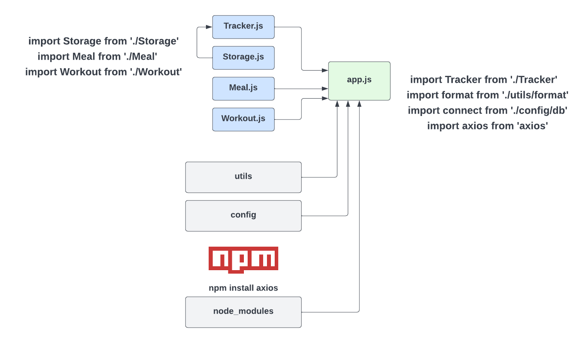
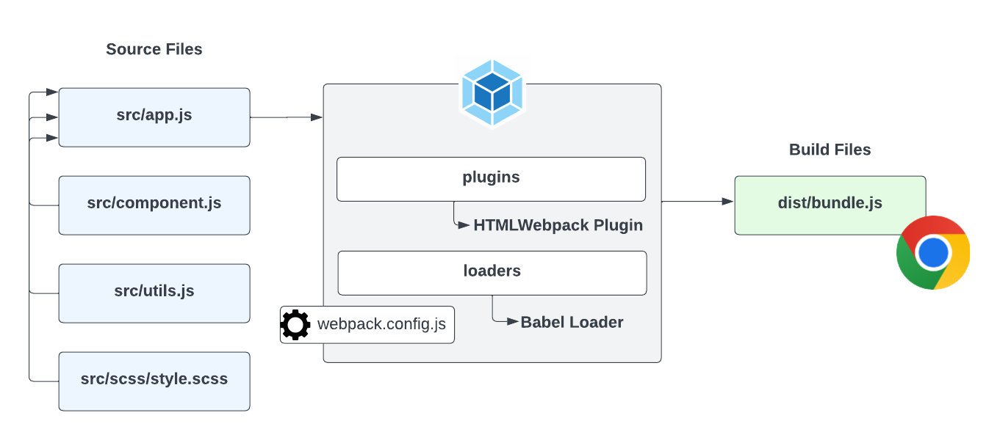

# 01-what-are-modules

# What Are Modules

So what are modules? Modules are just JavaScript files that we can import into other JavaScript files. We can then use the code that is in the module in the file that we import it into. Now an import is not like a PHP include for instance, where we simply just have everything accessible to us. We need to export what we want from the file. This could be a function, a class or even just a variable value or an object. Modules can be our own files and code or they can be part of a package that we install using `NPM` or the `Node Package Manager`. If you want to use NPM modules in the front-end, you need to use a module bundler like Webpack, which we're going to get into later. For now, let's just focus on how to create our own modules using our own files.

The reason that modules are so important is because they allow us to break our code up into different files. This makes our code more organized and easier to maintain. Using our **Tracalorie** app as an example, we had a single app.js file with 5 different classes. that's not really ideal. Imagine if we had 100 classes. It would be more organized to put each class into it's own module. We can then import the modules into the app.js file. This way, we can keep our code organized and maintainable. Like I said, later on, we'll refactor our Tracalorie app to use modules.

Modules are obviously **modular**, so we can reuse them where we want. You may have a module with some utilitly classes to add commas to a number or something. Where ever you want to use that, you can import it and use it.

Using a module bundler also means that we can use NPM packages. So you have access to over a million 3rd-party modules to enhance your application. You can't use NPM with the way that we've been doing things.

Also, when you use something like Webpack or Parcel, you have access to tools to optimize your project. Whether it's minifying your code or using Sass or a custom dev server, you can create a very customized environment.

## Types Of Modules

There are a few different types of modules when it comes to JavaScript. The two main types are `CommonJS Modules` and `ES Modules` or `ES6 Modules`. `CommonJS Modules` are the modules that are usually used in Node.js. We're going to talk about Node more in the next video. When you use a front-end framework like React, Angular or Vue, you'll be using `ES Modules`. I'm going to show you both types.

ES Modules and CommonJS modules have a different syntax, but the idea is the same. We export what we want from a specific module/file and import it into another. We can export variables, functions, classes, etc.

## Modules & The Browser

When it comes to using modules in the browser, there is support for `ESM` or `ES Modules` in newer browsers, however they're not supported in older browsers. So in order to use them, you will usually use a module bundler like `Webpack` or `Parcel` to bundle our modules into a single file that can be used in the browser. I will show you how to use ES Modules directly in the browser, but it is recommended that you use some kind of module bundler.

## Visual Example

Let's look at an example of what we could do for the Tracalorie project if we broke it up into modules:



We could separate out the tracker, storage, meal and workout classes into their own files. We would export the whole class, that way we could use whatever methods we needed from that class. Since we use the tracker, the meal and the workout class in the main App class, we would import it into app.js. The Storage class is used in the tracker, so we would import that into `Tracker.js`. The syntax we're looking at here is the `ES6 Module` syntax. CommonJS is a bit different. I'm going to show you both.

I added some other files and folders just as an example. We may have a config folder and a utile folder with more code we want to import. We could also install 3rd-party modules/packages using `NPM`. For instance, if we installed the `axios` package, which is an HTTP client, we could import it where we needed it.

In order to teach you about the `CommonJS` modules as well as `NPM` modules, we need to talk about and install Node.js. So we'll do that in the next lesson.


---


# 02-what-is-node.js

# What Is Node.js?

Alright, so this is not a Node.js course, so we won't be doing a deep dive into Node. I do want you to be familiar with it though, because it's a very popular environment for JavaScript and even as a front-end developer, you'll be working with `NPM` and to use NPM, you need to install Node.js.

So Node.js is a runtime environment. Up to this point, we've been executing our JavaScript code in the browser. Node.js is simply another environment to execute JavaScript code. It allows us to write server-side code with JavaScript. Just like other languages, such as Python, Ruby and Java. Server-side code is code that can interact with databases and the filesystem, etc.

Node is built on Chrome's V8 JavaScript engine. It uses an event-driven, non-blocking I/O model that makes it lightweight and efficient. The way Node works is very similar to how the browser works. It uses an event loop, callbacks, promises, async/await, etc. It's essentially the browser environment minus the window object. Node does have a global object, it's just not called `window`,it's called `global`. In Node, we don't have a document object model. So it's not used for creating interfaces like we do in the browser. It's used for creating back-end applications and APIs. It's also used for creating command line tools among other things.

## Installing Node.js

Installing Node is extremely easy. Just go to the [Node.js website](https://nodejs.org/en/) and download the latest version. Once it's installed, you can check the version by opening up your terminal/command line and typing `node -v`. This should return the version number. You can also check the version of `npm` by typing `npm -v`. This should also return the version number.

Let's create a folder to work in and an app.js file

```js
mkdir node-playground
cd node-playground
touch app.js
code app.js
```

## Running a .js file

Add `console.log('Hello World');` to the app.js file.

There is no browser in this environment, so `console.log()` will output to the terminal.

Now let's run this file in the terminal. We can do this by typing `node app.js`. We can also leave off the `.js` extension and just do `node app`. You should see `Hello World` logged to the terminal.

Instead of just doing a hello world, let's fetch some data.

The fetch API actually was not part of Node.js up until recently. We had to use an NPM package like `node-fetch` or `axios` if we wanted to make requests.

```js
async function getUser() {
  const response = await fetch('https://api.github.com/users/bradtraversy');
  const data = await response.json();
  console.log(data);
}
getUser();
```

Now let's run this file in the terminal with `node app.js`.

You should see the data logged to the console. Now let's run this file in the terminal.


---


# 03-common-js-modules

# CommonJS Modules

Let's look at the first type of module syntax called `CommonJS`. This is an older syntax that is used in Node.js. You won't use this much on the front-end, but if you plan on being a full-stack or back-end developer, you'll need to know it.

Let's create an `app.js` file and a `utils.js` file. Let's say that the app file is the main entry point and utils is just some extra utility functions that we want to be able to use in multiple files.

In `utils.js`, I am going to create a function that will capitalize the first letter of every word.

```js
function capitalizeWords(str) {
  return str
    .toLowerCase()
    .split(' ')
    .map((word) => word[0].toUpperCase() + word.substr(1))
    .join(' ');
}
```

I want to be able to import this into the `app.js` file and use it. In order to do that, we need to export it. We do that by using the `module.exports` object. We can then set it equal to the function that we want to export.

```js
module.exports = capitalizeWords;
```

Now, I can import it into the `app.js` file. In order to do that, we use the `require()` function. We pass in the path to the file that we want to import. We can then store it in a variable and use it.

```js
const capitalizeWords = require('./utils');

console.log(capitalizeFirst('hello world')); // Hello World
```

As you can see, we can import the function and use it in the `app.js` file.

## Exporting Multiple functions

In many cases, you will want to export more than one thing from a file. Let's create another function in `utils.js`.

```js
function makeMoney(amount) {
  return `$${amount}`;
}
```

To export both functions, we can use the `module.exports` object again. We can set it equal to an object with the functions as properties.

```js
module.exports = {
  capitalizeWords,
  makeMoney,
};
```

Now when we import it in the `app.js` file, we can destructure it and get both functions.

```js
const { capitalizeWords, makeMoney } = require('./utils');

console.log(capitalizeWords('hello world')); // Hello World
console.log(makeMoney(100)); // $100
```

## Exporting Classes

Functions are not the only thing that we can import/export. Let's create a file named `Person.js` and create a class in it.

```js
class Person {
  constructor(name, age) {
    this.name = name;
    this.age = age;
  }

  greet() {
    console.log(`Hello, my name is ${this.name} and I am ${this.age}`);
  }
}
```

Now, let's export it

```js
module.exports = Person;
```

Now we can use it in the `app.js` file.

```js
const Person = require('./Person');

const person1 = new Person('John', 30);
person1.greet(); // Hello, my name is John and I am 30
```

Remember, this is only for Node.js. You won't be able to use this on the front-end, at least without tooling.


---


# 04-npm-modules

# NPM Modules

`NPM` stands for `Node Package Manager`. It's a package manager for JavaScript. It's used to install 3rd-party packages and modules that we can use in our projects. There are over a million packages that you can install in a single command. Packages are hosted at `npmjs.com`.

Let's create another `app.js` file. I'm going to install and use `Axios`, which is a 3rd-party HTTP client that is similar to the Fetch API, but even more powerful.

When you create a Node.js app, the first thing that you usually do is run `npm init`. This will create a `package.json` file. This file is used to store information about your project. It's also used to store information about the packages that you install. It's kind of like a manifest file. It's also used to store scripts that you can run from the command line. We'll talk more about that later. For now, let's just run `npm init` and accept all of the defaults.

```bash
npm init
```

You can also run `npm init -y` to accept all of the defaults without having to answer any questions.

In this file, you will see some standard information about the project. You will also see a `dependencies` object. This is where the information about the packages that we install will be stored. Let's install `axios`.

```bash
npm install axios
```

Now, if you look at your `package.json` file, you will see `axios` listed in your projects dependencies. You will also see a new folder called `node_modules`. This is where the packages that we install will be stored. If you look in it you will see a bunch of folders because our dependencies/packages use other dependencies. So this file gets VERY large. It is important that you do not commit this folder to version control. You should add it to your `.gitignore` file. Let's do that now.

```bash
echo "node_modules" >> .gitignore
```

Now, when we commit our code, the `node_modules` folder will not be included.

Let's go to our `app.js` and import axios

```js
import axios from 'axios';
```

Now we can use it to fetch some data from an API. Let's use the `JSON Placeholder` API to fetch a single post.

```js
async function getPost() {
  const res = await axios.get('https://jsonplaceholder.typicode.com/posts/1');
  console.log(res.data);
}
getPost();
```

We are able to use `axios` because we installed and imported it.

Let's install one more package called `Lodash`. This is a utility library that has a lot of useful methods. Let's install it. We can use `i` as a shorthand for `install`.

## Global Packages

You can also use the `-g` option to install packages globally. This means it's not installed in your local project in the `node_modules` folder. It's installed globally on your system and you can use it whereever you want. 

An example would be `create-react-app`. This is a utility that you can run to generate a new React boilerplate. You could install this globally like this:

```bash
npm install -g create-react-app
```

You could then run it from anywhere.

## Dev Dependecies

Sometimes, you may use packages that are strictly for your development environment. An example would be `nodemon`, which monitors your application so you don't have to keep running it. Nodemon would not be needed in your production environment, so you could install it as a dev dependency with the `-D` option

```bash
npm install -D nodemon
```

Then, in your package.json file, it would be put in a `devDependencies` object.


## NPM Scripts

Let's say that we want to run our `app.js` file. We could run `node app.js`, but that's kind of long. We can create a script in our `package.json` file to make this easier. Let's add a `start` script.

```json
{
  "name": "npm-modules",
  "version": "1.0.0",
  "description": "",
  "main": "app.js",
  "scripts": {
    "start": "node app.js"
  },
  "keywords": [],
  "author": "",
  "license": "ISC",
  "dependencies": {
    "axios": "^0.21.1",
    "lodash": "^4.17.21",
    "uuid": "^8.3.2"
  }
}
```

Now we can run `npm start` to run our `app.js` file.

Note that if you use something other than `start`, you will have to run `npm run <script name>`. Let's change start to `dev`. Let's ass a `dev` script that will run our app with Nodemon

```json
{
  "name": "npm-modules",
  "version": "1.0.0",
  "description": "",
  "main": "app.js",
  "scripts": {
    "start": "node app.js",
    "dev": "nodemon app.js"
  },
  "keywords": [],
  "author": "",
  "license": "ISC",
  "dependencies": {
    "axios": "^0.21.1",
    "lodash": "^4.17.21",
    "uuid": "^8.3.2"
  }
}
  ```

To run Nodemon, we would do the following

```bash
npm run dev
```

So those are the basics of NPM. You'll be using it quite a bit as a JavaScript developer.


---


# 05-es-modules

# ES Modules

When it comes to the front-end and the browser, things can be a bit more complicated. You're not going to be using CommonJS modules in the browser. You technically can if you use a module bundler, but ES Modules are much more popular and more modern.

## Browser Compatibility

Modern browsers support ES Modules, however older browsers do not. This is why it is suggested that you use a module bundler like Webpack to bundle our modules into a single file that can be used in the browser. We'll talk more about module bundlers in the next video. Using something like Webpack or Parcel has other benefits as well. You can install and use `NPM` modules. You can install plugins to do all kinds of things to optimize your code. They typically have some kind of local web server as well. Although, that's not really a big deal, because we have `Live Server` installed in VS Code.

In this lesson, we are not going to use any module bundlers. We're just going to use ES Modules in Chrome. The import/export syntax is the same wether you use a module bundler or not.

## The `type="module"` Module Attribute

Create an `index.html` file and an `app.js` file to start with. Since we are going to be using modules in the browser, when you add the `<script>` tag to the HTML file, you need to add the `type="module"` attribute. This tells the browser that this is an ES Module. You can also add the `defer` attribute, which will make sure that the script is loaded after the HTML is loaded. This is just a good practice to get into.

```html
<!DOCTYPE html>
<html lang="en">
  <head>
    <meta charset="UTF-8" />
    <meta http-equiv="X-UA-Compatible" content="IE=edge" />
    <meta name="viewport" content="width=device-width, initial-scale=1.0" />
    <script src="app.js" type="module" defer></script>
    <title>ES Modules</title>
  </head>
  <body>
    <h1>ES Modules</h1>
  </body>
</html>
```

## Creating Modules

Let's do the same thing that we did in the `CommonJS` lesson. Although, ths time I'm going to create a folder called `modules` and put my files in there. Let's start with our `modules/utils.js` file.

```js
function capitalizeWords(str) {
  return str
    .toLowerCase()
    .split(' ')
    .map((word) => word[0].toUpperCase() + word.substr(1))
    .join(' ');
}

function makeMoney(amount) {
  return `$${amount}`;
}

export { capitalizeWords, makeMoney };
```

As you can see, to export, we use the `export` keyword. We can export multiple things by separating them with a comma. So remember, with `CommonJS`, we use `module.exports = {}`, with ES Modules, we use `export {}`.

Now, let's use it in the `app.js` file.

```js
import { capitalizeWords, makeMoney } from './modules/utils.js';

console.log(capitalizeWords('hello world'));
console.log(makeMoney(100));
```

So instead of using `require()` like we did with `CommonJS`, we use the `import` keyword. Since we are exporting and importing multiple things, we use curly braces and commas. When we do not use a bundler, we need to include the file extension on the import.

Now, let's create a `Person.js` file and export a single class.

```js
class Person {
  constructor(name, age) {
    this.name = name;
    this.age = age;
  }

  greet() {
    console.log(`Hello, my name is ${this.name} and I am ${this.age}`);
  }
}

export default Person;
```

Notice we used `export default` instead of `export`. This is because we are only exporting one thing. We can only use `export default` once per file. If we try to use it more than once, we will get an error. You can use as many `export` statements as you want.

Let's import `Person`

```js
import Person from './modules/Person.js';

const person = new Person('Mark', 29);
person.greet();
```

Notice we didn't use curly braces. That's because we exported as default.

So that is the `ES Module syntax`. It's a bit nicer than `CommonJS`. You can also use `Node.js` with ES Modules, there is just a little bit of setup that goes into it. In the next video, I will show you how to setup the webpack module bundler.


---


# 06-webpack-module-bundler

# Webpack Module Bundler

So now that you understand the concept of modules, let's talk about module bundlers. A module bundler is a tool that takes all of your modules and bundles them into one or more files that can be used in the browser. There are a few popular module bundlers out there, but in this video, we'll be focusing on `Webpack`. There are some others such as `Vite`, `Parcel` and `Snowpack`. I'll be honest and say that Webpack is probably the most difficult of the bunch, but it's the one that's been around forever, so you'll probably run into it at some point. Also, if you learn Webpack now, learning the others will be simple.

Webpack is used by a lot of companies. It's very popular and has a lot of features. It's also very flexible and can be configured to do a lot of different things. The next few videos will all have to do with creating a Webpack project from scratch. We'll start with the basics and then add more and more features as we go.

I can almost guarantee that you will be a bit overwhelmed if you've never used a module bundler. It takes some time to get used to them, but the good news is, once you create this boilerplate, you can use it for pretty much any project that you create. So, it's worth it to spend some time learning about it. The code that we write that pertains to the module bundler will only be a small part of your application and is reuseable accross applications.

## How It Works

The way that we've been doing things is pretty simple. We create our JavaScript code and run it in the browser. However, when you get into more advance JavaScript and start building bigger applications, you're probably going to use some kind of build tool such as Webpack. You may get into a framework like React, but this is the same process that goes on under the hood with front-end frameworks.

The way that Webpack and other bundlers work is that they take all of your JavaScript files and bundle them into one or more files that can be used in the browser. This allows you to create all kinds of files and modules, use NPM packages, import CSS files and other assets and much more. As you can see from this diagram. We write our code in the source or `src` folder, then we run it through Webpack which bundles it into one or more files that can be used in the browser.



The files in your `dist` or `build` folder are the files that you would use in production. You would upload those files to your server. The files in your `src` folder are the files that you would use during development. So you need to get used of the idea that you have `development` or `source` files and `production` or `build` files.

There's a few parts of Webpack that I want to mention here and we'll see these in action very soon.

## Webpack Config

First, Webpack is configured using a file called `webpack.config.js`. This file is a JavaScript file that exports an object. The object contains all of the configuration for Webpack. You can specify your input and output files, project mode, as well as any loaders and plugins, which I'll talk about now.

## Loaders

Webpack has something called `loaders`. Loaders are used to process different types of files and convert them into modules that can be used in your application. For instance, if you want to import a CSS file into your JavaScript, you would use a CSS loader. If you want to import an image, you would use an image loader. There are loaders for pretty much anything you can think of. You can even create your own loaders if you want. The Babel loader, which I have as an example here, is commonly used. Babel is a transpiler that will take your modern JavaScript code and transpile it to older JavaScript that older browsers can understand. We'll look at Babel later.

## Plugins

Webpack also has something called plugins. Plugins are used to extend the functionality of Webpack. For instance, if you want to minify your JavaScript, you would use a minification plugin. If you want to extract your CSS into a separate file, you would use a CSS extraction plugin. We'll be using the `HTMLWebpack` plugin to automatically generate our HTML production files and the `WebpackDevServer` plugin to give us a nice auto reload dev server to work with.

Alright, in the next lesson, we're going to create a basic Webpack setup.


---


# 07-webpack-basic-setup

# Webpack Setup

Alright, now we are going to setup Webpack. Like I said, your configuration and what your tooling does can be as simple or advanced as you want. I'm going to try any keep it pretty simple. What I want to do is create a `webpack-starter` boilerplate that you can re-use in future applications. We're also going to use it to refactor the `Tracalorie` project. This is the boilerplate that I use. I will include the finished project in this lesson. I have a very similar project at https://github.com/bradtraversy/webpack-starter. It does have a few extra bells and whistles, but it is very similar and used in the same way.

Let's start off by creating a folder called `webpack-starter`. Open it with your text editor and run `npm init` to create a package.json file.

## Create folders

We are going to create a few folders. Create a `src` folder and a `dist` folder. The `src` folder is where we are going to put our source code. The `dist` folder is where we are going to put our bundled code. We are going to use the `dist` folder for production.

Create an `index.html` file in the `dist` folder. We'll put some boilerplate HTML in there for now. We are going to create a `script` tag and point it to a file called `main.js`. This file does not exist yet. This is the output file that Webpack is going to create for us.

Now, create a file called `index.js` in the `src` folder. This will be the entry point for our application. Let's also create a file called `message.js` in the `src` folder. This is going to be a module that we are going to import into the `index.js` file.

In the `message.js` file, let's export an object with an id and a text field. You could also export functions, classes, etc.

```js
export default {
  id: 1,
  text: 'Hello World',
};
```

We could also give it a variable name and export the variable

```js
const message = {
  id: 1,
  text: 'Hello World',
};

export default message;
```

Bring it into the `index.js` file and log the text message.

```js
import message from './message.js';
console.log(message);
```

Now, this is not code that would work on it's own in the browser. We need to bundle it with Webpack. We are going to use Webpack to bundle our code into a single file.

## Install Webpack

Now we are going to install Webpack. Run `npm install -D webpack webpack-cli`. We use the `-D` to save as a `development dependency`. Meaning this is a dev tool and it won't be used in production. This will get put in the `devDependencies` section in the package.json file.

## .gitignore

Let's create a `.gitignore` file. We don't want to commit the `node_modules` folder to GitHub. We also don't want to commit the `dist` folder. We are going to create that folder when we build our application. We are going to add the `dist` folder to the `.gitignore` file.

```txt
node_modules
dist
```

## Create Build Script

Let's open up the `package.json` file and create a build script. What I mean is a command that we can run to take our source code and bundle it into our production files. We don't have a config file yet, so I am just going to add the mode flag and set it to production.

```json

"scripts": {
  "build": "webpack --mode production"
}
```

Now, let's run `npm run build`. This will run the build script. We should see a `main.js` file show up in the `dist` folder. If we open up the `index.html` file in the browser, we should see `Hello World` in the console. I'll just use `live-server` for now, but I will show you a webpack dev server that we can use in a bit.

## Create webpack.config.js

Now we are going to create a `webpack.config.js` file. This is where we are going to put our Webpack configuration. We use the `CommonJS` module syntax in this particular file. We are going to exportindex. an object with our configuration. For now, let's add an entry and an output. I'm going to change the output file from `main.js` to `bundle.js`. We will also put the `mode` in here and take it out of the `package.json` file. We will also set it to `development` for now.

```js
const path = require('path');

module.exports = {
  mode: 'development',
  entry: './src/index.js',
  output: {
    path: path.resolve(__dirname, 'dist'),
    filename: 'bundle.js',
  },
};
```

We used the `path` module to get us the absolute path. It's a built-in module in Node. We are going to use the `__dirname` variable to get us the current directory. We are going to use the `resolve` method to resolve the path.

Now let's change the script name in our HTML from `main.js` to `bundle.js`. Now, let's run `npm run build`. We should see a `bundle.js` file show up in the `dist` folder. If we open up the `index.html` file in the browser, we should see `Hello World` in the console. You can delete the `main.js` file now.

Notice we see a lot more stuff in the output file. This is because we are in `development` mode. It added some extra code to help us debug. You can change it to production when you are ready to deploy. The result is the same though.

## NPM Modules

We are now able to build much more advanced applications just being able to import files. We can also use `NPM` modules for our frontend apps.

Let's install a package called `UUID`, which will generate unique IDs for us. Run `npm install uuid`. Now, let's import it into the `message.js` file and use it for the id.

```js
import { v4 as uuidv4 } from 'uuid';
```

```js
export default {
  id: uuidv4(),
  text: 'Hello World',
};
```

Now, build again with `npm run build`. You should see a `bundle.js` file in the `dist` folder. If you open up the `index.html` file in the browser, you should see a different ID in the console everytime you refresh the page. We are now using the UUID package in our frontend app.

I'm going to remove `UUID`, because I don't want it in the boilerplate. I just wanted to show you we can use NPM modules.

```js
npm remove uuid
```

```js
// message.js
export default {
  id: 1,
  text: 'Hello World',
};
```

Make sure that you run `npm run build` again after you remove the package. Right now, you have to do this for every single change, but I will show you how to set up a dev server that will watch your files soon.

So, now that you know how to import files and use NPM modules, then build your production files with Webpack, let's move on to the next lesson and talk about `loaders`, specifically the `css` and `style` loaders.


---


# 08-css-style-loaders

## CSS & Style Loaders

In webpack, `loaders` are modules that transform the source code of an application as it's being bundled. They allow you to pre-process files as you include them in your application, and provide a means to transform code written in one language (such as TypeScript or CSS) into JavaScript that the browser can understand. You can also use loaders to use frameworks like React or Vue in your application.

## CSS & Style Loaders

We are going to use a loader to transform our CSS files and let us import them directly into our JavaScript. Let's install the `style-loader` and the `css-loader`. Run `npm install -D style-loader css-loader`.

After installing loaders, you need to configure them in the config file. Loaders are specified in the `module.rules` field of the config file. Each rule consists of a regular expression that determines which files the loader should be applied to, and an array of loaders to use.

```js
module.exports = {
  mode: 'development',
  entry: './src/index.js',
  output: {
    path: path.resolve(__dirname, 'dist'),
    filename: 'bundle.js',
  },
  module: {
    rules: [
      {
        test: /\.css$/,
        use: ['style-loader', 'css-loader'],
      },
    ],
  },
};
```

Here, we are saying that any file that ends with `.css` should be processed by the `style-loader` and the `css-loader`. The `style-loader` will add the CSS to the DOM by injecting a `<style>` tag, and the `css-loader` will interpret `@import` and `url()` like `import/require()` and will resolve them.

Now let's create a file at `src/css/style.css` and make the background of the page purple.

```css
body {
  background: purple;
  color: white;
}
```

Now, we should be able to simply import the CSS file into our JavaScript file. Let's import it into the `index.js` file.

```js
import './css/style.css';
```

Now, let's build again with `npm run build`. You should see a `bundle.js` file in the `dist` folder. If you open up the `index.html` file in the browser, you should see a purple background. We are now using the CSS loader to import our CSS file into our JavaScript file.

If you look at the `bundle.js` file, and search for `purple`, you will see that the CSS is now in the JavaScript file. This is because the `style-loader` injected the CSS into the DOM by injecting a `<style>` tag.


---


# 09-html-webpack-plugin

# HTMLWebpackPlugin

So, the way that we have things right now, it's ok, but it's a very basic setup. We created the `index.html` file and we added a script tag to it. The issue with this is that we have this static HTML file, so if I were to share this code, I have to include the `dist` folder. So, what we're going to do is we're going to use the `HTMLWebpackPlugin` to generate the `index.html` file for us. This means that we don't have to worry about creating the `dist` folder. So, let's go ahead and install it.

```bash
npm i -D html-webpack-plugin
```

Then, we're going to import it into our `webpack.config.js` file.

```js
const HtmlWebpackPlugin = require('html-webpack-plugin');
```

Then, we're going to add it to the plugins array.

```js
plugins: [
  new HtmlWebpackPlugin({
    title: 'Webpack App'
    filename: 'index.html'
  })
]
```

Now, we should be able to delete the whole `dist` folder. It will be regenerated on build.

```bash
rm -rf dist
```

```bash
npm run build
```

Now the `dist` folder will be created with both the `bundle.js` and `index.html` files. If we open up the `index.html` file in the browser, we should see `Hello World` in the console. We are now using the `HTMLWebpackPlugin` to generate the `index.html` file for us.

The issue that we have now is if I add anything to the html file, such as an `<h1>`, it will go away when we build again. We fix this by adding a template. We add the template file to the `src` folder and then we add the template property to the `HTMLWebpackPlugin` and set it to the template file.

```js
plugins: [
  new HtmlWebpackPlugin({
    title: 'Webpack App'
    filename: 'index.html'
    template: './src/index.html'
  })
]
```

I'm using `index.html` as the name, but you could call it anything that you want (eg. template.html). Whatever we put in `src/index.html` will be in the `dist/index.html` file. So, let's go ahead and add some basic HTML and add an `<h1>` tag to the `src/index.html` file. We can also use values fom the `webpack.config.js` file in the template. So, let's go ahead and add the title to the `<title`> tag and the `<h1>` tag.

```html
<!DOCTYPE html>
<html lang="en">
  <head>
    <meta charset="UTF-8" />
    <meta http-equiv="X-UA-Compatible" content="IE=edge" />
    <meta name="viewport" content="width=device-width, initial-scale=1.0" />
    <title><%= htmlWebpackPlugin.options.title %></title>
  </head>
  <body>
    <h1><%= htmlWebpackPlugin.options.title %></h1>
  </body>
</html>
```

```bash
npm run build
```

Now, take a look at `dist/index.html`. You should see the title and the `<h1>` tag that we added to the `src/index.html` file. So now, we do not have to create a `dist` folder to share our code. We simply run `npm run build` and it creates the `dist` folder.

In the next lesson, we're going to install the `webpack-dev-server` to make development easier.


---


# 10-webpack-devserver

# Webpack DevServer Plugin

It get's quite annoying to have to run `npm run build` after every little change. There is a plgin that we can use that will watch our files and rebuild them for us. Let's install it.

```js
npm install -D webpack-dev-server
```

We now want to create a new NPM script to run the server. Let's open up the `package.json` file and add a new script.

```json
"scripts": {
  "build": "webpack",
  "start": "webpack serve"
}
```

## Add config

Before we run it, I just want to add some values to the config file. Right above the `modules` object, add the following:

```js
 devServer: {
    static: {
      directory: path.resolve(__dirname, 'dist'),
    },
    port: 3000,
    open: true,
    hot: true,
    compress: true,
    historyApiFallback: true,
  },
  module: {
    //..
  }
```

So here, we are telling the dev server to serve the files from the `dist` folder. We are also telling it to open the browser on start and to use hot module replacement. We are also telling it to compress the files and to fallback to the `index.html` file if it can't find the file.

Now, let's run `npm run dev` and it should open up on `http://localhost:3000`. If we make a change to the `index.js` file, it should rebuild the application and refresh the browser for us.

If I make a change, like change the message to 'Hello World from Webpack', it should rebuild the application and refresh the browser for us.


---


# 11-babel-loader

# Babel Loader

The last thing that I want to do is setup `Babel`, which is a JavaScript transpiler that will take any modern JavaScript that we write and transpile it into older code that older browsers can understand. These days, I guess it is not completely mandatory, but it's still a good idea to make our code more backwards compatible.

We can install Babel and the Babel loader with the following command:

`npm install -D babel-loader @babel/core @babel/preset-env`

Then in the Webpack config, we need to add a rule to the module object. We also need to add a new property to the config object called `resolve`. This will tell Webpack what file extensions we want it to resolve. We are going to add `.js`. We also want to exclude anything in the `node_modules` folder. We also want to add the preset-env to the options object.

```js
module: {
  rules: [
    //..
     {
        test: /\.js$/,
        exclude: /node_modules/,
        use: {
          loader: 'babel-loader',
          options: {
            presets: ['@babel/preset-env'],
          },
        },
      },
  ],
},
```

Now, we can run `npm run dev` or `npm run build` and it should work as expected.

If you want to test it out, you can use an arrow function in your source code, and you will see it will be a regular function in your build file.

So we have a modern front-end dev environment setup. We have Webpack, Babel, and DevServer all setup and working. We can now start to refactor the Tracalorie app using this `webpack-starter` project.


---


# 12-tracalorie-webpack-refactor

# Tracalorie Webpack Refactor

Now we are going to take the Tracalorie project, which is just a bunch of classes in a single file, and refactor it to use Webpack. We're going to use the `webpack-starter` boilerplate. I will include it in this lesson, if you don't have it already. You will also need the `tracalorie` project so we can copy the files and code over to the webpack project. I will include that as well.

## Set Up Files

Copy the `webpack-starter` boilerplate and rename it to `tracalorie-webpack`. Open the `package.json` and change the name to `tracalorie-webpack`. You can also change the description and change `main` from `index.js` to `app.js`. This is optional, but it is a convention that I like. Especially, where this is where the `App` class is going to be.

Change the `entry` field in the `webpack.config.js` from `./src/index.js` to `./src/app.js`.

Delete the `message.js` file if it's there. That was just created to show you how modules work. You can remove everything in the `app.js` file as well.

## Bring Over Assets & HTML

In the `src` folder, create a `css` folder. Bring over the following stylesheets from the Tracalorie project:

- style.css
- bootstrap.css

We will be installing `bootstrap` and `fontawesome` using NPM, so we don't need to bring over the `fontawesome.css` file. We do want the `bootstrap.css` because it is a customized theme.

Bring over the `webfonts` folder into the `src` folder as well.

Copy everything from the `index.html` file and paste it into the `index.html` file in the `src` folder. We need to make some changes here though.

Delete all of these lines from the `<head>`:

```html
<link rel="stylesheet" href="css/fontawesome.css" />
<link rel="stylesheet" href="css/bootstrap.css" />
<link rel="stylesheet" href="css/style.css" />
<script src="js/bootstrap.bundle.min.js" defer></script>
<script src="js/app.js" defer></script>
```

We don't need to include the app.js because now that we are using Webpack along with the HTMLWebpackPlugin, it will automatically include the `app.js` file for us. We don't need the stylesheet links because we will be importing our styles. Since we are going to install Bootstrap, we do not need the `bootstrap.bundle.min.js` file either.

Paste the everything in from the `<body>`. Make sure there are no hardcoded dummy meals or workouts in the HTML.

## Install Bootstrap & Fontawesome

Now we need to install Bootstrap and Fontawesome. We will be using the `bootstrap` and `@fortawesome/fontawesome-free` packages. Install them using NPM:

```bash
npm install bootstrap @fortawesome/fontawesome-free
```

Now open your `app.js` file and add the following imports:

```js
import '@fortawesome/fontawesome-free/js/all.js';
import { Modal, Collapse } from 'bootstrap';
import './css/bootstrap.css';
import './css/style.css';
```

We need to bring in the `Modal` and `Collapse` classes from Bootstrap in order to use them in our JavaScript.

## Create The CalorieTracker class

Create a file named `CalorieTracker.js` in the `src` folder. Copy the `CalorieTracker` class from the Tracalorie project and paste it into the `CalorieTracker.js` file.

At the end of the file, export the class with the following line:

```js
export default CalorieTracker;
```

## Create The Meal & Workout Classes

Since the Meal and Workout classes are so simple, let's put the in a single file. Create a file called Items.js in the `src` folder. Copy the `Meal` and `Workout` classes from the Tracalorie project and paste them into the `Items.js` file and export them like this:

```js
export { Meal, Workout };
```

## Create The Storage Class

Create a file called `Storage.js` in the `src` folder. Copy the `Storage` class from the Tracalorie project and paste it into the `Storage.js` file. Export the class like this:

```js
export default Storage;
```

## Import Storage Into CalorieTracker

The Storage class is only used in the tracker, so import it at the top of `CalorieTracker.js` like this:

```js
import Storage from './Storage';
```

## Import CalorieTracker & Items Into App

In the `src/app.js` folder, import the `CalorieTracker` and `Items` classes like this:

```js
import CalorieTracker from './CalorieTracker';
import { Meal, Workout } from './Items';
```

## Create The App Class

Now copy the entire App class to the `src/app.js` file. Also, instantiate the App class:

```js
const app = new App();
```

## Run The Server

Now we should be all set to run the Webpack dev server. Run the following command:

```bash
npm run dev
```

## Use The UUID Package

Instead of using hex values for the item IDs, let's use the `uuid` package. Install it using NPM:

```bash
npm install uuid
```

Now, in the `Items.js` file, import the `uuid` package like this:

```js
import { v4 as uuidv4 } from 'uuid';
```

Then, in the `Meal` and `Workout` classes, replace the `id` property with the following:

```js
this.id = uuidv4();
```

This is a great example of how you can use packages to add functionality to your projects.

That's it, now you have a modern, modularized project using Webpack. This makes our app more scalable and easier to maintain.
