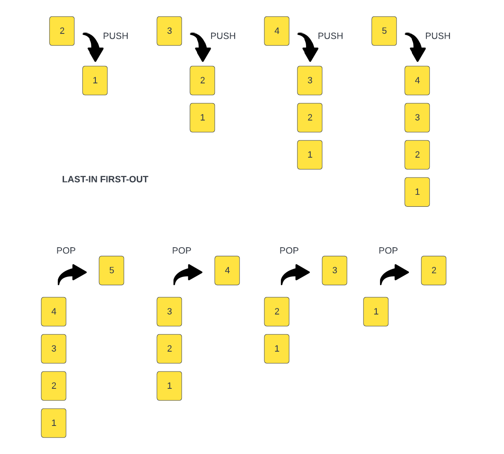
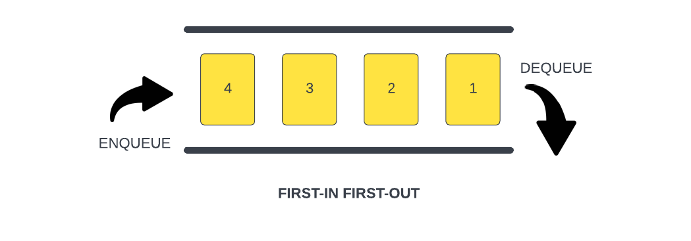
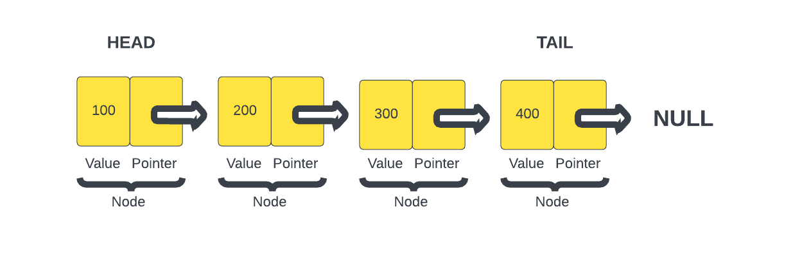

# 00 - Section Intro

# Section Intro

In this section we're going to cover a few things related to concepts that are a little more advanced and not as common. We're going to talk about `iterators`, which are objects that defines a sequence of values. `Generators`, which are used to create iterators and then we're going to move to data structures including `sets` and `maps`, which are built-in to JavaScript, but we're also going to create some data structures that are well known in computer science, but not built in to JavaScript. This includes `stacks`, `queues` and `linked lists`. What we'll do is create some classes that allow us to instantiate an object and give it methods to behave like these data structures. So this stuff is a bit more advanced, but I think you'll learn a lot as we go. So let's get into it.

---


# 01-symbols

# Symbols

It was a long time ago that we talked about the primitive types of JavaScript, such as strings, numbers and booleans, however, we did not really address Symbols, which are also a primitive data type. They are a bit harder to understand than the others, so I wanted to wait a while before we talked about them.

Symbols are used to create unique identifiers for objects. They are created using the `Symbol()` function, which can be called with an optional string as its parameter. This string is used to describe the symbol, and is useful when debugging code. The value that you pass in is strictly for identification. Let's create a couple symbols.

```js
const sym1 = Symbol('foo');
const sym2 = Symbol('bar');

console.log(sym1); // Symbol(foo)
console.log(sym2); // Symbol(bar)
console.log(typeof sym1); // symbol
```

It is important to remember that when we create a symbol, we do not use the `new` keyword. It is not a constructor function. This prevents developers from creating an explicit Symbol wrapper object instead of a new Symbol value. We can do that with strings, numbers and booleans, but not with symbols.

We can get the read-only `description` property of a Symbol, but keep in mind, this is just an identifier, it is not a value.

```js
console.log(Symbol('sym1').description); // sym1
console.log(Symbol().description); // undefined
```

## Symbols are unique

Symbols are unique. So if we do the following, we get false.

```js
console.log(Symbol('sym1') === Symbol('sym1'));
```

This is because the `Symbol()` function creates a new symbol each time it is called. This is why we can pass in a string to the function. It is used to identify the symbol, but it is not used to create the symbol.

One use case for Symbols is when we want to create objects that have private properties. We can use Symbols to create private properties that are not accessible outside of the object. Let's create an object that has a private property.

```js
const user = {
  [Symbol('id')]: 1,
  name: 'John',
  email: 'john@gmail.com',
};

user.id = '123';

console.log(user); // { name: 'John', email: 'john@gmail.com', id: '123', [Symbol(id)]: 1 }
```

Changing the id does not change the symbol value, it just adds a new property to the object.

This will not work either

```js
console.log(user[Symbol('id')]); // undefined
```

So symbols are a good way to hide properties from the outside world. If you're creating a library or something like that.

## Non-Enumerable

We can also see that the symbol is not enumerable. It is not returned when we use `Object.keys()` or `Object.values()`.

```js
console.log(Object.keys(user)); // [ 'name', 'email', 'id' ]
console.log(Object.values(user)); // [ 'John', 'john@gmail.com', '123' ]
```

Since Symbols are not enumerable, we cannot use `for...in` to iterate over them.

```js
for (let key in user) {
  console.log(key);
}
```

## getOwnPropertySymbols

We can use `Object.getOwnPropertySymbols()` to get an array of all the symbols in an object.

```js
console.log(Object.getOwnPropertySymbols(user)); // [ Symbol(id) ]
```

## Well-known Symbols

There are a few well-known symbols that are used by JavaScript. These are used to create special objects that have special properties. For example, the `Symbol.iterator` symbol is used to create objects that are iterable. We will talk about this in a later chapter.

## Symbol.for()

There is another way to create symbols. We can use the `Symbol.for()` function. This function takes a string as its parameter. It will search for an existing symbol that has the same string as its description. If it finds one, it will return that symbol. If it does not find one, it will create a new symbol with the string as its description.

The Symbols are stored in a global symbol registry. So it first checks the registry before creating it. Having it in a global registry means that if we create a symbol using `Symbol.for()`, we can access it from anywhere in our code.

```js
const sym3 = Symbol.for('foo');
const sym4 = Symbol.for('foo');

console.log(sym3 === sym4); // true
```

`sym3` and `sym4` are the same symbol. They are both referencing the same symbol in the global symbol registry.

## Symbol.keyFor()

We can use the `Symbol.keyFor()` function to get the description of a symbol. It takes a symbol as its parameter. It will return the description of the symbol if it is in the global symbol registry. If it is not in the global symbol registry, it will return `undefined`.

```js
console.log(Symbol.keyFor(sym3)); // foo
```

If we use `Symbol()` to create a symbol, it will not be in the global symbol registry, so it will return `undefined`.

```js
console.log(Symbol.keyFor(sym1)); // undefined
```

## toString() & valueOf()

These do exactly what you think. They get the Symbol in string form and the primitive value of the Symbol.

```js
// toString() - returns a string representation of a symbol

console.log(sym1.toString()); // Symbol(sym1)
console.log(sym3.toString()); // Symbol(foo)

// valueOf - returns a primitive value of a symbol
console.log(sym1.valueOf()); // Symbol(sym1)
console.log(sym3.valueOf()); // Symbol(foo)
```

## Well-Known Symbols

There are some well-known symbols, also called 'built-in symbols' that are used by JavaScript engines to provide certain language features and are shared by all built-in objects. For example, `Symbol.iterator` is utilized to iterate over items in arrays, strings, or even to define your own iterator function. We're going to go over iterators very soon and we'll look more into this, but in all honesty, you probably won't use these all too much, but I did want to mention them.

You can actually see all of the built-in symbols by running the following code:

```js
console.log(Object.getOwnPropertyNames(Symbol));

//  ['length', 'name', 'prototype', 'for', 'keyFor', 'asyncIterator', 'hasInstance', 'isConcatSpreadable', 'iterator', 'match', 'matchAll', 'replace', 'search', 'species', 'split', 'toPrimitive', 'toStringTag', 'unscopables']
```

If you want to look more into these, you can, but I would say they're beyond the scope of this course because I only want to focus on things that you'll use on a frequent basis.


---


# 02-iterators

# Iterators

An `iterator` is an object that defines a sequence and potentially a return value upon completion. It's an object that implements the `iterator protocol` by having a `next()` method. The `next()` method returns an object with two properties: `value` and `done`. The `value` property is the value of the next item in the sequence. The `done` property is a boolean that is `true` if the iterator is done with its sequence.

## Iterator Example 1

We're going to create an `app` object that has an array of baseball teams.

```js
const app = {
  teams: ['Red Sox', 'Yankees', 'Astros', 'Dodgers'],
};
```

We want to create an iterator that will iterate through this teams array and return the next team in the sequence. We need to create a function in the object called `next` that returns the next team in the sequence. We also need to create a variable called `nextIndex` that will keep track of the next team in the sequence.

The `next()` function should return an object with a `value` and a `done` property. The `value` property is the next team in the sequence. The `done` property is `true` when the sequence is complete.

```js
const app = {
  nextIndex: 0,
  teams: ['Red Sox', 'Yankees', 'Astros', 'Dodgers'],
  next() {
    if (this.nextIndex >= this.teams.length) {
      return { done: true };
    }

    const returnValue = { value: this.teams[this.nextIndex], done: false };
    this.nextIndex++;
    return returnValue;
  },
};
```

We can call the `next()` function to get the next team in the sequence.

```js
console.log(app.next()); // { value: 'Red Sox', done: false }
console.log(app.next()); // { value: 'Yankees', done: false }
console.log(app.next()); // { value: 'Astros', done: false }
console.log(app.next()); // { value: 'Dodgers', done: false }
console.log(app.next()); // { done: true }
```

We can use a while loop with our iterator.

```js
let next1 = app.next();

while (!next1.done) {
  console.log(next1.value);
  next1 = app.next();
}
```

Now, even though this is an iterator, is not iterable such as a built int Array or Map in JavaScript. We can not use a for...of loop with our iterator.

```js
for (const team of app) {
  console.log(team); // TypeError: app is not iterable
}
```

In order for this to be iterable and work with a for...of loop, we need to add a `Symbol.iterator` to our object.

## Iterator Example 2

In this example, we will do the same thing as the previous example, but we will use the built-in `Symbol.iterator`.

```js
const app = {
  teams: ['Red Sox', 'Yankees', 'Astros', 'Dodgers'],
  [Symbol.iterator]: function () {
    let nextIndex = 0;
    return {
      next: () => {
        return nextIndex < this.teams.length
          ? { value: this.teams[nextIndex++], done: false }
          : { done: true };
      },
    };
  },
};
```

So here, we are using `Symbol.iterator` to create a function where we are returning an object that has a `next()` function. The `next()` function returns the next team in the sequence. If the sequence is complete, it returns `done: true`.

We can use the iterator like this:

```js
const iterator = app[Symbol.iterator]();
console.log(iterator.next().value); // Red Sox
console.log(iterator.next().value); // Yankees
console.log(iterator.next().value); // Astros
console.log(iterator.next().value); // Dodgers
console.log(iterator.next().done); // true
```

We could also use this iterator in a `while` loop.

```js
let next = iterator2.next();

while (!next.done) {
  console.log(next.value);
  next = iterator2.next();
}
```

Or we could use it in a `for...of` loop.

```js
// For of loop
for (const team of app2) {
  console.log(team); // Res Sox, Yankees, Astros, Dodgers
}
```

So we're creating our own iterators. You may not use this stuff right now as a beginner, but it's good to know that this is how iterators work.


---


# 03-generators

# Generators

Generators are similar to iterators. In fact, they are basically used to "generate" iterators. You can use them for the same thing, but they have a much easier syntax and are easier to maintain. Generators are functions that can be paused and resumed. They are created using the `function*` syntax. We can use the `yield` keyword to pause the function. We can also use the `yield*` keyword to delegate to another generator function.

Let's look at an example.

```js
function* createTeamIterator(teams) {
  for (let i = 0; i < teams.length; i++) {
    yield teams[i];
  }
}

const teams = ['Red Sox', 'Yankees', 'Astros', 'Dodgers'];

const iterator = createTeamIterator(teams);

console.log(iterator.next().value); // Red Sox
console.log(iterator.next().value); // Yankees
console.log(iterator.next().value); // Astros
console.log(iterator.next().value); // Dodgers
console.log(iterator.next().done); // true
```

As you can see, we get the same results as we did with the iterator. The only difference is that the syntax is much easier to read and maintain.

We can also use a for...of loop with a generator.

```js
for (const team of createTeamIterator(teams)) {
  console.log(team);
}
```

Or we can use a spread operator.

```js
console.log([...createTeamIterator(teams)]);
```

We can also use `destructuring` to get the values.

```js
const [first, second, third] = createTeamIterator(teams);
console.log(first, second, third);
```


---


# 04-profile-scroller-project

# Profile Scroller Project

In this project, we will use a simple generator function to create a dating app profile scroller. We are using people, but you could use any type of data.

## The HTML

Here is the HTML. There is a dummy person in the HTML, but we will be using JavaScript to add more people.

```html
<div class="container">
  
  <div class="profile-info">
    <h3>Jamie Williams</h3>
    <p>26 Years Old</p>
    <p>From London, UK</p>
    <p>Female looking for male</p>
    <button id="next">Show Next</button>
  </div>
</div>
``` 
## The CSS 

We have some simple CSS 

```css @import
url('https://fonts.googleapis.com/css2?family=Poppins:wght@300;400;500;600;700&display=swap');
body { font-family: 'Poppins', sans-serif; background: #f5f5f5; font-size: 18px;
} .container { width: 400px; margin: 100px auto; padding: 40px 20px; background:
#fff; border: 1px solid #ccc; border-radius: 5px; box-shadow: 0 0 10px #ccc;
text-align: center; } img { border-radius: 50%; } button { background: purple;
color: #fff; border: 1px solid #ccc; border-radius: 10px; padding: 14px 25px;
margin: 10px; cursor: pointer; font-size: inherit; } button:hover { background:
#fff; color: purple; }
```

## The JavaScript

Let's create an array of people with their info.

```js
const people = [
  {
    name: 'John Smith',
    age: 35,
    gender: 'male',
    location: 'New York, NY',
    imageURL: 'https://randomuser.me/api/portraits/men/1.jpg',
    looking: 'Male looking for female',
  },
  {
    name: 'Jamie Williams',
    age: 26,
    gender: 'female',
    location: 'Los Angeles, CA',
    imageURL: 'https://randomuser.me/api/portraits/women/1.jpg',
    looking: 'Female looking for male',
  },
  {
    name: 'Bob Johnson',
    age: 42,
    gender: 'male',
    location: 'Chicago, IL',
    imageURL: 'https://randomuser.me/api/portraits/men/2.jpg',
    looking: 'Male looking for male',
  },
  {
    name: 'Shannon Jackson',
    age: 29,
    gender: 'female',
    location: 'Los Angeles, CA',
    imageURL: 'https://randomuser.me/api/portraits/women/2.jpg',
    looking: 'Female looking for female',
  },
];
```

In a real-world app, this would be coming from an API.

Let's bring in everything we need from the DOM.

```js
const container = document.querySelector('.container');
const img = container.querySelector('img');
const profileInfo = container.querySelector('.profile-info');
const nextBtn = container.querySelector('#next');
```

Now we can create a generator function that will yield a person from the array. We will then set the generator to a variable called `generator`.

```js
function* peopleGenerator() {
  let index = 0;
  while (true) {
    yield people[index++ % people.length];
  }
}

const generator = peopleGenerator();
```

Now we will create the event listener for the button. When the button is clicked, we will get the next person from the generator and set the DOM elements to the new person's info. We will also make the initial 'click' to get the first person.

```js
nextBtn.addEventListener('click', () => {
  const person = generator.next().value;
  img.src = person.imageURL;
  profileInfo.querySelector('h3').textContent = person.name;
  profileInfo.querySelectorAll('p')[0].textContent = `${person.age} Years Old`;
  profileInfo.querySelectorAll('p')[1].textContent = `From ${person.location}`;
  profileInfo.querySelectorAll('p')[2].textContent = person.looking;
});

nextBtn.click();
```

Now we have a profile scroller. You can click the `next` button and it will show the next person. Feel free to add more people to the array.


---


# 05-sets

# Sets

Sets are a data structure that allows you to store a collection of unique values. They are unordered and they do not allow duplicates. Sets are useful when you want to store a collection of values that you want to check for membership, but you don't care about the order of the values.

## Creating a Set

To create a set, you use the `new Set()` constructor. You can pass in an iterable, such as an array, to initialize the set with values.

```js
const set = new Set([1, 2, 3, 4]);
```

Sets contain only unique values. If you try to add a value that already exists in the set, it will be ignored.

```js
const set = new Set([1, 2, 2, 3, 3, 4]);
// set = {1, 2, 3, 4, 5}
```

## Adding to a Set

To add a value to a set, you use the `add()` method.

```js
set.add(5);
```

## Checking for Membership

To check if a value is in a set, you use the `has()` method.

```js
set.has(5); // true
set.has(6); // false
```

## Removing from a Set

To remove a value from a set, you use the `delete()` method.

```js
set.delete(5);
set.has(5); // false
```

## Converting a Set to an Array

To convert a set to an array, you use the `Array.from()` method.

```js
const setArray = Array.from(set);
```

## Converting an Array to a Set

To convert an array to a set, you use the `new Set()` constructor.

```js
const arraySet = new Set([1, 2, 3, 4, 5]);
```

## Iterating using a for...of loop

To iterate through a set, you can use a `for...of` loop.

```js
for (let item of set) {
  console.log(item);
}
```

## Create an iterator

To create an iterator, you use the `values()` method.

```js
const iterator = set.values();

console.log(iterator.next()); // {value: 1, done: false}
console.log(iterator.next()); // {value: 2, done: false}
console.log(iterator.next()); // {value: 3, done: false}
console.log(iterator.next()); // {value: 4, done: false}
console.log(iterator.next()); // {value: undefined, done: true}
```

This should make sense after the last few lessons.

## Clear the set

```js
set.clear();
```

In the next lesson, we'll look at maps.


---


# 06-maps

# Maps

Maps are another data structure that we can use in JavaScript. Maps were introduced in ES6. They are similar to objects, but the keys can be ANY type, not just strings. You can even have an object or an array for a key. Maps are iterable, so we can loop through them as well.

## The Map Object

The Map object is a collection of keyed data items, just like an Object. But the main difference is that Map allows keys of any type.

```js
const map = new Map();
```

We can add data to a map using the `set` method.

```js
map.set('name', 'John');
map.set(1, 'Number One');
```

We can get data from a map using the `get` method.

```js
map.get('name'); // John
map.get(1); // Number One
```

We can also use the `size` property to get the number of items in the map.

```js
map.size; // 2
```

We can also use the `has` method to check if a key exists in the map.

```js
map.has('name'); // true
map.has('age'); // false
```

We can also use the `delete` method to remove a key-value pair from the map.

```js
map.delete('name');
map.size; // 1
```

We can also use the `clear` method to remove all key-value pairs from the map.

```js
map.clear();
map.size; // 0
```

We can also use the `forEach` method to loop through the map. Let's create a new map and add some data to it.

```js
const peopleMap = new Map();
map.set('Brad', { phone: '555-555-5555', email: 'brad@gmail.com' });
map.set('John', { phone: '555-555-5555', email: 'john@gmail.com' });
map.set('Jill', { phone: '555-555-5555', email: 'jill@gmail.com' });
```

Now we can loop through the map using the `forEach` method.

```js
peopleMap.forEach((person) => {
  console.log(person.email);
});
```

We can also get the `keys`, `values` and `entries` from the map. These 3 methods return an iterator, so this should make sense if you watched the videos on iterators.

```js
peopleMap.keys(); // MapIterator {"Brad", "John", "Jill"}
peopleMap.values(); // MapIterator {{…}, {…}, {…}}
peopleMap.entries(); // MapIterator {"Brad" => {…}, "John" => {…}, "Jill" => {…}}
```

Let's use the `next()` method to get the first value from the `keys` iterator.

```js
const iterator = peopleMap.values();

console.log(iterator.next());
console.log(iterator.next());
console.log(iterator.next());
console.log(iterator.next());
```

To convert a map to an array, we can use the `Array.from` method.

```js
const peopleArray = Array.from(peopleMap);
```

To convert to an array of values, we can use the `Array.from` method and pass in the `values` method.

```js
const peopleArray = Array.from(peopleMap.values());
```

To convert to an array of keys, we can use the `Array.from` method and pass in the `keys` method.

```js
const peopleArray = Array.from(peopleMap.keys());
```


---


# 07-poll-project

# Poll Project

In this project, we will create a very simple poll application that uses a `Map` to keep track of the votes. Like with anything else, using a `Map` in an actual project, helps you understand it better.

We will create a poll form to vote for your favorite JavaScript framework. The poll will have 5 options, and the user can only vote for one option. The results will be displayed after the user votes.

## The HTML

I used Bootstrap 5 for this project. Here is the HTML with the Bootstrap classes:

```html
<!DOCTYPE html>
<html lang="en">
  <head>
    <meta charset="UTF-8" />
    <meta http-equiv="X-UA-Compatible" content="IE=edge" />
    <meta name="viewport" content="width=device-width, initial-scale=1.0" />
    <link
      href="https://cdn.jsdelivr.net/npm/bootstrap@5.3.0-alpha1/dist/css/bootstrap.min.css"
      rel="stylesheet"
      integrity="sha384-GLhlTQ8iRABdZLl6O3oVMWSktQOp6b7In1Zl3/Jr59b6EGGoI1aFkw7cmDA6j6gD"
      crossorigin="anonymous"
    />
    <script src="script.js" defer></script>

    <title>Poll</title>
  </head>
  <body class="bg-light">
    <div class="card w-50 m-auto border-round mt-5 shadow-lg">
      <div class="card-header bg-primary text-white text-center">
        <h1>Favorite JS Framework</h1>
      </div>
      <div class="card-body p-5 fs-4">
        <form id="poll-form">
          <div class="form-check m-2 p-3 border-bottom">
            <input
              class="form-check-input"
              type="radio"
              name="poll-option"
              id="poll-option"
              value="React"
            />
            <label class="form-check-label" for="poll-option"> React </label>
          </div>
          <div class="form-check m-2 p-3 border-bottom">
            <input
              class="form-check-input"
              type="radio"
              name="poll-option"
              id="poll-option"
              value="Vue"
            />
            <label class="form-check-label" for="poll-option"> Vue </label>
          </div>
          <div class="form-check m-2 p-3 border-bottom">
            <input
              class="form-check-input"
              type="radio"
              name="poll-option"
              id="poll-option"
              value="Angular"
            />
            <label class="form-check-label" for="poll-option"> Angular </label>
          </div>

          <div class="form-check m-2 p-3 border-bottom">
            <input
              class="form-check-input"
              type="radio"
              name="poll-option"
              id="poll-option"
              value="Svelte"
            />
            <label class="form-check-label" for="poll-option"> Svelte </label>
          </div>

          <div class="form-check m-2 p-3">
            <input
              class="form-check-input"
              type="radio"
              name="poll-option"
              id="poll-option"
              value="Other"
            />
            <label class="form-check-label" for="poll-option"> Other </label>
          </div>

          <input
            type="submit"
            value="Submit"
            class="btn btn-dark btn-lg btn-block w-100 mt-5"
          />
        </form>

        <div id="results" class="m-4"></div>
      </div>
    </div>
  </body>
</html>
```

## The JavaScript`

Let's create a map to correspond to the options in the poll. The keys will be the options, and the values will be the number of votes for each option. The values will be set to 0 initially.

```js
const poll = new Map();
poll.set('React', 0);
poll.set('Vue', 0);
poll.set('Angular', 0);
poll.set('Svelte', 0);
poll.set('Other', 0);
```

Let's setup an event listener for the form. When the user submits the form, we will get the value of the selected option, and increment the corresponding value in the map.

```js
document.getElementById('poll-form').addEventListener('submit', submitForm);

function submitForm(e) {
  e.preventDefault();
  const selectedOption = document.querySelector(
    "input[name='poll-option']:checked"
  );

  if (!selectedOption) {
    alert('Please select an option');
    return;
  }

  let voteCount = poll.get(selectedOption.value);
  poll.set(selectedOption.value, voteCount + 1);
  displayResults();
}
```

We are using the `get()` method to get the value of the selected option. We are also using the `set()` method to increment the value of the selected option.

Let's create a function to display the results. We will loop through the map and display the results in a list.

```js
function displayResults() {
  const results = document.getElementById('results');
  results.innerHTML = '';
  for (let [option, votes] of poll) {
    const optionElement = document.createElement('div');
    optionElement.classList.add(
      'border-bottom',
      'p-2',
      'd-flex',
      'justify-content-between'
    );
    optionElement.innerHTML = `<strong>${option}:</strong> ${votes} votes`;
    results.appendChild(optionElement);
  }
}
```

When you vote, you will see each option and the number of votes for that option. TO make it so the user can only vote once, we can disable the form after the user votes.

Add this to the `submitForm()` function:

````js
 // disable form fields and submit button
  document
    .getElementById('poll-form')
    .querySelectorAll('input, button')
    .forEach((el) => {
      el.setAttribute('disabled', true);
    });
    ```
````


---


# 08-stacks

# Stacks

So we have looked at built-in data structures like arrays, objects, sets and maps, but now I want to cover some custom data structures. We'll start with stacks, which if you've been following along, you should already be somewhat familiar with because we talked about the `call stack` earlier in the course.

Stacks are `LIFO` (Last In First Out) data structures. The last item added to the stack will be the first item removed from the stack. We talked about stacks way back when we were looking at the call stack. The call stack is a stack of functions that are called. The last function called is the first function to be removed from the stack.



Since stacks are not built in to JavaScript, we will have to create our own.
We will create a class called `Stack` that will have the following methods:

- `push()`
- `pop()`
- `peek()`
- `length()`
- `isEmpty()`

We will have a constructor where we initialize our data. We will use an array to store our data. We will also have a `count` property that will keep track how many items are in the stack. We will use underscores, because they are all private properties, meaning the should not be accessed outside of the class.

```js
class Stack {
  constructor() {
    this._items = [];
    this._count = 0;
  }
}
```


## `push()`
Now we can add the `push()` method. This method will add an item to the top of the stack. Some people just use the built in `push()` method for arrays, but we are going to do this without any help from pre-defined methods. We will use the count as the index and set the item. Then increment the count by 1,

```js
  push(item) {
    this._items[this._count] = item;
    this._count++;
  }
```

## `pop()`

Now we can add the `pop()` method. This method will remove an item from the top of the stack. Again, we could take the easy way out and use the `Array.prototype.pop()` method, but we want this to be barebones.

First, we check to see if the stack is empty and return "Underflow" if it is. That;s what it's called when you try and pop off an item that is not there. It's the opposite of a stack overflow.

Then we store the last item of the stack into a variable 'item'. This item is going to be returned at the end of the method.

It decrements the count property by 1, to reflect that the stack now has one less item.

It starts a for loop, where the variable `i` is initialized to the value of the count, and the loop continues as long as `i` is less than the length of the items array.

Inside the for loop, the method assigns the value of this.items[i+1] to this.items[i]. This has the effect of shifting all items in the array to the left by one index. This way it removes the last item of the array by shifting all the items to the left by one index.

The variable i is incremented by one on each iteration, so the loop can continue processing the next item of the array.

The loop continues until all the items have been shifted to the left.

Finally, the method updates the length property of the items array to the value of the count property. This reduces the length of the array, effectively removing the last item.

The last step is returning the variable 'item' that was stored in the first step. This variable holds the value of the last item of the stack before poping it out.

```js
pop() {
   if (this._count === 0) {
      return 'Underflow';
    }
    const item = this._items[this._count - 1];
    this.count--;
    for (let i = this._count; i < this._items.length; i++) {
      this._items[i] = this._items[i + 1];
    }
    this._items.length = this._count;
    return item;
  }
```

## `isEmpty()`

We will need to check if the count is === 0 a couple times, so let's create an `isEmpty()` method

```js
isEmpty() {
  return this._count === 0;
}
```

Add the `isEmpty()` to the `pop()` method

```js
 if (this.isEmpty()) {
  return 'Underflow';
}
```

Now we can add the `peek()` method. This method will return the item at the top of the stack. We will return the item from the `data` array with an indec that is 1 less than the count.

## `peek()`

```js
  peek() {
    if (this.isEmpty()) {
      return 'No items in Stack';
    }
    return this._items[this._count - 1];
  }
```

## `length()`

Now we can add the `length()` method. This method will return the length of the stack. We will return the `count` property.

```js
length() {
  return this._count;
}
```

## `clear()`

This will clear all items and set the count to 0

```js
  clear() {
    this._items = [];
    this._count = 0;
  }
```


Now we can create a new instance of the `Stack` class and add some items to it.

```js
const stack = new Stack();
```

At the bottom of the script, let's check the length, top item and if empty

```js
console.log('Top item: ', stack.peek());
console.log('Stack Length: ', stack.length());
console.log(stack.isEmpty() ? 'Stack is empty' : 'Stack is not empty');
```

Let's add some items

```js
stack.push('First Item');
stack.push('Second Item');
```

We should see a length of `2` and a top item of `Second Item`

Let's add a couple more items. We will add some strings

```js
stack.push('Third Item');
stack.push('Fourth Item');
```

Now we should see a length of `4` and a top item of `Fourth Item`

Let's remove an item

```js
stack.pop();
```

We should see a length of `3` and a top item of `Third Item`

Let's remove a couple more items

```js
stack.pop();
stack.pop();
```

You should be able to call `stack.clear()` at any time and it will clear all items.

We should see a length of `1` and a top item of `First Item`

So we have created a stack class that we can use in our applications. We can use this class to create a stack of any type of data.


---


# 09-queues

# Queues

Queues are another type of data structure specifically designed to operate in a FIFO context (first-in first-out), where items are inserted into one end of the container and extracted from the other.



We saw an example of this when we looked at the JavaScript `Task Queue`. The `Task Queue` is a queue of functions that are waiting to be executed. The first function in the queue is the first function to be executed.

Let's create a class called `Queue` that will have the following methods:

- `enqueue()`
- `dequeue()`
- `peek()`
- `length()`
- `isEmpty()`

We will have a constructor where we initialize our data. We will use an array to store our data. We will also have a `count` and a `front` property that will keep track of the front of the queue. We will use udnescores to signify that these are private properties.

```js
class Queue {
  constructor() {
    this._items = [];
    this._count = 0;
    this._front = 0;
  }
}
```

## `enqueue()`

Now we can add the `enqueue()` method. It takes in a single parameter, item, which is the item that is being added to the queue.

It assigns the value of the item parameter to the next empty index of the `items` array. The next empty index is determined by the current value of the `count` property. Then it increments the `count` property by 1 to reflect that the queue now has one more item.

```js
 enqueue(item) {
    this._items[this._count] = item;
    this._count++;
  }
```

## `dequeue()`

Now we can add the `dequeue()` method. This method will remove an item from the front of the queue. We first check to see if there is anythin in the queue.

It stores the first element of the queue into a variable 'item'. This element is going to be returned at the end of the method.

It starts a for loop, where `i` is initialized to the value of the `first` property, and the loop continues as long as `i` is less than the `count` property - 1.

Inside the for loop, the method assigns the value of `this._items[i+1]` to `this._items[i]`. This way it removes the first element of the array by shifting all the elements to the left by one index.

Then `i` is incremented by one on each iteration, so the loop can continue processing the next element of the array.

Finally, the method decrements the `count` property by 1 to reflect that the queue now has one less item, and updates the length property of the `items` array to the value of the `count` property. This reduces the length of the array, effectively removing the first element.

```js
dequeue() {
    if (this._count === 0) {
      return 'Underflow';
    }
    const item = this._items[this._front];
    for (let i = this._front; i < this._count - 1; i++) {
      this._items[i] = this._items[i + 1];
    }
    this._count--;
    this._items.length = this._count;
    return item;
  }
```

## `isEmpty()`

Let's add a method to check to see if the queue is empty

```js
isEmpty() {
    return this.length() === 0;
  }
```

You can then add that to the `dequeue()` method

```js
if (this.isEmpty()) {
      return 'Underflow';
    }
```

## `peek()`
Now we can add the `peek()` method. This method will return the item at the front of the queue. We will return the item from the `data` array at the `front` property.

```js
 peek() {
    if (this.isEmpty()) {
      return 'No items in Queue';
    }
    return this._items[this._front];
  }
```

## `length()`

Now we can add the `length()` method. This method will return the length of the queue. We will return the `back` property minus the `front` property.

```js
length() {
  return this.back - this.front;
}
```


Now we can create a new instance of the `Queue`

```js
const queue = new Queue();
```

Lets show the front item, lenth and if empty

```js
console.log('Front Item: ', queue.peek());
console.log('Queue Length: ', queue.length());
console.log(queue.isEmpty() ? 'Queue is empty' : 'Queue is not empty');
```

Above that, go ahead and add a couple items

```js
queue.enqueue('First item');
queue.enqueue('Second item');
queue.enqueue('Third item');
```

You should see the first item as the front

Let's remove an item

```js
queue.dequeue();
```

Now you should see the second item as the front

So you can see that the `Queue` class is working as expected, which is first in first out.


---


# 10-linked-lists

# Linked Lists

A linked list is a data structure that contains a sequence of nodes. They are similar to arrays, but the difference is that elements are not stored in a particular memory location or index. Rather, each element is a separate object that contains a pointer or a link to the next object in that list.

Linked Lists are a common interview question. You probably won't use them in your day to day work, but learning this stuff helps your overall understanding of data structures and programming in general.

Let's look at a diagram to help you visualize a linked list.



As you can see a linked list is made up of `nodes`. Each node contains a `value` and a `pointer` to the next node. The first node is called the `head` and the last node is called the `tail`. The `tail` node will point to `null` since there is nothing after it.

Before, we crate our class, I'll just use object literals to represent our nodes.

```js
const node1 = {
  value: 100,
};

const node2 = {
  value: 200,
};
```

Here we just have two nodes. We can connect them by setting the `next` property on `node1` to be `node2`.

```js
node1.next = node2;
```

Now we have a linked list with two nodes. We can add more nodes by setting the `next` property on `node2` to be another node.

```js
const node3 = {
  value: 300,
};

node2.next = node3;
```

That is a very simplistic example of a linked list.

Now, we will create 2 classes, a `Node` class and a `LinkedList` class. The `Node` class will represent a node in the linked list. It will have a `value` property and a `next` property. The `next` property will point to the next node in the list.

```js
class Node {
  constructor(value) {
    this.value = value;
    this.next = null;
  }
}
```

We can initialize a node with:

```js
const node1 = new Node(100);
console.log(node1); // Node { value: 100, next: null }
```

Don't leave this in your code, it is just to show you how we will be initializing nodes within the `LinkedList` class.

Let's create a class called `LinkedList` that will have the following methods:

- `insertFirst()`
- `insertLast()`
- `insertAt()`
- `getAt()`
- `removeAt()`
- `printListData()`
- `clearListData()`

We will have a constructor where we initialize our data. We will use a `head` property to keep track of the first node in the list and a `tail` property to keep track of the last node in the list. I am also going to add some comments for the methods that we will be creating.

```js
class LinkedList {
  constructor(value) {
    this.head = null;
    this.length = 0;
  }

  // Insert first node (head)

  // Insert last node (tail)

  // Insert at index

  // Get at index

  // Remove at index

  // Print the list data

  // Clear list data
}
```

## `insertfirst()`

We pass in the data for this node. Then we initialize a new node using the `Node` class. We set the `next` property on the new node to be the `head` property. Then we set the `head` property to be the new node. Finally, we increment the `length` property by `1`.

```js
  // Insert first node (head)
  insertFirst(data) {
    const newNode = new Node(data);
    newNode.next = this.head;
    this.head = newNode;
    this.length++;
  }
```

We can test this method by creating a new instance of the `LinkedList` class and calling the `insertFirst()` method.

```js
const list = new LinkedList();
list.insertFirst(100);
console.log(list); // LinkedList { head: Node { value: 100, next: null }, length: 1 }
```

The `head` property is now pointing to the new node, which has a `value` of 100 and a `next` value pointing to `null` because it is the only node in the list. The `length` property is now `1`.

If we add another node with...

```js
list.insertFirst(200);
console.log(list); // LinkedList { head: Node { value: 200, next: Node { value: 100, next: null } }, length: 2 }
```

That node with the value of `200` is now the `head` of the list. The `next` property on that node is pointing to the node with the value of `100`. The `length` property is now `2`.

## `insertLast()`

Now we want to be able to add a node to the end of the list. We will create a method called `insertLast()`.

```js
  // Insert last node (tail)
  insertLast(data) {
    const newNode = new Node(data);
    let current = this.head;
    while (current.next) {
      current = current.next;
    }
    current.next = newNode;
    this.length++;
  }
```

We create a new node with the data that is passed in. Then we create a variable called `current` and set it to the `head` property. We use a `while` loop to loop through the list until we get to the `tail` node. The `tail` node will have a `next` property of `null`. We set the `next` property on the `tail` node to be the new node. Finally, we increment the `length` property by `1`.

We can test this method by creating a new instance of the `LinkedList` class and calling the `insertLast()` method.

```js
const list = new LinkedList();
list.insertFirst(100);
list.insertFirst(200);
list.insertFirst(300);
list.insertLast(400);
console.log(list);
```

Now the `tail` node has a `value` of `400` and a `next` property of `null`. The `length` property is now `4`.

## `printListData()`

Let's jump down to the `printListData()` method. This will help us see the data in the list.

```js
  // Print the list data
  printListData() {
    let current = this.head;
    let list = '';
    while (current) {
      list += current.value + ' ';
      current = current.next;
    }
    console.log(list);
  }
```

We create a variable called `current` and set it to the `head` property. We create a variable called `list` and set it to an empty string. We use a `while` loop to loop through the list. We add the `value` property of the current node to the `list` variable. We then set the `current` variable to be the `next` property on the current node. We log the `list` variable to the console.

We can test this method by creating a new instance of the `LinkedList` class and calling the `printListData()` method.

```js
const list = new LinkedList();
list.insertFirst(100);
list.insertFirst(200);
list.insertFirst(300);
list.insertLast(400);
list.printListData(); // 300 200 100 400
```

## `insertAt()`

Now we want to be able to insert a node at a specific index. We will create a method called `insertAt()`.

```js
  // Insert at index
  insertAt(data, index) {
    if (index > 0 && index > this.length) {
      return;
    }

    if (index === 0) {
      this.insertFirst(data);
      return;
    }

    const newNode = new Node(data);
    let current, previous;
    current = this.head;
    let count = 0;

    while (count < index) {
      previous = current;
      count++;
      current = current.next;
    }

    newNode.next = current;
    previous.next = newNode;
    this.length++;
  }
```

We check if the index is greater than 0 and greater than the length of the list. If it is, we return. If the index is `0`, we call the `insertFirst()` method. We create a new node with the data that is passed in. Then we create a variable called `current` and set it to the `head` property. We create a variable called `previous` and set it to `null`. We create a variable called `count` and set it to `0`. We use a `while` loop to loop through the list until we get to the index that we want to insert the node at. We set the `previous` variable to be the `current` variable. We increment the `count` variable by `1`. We set the `current` variable to be the `next` property on the `current` variable. We set the `next` property on the `newNode` to be the `current` variable. We set the `next` property on the `previous` variable to be the `newNode` variable. Finally, we increment the `length` property by `1`.

We can test this method by creating a new instance of the `LinkedList` class and calling the `insertAt()` method.

```js
const list = new LinkedList();
list.insertFirst(100);
list.insertFirst(200);
list.insertFirst(300);
list.insertLast(400);
list.insertAt(500, 2);
list.printListData(); // 300 200 500 100 400
```

## `getAt()`

Now we want to be able to get a node at a specific index. We will create a method called `getAt()`.

```js
  // Get at index
  getAt(index) {
    let current = this.head;
    let count = 0;
    while (current) {
      if (count == index) {
        console.log(current.value);
      }
      count++;
      current = current.next;
    }
    return null;
  }
```

We create a variable called `current` and set it to the `head` property. We create a variable called `count` and set it to `0`. We use a `while` loop to loop through the list. We check if the `count` variable is equal to the index that we want to get. If it is, we log the `value` property of the current node to the console. We increment the `count` variable by `1`. We set the `current` variable to be the `next` property on the `current` variable. We return `null` if the index is not found.

We can test this method by creating a new instance of the `LinkedList` class and calling the `getAt()` method.

```js
const list = new LinkedList();
list.insertFirst(100);
list.insertFirst(200);
list.insertFirst(300);
list.insertLast(400);
list.insertAt(500, 2);
list.getAt(2); // 500
list.getAt(3); // 100
```

## `removeAt()`

Now we want to be able to remove a node at a specific index. We will create a method called `removeAt()`.

```js
  // Remove at index
  removeAt(index) {
    if (index > 0 && index > this.length) {
      return;
    }

    let current = this.head;
    let previous;
    let count = 0;

    if (index === 0) {
      this.head = current.next;
    } else {
      while (count < index) {
        count++;
        previous = current;
        current = current.next;
      }
      previous.next = current.next;
    }
    this.length--;
  }
```

We check if the index is greater than 0 and greater than the length of the list. If it is, we return. We create a variable called `current` and set it to the `head` property. We create a variable called `previous` and set it to `null`. We create a variable called `count` and set it to `0`. If the index is `0`, we set the `head` property to be the `next` property on the `current` variable. Otherwise, we use a `while` loop to loop through the list until we get to the index that we want to remove the node at. We increment the `count` variable by `1`. We set the `previous` variable to be the `current` variable. We set the `current` variable to be the `next` property on the `current` variable. We set the `next` property on the `previous` variable to be the `next` property on the `current` variable. Finally, we decrement the `length` property by `1`.

We can test this method by creating a new instance of the `LinkedList` class and calling the `removeAt()` method.

```js
const list = new LinkedList();
list.insertFirst(100);
list.insertFirst(200);
list.insertFirst(300);
list.insertLast(400);
list.insertAt(500, 2);
list.printListData(); // 300 200 500 100 400
list.removeAt(2);
list.printListData(); // 300 200 100 400
```

As you can see, the value of `500` was removed from the list.

## `clearList()`

Now we want to be able to clear the list. We will create a method called `clearList()`.

```js
  // Clear list
  clearList() {
    this.head = null;
    this.length = 0;
  }
```

We set the `head` property to `null` and set the `length` property to `0`.

We can test this method by creating a new instance of the `LinkedList` class and calling the `clearList()` method.

```js
const list = new LinkedList();
list.insertFirst(100);
list.insertFirst(200);
list.insertFirst(300);
list.insertLast(400);
list.insertAt(500, 2);
list.printListData(); // 300 200 500 100 400
list.clearList();
list.printListData(); // ""
```

That's it, we have now created a linked list data structure in JavaScript.
