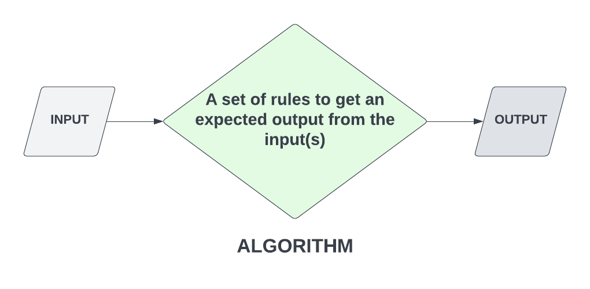

# 01-what-are-algorithms

# What Are Algorithms? / Section Intro

We looked at some data-structures, which really help you become a better programmer and are also very popular in software development job interviews. Algorithms are another side of the same coin. In fact, you hear the term "data structures and algorithms" a lot. In this section, we'll be not only solving some algorithms, but we'll be writing unit-tests to run to see if we did them correctly. I'll talk more about testing in the next lesson. Let's look at what an algorithm actually is.

Algorithms are used in computer programming to solve problems. They are also used in mathematics, science, engineering, and many other fields.

I like to keep things as simple as possible, so a simple explanation is that an algorithm is a set of instructions for accomplishing a task. Usually, you have an input or a set of inputs that you run through an algorithm to get an expected output. People like to think algorithms have to be this crazy braniac type thing that only tech geniuses can solve, but the truth is, an algorith can be as simple as a `getSum(n1, n2)` function. You're passing in input, in the form of function arguments, which are the 2 numbers to be added and you have an expected output. You can also write tests to validate that algorithm. In fact, that will the first test we write.



We did the FizzBuzz challenge a while ago when we were learnig about loops. That's actually a very popular algorithm for job interviews.

This section is going to have challenges that you can either stop and try yourself or just follow along to see the solution. I would encourage you to try them yourself. Im almost hesitant to say that because solving algorithms is a skill that takes time to develop. It's not something that you can just pick up and do. There are many of you that won't be able to do any of these on your own. Just know that that is absolutely fine.

For those of you that do want to try them on your own, keep in mind that you can search for the methods and functions that you need to solve the problem.

These problems will rnge from easy to intermediate. We're not really doing anything advanced because that's just not what this course is.

IN the next lession, we'll talk a little bit more about testing.


---


# 02-what-is-unit-testing

# What is Unit Testing

In software development, we often write tests to test our code. This is especially true for really large projects that teams work on. Now, testing can be a little controversial because it's quite divisive. Some developers say that you always need to test your code, some say it's a waste of precious time. Of course, there is no right or wrong opinion, like most things, it comes down to the developer and the project. Either way, it's good to at least know the basics.

There's many different types of testing. There's unit testing, end-to-end testing, there's integration testing, etc. For the purposes of this course, we're going to be focusing on unit testing, which is one of, if not the most common type. It's also usually the first type of testing done on a project.

Unit testing is a way of testing individual pieces of code, called units. Usually the unit you're testing is a function. It is a method of testing where you write test scripts that check if the code is doing what it's supposed to do. For example, if you have a function that adds two numbers together, you would write a test that calls the function with the numbers 1 and 2 and checks that the output is 3. If the function passes the test, it is working correctly. If it fails, it means there is a problem that needs to be fixed.

## Jest

There are all kinds of testing libraries and frameworks, not just for JavaScript, but for any language. Many of them are similar, they just have a different syntax. We will be using a very popular framework called **Jest**. Jest is pretty easy to use, there isn't even any needed configuration. We can install it with NPM and then just start writing tests. Jest is also very popular, so there's a lot of documentation and tutorials out there, including my own.

This is a very simple example that tests a function called `sum()`. We use the test() function and add a description of what should happen. Then we pass in a callback with an expect function that gets the function that we're testing passed in and then we're using the toEqual() method to see if it equals 3. There's all kinds of methods you can use.

## Testing Algorithms

What we'll be doing is writing a test for each algorithm to make sure that we do it correctly and get the right output. I'm trying to kill two birds with one stone here and teach you basic unit testing as well as problem solving with algorithms. I think it's a good combination.

In the next video, we will get Jest installed and setup our files.


---


# 03-jest-unit-testing

# Unit Testing With Jest

Now, we're going to get setup with **Jest**, so that we can write unit tests.

Create a new folder to work in. You can call it whatever you want, but I'm going to call it `unit-testing-algorithms`.

We will be installing Jest using NPM, so we first need to run `npm init` to create a `package.json` file.

### Install Jest

Then, we can install Jest with

```bash
npm install -D jest
```

We are installing it as a dev-dependency, because we only need it for development.

### Create a .gitignore file

Next, create a `.gitignore` file and add `node_modules` to it. This will prevent the `node_modules` folder from being added to the repository.

### Create the test script

In your `package.json` file, add a `test` script:

```json
"scripts": {
  "test": "jest"
}
```

Now, when we need to run our tests, we just run `npm test`.

The way it works, is any file where we want to test, we make a file with the same name, but with `.test.js` at the end. For example, if we want to test a file called `sum.js`, we would create a file called `sum.test.js`.

Let's create a file called `sum.test.js` and add the following code:

```js
const sum = require('./sum');

test('adds 1 + 2 to equal 3', () => {
  expect(sum(1, 2)).toEqual(3);
});
```

We are importing the `sum` function from the `sum.js` file. Then, we are using the `test` function to create a test. The first argument is the name of the test, and the second argument is a function that contains the actual test, which is we expect to get 3 as an output, when we have an input of 1 and 2.

Let's run the test with `npm test`. You should see a fail message like this

```bash
 FAIL  ./sum.test.js
  × adds 1 + 2 to equal 3

  ● adds 1 + 2 to equal 3

    TypeError: sum is not a function

      2 |
      3 | test('adds 1 + 2 to equal 3', () => {
    > 4 |   expect(sum(1, 2)).toBe(3);
        |          ^
      5 | });
      6 |

      at Object.sum (sum.test.js:4:10)

Test Suites: 1 failed, 1 total
Tests:       1 failed, 1 total
Snapshots:   0 total
Time:        0.351 s, estimated 1 s
```

Obviously, this will fail because we did not even create a `sum()` function yet.

It will show how many tests ran, passed and failed and will also give us an error message.

In your `sum.js` file, add the following code:

```js
function sum(a, b) {
  return a + b;
}

module.exports = sum;
```

Now, when you run `npm test`, you should see a success message like this:

```bash
 PASS  ./sum.test.js
  √ adds 1 + 2 to equal 3 (1 ms)

Test Suites: 1 passed, 1 total
Tests:       1 passed, 1 total
Snapshots:   0 total
Time:        0.413 s, estimated 1 s
```

Congrats! You just wrote your first unit test!


---


# 04-grouping-tests-describe

# Grouping Tests With `describe()`

In the last lesson, we used the `test()` function to create a test. However, we can also use the `describe()` function to group tests together. This is useful when we have a lot of tests for a single function.

Let's take it a step further and write some tests for the FizzBuzz algorithm. We did this challenge a while back. Basically, it needs to return `Fizz` if the number is divisible by 3, `Buzz` if the number is divisible by 5, `FizzBuzz` if the number is divisible by both 3 and 5, and the number itself if it is not divisible by 3 or 5.

Create a file called `fizzbuzz.js` and add the following code:

```js
function fizzbuzz(num) {
  if (num % 3 === 0) {
    return 'Fizz';
  } else if (num % 5 === 0) {
    return 'Buzz';
  } else {
    return num;
  }
}
```

Notice, I left out the case where the number is divisible by both 3 and 5. We will add that later.

Let's create fizzbuzz.test.js and add the following code:

```js
const fizzBuzz = require('./fizzbuzz');

describe('fizzBuzz', () => {
  it('should be a function', () => {
    expect(typeof fizzBuzz).toEqual('function');
  });
  it('should return a number', () => {
    expect(typeof fizzBuzz(1)).toEqual('number');
  });
  it('should return 1 with the input of 1', () => {
    expect(fizzBuzz(1)).toEqual(1);
  });
});
```

Here, we used the `describe()` function to group the tests together. The first argument is the name of the group, and the second argument is a function that contains the tests.

When we write a test, we use the `it()` function. The first argument is the name of the test, and the second argument is a function that contains the actual test. It is common convention to start the name of the test with `should`.

Then we use the `expect()` function to test the actual value. The first argument is the actual value, and the second argument is the expected value.

We are first testing if it is a function. Then if it returns a number if passed a number. Then if it returns 1 if passed 1.

Run `npm test` and you should get something like this

```bash
 PASS  fizzbuzz/fizzbuzz.test.js
 PASS  sum/sum.test.js

Test Suites: 2 passed, 2 total
Tests:       4 passed, 4 total
Snapshots:   0 total
Time:        0.463 s, estimated 1 s
```

So we have 2 test suites, and 4 tests. 1 of them are from the `sum.test.js` file, and 3 of them are from the `fizzbuzz.test.js` file.

Instead of only testing for the number 1, let's add a few more cases. Replace the last test with

```js
it('should return the number if not divisible by 3 or 5', () => {
  expect(fizzBuzz(1)).toEqual(1);
  expect(fizzBuzz(13)).toEqual(13);
  expect(fizzBuzz(17)).toEqual(17);
});
```

So we can add as many cases as we want to test.

Now, let's test if we get `Fizz` if the number is divisible by 3. Add the following code after the last test:

```js
it('should return Fizz if divisible by 3', () => {
  expect(fizzBuzz(3)).toEqual('Fizz');
  expect(fizzBuzz(6)).toEqual('Fizz');
  expect(fizzBuzz(9)).toEqual('Fizz');
});
```

Also, if we get `Buzz` if the number is divisible by 5. Add the following code after the last test:

```js
it('should return Buzz if divisible by 5', () => {
  expect(fizzBuzz(5)).toEqual('Buzz');
  expect(fizzBuzz(10)).toEqual('Buzz');
  expect(fizzBuzz(20)).toEqual('Buzz');
});
```

Run `npm test` and you should get something like this

```bash
 PASS  fizzbuzz/fizzbuzz.test.js
 PASS  sum/sum.test.js

Test Suites: 2 passed, 2 total
Tests:       6 passed, 6 total
Snapshots:   0 total
Time:        0.523 s, estimated 1 s
```

Finally, if we get `FizzBuzz` if the number is divisible by both 3 and 5. Add the following code after the last test:

```js
it('should return FizzBuzz if divisible by 3 and 5', () => {
  expect(fizzBuzz(15)).toEqual('FizzBuzz');
  expect(fizzBuzz(30)).toEqual('FizzBuzz');
  expect(fizzBuzz(45)).toEqual('FizzBuzz');
});
```

```bash
npm test
```

That test fails because we did not add the case where the number is divisible by both 3 and 5. Let's add that. Replace the `fizzbuzz.js` file with the following code:

```js
function fizzBuzz(number) {
  if (number % 3 == 0 && number % 5 == 0) {
    return 'FizzBuzz';
  } else if (number % 3 == 0) {
    return 'Fizz';
  } else if (number % 5 == 0) {
    return 'Buzz';
  } else {
    return number;
  }
}
```

Now run the test again and it should pass.

## Clean up files

Let's create a folder for each algorithm and put the main file and test file into those. So you will have a folder called `sum` and a folder called `fizzbuzz`. Then, you will have a `sum.js` file and a `sum.test.js` file inside the `sum` folder, and a `fizzbuzz.js` file and a `fizzbuzz.test.js` file inside the `fizzbuzz` folder.

Let's move on to another algorithm in the next lesson


---


# 05-reverse-string

# Reverse A String

## Instructions

Create a function called `reverseString` that takes a string as an argument and returns the string reversed.

## Tests

Let's make sure that `reverseString` works as expected. it should be a function and return a string. It should also return the string reversed.

```js
const reverseString = require('./reverseString');

describe('Reverse String', () => {
  it('should be a function', () => {
    expect(typeof reverseString).toEqual('function');
  });
  it('should return a string', () => {
    expect(typeof reverseString('hello')).toEqual('string');
  });
  it('should return the string reversed', () => {
    expect(reverseString('hello')).toEqual('olleh');
    expect(reverseString('Howdy')).toEqual('ydwoH');
    expect(reverseString('Greetings from Earth')).toEqual(
      'htraE morf sgniteerG'
    );
  });
});
```

## Hint

There is no method to reverse a string, but there is a method to reverse an array and strings can be converted into arrays and vice versa.

If you want to try and create the function on your own, you can do so in the `reverseString.js` file. Then just run `npm test` to see if your function passes the tests.

<details>
  <summary>Click For Solutions</summary>

## Solution 1

```js
function reverseString(str) {
  return str.split('').reverse().join('');
}
```

We can use the `split` method to split the string into an array of characters. We can then use the `reverse` method to reverse the array. Finally, we can use the `join` method to join the array back into a string.

This is probably the most straightforward way to solve this problem. Let's look at another solution.

## Solution 2

```js
function reverseString(str) {
  let reversed = '';
  for (let character of str) {
    reversed = character + reversed;
  }
  return reversed;
}
```

We can use a `for` loop to iterate through the string. We can then add each character to the beginning of the `reversed` variable. We can then return the `reversed` variable.

## Solution 3

```js
function reverseString(str) {
  return str.split('').reduce((reversed, character) => {
    return character + reversed;
  }, '');
}
```

We can use the `reduce` method to iterate through the string. We can then add each character to the beginning of the `reversed` variable. We can then return the `reversed` variable.

</details>


---


# 06-palindrome

# Palindrome

A palindrome is a word that is spelled the same forwards and backwards. For example, `kayak` and `rotator` are both palindromes. `hello` and `world` are not palindromes.

## Instructions

Create a function called `palindrome()` that takes a string as an argument and returns `true` if the string is a palindrome and `false` if it is not.

## Tests

```js
const palindrome = require('./palindrome');

describe('palindrome', () => {
  it('should be a function', () => {
    expect(typeof palindrome).toEqual('function');
  });
  it('should return a boolean', () => {
    expect(typeof palindrome('hello')).toEqual('boolean');
  });
  it('should return true if is a palindrome', () => {
    expect(palindrome('kayak')).toBeTruthy();
    expect(palindrome('rotator')).toBeTruthy();
    expect(palindrome('wow')).toBeTruthy();
  });
  it('should return false if is not a palindrome', () => {
    expect(palindrome('hello')).toBeFalsy();
    expect(palindrome('world')).toBeFalsy();
    expect(palindrome('bye')).toBeFalsy();
  });
  it('should return false if includes spaces', () => {
    expect(palindrome(' wow')).toBeFalsy();
    expect(palindrome('wow ')).toBeFalsy();
  });
});
```

We are testing to make sure that `palindrome` is a function and that it returns a boolean. We are also testing to make sure that it returns `true` if the string is a palindrome and `false` if it is not. It should also return `false` if the string includes spaces.

<details>
  <summary>Click For Solutions</summary>

## Solution 1

```js
function palindrome(str) {
  const reversed = str.split('').reverse().join('');
  return str === reversed;
}
```

This is very similar to one of the solutions for the `reverseString` problem. We can use the `split` method to split the string into an array of characters. We can then use the `reverse` method to reverse the array. Finally, we can use the `join` method to join the array back into a string. Then we simply need to check if the `str` is equal to the `reversed` string.

## Solution 2

```js
function palindrome(str) {
  return str.split('').every((char, i) => {
    return char === str[str.length - i - 1];
  });
}
```

We can use the `every` method to check if every character in the string is equal to the character at the same index in the reversed string. We can use the `str.length - i - 1` to get the index of the character in the reversed string.

</details>


---


# 07-array-chunking

# Array Chunking

## Instructions

Create a function called `chunk()` that takes in an array and a size. The function should return a new array where each element is a sub-array of the given size.

## Tests

I am going to change it up a bit here and use the built-in Node.js `assert` library along with Jest. We don't have to do this and it will do the same thing, but it's just to show you there are multiple ways to test and you may run into this. You can read more about `assert` [here](https://nodejs.org/api/assert.html).

An `assertion` is a statement that is either true or false. If it is false, then the program will throw an error. We can use `assert` to test our code. We can use `assert.equal` to test if two values are equal. We can also use `assert.deepEqual` to test if two objects are equal. We can also use `assert.ok` to test if a value is truthy.

```js
const chunk = require('./arraychunk');
const assert = require('assert');

describe('Array Chunking', () => {
  it('Should implement array chunking', () => {
    assert.deepEqual(chunk([1, 2, 3, 4], 2), [
      [1, 2],
      [3, 4],
    ]);
    assert.deepEqual(chunk([1, 2, 3, 4], 3), [[1, 2, 3], [4]]);
    assert.deepEqual(chunk([1, 2, 3, 4], 5), [[1, 2, 3, 4]]);
  });
});
```

We are going to use `assert.deepEqual` to test if the returned array is equal to the expected array. We can use `assert.deepEqual` to test if two arrays are equal. We can also use `assert.deepEqual` to test if two objects are equal.

<details>
  <summary>Click For Solutions</summary>

Let's also change our functions up a bit and use arrow functions.

## Solution 1

```js
const chunk = (array, size) => {
  const chunked = [];
  for (let element of array) {
    const last = chunked[chunked.length - 1];
    if (!last || last.length === size) {
      chunked.push([element]);
    } else {
      last.push(element);
    }
  }
  return chunked;
};
```

This is a very common solution. We create an empty array called `chunked`. We then loop through the given array. We then check if the last element in `chunked` is equal to the given size. If it is, we push a new chunk into `chunked` with the current element. If not, we add the current element into the chunk.

## Solution 2

```js
const chunk = (array, size) => {
  const chunked = [];
  let index = 0;
  while (index < array.length) {
    chunked.push(array.slice(index, index + size));
    index += size;
  }
  return chunked;
};
```

This is a very similar solution to the first one. We create an empty array called `chunked`. We then loop through the given array. We then use the `slice` method to get a slice of the given array from the current index to the current index plus the given size. We then push the slice into `chunked`. We then increment the index by the given size.

</details>


---


# 08-anagram

# Anagrams

An anagram is a word, phrase, or name formed by rearranging the letters of another, such as cinema, formed from iceman.

## Instructions

Create a function called `anagram()` that takes two strings as arguments and returns `true` if the strings are anagrams and `false` if they are not.

## Tests

```js
const anagram = require('./anagram');

describe('Anagram', () => {
  it('should be a function', () => {
    expect(typeof anagram).toEqual('function');
  });
  it('should return a boolean', () => {
    expect(typeof anagram('ram', 'arm')).toEqual('boolean');
  });
  it('should return true if is an anagram', () => {
    expect(anagram('cinema', 'iceman')).toBeTruthy();
    expect(anagram('hello world', 'world hello')).toBeTruthy();
    expect(anagram('god', 'dog')).toBeTruthy();
  });
  it('should return false if is not an anagram', () => {
    expect(anagram('hello', 'fellow')).toBeFalsy();
    expect(anagram('world', 'twirl')).toBeFalsy();
    expect(anagram('lose', 'choose')).toBeFalsy();
  });
});
```

We are testing to make sure that `anagram` is a function and that it returns a boolean. We are also testing to make sure that it returns `true` if the string is a anagram and `false` if it is not.

<details>
  <summary>Click For Solutions</summary>

## Solution 1

```js
function anagram(str1, str2) {
  const aCharMap = buildCharMap(str1);
  const bCharMap = buildCharMap(str2);

  if (Object.keys(aCharMap).length !== Object.keys(bCharMap).length) {
    return false;
  }

  for (let char in aCharMap) {
    if (aCharMap[char] !== bCharMap[char]) {
      return false;
    }
  }

  return true;
}

function buildCharMap(str) {
  const charMap = {};

  for (let char of str.replace(/[^\w]/g, '').toLowerCase()) {
    charMap[char] = charMap[char] + 1 || 1;
  }

  return charMap;
}
```

We can use a helper function called `buildCharMap` to build a character map for each string. We can then loop through the character map of the first string and check if the character exists in the second string's character map. If it does, we can check if the character count is the same. If it is not, we can return `false`. If it is, we can continue looping. If we make it through the entire loop, we can return `true`.

</details>


---


# 09-get-elements-by-tag

# Get Elements By Tag

We are going to get a little bit more advanced and realistic with our unit testing. I don't expect anyone to get this without watching, unless you're a very experienced JS developer. We are going to test a function that takes a DOM tree and a tag name and returns an array of all the elements in the tree with that tag name.

This shows you how you can write code that has to do with the DOM and still test it without having to actually create a DOM tree. We won't have any actual HTML or DOM elements. We will just create some mock elements within our test code.

Remember, we have no DOM. We are working within Node.js. In order to create mock elements, we need to use the `jsdom` test environment. First off, we need to create a Jest config file and add the following to it:

```js
const config = {
  testEnvironment: 'jsdom',
};

module.exports = config;
```

With recent versions of jest, we need to install an additional package for this to work. So open your terminal and run the following command:

```bash
npm install -D jest-environment-jsdom
```

Now, we should be able to create mock elements in our tests.

## Tests

```js
const getElementsByTag = require('./getelementsbytag');

describe('Get Elements By Tag', () => {
  it('should be a function', () => {
    expect(typeof getElementsByTag).toEqual('function');
  });
  it('should return an array', () => {
    expect(Array.isArray(getElementsByTag())).toEqual(true);
  });
  it('should return an empty array if no root element is passed in', () => {
    expect(getElementsByTag()).toEqual([]);
  });
  it('should return only the root element in the array if no tagName is passed in', () => {
    const root = document.createElement('div');
    expect(getElementsByTag(root)).toEqual([root]);
  });
  it('should return the correct elements', () => {
    const root = document.createElement('div');

    // Add some child elements to the root
    const p1 = document.createElement('p');
    const p2 = document.createElement('p');
    const span = document.createElement('span');
    root.appendChild(p1);
    root.appendChild(span);
    span.appendChild(p2);

    // Call the function and save the result
    const result = getElementsByTag(root, 'p');

    // Assert that the result is an array containing the two p elements
    expect(result).toEqual([p1, p2]);
  });
});
```

## The Code

We want to pass in a `root` element and a `tagName`. We want to return an array of all the elements in the tree that have that tag name. We will use the `tagName` property of the element to check if it matches the tag name we are looking for.

```js
function getElementsByTag(root, tagName) {
  if (!root) return [];
  if (!tagName) return [root];

  let result = [];

  // Check if the root is the tag we are looking for, if so, add it to the result
  if (root.tagName.toLowerCase() === tagName.toLowerCase()) {
    result.push(root);
  }

  // Check if the root has any children, if so, recursively call getElementsByTagName on each child
  // This will merge the results of each child into the result array
  if (root.hasChildNodes()) {
    for (let child of root.children) {
      result = result.concat(getElementsByTag(child, tagName));
    }
  }

  return result;
}

module.exports = getElementsByTag;
```

We start off by checking if the `root` is `null` or `undefined`. If it is, we return an empty array. This is because we don't want to return `null` or `undefined` from our function. We want to return an array.

if we pass in only the `root` and no `tagName`, we return an array containing only the `root` element.

Next, we create an empty array called `result`. This is where we will store all the elements that match the tag name we are looking for.

We then check if the `root` element has the tag name we are looking for. If it does, we add it to the `result` array. We use the `tagName` property of the element to check if it matches the tag name we are looking for. We use `toLowerCase` to make sure we are comparing the tag names in a case-insensitive way.

Next, we check if the `root` element has any children. If it does, we loop through each child and recursively call `getElementsByTagName` on each child. `Recursive` means that we are calling the same function within the function. We then merge the results of each child into the `result` array.

Finally, we return the `result` array.


---


# 10-has-duplicate-ids

# Has Duplicate IDs

We are going to continue to work with the DOM test environment and test a function that takes a DOM tree and returns `true` if there are any duplicate IDs in the tree and `false` if there are not.

## Tests

```js
const hasDuplicateIds = require('./hasduplicateids');

describe('DOM Tree Has Duplicate IDs', () => {
  it('should be a function', () => {
    expect(typeof hasDuplicateIds).toEqual('function');
  });
  it('should return an boolean', () => {
    expect(typeof hasDuplicateIds()).toEqual('boolean');
  });
  it('should return false if no root element is passed in', () => {
    expect(hasDuplicateIds()).toEqual(false);
  });
  it('should return true if there are duplicate ids', () => {
    // Create a mock element tree
    const root = document.createElement('div');
    const child1 = document.createElement('div');
    const child2 = document.createElement('div');
    root.appendChild(child1);
    root.appendChild(child2);

    // Add duplicate ids to the tree
    root.id = 'root';
    child1.id = 'child';
    child2.id = 'child';

    // Call the function and save the result
    const result = hasDuplicateIds(root);

    // Assert that the result is true
    expect(result).toEqual(true);
  });
  it('should return false if there are no duplicate ids', () => {
    // Create a mock element tree
    const root = document.createElement('div');
    const child1 = document.createElement('div');
    const child2 = document.createElement('div');
    root.appendChild(child1);
    root.appendChild(child2);

    // Add duplicate ids to the tree
    root.id = 'root';
    child1.id = 'child1';
    child2.id = 'child2';

    // Call the function and save the result
    const result = hasDuplicateIds(root);

    // Assert that the result is true
    expect(result).toEqual(false);
  });
});
```

## Keeping Our Tests DRY By Using `beforeEach` and `afterEach`

As you can see, we have some repeating code where we are creating our root element, adding children, ids, etc. We can use a `beforeEach` block to set up the mock element tree and then use `afterEach` to clean up the mock element tree.

What these blocks do is run before and after each test. This allows us to set up the mock element tree before each test and then clean it up after each test.

```js
const hasDuplicateIds = require('./hasduplicateids');

describe('DOM Tree Has Duplicate IDs', () => {
  let root;
  beforeEach(() => {
    root = document.createElement('div');
    const child1 = document.createElement('div');
    const child2 = document.createElement('div');
    root.appendChild(child1);
    root.appendChild(child2);
  });
  afterEach(() => {
    root = null;
  });
  it('should be a function', () => {
    expect(typeof hasDuplicateIds).toEqual('function');
  });
  it('should return an boolean', () => {
    expect(typeof hasDuplicateIds()).toEqual('boolean');
    root.id = 'root';
    root.children[0].id = 'child';
    root.children[1].id = 'child';
    const result = hasDuplicateIds(root);
    expect(typeof result).toEqual('boolean');
  });
  it('should return false if no root element is passed in', () => {
    expect(hasDuplicateIds()).toEqual(false);
  });
  it('should return true if there are duplicate ids', () => {
    root.id = 'root';
    root.children[0].id = 'child';
    root.children[1].id = 'child';
    const result = hasDuplicateIds(root);
    expect(result).toEqual(true);
  });
  it('should return false if there are no duplicate ids', () => {
    root.id = 'root';
    root.children[0].id = 'child1';
    root.children[1].id = 'child2';
    const result = hasDuplicateIds(root);
    expect(result).toEqual(false);
  });
});
```

## The Code

```js
function hasDuplicateIds(root, idSet = new Set()) {
  if (!root) return false;

  // If the root has an id and the idSet already has that id, return true
  if (idSet.has(root.id)) return true;

  // If the root has an id, add it to the idSet
  root.id && idSet.add(root.id);

  // If the root has children, recursively call the function on each child
  if (root.hasChildNodes()) {
    for (let child of root.children) {
      const result = hasDuplicateIds(child, idSet);
      if (result) return true;
    }
  }

  return false;
}

module.exports = hasDuplicateIds;
```

We are passing in a root element to the tree and a set of ids. We are using a set because it is a data structure that only allows unique values. If we add a value to the set that already exists, it will not be added.

Then we are checking if the root has an id and if the idSet already has that id. If it does, we return true. If it does not, we add the id to the idSet.

Then we are checking if the root has children. If it does, we are recursively calling the function on each child. If any of the children return true, we return true. If none of the children return true, we return false.
