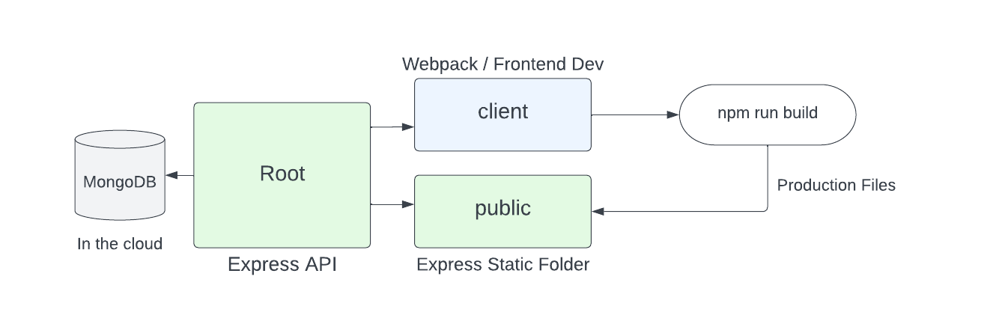

# 01-fullstack-workflow

# Fullstack Workflow

Now that we have our API done, we are going to start working on the front end. Before we jump into the code, I just want to go over the structure and the workflow of our project.

Here is a diagram of the structure of our project:



We already created the backend, which consists of the root folder with our Express API as well as the MongoDB database.

Now, will create a `client` folder. This will be our frontend development folder. We will use the `webpack-starter` as a base for our frontend.

We will configure Webpack to build our production files into a `public` folder in the root. This will be the folder that we will serve our static files from. With Express, we can serve static files from any folder. We will use this folder to serve our production `index.html` file as well as our bundled JavaScript and CSS files.

Let's start setting up the `client` folder in the next lesson.


---


# 02-client-folder-setup

# Client Folder Setup

In the last lesson, I explained the structure of our app, now we will implement it. I renamed my api folder from `randomideas-api` to `randomideas-app`, because now it will be a fullstack app. I also created a `client` folder in the root of the project.

### Setting the Static Folder

Express has a built in middleware function called `express.static` that allows us to serve static files from any folder. We will use this to serve our production files from the `public` folder.

Create a `public` folder in the root and add the following code to your `server.js` file:

```js
const path = require('path');
// ...

// Static Folder
app.use(express.static(path.join(__dirname, 'public')));
```

Now, if you add an `index.html` file to the `public` folder, you can access it at `http://localhost:5000/index.html`.

### Client Folder & Webpack Starter

I am going to use the Webpack starter that we created a few lessons ago. Create a folder called `client` and copy the contents of the `webpack-starter` folder, including the `src` folder into your `client` folder. You should not have a `dist` folder in your `client` folder. Delete it if you have one. `public` will be the new `dist` folder. Also, do not copy any `node_modules` folder. We will install our dependencies after.

From the client, install your frontend dependencies:

```bash
cd client
npm install
```

#### Setting the Build Folder

In your `webpack.config.js` file, change the `output` path to

```js
 output: {
    path: path.resolve(__dirname, '../public'),
    filename: 'bundle.js',
  },
```

and for the devServer path...

```js
 devServer: {
    static: {
      directory: path.resolve(__dirname, '../public'),
    }
  },
```

Now, when you run `npm run build`, your files will be built into the `public` folder. You can try it now. Open a new terminal and cd into your `client` folder. Run `npm run build` and you should see your files in the `public` folder.

Now, run your devserver from the client folder:

```bash
npm run dev
```

So at this point, you should have one terminal running your API (localhost:5000) and another terminal running your devserver (localhost:3000).

### RandomIdeas Theme

In this lesson, you will have a zip file called `randomideas-theme.zip`. It is just an index.html and a style.css. Add the index.html to the client, overwriting the one from `webpack-starter` and add the style.css to the `src/css` folder.

In the index.html, remove the link to the style.css. We can import that into our JS. Also, remove the script tag for the bundle.js. That is automatically added at build time.

Now, in your `index.js` file, import the style.css file:

```js
import '../css/style.css';
```

Delete the import of `message.js` and delete that file. You should now just see the hardcoded ideas in the html file.


---


# 03-modal-component

# Modal Component

Now, we want to create a Modal that includes a form to add a new idea. We are not using Bootstrap or anything, so we need to do this from scratch. The CSS already includes the transition and classes to show and hide the modal.

We are breaking everything into components as if we were using a framework. Let's create a folder called `components` and a file called `Modal.js` inside that folder.

Add the following:

```js
class Modal {
  constructor() {
    this._modal = document.querySelector('#modal');
    this._modalBtn = document.querySelector('#modal-btn');
    this.addEventListeners();
  }

  addEventListeners() {
    this._modalBtn.addEventListener('click', this.open.bind(this));
    window.addEventListener('click', this.outsideClick.bind(this));
  }

  open() {
    this._modal.style.display = 'block';
  }

  close() {
    this._modal.style.display = 'none';
  }

  outsideClick(e) {
    if (e.target === this._modal) {
      this.close();
    }
  }
}

export default Modal;
```

We are using the `querySelector` method to get the modal and the button in the constructor. We are also adding an event listener to the button to open the modal and to the window to close the modal if the user clicks outside of it. We are using the `bind` method to make sure that the `this` keyword is referring to the class. We have a method to open the modal and a method to close the modal. We also have a method to check if the user clicked outside of the modal and close it if they did. Finally, we are exporting the class so we can use it in other files.

Now bring it into your 'index.js' file and create an instance of the class.

```js
import Modal from './components/Modal';
new Modal();
```

Now you should be able to click on the modal button and open the modal.


---


# 04-ideaform-component

# IdeaForm Component

Now that we have a Modal component, I also want to have a component for the form. Let's create a file called `IdeaForm.js` inside the `components` folder.

Add the following code:

```js
import IdeaList from './IdeaList';

class IdeaForm {
  constructor() {
    this._formModal = document.querySelector('#form-modal');
  }

  addEventListeners() {
    this._form.addEventListener('submit', this.handleSubmit.bind(this));
  }

  handleSubmit(e) {
    e.preventDefault();

    if (
      !this._form.elements.text.value ||
      !this._form.elements.tag.value ||
      !this._form.elements.username.value
    ) {
      alert('Please enter all fields');
      return;
    }

    const idea = {
      text: this._form.elements.text.value,
      tag: this._form.elements.tag.value,
      username: this._form.elements.username.value,
    };

    console.log(idea);

    // Clear fields
    this._form.elements.text.value = '';
    this._form.elements.tag.value = '';
    this._form.elements.username.value = '';

    this.render();

    document.dispatchEvent(new Event('closemodal'));
  }

  render() {
    this._formModal.innerHTML = `
    <form id="idea-form">
    <div class="form-control">
      <label for="idea-text">Enter a Username</label>
      <input type="text" name="username" id="username" value="${
        localStorage.getItem('username') ? localStorage.getItem('username') : ''
      }" />
    </div>
    <div class="form-control">
      <label for="idea-text">What's Your Idea?</label>
      <textarea name="text" id="idea-text"></textarea>
    </div>
    <div class="form-control">
      <label for="tag">Tag</label>
      <input type="text" name="tag" id="tag" />
    </div>
    <button class="btn" type="submit" id="submit">Submit</button>
  </form>
    `;
    this._form = document.querySelector('#idea-form');
    this.addEventListeners();
  }
}

export default IdeaForm;
```

So we created a class for the form component and we are rendering the HTML from our JavaScript. We are also adding event listeners to the form. We are also storing the form in a property so we can access it later.

We need the modal to close when the form is submitted. We can do this by dispatching an event from the form component. We can listen for this event in the modal component.

```js
document.dispatchEvent(new Event('closemodal'));
```

Now, in the `components/Modal.js` file, we can listen for this event and close the modal. Add this to the `addEventListeners` method:

```js
document.addEventListener('closemodal', () => this.close());
```

Go to your HTML and remove the form from the modal. We are going to render it with JavaScript.

```html
<div id="modal" class="modal">
  <div id="form-modal" class="modal-box"></div>
</div>
```

Bring in your IdeaForm component in the `index.js` file and render it.

```js
import IdeaForm from './components/IdeaForm';
const ideaForm = new IdeaForm();
ideaForm.render();
```

Now your form should display and submit.


---


# 05-idealist-component

# IdeaList Component

Before we fetch our ideas from the API, let's create a component for the list of ideas. Create a file called `IdeaList.js` inside the `components` folder. For now, we will just use dummy data in the file.

Add the following code:

```js
class IdeaList {
  constructor() {
    this._ideaListEl = document.querySelector('#idea-list');
    this._ideas = [
      {
        id: 1,
        text: 'Idea 1',
        tag: 'Business',
        username: 'John',
        date: '02/01/2023',
      },
      {
        id: 2,
        text: 'Idea 2',
        tag: 'Technology',
        username: 'Jill',
        date: '02/01/2023',
      },
    ];
  }

  render() {
    this._ideaListEl.innerHTML = this._ideas
      .map((idea) => {
        const tagClass = this.getTagClass(idea.tag);
        return `
    <div class="card">
    <button class="delete"><i class="fas fa-times"></i></button>
    <h3>
      ${idea.text}
    </h3>
    <p class="tag tag-technology">Technology</p>
    <p>
      Posted on <span class="date">${idea.date}</span> by
      <span class="author">${idea.username}</span>
    </p>
  </div>
    `;
      })
      .join('');
  }
}

export default IdeaList;
```

Now, delete the `div` elements with the class `card` from the `index.html` file. We will render the ideas using the `IdeaList` component.

In your `index.js` file, import the `IdeaList` component and create an instance of it. Call the `render` method on the instance.

```js
import IdeaList from './components/IdeaList';

const ideaList = new IdeaList();
ideaList.render();
```

### Colored Tags

Now, let's add some color to the tags. We will use the `tag` property of the idea to determine the color of the tag. We will create a method called `getTagClass` that will return the class name based on the tag. I already have classes in the css for tag-technology, tag-inventions and a few others. We will put the allowed tags in a `set`.

```js
class IdeaList {
  constructor() {
    this._ideaListEl = document.querySelector('#idea-list');
    this._ideas = [
      {
        id: 1,
        text: 'Idea 1',
        tag: 'Business',
        username: 'John',
        date: '02/01/2023',
      },
      {
        id: 2,
        text: 'Idea 2',
        tag: 'Technology',
        username: 'Jill',
        date: '02/01/2023',
      },
    ];
    this._validTags = new Set();
    this._validTags.add('technology');
    this._validTags.add('software');
    this._validTags.add('business');
    this._validTags.add('education');
    this._validTags.add('health');
    this._validTags.add('inventions');
  }

  getTagClass(tag) {
    tag = tag.toLowerCase();
    let tagClass = '';
    if (this._validTags.has(tag)) {
      tagClass = `tag-${tag}`;
    } else {
      tagClass = '';
    }
    return tagClass;
  }

  render() {
    this._ideaListEl.innerHTML = this._ideas
      .map((idea) => {
        const tagClass = this.getTagClass(idea.tag);
        return `
      <div class="card">
      <button class="delete"><i class="fas fa-times"></i></button>
      <h3>
        ${idea.text}
      </h3>
      <p class="tag ${tagClass}">${idea.tag.toUpperCase()}</p>
      <p>
        Posted on <span class="date">${idea.date}</span> by
        <span class="author">${idea.username}</span>
      </p>
    </div>
      `;
      })
      .join('');
  }
}

export default IdeaList;
```

Now, the tags that are in the set, will have a color. The rest will be black.


---


# 06-api-service

# API Service

Now, we will fetch our data from the backend. In the `ideaList` component, delete the hardcoded objects and make `ideas` an empty array.

```js
this._ideas = [];
```

Create the file `services/ideasApi.js` and add the following code:

```js
import axios from 'axios';

class IdeasApi {
  constructor() {
    this._apiUrl = 'http://localhost:5000/api/ideas';
  }

  getIdeas() {
    return axios.get(this._apiUrl);
  }
}

export default new IdeasApi();
```

Now, since we are using `axios` to make the API call, we need to install it. Run the following command in the terminal:

```bash
npm install axios
```

In the `index.js` file, import the `ideasApi` service and call the `getIdeas` method and add the following code.

```js
import IdeasApi from '../services/ideasApi';

class IdeaList {
  constructor() {
    this._ideaListEl = document.querySelector('#idea-list');
    this._ideas = [];
    this.getIdeas();

    this._validTags = new Set();
    this._validTags.add('technology');
    this._validTags.add('software');
    this._validTags.add('business');
    this._validTags.add('education');
    this._validTags.add('health');
    this._validTags.add('inventions');
  }

  async getIdeas() {
    try {
      const res = await IdeasApi.getIdeas();
      this._ideas = res.data.data;
      this.render();
    } catch (error) {
      console.log(error);
    }
  }

  getTagClass(tag) {
    tag = tag.toLowerCase();
    let tagClass = '';
    if (this._validTags.has(tag)) {
      tagClass = `tag-${tag}`;
    } else {
      tagClass = '';
    }
    return tagClass;
  }

  render() {
    this._ideaListEl.innerHTML = this._ideas
      .map((idea) => {
        const tagClass = this.getTagClass(idea.tag);
        return `
      <div class="card">
      <button class="delete"><i class="fas fa-times"></i></button>
      <h3>
        ${idea.text}
      </h3>
      <p class="tag ${tagClass}">${idea.tag.toUpperCase()}</p>
      <p>
        Posted on <span class="date">${idea.date}</span> by
        <span class="author">${idea.username}</span>
      </p>
    </div>
      `;
      })
      .join('');
  }
}

export default IdeaList;
```

We are calling the `getIdeas` method in the constructor. This will fetch the ideas from the API and render them on the page.

## Enabling CORS

You will probably get an error that says your request is being blocked by CORS. This is because the API is running on a different port than the frontend. To fix this, we need to enable CORS in the backend. In the `server.js` file, add the following code:

```js
const cors = require('cors');

// cors middleware
app.use(
  cors({
    origin: ['http://localhost:5000', 'http://localhost:3000'],
    credentials: true,
  })
);
```

You need to install cors in the backend, so make sure you are in the root folder in the terminal and type

```bash
npm install cors
```

Also, when you start your backend server, do not use Nodemon. Start or restart it with `npm start`

Now, when you make your request from your frontend, you should see the ideas. If you don't, check the console for any errors.

You can also open up postman and make a POST request to add an idea and you should see it reflect in the browser.


---


# 07-create-idea

# Create Idea via Form & POST Request

Now, we want to be able to submit our form and create a new idea. We will use the `POST` method to do this. We will also use the `axios` library to make the API call.

In the `services/ideasApi.js` file, add the following method to the class:

```js
 createIdea(data) {
    return axios.post(this._apiUrl, data);
  }
```

Now go to `components/ideaForm.js` and add the following code:

```js
import IdeasApi from '../services/ideasApi';
```

Make the `handleSubmit` method `async` and add the following code:

```js
async handleSubmit(e) {
    e.preventDefault();

    const idea = {
      text: this._form.elements.text.value,
      tag: this._form.elements.tag.value,
      username: this._form.elements.username.value,
    };

    // Add idea to server
    const newIdea = await IdeasApi.createIdea(idea);

    // Clear fields
    this._form.elements.text.value = '';
    this._form.elements.tag.value = '';
    this._form.elements.username.value = '';

    document.dispatchEvent(new Event('closemodal'));
  }

```

### Update the DOM

We also want the DOM to get updated, so let's create a method in the `ideaList` component

```js
addIdeaToList(idea) {
    this._ideas.push(idea);
    this.render();
  }
```

Now, bring in the `ideaList` component in the `components/ideaForm.js` file and add the following code right under where we called the IdeasApi.createIdea method:

```js

import IdeaList from './IdeaList';

 constructor() {
    this._formModal = document.querySelector('#form-modal');
    this._ideaList = new IdeaList(); // <--- Add this line
  }


// Add idea to list
this._ideaList.addIdeaToList(newIdea.data.data);
```

Now, try and add a new idea via the form.


---


# 08-save-username-storage

# Save Username to Local Storage

We want the username that is put into the first idea submit into local storage and then pre-fill the username field with that value.

Go into `components/ideaForm.js` and add the following code:

```js
async handleSubmit(e) {
    e.preventDefault();

    if (
      !this._form.elements.text.value ||
      !this._form.elements.tag.value ||
      !this._form.elements.username.value
    ) {
      alert('Please enter all fields');
      return;
    }

    // Save user to local storage
    localStorage.setItem('username', this._form.elements.username.value); // <--- Add this line

    // ...

    // Render the form again
    this.render();

    document.dispatchEvent(new Event('closemodal'));
  }
```

### Pre-fill The Username Field

In the `render` method, add the following code:

```js
render() {
    this._formModal.innerHTML = `
    <form id="idea-form">
    <div class="form-control">
      <label for="idea-text">Enter a Username</label>
      <input type="text" name="username" id="username" value="${
        localStorage.getItem('username') ? localStorage.getItem('username') : ''
      }" />
    </div>
    <div class="form-control">
      <label for="idea-text">What's Your Idea?</label>
      <textarea name="text" id="idea-text"></textarea>
    </div>
    <div class="form-control">
      <label for="tag">Tag</label>
      <input type="text" name="tag" id="tag" />
    </div>
    <button class="btn" type="submit" id="submit">Submit</button>
  </form>
    `;
    this._form = document.querySelector('#idea-form');
    this.addEventListeners();
  }
```

Now, it will fetch the username from local storage and pre-fill the username field.


---


# 09-add-username-to-server

# Add Username to Server

We are going to jump back into the server and check for the username in the http request and match it to the username of the idea. If it matches, we will update/delete. If not, we will send a 403 error.

Go to the backend `routes/idea.js` file and add update the delete request function

```js
// Delete idea
router.delete('/:id', async (req, res) => {
  try {
    const idea = await Idea.findById(req.params.id);

    // Match the usernames
    if (idea.username === req.body.username) {
      await Idea.findByIdAndDelete(req.params.id);
      return res.json({ success: true, data: {} });
    }

    // Usernames do not match
    res.status(403).json({
      success: false,
      error: 'You are not authorized to delete this resource',
    });
  } catch (error) {
    console.log(error);
    res.status(500).json({ success: false, error: 'Something went wrong' });
  }
});
```

We want to do the same thing with the update:

```js
// Update idea
router.put('/:id', async (req, res) => {
  try {
    const idea = await Idea.findById(req.params.id);

    // Match the usernames
    if (idea.username === req.body.username) {
      const updatedIdea = await Idea.findByIdAndUpdate(
        req.params.id,
        {
          $set: {
            text: req.body.text,
            tag: req.body.tag,
          },
        },
        { new: true }
      );
      return res.json({ success: true, data: updatedIdea });
    }

    // Usernames do not match
    res.status(403).json({
      success: false,
      error: 'You are not authorized to update this resource',
    });
  } catch (error) {
    console.log(error);
    res.status(500).json({ success: false, error: 'Something went wrong' });
  }
});
```

Now, you can try to make an update or delete from Postman and see if it works. you need to send the username in the request body and it has to match the idea username.


---


# 10-delete-functionality

# Delete Functionality

Now we want to be able to delete ideas from the client. Let's start by adding the delete to the API service. I am also going to add an update, even though we are not going to use it in this project.

```js
 updateIdea(id, data) {
  return axios.put(`${this._apiUrl}/${id}`, data);
}

deleteIdea(id) {
  const username = localStorage.getItem('username')
    ? localStorage.getItem('username')
    : '';
  return axios.delete(`${this._apiUrl}/${id}`, {
    data: {
      username,
    },
  });
}
```

Now in the `components/ideaList.js` file, let's add an `addEventListeners` function that will add the event listeners to the delete buttons.

```js
addEventListeners() {
    this._ideaListEl.addEventListener('click', (e) => {
      if (e.target.classList.contains('fa-times')) {
        e.stopImmediatePropagation();
        const ideaId = e.target.parentElement.parentElement.dataset.id;
        this.deleteIdea(ideaId);
      }
    });
  }
```

We used `stopImmediatePropagation` to stop the event from bubbling up to the parent element. We also get the idea id from the dataset on the parent element. We don't have an data-id attribute on the element yet, so let's add it.

In the `render` function, add the `data-id` attribute to the `div` with the class of `card`:

```js
<div class='card' data-id='${idea._id}'>
  ${deleteBtn}
  <h3>${idea.text}</h3>
  <p class='tag ${tagClass}'>${idea.tag.toUpperCase()}</p>
  <p>
    Posted on <span class='date'>${idea.date}</span> by
    <span class='author'>${idea.username}</span>
  </p>
</div>
```

Now, create the `deleteIdea` function:

```js
 async deleteIdea(ideaId) {
    try {
      // Delete from server
      const res = await IdeasApi.deleteIdea(ideaId);
      this._ideas.filter((idea) => idea._id !== ideaId);
      this.getIdeas();
    } catch (error) {
      alert('You can not delete this resource');
    }
  }
```

We just filtered out the idea from the array and then called the `getIdeas` function to re-render the list.

### Hide Delete Button

Let's only show the delete button to people that own that idea. We can do that by checking for the username in the idea and comparing it to the username in local storage.

Here is the entire `render` function:

```js
render() {
  this._ideaListEl.innerHTML = this._ideas
    .map((idea) => {
      const tagClass = this.getTagClass(idea.tag);
      const deleteBtn =
        idea.username === localStorage.getItem('username')
          ? `<button class="delete"><i class="fas fa-times"></i></button>`
          : '';
      return `
    <div class="card" data-id="${idea._id}">
   ${deleteBtn}
    <h3>
      ${idea.text}
    </h3>
    <p class="tag ${tagClass}">${idea.tag.toUpperCase()}</p>
    <p>
      Posted on <span class="date">${idea.date}</span> by
      <span class="author">${idea.username}</span>
    </p>
  </div>
    `;
    })
    .join('');
  this.addEventListeners();
}
```

Now only ideas that you create should show the delete button


---


# 11-deploy-to-render

# Deploy To Render

There are many ways to deploy a fullstack app. You could use cloud hosting with something like Linode or Digital Ocean. You could use a service like Heroku. We are going to use Render.com. Render is a service that allows you to deploy your app to the cloud and manage it. It is a great service for deploying fullstack apps. It is also free for small apps.

## Create a Render Account

To get started, just sign in with GitHub. You can also sign up with an email address, but I recommend using GitHub.

## Checklist

In order to deploy successfully, there are a few things you need to do.

1. Change the mode in `webpack.config.js` to `production`

2. In your API service, change the `api_url` from `http://localhost:5000/api/ideas` to `/api/ideas`

3. Add a proxy. In your `webpack.config.js` file, add a proxy to the `devServer` object:

```js
 devServer: {
    static: {
      directory: path.resolve(__dirname, '../public'),
    },
    port: 3000,
    open: true,
    hot: true,
    compress: true,
    historyApiFallback: true,
    proxy: {
      '/api': 'http://localhost:5000',
    },

  },
```

This tells our devServer to use the proxy when it sees a request to `/api`. This is the same as if we were using a proxy like Nginx.

4. Build your app. Run `npm run build` to build your app.

5. Push your app to GitHub.

6. Add your environment variables to Render. In your Render dashboard, click on the `Environment` tab. Add the following environment variables:

MONGODB_URI - Your MongoDB connection string
NODE_ENV - production

7. Add your app to Render. Click on the `Add App` button. Select the GitHub repo that you pushed your app to. Select the branch you want to deploy. Click `Create App`.

Now you should be able to see your app running on Render. You can click on the `Open` button to see your app.
